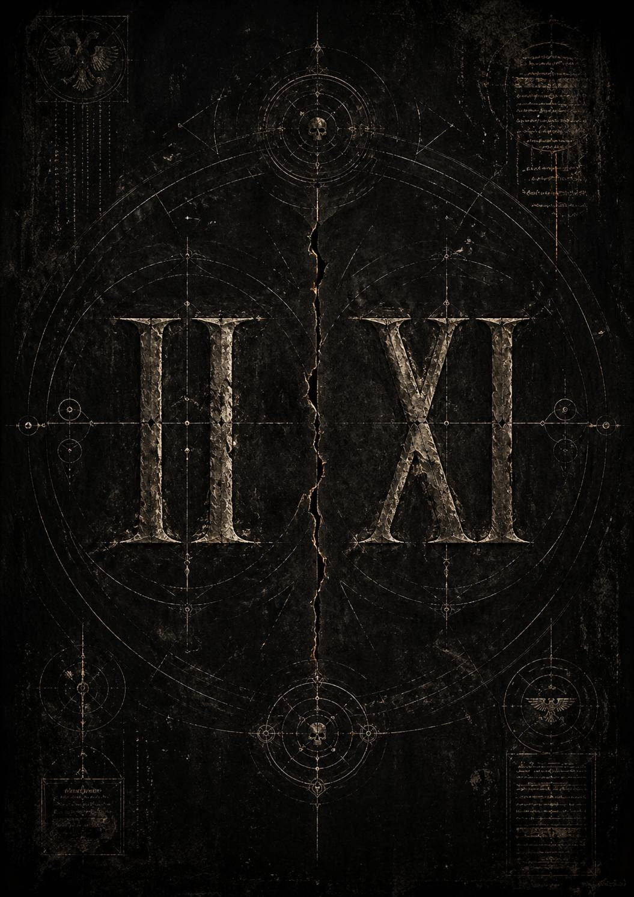

# Apocryphum: De numeris absentium

*Из апокрифического комментария к нумерологии утраченных легионов*

*автор неизвестен, атрибуция спорна, хранение не санкционировано*

Немногие осмеливаются размышлять не о самих утраченных, но об их числах. Ибо имя можно выжечь из летописей, лик — соскоблить с камня, деяния — обратить в пепел архивов, однако число упрямее памяти. Оно остаётся даже там, где смыслу уже запрещено существовать.

Второй и Одиннадцатый. II и XI. На первый взгляд — простые обозначения в порядке общего перечня. Но именно эта простота и внушает подозрение. Слишком бедны они внешне, слишком близки по рисунку, слишком настойчиво перекликаются друг с другом, чтобы казаться вполне случайными.

II — это чистая двойственность. Два столпа. Две черты. Две единицы, уже сведённые в одно понятие. Это знак парности, доведённой до устойчивости. Не расхождение, но соседство; не трещина, но повтор. В нём есть почти архитектурное спокойствие — как если бы сама форма утверждала: здесь двое стоят рядом и потому образуют целое.

XI на вид говорит почти то же самое, но уже иным голосом. В нём те же две вертикали, однако, поверх встаёт X — знак пересечения, узла, отмены, раны. Там, где II кажется завершённой формой, XI выглядит как та же форма, но к ней уже применено внешнее усилие. Не просто пара, а пара, через которую прошло нечто чуждое. Не два столпа, а память о двух столпах, перечёркнутых знаком вмешательства.

Если перевести это в более грубую, аравийскую запись, игра становится ещё очевиднее. XI есть 11 — две единицы, ещё стоящие раздельно. II есть 2 — те же две единицы, уже собранные в единое число. И потому возникает почти еретическое ощущение, что между этими двумя обозначениями скрыта не простая последовательность, а отношение превращения: расщеплённое и собранное, пара и её итог, удвоение и сжатие удвоения в один знак.

Оттого и кажется, что утрата была парной не только исторически, но и символически. Не два независимых исчезновения, а один разлом, оставивший после себя две формы пустоты. Одну — как завершённую двойственность. Другую — как двойственность, ещё не приведённую к согласию. Быть может, именно потому они и были преданы одинаковому забвению: не потому лишь, что оба пали, но потому, что вместе составляли некую симметрию, слишком опасную для сохранения в памяти.

И если это так, то числа их были стерты не до конца. Они продолжили говорить после запрета — не именами, не деяниями, но одной своей формой. II и XI остались в летописях как два шрама, нанесённые на один и тот же порядок. И, быть может, именно поэтому всякий взгляд на них рождает не знание, а тревогу: словно перед нами не просто номера отсутствующих легионов, а геометрия забытой вины.
