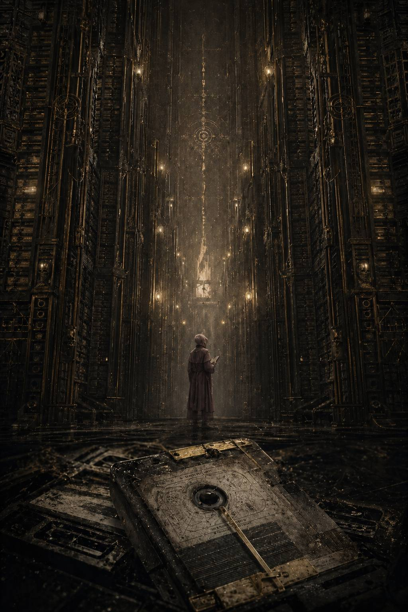

*Не существует выбора между верой и разумом.*

*Существует только заблуждение, принимающее разные формы.*

*Я покажу тебе, сколько крови пролито во имя богов.*

*Из протокола беседы в разрушенном храме на Терре.*

*798–800.M30*

# I. Dispersae Reliquiae / Технический мусор

В Архивариуме не существовало утра.

Свет там не рождался, а включался по уставу — тусклый, ровный, с мертвенной желтизной, будто лампы питались не током, а выжатым из костей терпением. Он стекал по тысячам стоек, по бронзовым решёткам, по пыльным рёбрам каталожных шахт и терялся где-то под сводами, настолько высокими, что даже звук молитв, произнесённых под ними, не возвращался обратно тем же.

Каэль Меррон любил этот свет именно за это.

Он ничего не обещал.

Он не льстил, не грел, не притворялся человеческим. Он просто позволял видеть строки, номера дел, санкционные печати и индексы хранения. Для человека, выросшего на нижних жилых ярусах Терры, где всё ценное принадлежало кому-то другому, сама возможность видеть вещи в их правильном свете казалась чудом, которое лучше не анализировать слишком долго, чтобы не спугнуть.

Он вошёл в сектор Третьей Реклассификации за три минуты до начала смены и, как всегда, задержался перед контрольно-литаническим постом. Медная маска сервочерепа, вмонтированная в стену, была неподвижна, но её вокодер уже просыпался хрипом древних мембран.

— Назови себя.

— Аналитик четвёртого разряда Каэль Меррон. Печать допуска: девять-омикрон, временное расширение на кластерную сортировку.

— Назови функцию.

— Выявление, фильтрация и переназначение повреждённых архивных массивов, ошибочно помеченных к утилизации.

— Назови грех.

Каэль опустил взгляд.

— Самовольное толкование.

Вокодер потрескал несколько секунд, будто наслаждался паузой.

— Назови защиту.

— Индекс выше смысла. Протокол выше догадки. Список выше памяти.

Только после этого внутренние створки разошлись.

Он вошёл.

Третья Реклассификация не имела ничего общего с торжественными залами центральных мемориальных хранилищ. Там не было статуй, реликвариев и монументальных табличек с именами священных героев. Здесь хранили не память. Здесь хранили то, что осталось после памяти: мусорные цепочки, битые метаданные, дубли, разошедшиеся версии, ошибочные зеркала, обломки индексов, которые уже никто не хотел видеть, но никто не осмеливался окончательно стереть без согласований, печатей и дополнительных подписей на уничтожение.

Здесь было тихо даже по меркам Архивариума.

Не свято тихо, как в часовнях данных, а глухо. Так бывает в деревянном ящике, если долго держать крышку закрытой.

На его рабочем посту уже лежала металлическая планшетка с назначением смены. На поверхности тускло мерцала строчка:

**КЛАСТЕР 88-ЧЁРНЫЙ / СЛУЖЕБНЫЙ ШУМ / ПОВТОРНАЯ ПРОВЕРКА ПЕРЕД УТИЛИЗАЦИЕЙ
ДАТИРОВАНО: 88X.M30
ОСНОВАНИЕ: СИСТЕМНАЯ НЕСОГЛАСОВАННОСТЬ МЕМОРИАЛЬНЫХ ИНДЕКСОВ
ИСПОЛНИТЕЛЬ: МЕРРОН, К.**

Ниже стояла машинная пометка, почти лениво добавленная поверх основного текста:

**ПРИОРИТЕТ НИЗКИЙ. ДОПУСК ДО ИНТЕРПРЕТАЦИИ НЕ ТРЕБУЕТСЯ.**

Каэль невольно усмехнулся одними глазами.

На Терре всё, к чему приписывали, что интерпретация не требуется, как правило, уже было интерпретировано кем-то достаточно влиятельным, чтобы дальше это никому не было интересно.

Он сел, подсоединил перчаточный интерфейс к столу и вызвал массив.

Воздух над рабочей плитой завибрировал. Из глубины системы поднялась трёхмерная схема — полупрозрачная, зернистая, как будто собранная из тусклых игл света. Обычный повреждённый кластер выглядел как беспорядочная сыпь: оборванные узлы, пустые карманы адресации, фрагменты маршрутов без связей. Но этот был другим.

Он был слишком аккуратно сломан.

Первое, что заметил Каэль, — повторяемость провала.

В центре облака зияли две пустоты. Не просто отсутствующие сегменты, а области, вокруг которых изменения сгущались неестественно плотно, словно кто-то многократно вырезал одно и то же место и каждый раз старался зашить края так, чтобы разрез не был виден. Но чем больше слоёв накладывали, тем заметнее становилась сама попытка скрыть шов.

Он приблизил схему.

По краям первой пустоты шли остаточные ярлыки:

**\> …/LEG-PRIM/II/
\> …/санкц.памяти/
\> …/уровень красный/
\> …/перекрёстн. доступ запрещён/**

Вокруг второй — то же самое, только с индексом XI.

Каэль замер.

Несколько секунд он просто смотрел, не позволяя себе думать дальше того, что уже видел.

**II. XI.**

Он знал эти обозначения, как всякий образованный служитель Архивариума знал строение имперской легенды. Знал именно в той степени, в какой положено знать безопасные пустоты. Существовали примархи. Существовали легионы. Существовали двадцать ритуальных традиций перечисления, восемнадцать подтверждённых генеалогических линий, девятнадцать допущенных перечней и две лакуны, которые следовало воспринимать не как вопрос, а как архитектурный элемент государственной истины.

Иными словами: не думать о них отдельно.

Не задавать вопросов там, где в перечне оставлено молчание.

Не путать пробел с потерей.

Он попробовал закрыть схему, но рука остановилась.

Красный уровень цензуры внутри кластера, помеченного как служебный шум, был невозможен уже сам по себе. Такие вещи не сваливались в низкоприоритетную утилизацию. Их не отдавали четвёртому разряду. Их не перепроверяли в секторе, где пыль на полках была старше иных династий губернаторов.

— Ошибка маршрутизации, — тихо сказал он в пустоту, как будто проговаривая это вслух, он сделать увиденное менее живым.

Но кластер на ошибку не походил.

Каэль запросил историю переназначений.

Система ответила не сразу. На мгновение стол под пальцами похолодел. Потом над пустотами проступили тонкие вертикальные нити — слои правок, вложенных друг в друга. Каэль видел такое прежде, но никогда в таком количестве. Перенос. Переименование. Маскировка. Дублирование. Ложная утилизация. Обратный вызов из очереди на уничтожение. Переназначение в технический резерв. Скрытие по санкции. Переупаковка в мусорный контейнер. Снова удаление. Снова возврат.

Кто-то не просто убирал эти данные.

Кто-то веками не давал им умереть окончательно, одновременно запрещая им существовать.

Он почувствовал знакомое сухое напряжение под рёбрами — не страх ещё, а его инстинктивный предвестник. Внизу живота словно возник холодный грузик, и сознание само собой стало чётче, осторожнее, уже примеряя к увиденному не смысл, а способы выживания рядом с этим смыслом.

Каэль вызвал логи санкции.

Доступ был частично выжжен. Большинство строк отозвались чёрными прямоугольниками и служебным уведомлением:

**ПОЛНОМОЧИЯ НЕДОСТАТОЧНЫ.
ПОВТОРНЫЕ ПОПЫТКИ ВОСПРОИЗВЕДЕНИЯ НЕ РЕКОМЕНДУЮТСЯ.**

Только одна крошечная дорожка осталась открытой — вероятно, по той причине, что её просто забыли дочистить или, что было хуже, потому что кто-то когда-то захотел, чтобы её всё же нашли.

Он развернул её.

На экране вспыхнула узкая колонка машинописного текста, изъеденная пропусками.

**\> …мемориальный перечень, версия до пересмотра…
\> …объекты II и XI исключены из публичной и ритуальной последовательности…
\> …основание: не подлежит распространению…
\> …перекрёстные упоминания подлежат немедленному обнулению…
\> …все производные индексы считать заражёнными интерпретацией…**

Каэль перечитал последнюю строку трижды.

Заражёнными интерпретацией.

Не ересью. Не повреждением. Не ложью.

*Интерпретацией.*

Он медленно снял пальцы со стола, будто боялся задеть ещё что-то, что немедленно донесёт наверх о его любопытстве.

В секторе по-прежнему стояла тишина, но теперь она уже не казалась мёртвой. Наоборот. В ней было слишком много древнего внимания. Так бывает в хранилищах реликвий, когда некий предмет давно запечатан, но вокруг него столетиями ходят, не говоря вслух, и сам воздух запоминает запрет лучше людей.

Где-то далеко, за рядами стеллажей, прошёл сервитор на паучьих опорах. Стальные сочленения цокнули по металлу пола и звук начал удаляться.

Каэль подавил желание оглянуться.

Он знал за собой этот недостаток: в критические моменты его разум работал яснее обычного, но тело при этом становилось слишком прозрачным. Любой наблюдатель, обученный читать дрожание пальцев или лишнюю задержку дыхания, сразу понял бы, что аналитик четвёртого разряда только что увидел нечто, чего не должен был увидеть.

Он заставил себя переключиться на процедуру.

Шаг первый: верифицировать происхождение кластера.

Шаг второй: определить, является ли провал остатком старой системной ошибки или намеренной ретушью.

Шаг третий: передать наверх.

Ни один из этих шагов не предусматривал личного интереса.

Он открыл маршрут поступления.

Путь кластера оказался таким же уродливо чистым, как и всё остальное. Формально он происходил из мемориального массива, где хранились вторичные тени торжественных перечней: не сами священные каталоги, а машинные зеркала, используемые для синхронизации индексов между церемониальными залами, учебными трактатами и литургическими справочниками. Несколько месяцев назад там произошла системная несогласованность — пустяковая по имперским меркам: разошлись порядковые ссылки в старом массиве статуарных залов. Ошибку закрыли. Массив частично пересобрали. Обломки отправили вниз.

Обломки.

Каэль снова приблизил пустоты. На этот раз он запросил не текст, а соседние метки расположения. И почти сразу перед ним всплыли две координатные строки из какого-то очень старого архитектурного плана:

**ЗАЛ МЕМОРИАЛЬНЫХ ОСНОВАНИЙ / СЕКЦИЯ ОКТУС
ПОСТАМЕНТ II — ПУСТО
ПОСТАМЕНТ XI — ПУСТО**

Он почувствовал, как по спине пробежал холодок.

Пустые основания.

Перед внутренним взглядом сразу встал вчерашний образ: огромный зал, почти лишённый декора, два основания среди прочих, голые, тщательно выскобленные, будто отсутствие тоже нуждалось в полировке. Он видел их сам, сопровождал старшего куратора на сверке повреждённых каталогов и тогда ещё не понял, почему взгляд всё время возвращался именно туда, где ничего не было.

Теперь он понял это хотя бы отчасти.

Не пустота притягивала взгляд.

След вырванного.

Он резко свернул архитектурную схему и несколько секунд сидел неподвижно, слушая, как собственное сердце слишком отчётливо отсчитывает время.

Правильным решением было встать, закрыть сессию, вызвать старшего архивария и передать всё без комментариев. Его работа закончилась в тот самый миг, когда служебный шум перестал быть служебным.

Но было уже поздно.

Он уже увидел структуру.

А структура, однажды увиденная, не отпускала. В этом и состояла вся тайная власть Архивариума над его служителями: ты можешь не знать истины, можешь не понимать масштаба, можешь быть слишком мал, чтобы делать выводы, — но если ты заметил узор, то всю оставшуюся жизнь будешь видеть мир через него.

Каэль снова наклонился над столом.

— Только верификация, — сказал он. — Только форма. Без толкования.

Эта оговорка немного успокаивала. Ложь, конечно, но удобная.

Он запросил список производных индексов, связанных с II и XI до последнего пересмотра.

Окно вспыхнуло красным, затем жёлтым, затем неожиданно открылось.

На миг ему показалось, что система просто дала сбой, но нет: строки действительно пошли одна за другой, рваными кусками, наполовину выжженными, наполовину скрытыми под наслоением компрессионных артефактов.

**\> …совместная кампания…
\> …не подлежит литургическому цитированию…
\> …отчёт о распределении флотов — повреждён…
\> …личные сигилы удалены…
\> …перекрёстные упоминания не согласуются с утверждённой схемой родства…
\> …санкция памяти…
\> …уровень красный…
\> …обнулить…
\> …обнуление…
\> …обнулено…**

Одна строка отличалась от остальных. Не содержанием — интонацией. Если машинный текст вообще мог обладать интонацией, то здесь она была.

**\> …переписано поверх предшествующей версии. Предшествующая версия не подлежит восстановлению. Следы восстановления считать признаком вторичной ереси…**

*Вторичная ересь.*

Каэль закрыл глаза.

Он не был трусом. По крайней мере, не в том дешевом смысле, в каком это слово любили употреблять офицеры или священники, никогда не жившие под давлением тихих системных угроз. Он умел быть осторожным. Умел не смотреть туда, куда не надо. Умел вовремя кланяться, вовремя отводить глаза, вовремя молчать, вовремя соглашаться, что порядок полезнее любопытства. Именно благодаря этому он вообще дожил до своего места в Архивариуме.

Но сейчас осторожность требовала не отступить сразу.

Сначала понять, насколько глубоко он уже замаран самим фактом доступа.

Он проверил журналы обращения.

Плохо.

Система отметила его вход в кластер. Конечно, отметила бы. Но помимо этого где-то на заднем фоне уже пришел в движение запрос на сверку полномочий. Пока ещё автоматический, не адресный. Пока ещё без имени. Пока ещё.

Значит, времени у него было меньше, чем хотелось.

Каэль наклонился ближе и вывел локальную копию не всего массива — это было бы самоубийством, — а маленький технический слепок метаданных: индексы, цепочки переназначений, несколько служебных предупреждений. Ничего содержательного. Только форма шрама.

Даже это он делал с ощущением, будто снимает слепок зубов со святой реликвии.

Пока отпечаток собирался, он заметил в нижнем углу интерфейса крохотную, почти стёртую пиктограмму старого формата вложений. Не текст. Не лог. Что-то вроде мемориального маркера, выжившего под слоями последующей архивации.

Каэль колебался меньше секунды.

Открыл.

Изображение возникло рывком, словно его вытаскивали из очень глубокой воды.

Чёрный фон. Зерно. Полосы помех.

Потом проступили два силуэта, снятые, вероятно, с огромного расстояния или наложенные уже после частичного повреждения файла. Не лица — их нельзя было различить. Не доспехи — только общий тяжёлый контур. Две фигуры, стоящие не рядом, но так, будто пространство между ними уже само было формой связи. Одна — статичнее, строже, словно высеченная из вертикали. Другая — чуть развёрнута, будто движение ещё не погасло в ней до конца.

Под изображением шёл выжженный почти до нуля комментарий.

Сохранилось лишь несколько слов:

**\> …совместное присутствие…
\> …недопустимый контур…
\> …изъять из всех публичных массивов…**

Каэль выключил изображение так резко, что стол недовольно щёлкнул реле.

Вот теперь страх пришёл по-настоящему.

Не потому, что он увидел доказательство. Доказательства не было. Только зернистый призрак и несколько изуродованных фраз. Но именно этого оказалось достаточно, чтобы невозможное стало не абстракцией, а фактом физического мира.

II и XI были не просто пустотами в списке.

Когда-то они стояли где-то в реальном пространстве, достаточно близко к свету, чтобы кто-то сделал пикт-запись их совместного присутствия.

А затем эту запись не уничтожили полностью.

Его затошнило от одной мысли, сколько рук касалось этого кластера до него, сколько людей что-то увидели, сколько решили промолчать, сколько исчезли, сколько сделали карьеру именно на том, что вовремя не увидели ничего.

Слепок метаданных был готов.

Каэль спрятал его в личный служебный буфер под видом статистического мусора по несогласованности индексов. Хлипкая маскировка. Вполне достаточная на несколько часов. Может быть, на день, если машинный надзор будет ленив. Может быть, на несколько минут, если нет.

Потом он привёл рабочий стол в порядок, как будто действительно провёл всего лишь рутинную первичную проверку. Оставил открытым безопасный слой — повреждения адресации, ошибка синхронизации, отказ служебного зеркала. Ничего такого, за что кому-то захотелось бы немедленно резать ему горло во имя стабильности.

Только после этого он позволил себе поднять голову.

Сектор Третьей Реклассификации был пуст.

Слишком пуст.

На соседнем посту обычно сидела сгорбленная женщина из младших переписчиков, тихо шептавшая формулы сверки под нос, будто боялась, что иначе строки обратят на нее внимание. Сейчас её место пустовало. В дальнем проходе, где неспешно бродил дежурный сервитор, тоже никого не было. Даже механический шелест вентиляции вдруг показался Каэлю отступившим, как будто само помещение прислушивалось.

Он встал.

План был простым: сдать формальный отчёт, не упоминая главного; вернуться в ярус; не открывать слепок до тех пор, пока не найдёт безопасное место; подумать. Может быть, уничтожить копию. Может быть, он успеет, пока за ним не придут.

Он уже сделал шаг к выходу, когда над столом ярко вспыхнула новая строка.

Не из его интерфейса.

Из центральной системы.

Всего одно уведомление без подписи:

**АНАЛИТИК МЕРРОН.
НЕ ПЫТАЙТЕСЬ ВОССТАНАВЛИВАТЬ ПРЕДШЕСТВУЮЩИЕ ВЕРСИИ.**

Строка моргнула и исчезла.

Несколько долгих мгновений Каэль не двигался.

Потом очень медленно сел обратно.

В Архивариуме существовало множество вещей, которых следовало бояться: дознание, ошибочная формулировка, случайный взгляд начальства, не та книга на не той тележке, сбой памяти у сервитора, достаточно древнего, чтобы в нём жил чужой шёпот. Но сильнее всего следовало бояться вежливости.

Потому что угроза, которая уже уверена в себе, не кричит.

Она просто сообщает, что видит тебя.

Каэль посмотрел на погасший интерфейс, потом на собственные руки. Они лежали на металле спокойно. Почти слишком спокойно. Лишь кончики пальцев побелели.

— Я ничего не восстанавливал, — сказал он в пустой сектор, и голос его прозвучал хрипло, будто Архивариум успел одолжить ему часть своей пыли. — Я лишь сортировал мусор.

Ответа не было.

Но теперь он уже знал то, чего не знал час назад.

Технического мусора не существовало.

Существовали только вещи, слишком опасные, чтобы хранить их среди святынь, и слишком важные, чтобы осмелиться уничтожить до конца.

И он только что прикоснулся к одной из них.
