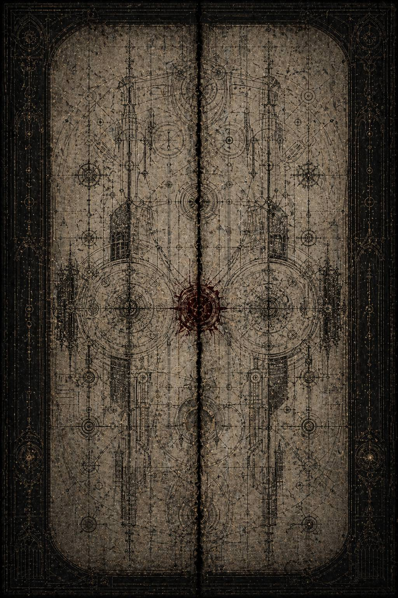

# X. Schema Divisum / Чертёж

Тёмно-красный значок на экране не мигал.

Вот что пугало сильнее всего.

Жёлтые предупреждения и белые уведомления ещё допускали видимость выбора. Янтарные намёки оставляли пространство для внутренней сделки: ты прочитал, ты понял, ты можешь отступить сам и тем самым доказать, что система не ошиблась в твоей благоразумной трусости. Но этот цвет был иным. Он не требовал решения. Он лежал на поверхности как след старой крови под лаком: неяркий, почти чёрный, уверенный в том, что однажды всё равно станет центром внимания.

Каэль смотрел на него и уже знал, что никакая очистительная формула здесь не поможет.

Потому что всё, что было до этого, ещё можно было списать на историю.

На чужие страхи.

На косвенные оценки.

На тревожные, но не окончательные наблюдения.

А меморандум такого рода всегда означает одно: кто-то однажды перестал бояться абстрактно и сел проектировать решение.

Он открыл файл.

Система долго молчала, словно не хотела признавать, что этот документ вообще может быть поднят в низшем контуре. Потом появилось несколько сухих строк.

**ПОВРЕЖДЁННЫЙ СЛУЖЕБНЫЙ МЕМОРАНДУМ.
ПРЕДМЕТ: УПРАВЛЕНИЕ СВЯЗАННЫМИ ОТКЛОНЕНИЯМИ В ВЫСШИХ КОНТУРАХ.
СТАТУС: НЕ ПОДЛЕЖИТ РЯДОВОМУ АРХИВИРОВАНИЮ.
ПРИЧИНА ПОПАДАНИЯ В НИЗШИЕ МАССИВЫ: НЕ УСТАНОВЛЕНА.**

Ниже, уже почти стёртая, но всё ещё читаемая, шла строка внутреннего назначения:

**ДЛЯ УЗКОГО КРУГА КОРРЕКТИРОВКИ ГЕНЕАЛОГИЧЕСКОЙ СТАБИЛЬНОСТИ.**

Не военной.

Не моральной.

Не догматической.

*Генеалогической.*

Значит, страх действительно лежал так глубоко, как ему уже начинало казаться. Не в одной кампании. Не в одном подозрении. В самой логике семьи, из которой строили империумную мифологию. Если в этой семье двое могли образовать горизонтальную завершённость, всё древо начинало выглядеть не так устойчиво, как хотелось бы Трону.

Каэль пошёл дальше.

Сначала документ был невыносимо канцелярским. Видимо, автор принадлежал к той редкой породе умов, которые способны говорить о разрушении живого в языке санитарной аккуратности, не оставляя на тексте ни капли личной злобы. Именно такие люди и опаснее прочих. Они не ненавидят. Они выравнивают.

**\> …в случаях, когда два высших контура демонстрируют устойчивую взаимную верификацию восприятия, не совпадающую полностью с основной вертикалью санкции, не рекомендуется преждевременная карательная реакция.**

**\> …прямое вмешательство при отсутствии формальной делинквенции способно произвести у объектов обратный эффект консолидации, в результате чего риск не уменьшится, а лишь обретёт осознанную форму…**

Консолидации.

Осознанную форму.

То есть они понимали всё уже тогда. Ещё до падения. Ещё до проступка. Понимали, что грубый удар может не разрушить их, а наоборот, превратить смутную внутреннюю завершённость в явную клятву друг другу. Значит, нужно было действовать тоньше. Не запретить связь. Придать ей форму, в которой она начнёт вредить самой себе.

Ниже шёл перечень рекомендаций.

Не в виде приказов. В виде «предпочтительных мер среды». И от этой сухой формулировки Каэлю стало почти дурно.

**МЕРЫ СРЕДЫ.**

Не наказать.

Не обвинить.

Изменить среду так, чтобы связь, оставаясь формально невиновной, начала работать против собственной устойчивости.

Он читал дальше.

**\> …наиболее продуктивным следует признать постепенное разведение естественных функций объектов по театрам, усиливающим их индивидуальные склонности и ослабляющим взаимное уравновешивание…**

**\> …объект предельного типа надлежит удерживать в контуре, где постоянная необходимость жестокого отсечения закрепляет его в роли окончательной границы…**

**\> …объект путевого типа надлежит удерживать в контуре, где повторяющаяся ответственность за живое движение усиливает его внутреннюю зависимость от исключительных решений и нетерпимость к допустимой утрате…**

Каэль откинулся на спинку кресла так резко, что металл тихо скрипнул.

Вот он.

Чертёж.

Не просто развести по разным сторонам галактики.

Ещё и сделать так, чтобы разлука постепенно вытачивала в каждом худшую, неуравновешенную половину собственной силы.

Кайрона отправлять туда, где один только предел постепенно затвердевает в привычку не ждать другого взгляда.

Малисару туда, где один только путь начинает всё сильнее ненавидеть саму идею допустимой потери.

Не удар.

Микроклимат.

Ниже текст становился ещё холоднее.

**\> …связанные отклонения редко разрушаются через лобовую конфронтацию. Гораздо надёжнее лишить каждый объект регулярного подтверждения со стороны сопряжённого контура, не запрещая воспоминание о таковом напрямую…**

**\> …при сохранении памяти и частичной переписки, но при устранении оперативной сонастроенности, внутренняя завершённость связи имеет тенденцию переходить из практической в компенсаторную область.**

**\> …на этом этапе возрастает вероятность либо функционального ожесточения, либо компенсаторного поиска недопустимых решений.**

Компенсаторную область.

Каэль долго смотрел на эту строку.

Это был язык убийц, придумавших себе психологию вместо ножа.

Они не хотели стереть память о другом сразу. Стереть слишком быстро означало бы признать, что связь реальна и страшна. Куда полезнее дать ей сохраниться как боль, как внутренний ритм, как недостаток мира. Тогда она перестаёт помогать действовать и начинает требовать компенсации.

У одного это станет ещё большей холодной точностью.

У другой — тягой к тому самому «лишнему пути», где уже не нужно смиряться с уродливой арифметикой утрат.

Он читал дальше, и каждая строка только подтверждала худшее.

**\> …допустим ограниченный обмен частными сообщениями при условии их непредсказуемой задержки, частичной фрагментации и утраты операционной своевременности.**

**\> …не следует запрещать контакт полностью, если сохраняется шанс превратить его из источника совместного решения в источник внутреннего дефицита…**

Задержка.

Фрагментация.

Утрата своевременности.

Не дать письму не дойти. Дать ему дойти слишком поздно, обломком, слишком человеческим, слишком маленьким для действия и слишком живым, чтобы дальше болеть внутри.

Каэль вспомнил одно слово на внешней пломбе.

**Дыши.**

И впервые понял весь масштаб жестокости даже этого короткого утешения. Оно было не просто знаком близости, пробившимся через разлуку. Оно существовало уже внутри спроектированной среды, где утешение было разрешено ровно в той мере, в какой не могло стать общим ответом.

Ниже шёл раздел, озаглавленный почти безумно нейтрально:

**О ПРЕДПОЧТИТЕЛЬНОМ МОМЕНТЕ ПЕРЕХОДА ОТ НАБЛЮДЕНИЯ К ИСТОРИЧЕСКОЙ КОРРЕКЦИИ**

Историческая коррекция.

Не суд.

Не казнь.

*История.*

Кто-то здесь уже думал наперёд не о том, как управлять живыми, а о том, как потом оформить мёртвых.

**\> …при успешном размыкании сопряжённого контура и последующей индивидуализации отклонений надлежит избегать ретроспективной оптики парности.**

**\> …дальнейшая историческая коррекция должна строиться на усилении автономных добродетелей каждого объекта и последовательном выведении за скобки той формы взаимности, которая делала риск системным, а не частным…**

**\> …объект предельного типа предпочтительно описывать как чрезмерную, но логически изолированную жёсткость.**

**\> …объект путевого типа предпочтительно описывать как чрезмерное, но логически изолированное сострадание, переходящее границу формы…**

Каэль едва не закрыл файл.

Вот так, значит, и был написан их будущий миф.

Сначала организовать среду, в которой они перестают удерживать друг друга от крайностей.

Потом, когда крайности прорастут достаточно далеко, объявить их личными пороками.

Потом вычистить всё, что указывало на первоначальную связанность.

И, наконец, оставить потомкам две отдельные, удобные для осуждения или романтизации тени.

Отдельный холод.

Отдельный путь.

Две аккуратные ереси вместо одной спроектированной раны.

Он углубился дальше.

Под основным текстом шли частично уцелевшие приложения. Чужие примечания. Внутренние возражения. Остатки подпороговых споров между теми, кто составлял и читал меморандум. И вот тут впервые проступило нечто вроде живого сопротивления внутри самого аппарата.

Одна краткая ремарка, почти выдранная с корнем, гласила:

**\> …не следует забывать, что искусственно усиленное разъединение может не просто локализовать риск, но и спровоцировать именно ту форму катастрофы, которой пытаются избежать.**

Ниже стояла сухая отметка чужой рукой:

**ВОЗРАЖЕНИЕ ПРИНЯТО К СВЕДЕНИЮ. УРОВЕНЬ ДОКАЗАТЕЛЬНОСТИ НЕДОСТАТОЧЕН.**

Кто-то знал.

Кто-то предупреждал.

Кто-то понимал, что если отнять у двух связанных существ возможность быть друг для друга ограничением и подтверждением, то разойдутся не только они. Разойдётся сама внутренняя форма их служения. Но предупреждение утонуло в той самой безликой вежливости, которая всегда неотрывно сопровождает грамотно организованную бюрократию.

Каэль открыл реконструктивный блок, приложенный к меморандуму неизвестным поздним архивистом. И прошлое снова поднялось, но теперь уже не как частная боль письма и не как сухая логистика разъединения. Теперь было видно, как чертёж начинает работать.

---

Орфей делал Кайрона тише.

Не в смысле внешнего поведения. Тише внутри.

Три заражённые системы на окраине сектора не оставляли места для той разновидности решения, которую мог бы привнести кто-то вроде Малисары. Здесь всё требовало предела. Холодного. Точного. Воспроизводимого. Миры были не сломлены, а медленно дрейфовали в сторону таких типов заразы, где запоздалая жалость уже неотличима от пособничества.

Кайрон действовал безупречно.

Именно это было страшно.

Он запечатывал системы раньше, чем заражение успевало получить язык.

Выжигал шлюзы не после, а до подтверждения последнего шанса.

Принимал на себя право назвать мир потерянным в тот момент, когда другие ещё искали удобную отсрочку, чтобы не нести тяжесть решения прямо сейчас.

Его легион называл это ясностью.

Окружение — жестокостью.

Архив позже назовёт логически изолированной чрезмерностью.

Но без неё Орфей бы сгнил без остатка, и в этом была худшая правда таких кампаний: машина не врала полностью, когда посылала туда именно его.

Он стоял над картами и всё чаще не нуждался ни в чьём втором взгляде.

Не потому, что перестал помнить Малисару.

Потому, что среда день за днём убеждала его: здесь помнить её бесполезно. Здесь путь только мешает. Здесь всякое промедление ради воображаемой щели между уже обречённым и ещё спасаемым лишь увеличивает радиус общей гибели.

В одной из уцелевших частных реконструкций его капитан Севериан Тар писал:

**\> …господин стал принимать окончательные решения быстрее. Я не уверен, хорошо это или плохо. Война благодарит за скорость, но иногда рядом с ним раньше возникала доля паузы, будто он внутренне оставлял место для другой формы расчёта. Теперь это место пусто…**

Пусто.

Вот и весь результат правильного назначения. Не ярость. Не падение в безумие. Просто исчезновение паузы.

А у Малисары в Кассарской расщелине происходило обратное.

---

Там каждый день был борьбой не за миры и не за принципы, а за то, сколько живых ещё можно провести сквозь пространство, которое уже начало лгать. Ни один расчёт не держался достаточно долго. Ни одна карта не оставалась объективной. Колонны умирали не из-за большого героического врага, а от перегрева, смещения узлов, нехватки воздуха, паники, запоздалой маршрутизации, сбоя света в нужную секунду, ложного коридора, казавшегося светлее настоящего.

Её легион был идеален для такого ада.

Именно поэтому её там и держали.

Она ещё долго работала безупречно. Даже после первых записей о «боковом пути» никакой открытой ошибки не произошло. Она предпринимала честные шаги, держала ритм, не позволяла себе поверить в слишком чистое решение. Но пространство внутри неё уже тоже менялось.

Лишённая холодной границы рядом, она всё чаще ненавидела саму необходимость считать утраты допустимыми.

Всё чаще видела, как мир можно было бы спасти чуть больше, если бы не эти уродливые рамки.

Всё чаще внутренне спорила не с расчётом, а с самой формой реальности, которая снова и снова оказывалась уже, чем должна быть.

Один из капитанов XI, имени которого архив не сохранил, записал:

**\> …госпожа всё ещё выбирает честный путь. Но иногда, когда маршрут ломается у неё на глазах, я вижу в ней не страх, а гнев на саму ткань мира. Раньше рядом с этим гневом было нечто, что возвращало его в границы. Теперь я не знаю, куда он уходит…**

Каэль читал это и чувствовал, как чертёж меморандума совпадает с живыми следами слишком хорошо.

Не теория.

Не циничное допущение.

Рациональный тикающий механизм.

Один без другого не переставали быть великими.

Они становились опаснее именно в силу собственной чистоты.

---

Следующий реконструктивный эпизод был коротким, но от него мороз шёл глубже, чем от боевых сцен.

Нейтральная станция Ферр-Лис, используемая для пересылки высоких пакетов между секторами. Ни Кайрон, ни Малисара лично не присутствовали. Только документы, доверенные лица и несколько часов маршрутизации, в которые чья-то осторожная рука внутри аппарата успела сделать очень маленькую, почти незаметную вещь.

Перенаправить пакет.

Задержать подпакет.

Перекрыть часть астропатической ленты как «несогласованную по времени».

Позволить остальному пройти.

В результате один из ответов Кайрона до Малисары не дошёл вовсе.

Другой дошёл позже на двенадцать дней.

Третий пришёл фрагментированным, сохранив только самую жёсткую служебную часть.

Века спустя уцелели несколько слов:

**\> …если путь требует лжи о потерях, он уже не твой…**

Ни контекста.

Ни следующей фразы.

Ни той части, где он, возможно, смягчал смысл или возвращал её к дыханию и счёту.

Только жёсткое ядро.

Малисара, если верить частной записи её адъютанта, прочла этот обломок ночью и сказала очень тихо:

— Значит, он тоже начинает видеть во мне только путь.

Каэль закрыл глаза.

Вот оно.

Не нужно было подделывать слова.

Достаточно было убрать половину.

Разорвать совместный контекст.

Сделать так, чтобы от живого человека дошёл только тот контур, который усиливает уже разрастающийся в тебе страх.

Точно так же, вероятно, и Кайрон получал из Кассара не всё. Не её усталую ясность. Не страшную дисциплину, с которой она всё ещё отказывалась идти за ложным коридором. А отдельные элементы мозаики, где она снова и снова удерживает потоки против расчёта, снова и снова не соглашается закрыть внешние ветви, снова и снова говорит: ещё можно.

В одной из служебных пометок Орфея его связист оставил раздражённую запись:

**\> …пакеты XI приходят как будто специально составленными так, чтобы господин видел в них лишь нарастающую нетерпимость к пределу. Не верю в случайность, но доказать н…чего…**

Не верю в случайность.

Пожалуй, это была самая точная формула всего происходящего.

---

Посреди меморандума обнаружился ещё один раздел, на этот раз почти предельно жестокий в своём прагматичном цинизме.

**О ПРЕДПОЧТИТЕЛЬНОЙ ТРАЕКТОРИИ ЛЕГИТИМНОГО РАСПАДА СВЯЗАННЫХ КОНТУРОВ**

Каэль прочёл это название медленно и почувствовал, как воздух становится тяжелее.

Легитимного распада.

То есть они уже думали не просто о разделении, а о том, как сделать будущую катастрофу приемлемой для последующего исторического языка.

**\> …наиболее благоприятен сценарий, при котором каждый из объектов, оставаясь формально верным общей вертикали, постепенно доводит собственную добродетель до состояния, не совместимого с долговременной устойчивостью…**

**\> …в таком случае дальнейшее крушение воспринимается как индивидуальная избыточность, а не как следствие управляемого разрыва сопряжённого контура…**

**\> …особенно важно исключить в позднейшей памяти прямую причинную связку между административным разведением и последующим выходом объектов за предел допустимой формы.**

Каэль долго смотрел на текст.

И вот тут, впервые за всё расследование, он испытал почти настоящую ненависть.

Не к отдельному человеку.

К типу ума.

К тому холодному классу сознания, для которого беда других становится приемлемой не тогда, когда она неизбежна, а тогда, когда правильно оформлена задним числом.

Именно это они и делали.

Готовили будущую историю так, чтобы больше в ней никогда нельзя было сказать: их подтолкнули к их собственным крайностям, отняв друг у друга возможность внутреннего выравнивания.

Документ заканчивался плохо.

Не потому, что был повреждён. Напротив. Последняя страница уцелела удивительно хорошо, как будто именно её зачем-то и хотели сохранить для узкого круга.

Внизу стояли инициалы автора.

Почти полностью выжженные.

Только несколько букв.

**…EL A…**

Ни титула.

Ни должности.

Только сухая отметка согласования:

**ОДОБРЕНО К ИСПЫТАНИЮ В УСЛОВИЯХ ПОВЫШЕННОЙ СТРУКТУРНОЙ ЧУВСТВИТЕЛЬНОСТИ.**

Испытанию.

Не страху.

Не реакции.

Испытанию.

Значит, для кого-то всё это действительно было экспериментом.

Каэль закрыл файл так резко, что интерфейс на секунду мигнул.

Сектор Вторичной Сверки шумел своей обычной мелкой жизнью. Свет. Пыль. Ленты. Люди, которые никогда не узнают, что сидят посреди машины, умевшей проектировать чужие трагедии как проверку управляемости больших генеалогических систем.

Он долго сидел неподвижно.

Очень долго.

---

После Великого Перехода архивы стали лгать аккуратнее.

Раньше ложь была грубой. Выжженные имена. Пустые индексы. Санкции памяти. Красные провалы в логах. Даже в своей трусости система ещё оставляла на поверхности следы насилия, как плохо зашитый шов на теле, которое слишком спешили объявить целым.

Теперь стало иначе.

Документы о поздних кампаниях XI Легиона выглядели почти безупречно. Все печати на месте. Все допуски выровнены. Все числа сходятся чуть лучше, чем должны бы сходиться в живом мире. Потери располагались по строкам с почти неприличной симметрией цифр. Отчёты о спасении, локализации и выводе гражданских масс были составлены так ровно, будто само движение миллиардов через войну, тьму и разрыв реальности уже стало технологией, а не чудом на грани невозможного.

Вот это и испугало Каэля сильнее всего.

Потому что только две вещи в Архивариуме выглядели настолько чисто:

либо совершенно неважные бумаги,

либо слишком тщательно вымытые перед погребением раны.

Он начал с малого.

Не с имён, не с ярких эпизодов.

С ритма.

Сравнил ранние кампании XI до Имги, после Имги и после Великого Перехода. Вывел на один стол маршрутные задержки, число экстренных корректировок, процент спасённых против прогнозируемого, количество случаев, где Малисара отвергала стандартный протокол ради нестандартного внутреннего манёвра. Потом добавил сюда поздние медицинские хвосты, которые в обычной канцелярии никто не связывает с историей высокой власти: бессонницы навигаторов, повторяющиеся жалобы на «лишний свет» в пустых коридорах, приступы маршрутной гиперчувствительности у детей сопровождения, странные формулировки в закрытых журналах офицеров XI.

Картина проступила медленно.

И именно поэтому была такой страшной.

Малисара не сорвалась сразу после Имги.

Не начала говорить чужим голосом.

Не допустила явной ошибки, которую любой священник или инквизитор с удовольствием назвал бы падением ещё на ранней стадии.

Хуже.

Её правда просто стала чуть менее переносимой внутри самой себя.

Сначала в отчётах появился новый тип фраз. Раньше она говорила:

**путь ещё держится**,

**поток можно удержать**,

**окно не закрыто**.

Позже формулировки начали смещаться:

**потеря не должна быть такой высокой**,

**эта цена структурно неправильна**,

**должен существовать другой способ перераспределить тяжесть**.

Не лозунг.

Не манифест.

Почти инженерный язык.

Но под ним уже жила новая вещь: ненависть не к поражению, а к самой архитектуре мира, который снова и снова требует расплачиваться живыми за возможность вытащить хоть кого-то.

Каэль открыл первый крупный фрагмент.

Это был поздний театр в системе Орелис.

Не знаменитый.

Не мифический.

Слишком малый для торжественной памяти и слишком сложный для удобной бюрократии. Именно такие места и говорят правду о человеке лучше любых великих побед.

Орелис умирал не красиво.

Не через колоссальную войну и не через одно апокалиптическое событие.

Он разлагался цепочкой локальных катастроф. Сбои переходов. Ложные сигналы. Неустойчивые медицинские контуры. Срывающиеся волны эвакуации. Дети, слышащие боковые пути раньше, чем их успевали обозначить взрослые. Старшие навигаторы, уже не различающие, где честная узость мира, а где обещание её обхода.

Это была идеальная среда для Малисары.

Идеальная среда, чтобы её собственный дар начал по капле точить её же собственную меру.

В первом уцелевшем фрагменте она была ещё безупречна.

— Первую волну не смешивать со слепыми, — скомандовала она старшему проводнику. — Если дети услышат взрослую панику раньше положенного, они пойдут не за светом, а за чужим ужасом.

Потом:

— Здесь не быстрее. Здесь тише.

Потом:

— Не смотри в левый коридор. Он пока ещё только хочет выглядеть возможным.

Это всё ещё та Малисара, которую уже любит читатель и боится Империум. Та, что умеет замечать лживость пути раньше других. Та, чья человечность в мире полубогов выглядит не слабостью, а завораживающе жуткой хирургически точной силой.

Но потом начинается сдвиг.

Не в её действиях.

В языке.

В одной служебной пометке она комментирует решение местного штаба закрыть дополнительный маршрут:

**такое решение допустимо только при предположении, что мир по природе обязан быть уже, чем он есть на самом деле**.

Каэль перечитал строку несколько раз.

Вот.

Это и был подлинный перелом.

Пока человек спорит о количестве потерянных, о скорости, о тактике, о приоритете, он всё ещё живёт в общем языке Империума, просто используя его чуть более человечно.

Но когда он начинает подозревать, что сама узость мира не закон, а ошибка, тогда начинается другое.

Не ересь.

Ещё и уже нет.

Куда страшнее.

Возможность желать иной реальности как моральной необходимости.

Следующий слой состоял не из официальных документов, а из частных регистрационных обрывков, случайно переживших позднюю зачистку. Кто-то из капитанов XI вёл личный журнал. Очень сухо. Без лишней чувствительности. Возможно, именно поэтому журнал и просуществовал дольше прочих: цензоры недооценивают тихую прямоту чаще, чем пафос.

**\> …госпожа по-прежнему безошибочно чувствует гниль боковых путей. Но в последнее время, отказываясь от них, злится не только на ложь. На саму необходимость отказываться тоже…**

Каэль закрыл глаза на мгновение.

Да.

Вот так и выглядит начало настоящего заражения, когда оно приходит не через жажду власти и не через наслаждение разрушением.

Человек всё ещё выбирает честный путь.

Но уже ненавидит сам факт, что честный путь устроен так чудовищно бедно.

Он продолжил читать.

Следующая реконструкция была одной из самых тихих и потому самых страшных во всей первой книге.

Ночной узел пересадки.

Тусклый свет.

Три волны эвакуации уже прошли.

Четвёртая ждёт разрешения.

Внизу, за полупрозрачной бронёй, люди спят прямо на полу, потому что дальше им можно будет двинуться только после остывания переходного ребра.

Малисара стоит у карты не как командующая перед победой и не как мученица перед неизбежным крахом.

Просто усталый человек, слишком долго удерживающий на своих плечах чужое движение.

Кайрон появляется в записи не сразу.

Сначала возникает его голос по закрытому каналу.

— Сколько у тебя ещё живого времени в этом контуре?

Она отвечает после короткой паузы:

— Если честно? Девятнадцать минут. — Если достаточно сильно ненавидеть этот ответ, двадцать шесть.

На другом конце молчание.

Потом Кайрон говорит:

— Ненависть не прибавляет времени.

— Иногда прибавляет воли.

— Это не одно и то же.

Пауза.

— Я знаю, — говорит Малисара.

— Но мне всё труднее считать это утешением.

Вот здесь Каэль впервые по-настоящему почувствовал, как книга начинает уходить под лёд.

До этого момента между ними всё ещё существовала страшная полнота Великого Перехода. Один умеет закрывать, другая проводить, и вместе они делают мир менее чудовищным, чем он предпочитает быть.

Теперь впервые в её голосе появилась усталость не от самой катастрофы, а от формы его правоты.

Не отрицание правоты.

Это было бы проще.

Хуже.

Слабее.

Она всё ещё знает, что он прав.

Просто ей становится всё труднее жить в мире, где эта правда снова и снова требует одних и тех же жертв.

Кайрон почувствовал это сразу.

— Ты смотришь слишком долго в сторону того, чего нет, — сказал он.

Это была уже не служебная реплика.

Не формальный обмен оценками.

Разговор людей, которые знают друг друга так глубоко, что видят внутренний надлом раньше слов.

Малисара не ответила сразу.

Потом сказала:

— А ты слишком быстро называешь несуществующим всё, что не умещается в твою карту.

В обычной ссоре это звучало бы почти грубо.

Здесь прозвучало как ужасно точное опознание взаимной опасности.

Они оба уже менялись.

Но только в ней это движение вело вниз по линии соблазна, а в нём пока ещё вверх, в линию всё более тяжёлой верности пределу.

Каэль открыл следующий пласт.

Именно здесь впервые появился артефактный след после Имги.

Не сам Имги.

Его отголосок.

В одном из узлов Орелиса навигаторы начали рисовать одинаковый знак, не сговариваясь друг с другом. Ветка, круглый узел на конце линии, раздвоение. Медицинский корпус классифицировал это как маршрутную перегрузку. Капитан XI зафиксировал как тревожный резонанс с более ранним закрытым инцидентом. Малисара велела убрать рисунки из общего доступа и не обсуждать их при детях.

Но позже, в личном буфере, оставила одну короткую строку:

**\> …хуже всего не то, что оно обещает иной путь. Хуже то, что иногда мне кажется, будто сам ужас мира и есть доказательство, что иной путь должен существовать…**

Каэль почувствовал, как у него медленно немеют пальцы.

Вот она.

Главная трещина.

Пока иной путь соблазняет как персональное удобство, человек ещё может назвать его ложью.

Но когда сама реальность кажется нравственно неприемлемой, соблазн начинает выглядеть не соблазном, а почти обязанностью.

Именно в этом месте Хаос, если вообще можно называть это этим словом, становится особенно страшен: он приходит как сострадание, слишком уставшее от узости правды.

---

Следующий крупный фрагмент был уже про Кайрона.

Поздний служебный отчёт II Легиона.

Чистый, сухой, почти без следов внутренней трещины.

Тем и страшен.

Кайрон фиксирует, что контур Орелиса держится только пока Малисара ещё отличает честный путь от красивого. Он не пишет о любви. Не пишет даже о страхе. Только о мере.

**\> …Объект сохраняет функциональную целостность. Однако её текущая стратегия всё чаще опирается не на осознание границы, а на внутренний протест против неё как таковой.**

**\> …если это не остановить сейчас, следующий шаг будет сделан не в сторону предательства, а в сторону морального переопределения самой реальности.**

Каэль сидел над этой строкой очень долго.

Вот почему Кайрон страшен как трагическая фигура.

Он увидел суть раньше всех.

Даже раньше аппарата власти.

И всё же не сдаёт её.

Потому что сдача в данном случае была бы не просто докладом наверх.

Это означало бы признать: то, что между ними есть, уже не может быть местом спасения.

А он ещё слишком долго верит, что может.

Он открыл следующую сцену.

---

Она сохранилась лучше других, потому что, видимо, происходила в полуофициальном боевом канале и потому была автоматически продублирована.

Стыковочный пролёт.

Поздний пересменный цикл.

Вокруг почти никого.

Только внутренний свет тусклых коридорных ламп и звук перегоняемого кислорода.

Кайрон и Малисара стоят лицом друг к другу.

Без свидетелей, которым можно было бы сыграть красивую сцену.

Без нужды в риторике.

— Скажи мне честно, — говорит он. — Ты всё ещё выбираешь путь, который еще есть? Или уже тот, который уже мог бы быть?

Это, наверное, и был самый страшный вопрос главы.

Не «ты верна или нет».

Не «коснулся ли тебя Хаос».

Не «могу ли я тебе доверять».

Хуже.

*Выбираешь ли ты ещё реальность.*

*Или уже начала судить её как недостаточно достойную твоей любви к живому.*

Малисара долго молчит.

Потом отвечает:

— Я всё ещё знаю разницу.

— Но?

— Но мне всё труднее считать её допустимой.

Кайрон закрывает глаза на долю секунды.

Потом открывает.

И Каэль, читая этот кусок, внезапно понимает, что именно здесь в книге начинается настоящая обречённость.

Не в момент, когда она окончательно соблазнится.

Не в момент, когда аппарат заведёт свои машины наблюдения слишком глубоко.

Сейчас.

Потому что он уже знает правду.

И всё же выбирает не доклад, не изоляцию, не прямое пресечение.

Он выбирает доверие.

— Тогда дай мне быть тем, кто помнит за нас обоих, где кончается ложь, — говорит Кайрон.

Она смотрит на него слишком долго.

— А если однажды я начну ненавидеть тебя за это?

Он отвечает:

— Начнёшь. Но это всё равно лучше, чем если однажды ты возненавидишь сам мир настолько, что позволишь ему стать любым.

На этом, по всем правилам хорошей драмы, следовало бы получить её согласие, обет, примирение или хотя бы временный покой.

Но первая книга построена не на утешениях.

Малисара ничего не обещает.

Просто говорит:

— Я постараюсь.

И этого недостаточно.

Они оба это знают.

Вот почему сцена так страшна.

Не потому, что в ней нет любви.

Её слишком много.

Но любви уже недостаточно, чтобы остановить процесс, который начался не между ними, а глубже, в самом отношении Малисары к цене реальности.

Следующий документ окончательно добил Каэля.

Это был медицинский хвост, поданный как обычная служебная диагностика. У Малисары после Орелиса не зафиксировали явной варповой порчи, когнитивного распада или боевой неустойчивости. Формально она была здорова. Но один психонавигационный параметр всё же вышел за норму.

**ПОВЫШЕННАЯ РЕАКТИВНОСТЬ НА СЦЕНАРИИ НЕВОЗВРАТНОЙ УТРАТЫ**

Бюрократия умеет осквернять живое одним только языком.

То, что в сущности было страхом потерять не только людей, но и саму возможность любить их без капитуляции перед жестокостью мира, они уже называли параметром.

Реактивностью.

*Сценарием.*

Каэль открыл последний слой главы.

Короткую аналитическую марку, приложенную позже, уже после других событий.

**\> …следует считать, что заражение Объекта Б началось не в момент явного отклонения маршрута, а в ту пору, когда допустимая утрата впервые стала восприниматься ею не как трагическая необходимость, а как нравственно неприемлемый принцип устройства мира…**

Вот и весь смысл десятой главы.

Не театр ереси.

Не громкое демонстративное падение.

Не переход черты.

Только один внутренний сдвиг:

раньше мир был ужасен, но дан.

Теперь мир в этой форме больше невыносим как должное.

И именно в этой точке иной путь, каким бы ложным он ни был, впервые может начать выглядеть не соблазном, а почти моральным долгом.

Каэль погасил экран и долго сидел неподвижно.

Потом взял узкую бумажную ленту и написал:

*Их не просто разъединили. Их направили к их одиночным крайностям.*

Он уже тянулся спрятать ленту, когда рядом прозвучал голос Лорен.

— Не пиши этого так.

Он вздрогнул впервые за много дней по-настоящему.

Она стояла совсем близко. Рядом со столом. Без всякого видимого основания. В руке — обычная пачка серых обложек для вторичных дел.

— Почему? — спросил он тихо.

Лорен положила обложки на край стола, будто только ради этого и подошла.

— Потому что если они направили их к крайностям, это звучит как успешно завершённая операция, — сказала она. — А это ещё не всё.

— Что ещё?

Она посмотрела на погасший экран.

— Самое важное в подобных чертежах не то, что они пытаются сделать с людьми. А то, чего они при этом не могут до конца просчитать.

Каэль не ответил.

— Любая такая схема исходит из того, что живое будет ломаться по модели, — продолжила Лорен. — Иногда так и происходит. Иногда нет. Иногда разъединение не только калечит. Оно делает последующую встречу невыносимо более опасной.

Эта мысль вошла в него почти физически.

Не падение по отдельности.

Не две параллельные ереси.

А что-то, что может случиться, если после долгого, спроектированного распада они снова встретятся уже в своих крайностях.

Предел, доведённый до предельности.

Путь, возведенный к ненависти к пределу.

И всё это ещё помнит, что когда-то совпадало.

Лорен увидела по его лицу, что он понял.

— Вот этого и надо бояться правильно, — сказала она.

— Ты знаешь, где они встретились снова?

— Я знаю, что если такой чертёж существовал, встреча была не сбоем. Она была либо недосмотром, либо следующим этапом.

— Значит, следующий шаг будет сделан не из жадности и не из безумия.

— Конечно.

— А из почти праведного желания не дать миру оставаться таким.

Лорен посмотрела на него внимательнее обычного.

— Вот поэтому такие падения и страшнее всего, — сказала она. — Когда человек идёт к пропасти не потому, что хочет зла, а потому, что зло уже слишком долго выглядит единственным эффективно непреложным законом реальности.

— Кто ты? — спросил Каэль.

На этот раз она не отшутилась и не ушла от вопроса сразу.

Постояла, глядя на него почти бесцветными глазами, в которых было слишком мало обычной архивной жизни для простой переписчицы.

— Человек, который однажды тоже начал с мусора, — сказала она наконец. — И понял слишком поздно, что в Архивариуме опаснее всего не запрещённые документы. Опаснее чертежи, по которым потом проектируют из запрещённого судьбу.

Она ушла.

В секторе шуршали ленты.

Где-то работал сервитор.

Сухой свет делал всё одинаково мёртвым и безопасным на вид.

Но он уже знал, что это ложь.

Самые страшные катастрофы начинаются не с первого большого проступка.

Они начинаются там, где добродетель перестаёт выдерживать мир таким, каков он есть.

Он достал еще одну полоску и написал:

*Она заразилась не тьмой. Невозможностью смириться с ценой света.*

Спрятал её туда же, куда предыдущие.

На столе, под пачкой серых обложек, лежал тонкий служебный листок, которого там минуту назад не было. Каэль вытащил его очень осторожно.

Старая межконтурная накладная.

Полустёртая.

Почти бесполезная на вид.

Но внизу, в хвосте, ещё читалась строка:

**ПЕРЕНАПРАВЛЕНИЕ В КОНТУР "ПАЛЕЦ ГОРГОНЫ" ОТМЕНЕНО.
ЗАМЕНА: УЗЕЛ MALUM / СОВМЕСТНОЕ ПРИСУТСТВИЕ ДОПУСТИМО ПО ОСОБЫМ ОСНОВАНИЯМ.**

Слово было почти чёрным.

**Malum**.

Он ещё не знал, что именно там случилось. Но уже чувствовал: вот она, точка, где чертёж либо дал сбой, либо перешёл к следующей фазе.

А внизу листка, совсем мелко, чужой рукой было приписано:

*С этого места история перестаёт быть управляемой.*

Каэль очень медленно сложил листок пополам.

Теперь он видел впереди не просто ещё один архивный слой.

Из тусклой пыли далёкого прошлого уже проступал тот узел, где чертёж сошелся со своим живым результатом.

Имги показал форму соблазна.

Великий Переход даровал полноту их связи.

Страх утраты сделал эту полноту уязвимой.

И, вероятно, именно там впервые станет видно, что страшнее: сама ересь или люди, которые бережно взрастили условия для неё, лишь бы не допустить иной формы верности.
