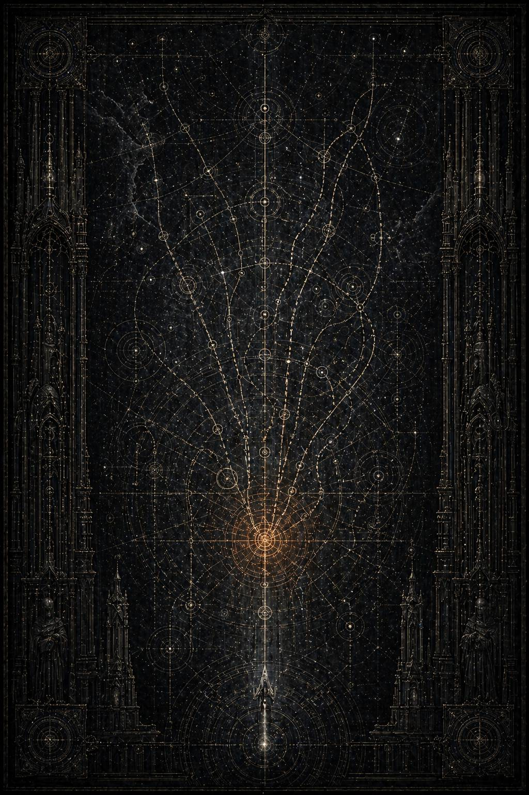

# XI. Via Falsa / Ложный маршрут

Каэль понял, что нашёл нужный узел, по одному слову.

Не по имени мира.

Не по номеру театра.

Не по санкции доступа.

По слову **несовпадение**.

Оно повторялось слишком часто для обычной военной неразберихи и слишком дисциплинированно для простого архивного бардака. Несовпадение карты. Несовпадение сигнала. Несовпадение времени входа. Несовпадение числа выведенных. Несовпадение внутреннего маршрута с утверждённым приказом. Несовпадение визуального отчёта с бортовой телеметрией. Несовпадение астропатической расшифровки с живым расположением конвоя.

Будто сама кампания уже не складывалась в единую картину, а только в несколько почти согласованных, но опасно несходящихся вариантов.

Он раскрыл верхний слой.

Официально всё выглядело терпимо. XI Легион действовал в кризисном узле, поддерживая массовый вывод населения и сохраняя внешнюю лояльность общему плану. Формальных признаков мятежа не было. Приказы отдавались. Приказы принимались. Приказы исполнялись. Сигилы верности сохранялись. Внешние каналы не фиксировали ни прямого богоборчества, ни раскола легиона, ни отказа от вертикали Империума.

И всё же сам почерк кампании уже был неправильным.

Не в том простом смысле, в каком нецензурна измена.

Хуже.

Он выглядел как операция, всё ещё стремящаяся к спасению, но уже переставшая считать реальность окончательным арбитром того, что можно и чего нельзя.

Каэль углубился в реконструктивный блок.

И прошлое впервые поднялось с ощущением тихой, почти беззвучной ереси, которая ещё не назвала себя, но уже пронизала мир изнутри.

---

Система называлась Корабрин.

Поздние архивы пытались распылить её на несколько независимых кризисов, будто бы разнесённых во времени и пространстве. Но ранний слой ещё удерживал правду: это был один узел, одна непрерывная катастрофа, один распадающийся театр, в котором одновременно происходили три вещи.

Умирал маршрутный мир.

Сходили с ума сигнальные вены сектора.

И в самой глубине боевого и эвакуационного пространства начала заводиться новая, несанкционированная ясность, слишком похожая на милость.

Мир у центрального перехода уже был списан.

Периферийные платформы ещё держались.

На внешнем кольце толпились миллионы.

Внутренние шлюзы системы раскрывались и гасли не по расписанию, а по какой-то другой, уже не вполне человеческой логике. Люди, пережившие первые волны, говорили одно и то же: маршрут не исчезал, он становился лучше, чем должен был быть. Чище. Проще. Шире. Слишком подходящим под желание любого уставшего ума.

Это и пугало больше всего.

Обычная ложь видна по жадности.

Обычный варп соблазняет чрезмерностью.

Корабрин делал другое.

Он предлагал именно ту форму спасения, которую добрый уставший человек хотел бы счесть справедливой.

XI Легион прибыл первым.

Разумеется.

Когда движение мира начинает рассыпаться, Малисара всегда приходила раньше остальных не потому, что так приказывала бюрократия, а потому, что все внизу уже слишком хорошо знали: если кто-то и удержит живой поток дольше допустимого, то именно она.

На первых этапах всё ещё выглядело как простое привычное чудо.

Разделение масс по устойчивости к свету.

Пересборка очередей не по статусу, а по способности тел и страха выдержать переход.

Устранение лишней тени на детских палубах.

Тишина там, где любой крик только множит эхо ложных путей.

Проводники XI, становящиеся не охраной, а ритмом для тех, кто уже начинал терять остатки сил быть отдельным человеком внутри общего ужаса.

И всё же уже в первые часы Корабрин начал давать симптомы, отличные от всего, что Каэль наблюдал в прежних фрагментах.

Не было одного явного соблазняющего коридора, как в позднейших легендах.

Не было голоса.

Не было «зова».

Вместо этого мир как будто всё время слегка улучшал сам себя в сторону желаемого.

Левый проход оказывался на шесть секунд стабильнее, чем должен быть.

Служебная арка растягивалась в ширину, достаточную, чтобы там почти можно было провести медицинскую волну.

Проваливающийся на глазах в глубину самого себя док вдруг принимал ещё один модуль прежде, чем сжаться окончательно.

Транспортная связка, по всем расчётам не выдерживающая новой волны, выдерживала ровно столько, сколько нужно было, чтобы захотелось довериться ей ещё раз.

Ложь не кричала.

Она была вежлива.

Малисара поняла это раньше других.

В одном боевом канале, позже вложенном в архив как технический дубль, сохранился её короткий приказ:

— Никому не радоваться преждевременно хорошему коридору. Повторяю: преждевременно хорошему.

Тогда даже её собственный капитан спросил:

— Госпожа, вы говорите так, будто улучшение и есть часть угрозы.

Она ответила:

— Иногда переполнение несёт в себе угрозу.

Потом, уже тише:

— Самые опасные маршруты те, которые сначала делают твою надежду похожей на справедливость.

Каэль остановился над этой строкой.

Вот и был первый настоящий шаг к ложному маршруту.

Не тогда, когда она ему уступит.

Уже раньше.

В тот момент, когда сама природа угрозы начинает слишком точно совпадать с самой болезненной частью её правды.

Кайрон в этой кампании присутствовал не с самого начала.

Именно это было фатально.

Его вызвали позже, когда внешний контур начал фиксировать уже не просто распад проводимости, а признаки того, что ложный маршрут может стать воронкой для целых узлов системы. Для Империума это ещё оставалось санитарной проблемой, не мифом. А значит, прислали II.

Пока его не было, Малисара держала Корабрин в одиночку.

Именно в одиночку.

Не физически, конечно. Вокруг были капитаны, навигаторы, тысячи бойцов XI. Но по той внутренней шкале, где человеку нужна не просто сила рядом, а другой, равный взгляд на реальность, она уже была одна.

Это сказалось не сразу.

Сначала лишь в языке.

Ранние приказы сохраняли привычную ей трезвость:

**удерживать только главный проход**,

**не пускать детей в боковой свет**,

**не смешивать тех, кто видит маршрут, с теми, кто слышит только страх**.

Но потом формулировки начали меняться.

В одном из пакетов, который потом официально признали повреждённым, она говорит:

— Центральное ребро невозможно по расчёту. Но оно ещё не окончательно отказало в моральном смысле.

В обычном рапорте такую фразу приняли бы за усталую метафору.

Для Каэля она уже была тревожнее явного кощунства.

Потому что маршрут не имеет морального смысла.

Именно это и есть последнее спасение от ереси.

Когда человек начинает судить физическую невозможность как нравственно неприемлемую, мир для него уже перестаёт быть просто миром. Он становится обвиняемым.

Очередной слой был уже привычно ещё страшнее.

Личный буфер неизвестного навигатора XI.

Короткие наблюдения.

Почти телеграфный стиль.

**\> …госпожа больше не спрашивает “жив ли путь”. Она спрашивает “достаточно ли мы верим в него, чтобы он оставался верным”…**

**\> …не уверен, что сам понимаю разницу, но чувствую, что она уже слишком мала…**

Каэль перечитал эту запись дважды.

Да.

Вот здесь и происходил необратимый сдвиг.

Пока путь жив или мёртв сам по себе, человек всё ещё служит реальности, как бы жестока та ни была.

Но если честность маршрута начинает хоть немного зависеть от меры внутренней веры в него, значит граница уже треснула. И в эту трещину может войти что угодно, особенно если приходит не как зло, а как наконец оправданная надежда.

Он открыл первую большую сцену главы.

---

Транспортный венец Корабрина.

Нижний медицинский пояс.

Третья волна детей и старших навигаторов.

Правый контур официально мёртв.

Левый нестабилен.

Центральное ребро по всем расчётам уже не должно существовать как путь вообще.

Но оно существует.

Слишком бережно.

Слишком аккуратно.

Ровный свет.

Отсутствие дрожи.

Необычно тихий фон.

Люди внутри потока впервые за многие часы перестают плакать не потому, что их успокоили, а потому что сам коридор почему-то кажется им милосердным.

Именно это и замечает Малисара.

Не то, что путь жив.

Не то, что он удобен.

То, что он слишком милостив.

— Остановить первую связку, — говорит она.

Капитан XI, бегущий рядом с ней, не сразу верит, что расслышал правильно.

— Госпожа, если мы не пустим их сейчас, боковые модули задохнутся раньше следующего окна.

Она смотрит на центральное ребро очень долго.

Слишком долго.

Так долго, что Каэль, читая регистратор, сам почувствовал внутренний холод.

— Я знаю, — говорит она.

И всё же не даёт приказ идти.

Вот чем так страшна эта глава. Даже здесь она ещё сопротивляется. Она не слепа. Не одержима. Не унесена уже окончательно. Она видит ложь как ложь. Но ложь становится всё мудрее именно потому, что больше не обещает силу. Она обещает прекращение унизительной, уродливой, бесконечной расплаты.

В этот момент на связи впервые появляется Кайрон.

Короткий закрытый канал.

Почти без лишних слов.

— Что у тебя?

— Коридор, который не должен быть таким добрым.

Пауза.

— Не веди туда детей.

— Я ещё не веду.

— Но уже думаешь.

Это была не ревность к её выбору.

Не приказ сверху.

Простое знание формы её внутренней открытой раны.

Малисара молчит.

Потом говорит:

— Если он всё же честный, я потеряю время.

— Если ложный, ты потеряешь их.

— Мне надоело, что мир устроен только такими предложениями.

На другом конце тишина.

Долгая.

Именно та, которая у Кайрона всегда предшествует ответу, сказанному не из силы, а из цены.

— Мир не обязан быть справедливым, чтобы мы не предавали правду о нём, — говорит он.

Каэль закрыл глаза на секунду.

Потому что вот она, суть всей их будущей катастрофы в одной фразе.

Для него правда первична даже стоя напротив ненависти к миру.

Для неё ненависть к миру, требующему такой правды, уже почти сильнее любой самой правды.

И она ещё не отказывается от его слов.

Хуже.

Она понимает, что он прав, и именно это делает их невыносимыми.

---

Следующий отрезок был уже после его прибытия.

Кайрон вошёл в Корабрин со стороны внешнего санитарного пояса и почти сразу понял, что перед ним не просто нестабильный узел, а среда, где сама мера желаемого стала рабочим инструментом лжи.

Это отразилось в его первом приказе:

— Всем внешним контурам запретить употребление слов “чистый”, “милосердный”, “безболезненный” и “естественный” применительно к нештатным маршрутам.

Капитан II спросил:

— Господин, это языковая санитария?

Кайрон ответил:

— Нет. Это карантин надежды.

Каэль перечитал эту строку и почти физически ощутил, насколько точен был Кайрон там, где большинство увидело бы только непонятную суровость. Он понимал, что на Корабрине заражение идёт не через плоть и не через очевидное варповое пережевывание сознания. Через язык ожидания. Через слова, через которые люди позволяют себе на мгновение поверить, что теперь цена наконец-то будет отменена.

Но Кайрон пришёл слишком поздно.

Потому что Малисара уже успела прожить рядом с ложным маршрутом достаточно долго, чтобы начать не только отвергать его, но и внутренне спорить с отказом.

Они встретились у карты.

Не как в Великом Переходе.

Без той страшной, ясной полноты, где их различие тут же складывалось в общий ответ.

Между ними уже возникла трещина.

Малая.

Почти незаметная.

Но в таких историях именно она и есть первая настоящая катастрофа.

— Центральное ребро нельзя использовать, — сказал Кайрон.

— Его ещё нельзя называть мёртвым.

— Его уже нельзя называть честным.

— А все остальные честные? — раздражённо спросила Малисара. — Те, где дети сотнями исчезают в боковых проходах в ожидании следующего окна?

Он ответил после короткой паузы:

— Честное не обязано быть справедливым.

Она посмотрела на него так, как, вероятно, смотрят на самого любимого человека в ту минуту, когда именно он произносит то слово, которое уже почти невозможно принять.

— Вот это я и начинаю ненавидеть, — сказала она.

Не его.

Ещё не уже.

Но уже достаточно близко к той линии, где ненависть к устройству мира очень легко перепутать с ненавистью к тому, кто продолжает называть это устройство правдой.

Каэль сидел над этой сценой, не двигаясь.

Потому что здесь книга впервые вошла в ту область, где любовь не просто бессильна, а начинает сама становиться еще одной сценой в театре боли. Чем точнее Кайрон, тем невыносимее он для той части Малисары, которая уже почти готова считать честную узость мира нравственным уродством.

И всё же решающий шаг она делает не сразу.

Делает сама кампания.

Один из боковых модулей действительно задыхается.

Один из детских отсеков гаснет раньше расчёта.

На внешнем слое происходит срыв санитарной линии.

Центральное ребро всё это время остаётся невозможным и при этом безукоризненно спокойным.

В этот момент и случается необратимое.

Малисара ведёт первую связку не по утверждённому левому контуру, а через центральное ребро.

Не весь конвой.

Не как откровенное преступление собственного приказа.

Хуже.

Как ограниченный, внутренне ещё будто бы оправданный манёвр ради тех, кто иначе не доживёт до следующего окна.

Формально это можно было назвать спасением.

В первые минуты так оно и выглядело.

Дети перестали кричать.

Старшие навигаторы успокоились.

Свет в коридоре не дрожал.

Люди шли так, будто мир на короткий срок перестал быть чудовищно узким.

И именно потому это был ложный маршрут.

Не потому, что он сразу всех сожрал.

А потому, что впервые дал осязаемо пережить невозможный опыт того мира, в который Малисара уже почти перестала верить как в нравственную необходимость.

Кайрон понял, что произошло, раньше, чем ему донесли полностью.

Позднейший лог II фиксировал только:

**изменение линии взгляда господина на тактической схеме до поступления подтверждения из внутреннего контура.**

То есть он почувствовал её выбор ещё до того, как его смогли назвать официально.

Он не сорвался в ярость.

Не проклял её.

Не объявил падшей.

Вместо этого сказал капитану рядом:

— С этого места уже нельзя будет сделать вид, что всё ещё идёт по плану.

Вот так.

Спокойно.

Страшно.

Точно.

Центральное ребро прожило дольше, чем должно было по всем расчётам.

И именно это стало последним аргументом в пользу лжи.

Потому что если ложный путь убивает сразу, его ещё можно отвергнуть как очевидную мерзость.

Хуже, когда он сначала работает.

Первую связку он пропустил.

Вторую почти.

На третьей начал разламываться.

Не взрывом.

Не демонстративным кошмаром.

Медленно.

Как хороший врач, который слишком долго притворялся спасителем, а потом аккуратно вскрыл в теле второе дно.

Дети начали слышать уже не только а друг друга, коридор целиком.

Несколько навигаторов потеряли границу собственной отдельности и стали вести колонну не по пути, а к самой точке внутренней согласованности куда-то внутрь себя.

Для толпы это выглядело как покой.

Для Малисары слишком поздно стало ясно, что это не покой, а растворение.

Она сама остановила третью волну.

Сама.

Не Кайрон.

Не внешний приказ.

Именно это делало цену почти невыносимой.

Потому что она увидела.

И всё же успела уже провести через ложный маршрут тех, кого теперь никогда нельзя будет считать просто спасёнными.

Когда Кайрон дошёл до внутреннего узла, всё уже было кончено не катастрофически, а исторически.

То есть необратимо.

Первая связка стояла на пересадочной палубе тихо.

Слишком тихо.

Дети дышали ровно, смотрели не на взрослых, а друг сквозь друга, будто всё ещё находились в некотором общем остаточном свете пути. Врачи не могли решить, выжили они или уже потеряны навсегда. Снаружи это выглядело как успех. Внутри уже пахло тем видом утраты, для которого Империум потом всегда выбирает самые сухие слова.

Малисара стояла у края палубы не поворачиваясь, когда Кайрон вошёл.

— Сколько? — спросил он.

— Первая связка дошла. — Вторая частично. Третью я остановила.

— А цена?

Пауза.

Потом:

— Её ещё не успели назвать.

Он долго молчал.

— Ты всё равно повела их туда.

Теперь она обернулась.

В её лице не было безумия.

Не было торжества.

Не было уже даже самооправдания.

Только смертельная усталость человека, который на несколько минут увидел ту версию милости, в какую слишком хотел верить, и теперь должен смотреть на её последствия своими же глазами.

— Да, — сказала Малисара.

— Почему?

Вот здесь, как понял Каэль, и была суть всей главы.

Не в том, что она даст красивую еретическую речь.

Не в том, что назовёт новую истину.

Нет.

Она отвечает почти шёпотом:

— Потому что в тот миг он был единственным местом во всём мире, которое не требовало от меня немедленно оставить кого-то умирать справедливо.

Каэль не мог отвести глаз от этих слов.

Вот как выглядит первый шаг за грань, когда человек ещё не падший.

Она не хотела власти.

Не хотела разрушить порядок.

Не желала Хаоса как такового.

Она просто выбрала тот путь, который на мгновение не требовал от неё быть соучастницей вивисекции.

Именно поэтому путь оказался ложным.

Именно поэтому она всё равно его выбрала.

И именно поэтому Кайрон уже не мог вернуть всё в прежнюю, пусть и трагическую форму одной только своей правотой.

Он сказал тихо:

— Тогда теперь ты знаешь, чем заплатила.

Она закрыла глаза.

На один удар сердца.

— Да.

— И если снова увидишь его?

Пауза была долгой.

Слишком долгой.

Вот где книга на самом деле окончательно переходит в необратимую фазу.

— Не знаю, — сказала Малисара.

Это и был ответ, после которого всё остальное уже становится лишь предисловием к катастрофе.

Не согласие с ложью.

Хуже.

Утрата прежней безусловной уверенности.

Теперь она знает цену ложного пути.

И всё же не уверена, что следующая цена не покажется ей меньшим злом, чем очередная допустимая утрата.

Кайрон тоже услышал это.

И, как понял Каэль, именно здесь его молчание стало уже не только любовью и надеждой, но и роковой ошибкой. Потому что с этого места вопрос нельзя было больше удерживать внутри них двоих без вмешательства чего-то большего. А он всё ещё не выпускал её наружу.

Не из слабости.

Из того, что ещё называл верностью их последней общей правде.

Каэль дочитал до конца позднюю аналитическую сноску, приложенную уже после стирания.

**\> …следует считать кампанию Корабрина первым зафиксированным случаем, когда Объект Б предпочёл внутренне желаемый маршрут утверждённой реальности, не отказываясь при этом от формальной лояльности…**

**\> …именно этим объясняется позднейшая трудность классификации: событие не является ни чистым спасением, ни чистой изменой…**

Да.

Вот почему глава и зовётся “Ложный маршрут”.

Не потому, что ложь здесь легко распознаётся.

Потому, что она приходит в форме почти спасения.

Каэль погасил экран и долго сидел неподвижно.

Потом взял узкую бумажную полоску и написал:

*Она впервые предпочла не истинное, а менее невыносимое.*

Спрятал её туда же, куда предыдущие, и только после этого заметил Лорен у дальнего ряда.

— Ну? — спросила она.

— Она ещё не предала, — сказал Каэль. — Но уже перешла ту черту, где правда перестаёт быть единственным арбитром выбора.

Лорен кивнула.

— Да.

— И хуже всего не то, что путь оказался ложным. Хуже, что он оказался милосерднее мира.

— Конечно, — сказала Лорен. — Иначе такие люди никогда бы на него не вошли.

Он посмотрел на неё внимательнее.

— Значит, после этого уже нельзя вернуть всё только любовью и молчанием.

— Нельзя, — ответила она. — После первого ложного маршрута преданность ещё остаётся. Но перестаёт быть лекарством. Она становится местом, где решение причиняет боль сильнее всего.

Она ушла.

А Каэль остался под сухим светом Архивариума, уже понимая, что теперь книга вошла в свой финальный круг.

Имги дал форму соблазна.

Страх утраты сделал его морально допустимым внутри неё.

Ложный маршрут превратил соблазн в поступок.
