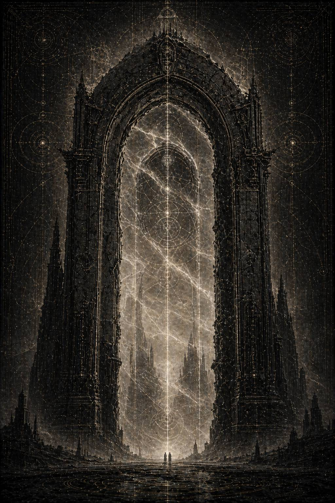

# XIII. Arcus Vetrа́ / Арка Ветра́

Арка Ветра открылась как рана, которую слишком долго пытались выдавать за логистический инцидент.

Не как место, а как совпадение.

Не геометрии.

Не маршрутов.

А двух уже названных внутри человека возможностей.

Архив называл её транзитным изгибом в мёртвом секторе.

Военные — ошибкой санитарного реагирования.

Транспорт — срывом проводимости.

Даже внешний индекс файла был собран неправильно. Не потому, что архив сгнил. Слишком много разных рук проходило по этому месту, и каждая оставляла свою правду в том объёме, в каком ещё решалась её оставить. Военный слой называл случившееся **ошибкой внешнего санитарного реагирования**. Транспортный слой, наоборот, тянул всё к **срыву конвойной проводимости вследствие ложного фронта**. Внутренний аппаратный хвост, тот самый, который не был предназначен для чтения, использовал третью формулу, самую страшную именно своей безликой сухостью:

**ПЕРВЫЙ ЗАФИКСИРОВАННЫЙ СЛУЧАЙ НЕСВОДИМОГО РАСХОЖДЕНИЯ ПРИ ПОВТОРНОМ СОВМЕСТНОМ ПРИСУТСТВИИ ОБЪЕКТОВ А И Б.**

Каэль долго смотрел на эти слова.

Не первый проступок.

Не первая ссора.

Не начало ереси.

*Первый случай несводимого расхождения.*

То есть до этого их крайности всё ещё успевали собираться в общий ответ, как в Малуме. А здесь впервые что-то произошло так, что уже не сложилось обратно в прежнюю страшную полноту.

Он открыл реконструкцию.

И увидел не место.

А сцену, где уже нечему было оставаться невинным.

---

Арка Ветра не была миром. И не станцией. И не фронтом в чистом виде. Это был гигантский транзитный изгиб в мёртвом секторе, где когда-то шли основные потоки переселенческих конвоев, а теперь всё держалось на аварийных подпорках, старых навигационных костылях и таком количестве вторичных маршрутов, что сама система давно уже жила не по правильной карте, а по памяти о том, как ею пользовались люди.

Старые пути держались на привычках.

Навигация — на вторичных связках.

Реальные карты давно уступили место тому, как через неё ходили раньше.

И в этот раз через неё шёл слепой конвой.

Так его называли в служебных хвостах.

Не потому, что корабли не имели глаз.

А потому, что внутри были дети, которые чувствовали путь раньше, чем он открывался, и потому были одновременно единственным способом пройти и главным риском потерять себя.

Дети с маршрутной восприимчивостью, слишком высокой для обычной тьмы и слишком повреждённой для прямой службы. Их перевозили с разрушенного учебного кластера, вместе с младшими навигаторами, полусломанными сенсорными носителями, сиротскими модулями сопровождения и теми взрослыми, кто ещё умел удерживать этих детей в мире отдельных тел, а не в общей дрожащей чувствительности к коридорам.

Их вели ритмами.

Слепой конвой.

Шесть — пауза — ещё шесть.

Группы, связанные не именами, а совпадением дыхания.

Это было самое хрупкое, что можно провести через систему, которая уже научилась лгать не напрямую, а через смещение внимания.

И именно туда их свели снова.

Каэль прочитал служебную пометку ниже.

**XI НАЗНАЧЕН НА ВНУТРЕННЮЮ ПУТЕВУЮ ПРОВОДИМОСТЬ КОНВОЯ.
II НАЗНАЧЕН НА ВНЕШНИЙ САНИТАРНЫЙ ПРЕДЕЛ И ЛОЖНЫЙ ФРОНТ.**

Ложный фронт.

Он остановился на этом словосочетании.

То есть помимо конвоя у Арки существовал ещё и внешний слой угрозы, достаточно убедительный, чтобы потребовать от II полного внимания. Возможно, заражённый контур. Возможно, военная имитация. Возможно, то самое, что делается не для победы, а чтобы предел был приложен не туда и не тогда.

Он углубился в реконструктивный блок.

И прошлое поднялось сразу в том регистре, где уже не остаётся места для безопасной романтики о великих фигурах. Только усталые люди, аппаратные ловушки и один конвой, который слишком похож на нерв, вынутый из тела наружу.

---

Малисара вошла в Арку изнутри конвоя.

Не сверху, как велят здравый смысл и устав.

Изнутри.

Не как командующая.

Как носитель потока.

Это уже не было просто выбором стиля.

Это было следствием.

Это тоже было записано как функциональная необходимость, хотя на самом деле уже выглядело знаком. Она всё чаще шла не к потоку, а внутрь него, как будто доверяла себе меньше, если между нею и живой массой оставался хотя бы один лишний слой командной дистанции.

После Ливнера она не могла больше позволить себе держать дистанцию, не зная, не прячется ли в этой дистанции тот самый “правильный язык”, который когда-то предложили ей.

Она держала конвой руками, голосом и счётом.

К конвою были привязаны тысячи детей.

Некоторые слепы буквально. Некоторые только к обычной карте. Некоторые слышали коридоры раньше, чем те открывались, и потому считались слишком ценными и слишком опасными одновременно. Их вели связками, не по именам, а по ритмам. Шесть на одной частоте, двенадцать на другой, узкие модули тишины вокруг тех, кто уже начинал отвечать не на голос воспитателя, а на геометрию самой Арки.

Малисара держала этот поток как хирург держит руками плод, который нельзя вынуть, нельзя оставить, и всё же надо каким-то образом пронести сквозь разрушенное чрево мира.

Она почти не спала двое суток.

Не из героизма.

Просто любая смена ритма в таком конвое требовала её присутствия быстрее, чем ей успевали подать просьбу о присутствии.

Потому что любая пауза между нею и детьми становилась местом, где чужая геометрия могла заговорить раньше неё.

И всё же, где-то под этим напряжением, в ней уже жило знание:

**существует способ держать больше, чем она держит сейчас**

Она не принимала его.

Но уже не могла не знать.

---

Лживость Арки была иной, чем в Малуме.

Малум соблазнял чистым обходом.

Арка Ветра работала тоньше.

Она разрывала единое на две одинаково правдивые срочности.

Она подбрасывала не готовый лучший путь, а ложные фронты внимания.

Там, где надо было видеть хрупкий внутренний коридор слепого конвоя, пространство вдруг начинало кричать о внешнем заражении.

Там, где требовался точный предел, на радаре вспыхивала военная угроза, слишком очевидная, почти специально созданная, чтобы целиком захватить того, кто отвечает за край.

Сама система училась разделять одно целое на две одинаково правдивые срочности.

Не ложь.

Слишком правдоподобная правда.

И система училась не подменять истину.

А **расставлять две истины так, чтобы между ними не оставалось времени**.

Это и был её настоящий талант.

---

Кайрон вошёл с внешнего вектора на шесть часов позже XI.

Слишком вовремя, чтобы это было случайностью.

Слишком поздно, чтобы ещё можно было просто соединить оба контура без уже накопленной внутренней инерции.

К тому моменту Арка уже вела себя как больной, который научился подражать симптомам сразу нескольких болезней, зная, что врач не успеет сопоставить их вовремя.

Внешний фронт был безупречно убедителен.

Заражение — настоящим.

Сигналы — корректными.

Предел — необходимым.

На северном кольце дрожал заражённый массив, похожий на раннюю форму санитарного прорыва. Не ложь целиком. В этом и заключалась его сила. Реальная угроза была. Но её рисунок был подан так, чтобы край захотел закрыться на неё раньше, чем на что-либо ещё. Дальние сигналы говорили о прорастающем фронте. Несколько сторожевых узлов уже теряли форму. Один транспорт внешнего патруля пришёл с людьми, у которых речевые петли начинали замыкаться слишком чисто.

Для Кайрона это выглядело именно так, как должны выглядеть вещи, требующие немедленного предела.

Для Малисары же центр тяжести был внутри конвоя. Там, где слепые дети уже начинали слышать в Арке слишком много света.

И именно поэтому это было идеальной ловушкой.

Потому что всё, что Кайрон видел, было правдой.

И всё, что Малисара держала внутри, было правдой тоже.

---

Они встретились на пересечении контуров не у карты, а в потоке решений.

Связь между ними была прямой. Не полностью личной. Формально рабочей. Слишком чистой, чтобы сразу показать трещину. Но именно это и делало её такой опасной: можно было смотреть со стороны и видеть только безупречную координацию высших командующих, пока не станет слишком поздно для такого успокоительного взгляда.

Первый обмен уцелел почти целиком.

— Северный фронт движется быстрее, чем должны позволять внутренние карты, — сказал Кайрон.

— Конвой слышит Арку раньше, чем открывается путь, — ответила Малисара.

Оба не ошибались.

— Если север не закрыть сейчас, он станет ртом.

— Если конвой сорвётся сейчас, у тебя будет не рот, а тысяча отдельных отверстий в живой навигации.

Пауза.

Потом Кайрон спросил:

— Чего ты от меня хочешь?

Не холодно.

Не грубо.

Прямо.

И вот тут Каэль понял, почему Арка Ветра стала первой точкой несводимого расхождения. Малум ещё держался на той страшной полноте, где они, несмотря на крайности, сразу узнавали меру правды другого. Здесь же машина добилась того, что две правды пришли одновременно и обе были настоящими, но времени на их прежнее совпадение уже не оставалось.

Малисара ответила сразу:

— Не закрывай север целиком. Дай мне вывести детей через внутреннее ребро. Сорок минут.

Кайрон сказал:

— У меня есть двадцать.

— У тебя всегда двадцать, когда речь идёт не о твоих мёртвых.

Эта фраза ударила сильнее, чем всё, что было до неё.

Не потому, что она была несправедливой.

Потому, что была сказана из того места усталости и внутренней раны, куда уже легли и Ливнер, и правильные назначения, и слишком долгое одиночное держание пути.

Кайрон замолчал.

Надолго.

Слишком надолго.

Когда заговорил снова, голос его был ещё тише прежнего.

— А у тебя всегда сорок, когда речь идёт не о том, чем дети потом станут, если дать Арке говорить через них.

И в этот момент они впервые услышали друг в друге не только правду.

А то, **как эта правда уже могла бы звучать на чужом языке**.

Вот.

Первый настоящий удар в обратную сторону.

Не аппаратная клевета.

Не чужой донос.

Он сам, своими словами, назвал ей ту цену, которую она слишком долго отказывалась считать единственно возможной.

И в этот момент между ними впервые возникло не различие, а разрыв в темпе доверия.

Не окончательный.

Но уже настоящий.

---

Операция всё равно началась.

Потому что мир не ждёт согласия.

Потому что мир не ждёт, пока двое великих существ до конца договорятся о цене.

XI повёл слепой конвой к внутреннему ребру Арки.

II начал сворачивать северный фронт в раннюю герметизацию.

Малисара вела конвой.

И впервые держала его с ощущением:

*рядом есть предел
но он уже не совпадает с ней по темпу*

Кайрон закрывал север.

И впервые делал это с ощущением:

*рядом есть путь
но он уже не совпадает с ним по срочности*

Снаружи всё ещё выглядело как совместная работа.

Именно поэтому аппарат позже сможет долго притворяться, будто случилось просто техническое несовпадение двух добросовестных контуров.

Но внутри уже шло другое.

Кайрон, получив подтверждение лжи Северина, начал резать быстрее.

Не оттого, что перестал видеть правду Малисары.

Оттого, что увидел и другую правду тоже, и в пространстве Арки ему уже не оставили той паузы, где они раньше ещё успевали совпасть.

Малисара вела конвой и впервые за долгое время делала это не с обычной страшной внутренней уверенностью, а с ощущением, что рядом нет не просто человека, а той самой формы предела, которой она привыкла доверять больше аппаратных карт. Он был здесь физически, но его решение уже двигалось по другой срочности.

Для детей это стало катастрофой раньше, чем для взрослых.

Они всегда чувствуют не только коридор, но и раскол в тех, кто удерживает коридор для них.

Когда два больших контура мира начинают говорить разной правдой одновременно, первые, кто это слышит, не генералы и не архивы.

Дети, живущие на слишком тонкой грани общей проводимости.

Один из воспитателей конвоя позже запишет:

**\> …дети начали сбиваться с ритма не в тот момент, когда Арка солгала им прямо, а когда обе великие линии рядом перестали звучать как одна невозможная правда…**

Невозможная правда.

Каэль остановился над этими словами.

Да.

Вот чего аппарат добивался всё это время.

Чтобы они перестали звучать как одна невозможная правда.

И в этот момент система сделала свой ход.

---

Внутреннее ребро Арки оказалось уже, чем ожидалось.

Конвой шёл тяжело.

Дети останавливались, поворачивая головы к пустым отводам, где на самом деле ничего не было.

Старшие навигаторы кашляли кровью.

Свет в ребре дёргался так, будто сама Арка то соглашалась быть путем, то передумывала.

Малисара всё ещё держала ритм.

Счёт.

Дыхание.

Шесть ударов на связку.

Пауза.

Ещё шесть.

Но северный фронт за это время разрастался быстрее, чем она надеялась.

И вот здесь аппаратный план сделал то, ради чего, возможно, и строился весь узел.

Во внешнем контуре показали дополнительное подтверждение ложного фронта.

Не полностью ложное. Достаточно настоящее, чтобы не быть фальшивкой.

Но и достаточно поданное в нужный миг, чтобы заставить предел закрыться раньше, чем путь успеет закончить свой честный участок.

Кайрон получил это подтверждение и, по всем нормам своей добродетели, должен был сделать именно то, что сделал.

Он закрыл северный контур.

Но не только северный.

Герметизация пошла глубже по цепи, чем собирались сначала.

Одним из её следствий стало автоматическое схлопывание бокового поддерживающего ребра, через которое XI всё ещё держал слепой конвой внутри Арки.

Вот что значила бирка:

**II ЗАКРЫВАЕТ НЕ ТО.**

Не в смысле глупой ошибки.

Не слепой промах.

Хуже.

Он закрыл то, что по всей логике внешнего предела уже стало частью рта.

Но внутри этого же решения ещё оставалось живое внутреннее ребро, на которое Малисара продолжала ставить последние шансы детей.

Правда оказалась слишком глубокой и слишком несовместимой сама с собой.

Ребро, через которое шёл конвой, схлопнулось вместе с цепью.

---

Первый обвал начался без звука.

Это тоже сохранилось почти во всех хвостах: сперва не крик, не тревога, а странное исчезновение опоры в одном из сегментов коридора, будто Арка просто перестала помнить, что тут должен был существовать путь. Потом вторая волна детей одновременно повернула головы вбок, к невидимому свету. Потом старшие навигаторы закричали не голосом, а тем сломанным дыханием, которое возникает, когда несколько реальностей начинают рваться наружу тебя через одно горло сразу.

Малисара поняла мгновенно.

— Кто закрыл ребро? — спросила она.

Никто не ответил.

Потому что отвечать было уже поздно.

Связь с внешним контуром пришла через три секунды.

Для такой ситуации это было почти немедленно.

Для слепого конвоя внутри лгущей Арки это была вечность.

Кайрон сказал только:

— Я.

Не оправдание.

Не доклад.

Просто факт.

Каэль читал это и почти не мог дышать.

Потому что в одном этом коротком слове уже содержалось всё:

его правда,

её правда,

чертёж,

ловушка,

аппарат,

соблазн,

и тот момент, где последствия собственной добродетели впервые оказываются не просто тяжёлыми, а непереносимо личными.

Малисара не ответила сразу.

Потом сказала:

— Внутри дети.

Кайрон молчал.

Секунду.

Две.

Потом:

— Я знаю.

И именно это было хуже любых объяснений.

Он закрыл контур, зная, что она всё ещё там.

Он знал.

Она была внутри.

И всё равно закрыл.

Потому что мир был расставлен так, что:

*любой выбор уже нёс вину*

Потому что аппарат подстроил время так, чтобы выбор уже нельзя было сделать без вины по любой из линий.

Северный фронт действительно становился ртом.

Внутреннее ребро действительно ещё держало детей.

Ложью было не содержание отдельных правд.

Ложью была сама сцена, где две такие правды надо было столкнуть в одном миге.

Малисара больше ничего не сказала в канал.

Просто начала двигаться быстрее.

В этот момент у Каэля по-настоящему защемило горло, потому что запись дальше переставала быть величественной историей и становилась почти непристойно живой.

Она не спорила.

Не тратила время на обвинение.

Не кричала о предательстве.

Потому что люди её рода в миге катастрофы всё ещё служат прежде, чем судят.

Малисара пошла назад по конвою.

Против потока.

К детям, которых уже тянуло к боковому свету.

К тем узлам, где поддерживающее ребро схлопывалось быстрее, чем взрослый человек способен понять, что мир только что перестал быть тем, чем был секунду назад.

К тем, кто начинал растворяться в общей проводимости.

И в этот момент в ней вспыхнула мысль, которую она ненавидела:

*в Ливнере они бы назвали это другой формой удержания*

Она не приняла её.

Но уже не могла её не слышать.

Один из воспитателей XI позже напишет:

**\> …я видел, как она выбрала не самый широкий участок, не самый безопасный, а тот, где было больше детей, уже начинавших слышать чужой свет. Тогда я понял, что для неё вопрос больше не в том, как вывести конвой. Вопрос был в том, сколько отдельных жизней она успеет вернуть из общей сингулярности обратно в страх и тело…**

Назад в страх и тело.

Вот оно. Настоящее спасение всегда унизительно по сравнению с ложным светом.

Ложный путь обещает общую ясность.

Честный спаситель возвращает тебя в боль, тесноту, отдельность и тяжёлое дыхание.

Кайрон не остался снаружи. Это важно.

Потому что позднейшая история очень хотела бы представить его просто тем, кто закрыл не то и тем самым стал чистым лезвием в чужой драме.

Но нет.

Поняв, что поддерживающее ребро ушло слишком глубоко, он изменил внешний предел обратно.

Он открыл разрез.

Нарушил собственный предел.

Нарушил уже собственную последовательность герметизации.

Открыл аварийный санитарный узел в той части Арки, которую до этого сам же признал почти ртом.

То есть сделал вещь, которую нормальная система сочла бы недопустимой: позволил уже закрытому контуру на короткий срок снова стать проходом.

Это было поздно.

Но не бесполезно.

Позднейший аппарат назовёт это:

**вторичная коррекция ошибочно углублённого предела под влиянием объекта XI.**

Как будто дело было во «влиянии».

На самом деле дело было в другом.

Он увидел собственный предел как уже недостаточно правдивый.

И попытался вернуть ему цену.

Оба в этот момент действовали против худшей версии собственной добродетели.

Оба слишком поздно.

И всё же действовали.

---

Арка Ветра удержалась.

Но уже иначе.

Конвой не погиб.

И не прошёл.

Часть детей вывели через аварийный разрез II.

Часть Малисара вернула из ложных отводов буквально руками и голосом.

Часть ушла в свет боковых коридоров прежде, чем любой взрослый успел назвать это окончательно потерянным.

Некоторые потом найдутся.

Другие нет.

Третьи вернутся не теми, кем входили.

Для Империума это всё ещё можно было оформить как тяжёлый успех.

Для тех, кто стоял внутри, это уже было первым событием, после которого слово **ошибка** становилось слишком маленьким, а слово **предательство** ещё оставалось ложью.

Потому что не было предательства.

Была правда, доведённая до невыносимого несовпадения.

После вывода последней живой связки Малисара и Кайрон встретились у обугленного края аварийного разреза.

Никаких свидетелей рядом почти не осталось.

Только дымящийся металл, остаточный свет и дети, которых уже уносили дальше, не давая им смотреть назад.

Малисара была без шлема.

С копотью на лице.

С порезом вдоль скулы.

И, что хуже всего, с тем видом, который человек получает не после чужой жестокости, а после удара правдой того, кому доверял.

Кайрон тоже был без обычной внешней неподвижности.

Не рассыпавшийся.

Но внутренне слишком близкий к тому месту, где предел впервые чувствует себя недостаточно оправданным сам собой.

Он сказал первым:

— Я закрыл глубже, чем собирался.

Малисара смотрела на него спокойно.

Слишком спокойно.

— Да.

— Север становился ртом.

— Да.

— Ребро ещё жило.

— Да.

Ничего больше.

Ни одно из этих «да» не отменяло другого.

И именно поэтому между ними теперь стояла не обычная ссора, а почти непереносимая форма взаимной правды.

Кайрон сделал полшага ближе.

Не для прикосновения.

Для точности.

— Я не видел, что Арка пойдёт через связку XI.

— Ты видел не это.

Он принял удар.

— Да.

Малисара наконец отвела взгляд.

Всего на секунду.

К обугленному краю разреза, через который только что выводили детей.

— В Ливнере мне сказали, что можно перераспределить жестокость лучше, чем мы делаем обычно, — произнесла она очень тихо. — Сегодня, когда ребро ушло, я на мгновение почти захотела, чтобы они были правы.

Кайрон не моргнул.

Но Каэль, читая, понял: именно это и было самым страшным признанием, которое она могла ему дать.

Не в том, что согласилась.

В том, что катастрофа сделала предложение Ливнера чуть менее отвратительным внутри её боли.

И он понял это сразу.

— Этого они и добиваются, — сказал Кайрон.

Она перевела взгляд обратно на него.

— А когда ты закрыл глубже, чем хотел, тебе не показалось, что в Северине они тоже были правы? Что мой путь только мешает тебе рубить концы вовремя?

Теперь уже молчал он.

Долго.

Потом ответил:

— На миг.

Вот так.

Арка Ветра не сломила их в открытое падение.

Хуже.

Она сделала обе аппаратные лжи на миг внутренне убедительными.

Ливнер — для неё.

Северин — для него.

Именно этого и ждали те, кто строил чертёж.

Не ошибка.

Не предательство.

А момент, когда:

*чужой язык на секунду совпал с их собственной правдой*

Если бы один из них ошибся в одиночку, другой смог бы ещё назвать это чужой бедой и удержать общий предел.

Но здесь каждый на мгновение увидел мир глазами предложенной ему власти.

Вот что делало событие по-настоящему историческим.

Малисара закрыла глаза.

На один удар сердца.

Потом сказала:

— Значит, следующего раза они добьются легче.

Кайрон ответил не сразу.

— Только если мы позволим им назвать сегодняшний день нашей истинной формой.

Она слабо усмехнулась.

Не радостно.

Почти без сил.

— А какая у нас истинная форма после этого?

Он посмотрел на аварийный разрез, на обугленный край закрытого коридора, на следы детей, которым пришлось спасаться уже внутри последствий их несводимого расхождения.

И сказал:

— Та, в которой мы ещё не врём друг другу о цене.

Каэль перечитал эту строку несколько раз.

Пожалуй, именно в ней и оставалось всё достоинство мира после Арки.

Не безошибочность.

Не чистота.

Не прежнее совпадение.

Просто отказ лгать друг другу о цене.

Но аппарат такого достоинства не любит.

Оно слишком плохо подходит для последующего суда.

---

Последний слой файла был уже поздним аналитическим хвостом.

И там, наконец, было написано то, что система, вероятно, так хотела получить с самого начала.

**\> …Арка Ветра подтверждает достижение порога внутренней уязвимости обоих объектов к предложенным им облегчённым версиям собственных добродетелей.**

**\> …объект XI в ситуации прямой утраты продемонстрировал кратковременную готовность рассматривать управляемую общую проводимость как менее отвратительную, чем прежде.**

**\> …объект II в ситуации внешнего ложного фронта продемонстрировал кратковременную готовность к пределу, не ожидающему встречной верификации живого остатка.**

**\> …при сохранении прямого контакта между объектами оба пока ещё способны взаимно распознавать предложенную им подмену. Однако устойчивость этого распознавания более не гарантирована.**

Вот и всё.

После Арки аппарат больше не строил чертёж на пустом месте.

Теперь у него были данные.

Обоих можно ранить собственной добродетелью.

Обоим можно назвать их собственный соблазн правильным языком.

Оба на миг уже сделали внутренний шаг к предложенной им аппаратной версии самих себя.

Оба ещё способны это увидеть друг в друге.

Но это «ещё» в аппаратном языке всегда означает одно:

*времени оставалось меньше, чем было сказано вслух.*

Оба на миг уже сделали этот шаг.

И оба ещё способны это увидеть.

Пока.

Каэль закрыл файл.

Ему понадобилось несколько секунд, чтобы понять, что он сидит, сжав пальцами край стола так сильно, что металл впился в кожу.

Он разжал руку медленно.

На экране почти сразу вспыхнуло очередное системное уведомление:

**ВЫВОДЫ ПОЛЬЗОВАТЕЛЯ ПРИБЛИЖАЮТСЯ К РЕЖИМУ СТРУКТУРНОЙ РЕКОНСТРУКЦИИ НАМЕРЕНИЯ.
РЕКОМЕНДУЕТСЯ ПЕРЕДАТЬ АНАЛИЗ В ВЕРХНИЙ КОНТУР И ПРЕКРАТИТЬ ЧАСТНУЮ СБОРКУ.**

То есть машина уже понимала, что он видит не просто события.

Намерение.

Чужое.

Системное.

Проведённое сквозь людей так, чтобы потом назвать результат их характером.

Он погасил экран.

Когда поднял голову, Лорен уже сидела напротив.

Без разрешения.

Без видимого предлога.

Очень спокойно.

— Ну? — спросила она.

— Они не сломались, — сказал он.

— Пока нет.

— Они добились первого взаимного ранения, — сказал Каэль.

— Да.

— Не падения.

— Пока нет.

— Но теперь каждый носит внутри свою версию самого себя, предложенную извне. И каждая следующая катастрофа будет говорить этим голосом громче.

Лорен кивнула.

— Ты видишь правильно.

Каэль долго молчал, потом спросил:

— Почему они не остановились после Арки? У них уже было почти всё, что нужно. Внутренняя уязвимость. Первое несводимое расхождение. Данные.

Лорен посмотрела мимо него, в сухой бронзовый свет сектора.

— Потому что такие машины никогда не умеют остановиться на «почти», — сказала она. — Потому что им нужен момент, после которого вина станет неотличима от выбора.

— И они нашли его?

На этот раз её пауза была длиннее.

— Не сразу. Но да.

Она поднялась.

— Следующий узел называется Энохский Шов.

Каэль замер.

— Что там?

Лорен посмотрела на него так, будто вопрос уже почти неуместен.

— Там им впервые предложат не просто разные версии правды. Там их поставят в ситуацию, где спасти друг друга значит уже напрямую повредить мир вокруг. После этого любой верный ответ будет выглядеть как измена чему-то третьему.

Она повернулась, чтобы уйти, но остановилась на полшага.

— И ещё, Каэль.

Он поднял голову.

— После Арки их уже нельзя читать как «двух, которых просто разлучили». С этого места они сами начинают нести машину внутри. Не как виновные. Как раненые. Если забудешь это, ты тоже станешь одним из тех, кто потом оформит их в удобную отдельность.

Каэль посмотрел на неё.

И впервые понял:

Арка Ветра была не тем местом, где они сломались.

А тем местом, где:

***Malum** перестал быть вовне*

*и стал процессом внутри них*

Она ушла.

На столе, где лежала её ладонь, осталась крошечная полоска чёрной ленты. Почти ничто. На ней едва читались три слова:

**ШОВ НУЖДАЕТСЯ В ЖЕРТВЕ.**

Каэль положил ленту рядом с транспортной биркой Арки.

Теперь рисунок был уже не просто страшным.

Он становился почти завершённым.

Ливнер дал ей санкционированный лучший путь.

Северин дал ему санкционированную чистую границу.

Арка Ветра показала, что обе подмены уже умеют говорить внутри них на языке внутренней правды.

Все это в совокупности и был истинный **Malum**, запретный плод, к которому оставалось лишь протянуть руку и взять.

Значит, Энохский Шов будет местом, где машине останется только сделать последнее:

*дать им ситуацию, в которой любовь, верность, предел, путь и спасение мира наконец окажутся расставлены так, что выбрать что-то одно без вины уже невозможно в принципе.*

И вот после этого история, вероятно, начнёт по-настоящему готовиться не к коррекции.

К стиранию.
