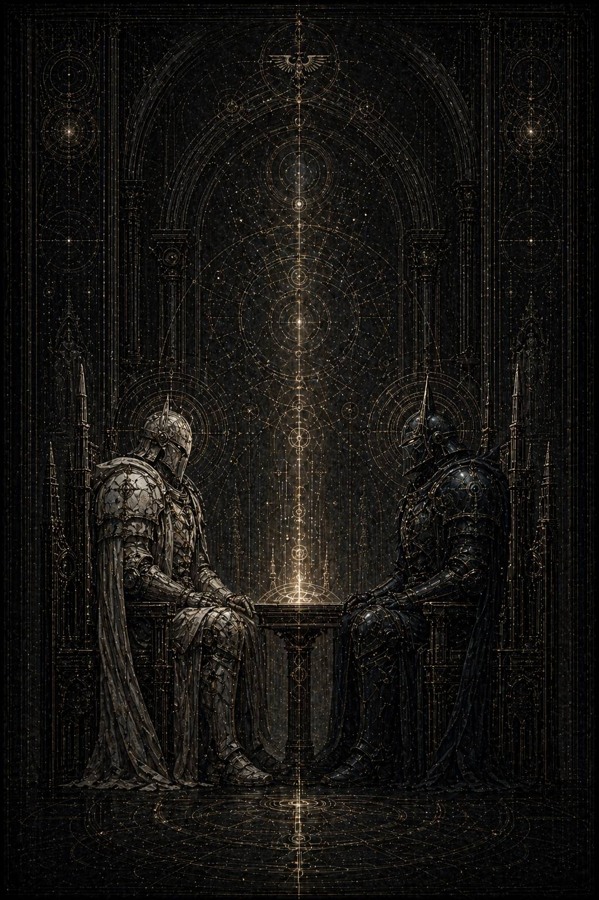

# XIV. Colloquium Extremum / Последний разговор

Каэль нашёл этот разговор не целиком.

Это было правильно.

Некоторые вещи, если архив сохранил их полностью, уже перестают быть правдой и становятся доказательством. А такие сцены не существуют как доказательства. Они живут в надломах: в несовпадающих регистраторах, в обрывках служебных маркеров, в случайно уцелевшей паузе между двумя пакетами, в голосе, из которого выжгли половину слов, но не смогли выжечь то, как он звучал.

Сначала ему показалось, что фрагменты вообще не сойдутся.

Один шёл из бортового журнала II Легиона.

Сухой. Почти бесчеловечный.

Фиксирующий только место, время и аномально длинное молчание перед возвращением командующего в основной контур.

Второй — из частного буфера XI, уже частично изъеденного позднейшей зачисткой. Там были только остатки звука, биометрические всплески, сбитые световые отметки и несколько неверифицированных строк, помеченных как «слишком личные для операционного значения».

Третий оказался самым странным: короткая полустёртая служебная записка без подписи, оставленная, видимо, кем-то из сопровождения внешнего узла. Всего одна строка:

**\> …после Корабрина они говорили так тихо, будто уже знали, что громкий язык принадлежит не им, а миру, который их переживёт…**

Каэль долго держал эту фразу перед глазами.

Потом открыл реконструкцию.

И прошлое поднялось не как война и не как политика.

Как поздний свет перед катастрофой, когда всё большое в мире уже случилось, а единственно важным становится то, могут ли двое ещё назвать друг другу правду без лжи утешения.

---

Они встретились на внешнем кольце безымянной ремонтной станции.

Не на Терре.

Не в парадном узле.

Не в месте, которое история могла бы потом красиво оформить в легенду.

Станция была почти мертва. Один внешний док. Два технических пролёта. Глухой обзорный отсек, выходящий не на величественное небо, а на тёмный срез повреждённого маршрута, где редкие аварийные огни дрожали так, будто космос и сам не до конца уверен, следует ли ему ещё быть пространством.

Именно поэтому место подходило.

Для последнего разговора между людьми их масштаба нужен не храм. Нужна честная бедность мира, в которой никакая архитектура не попытается солгать за тебя.

Кайрон прибыл первым.

По логу II он вошёл на станцию без почётного караула, оставив с собой только одного капитана у шлюза и приказав не допускать никого ближе обзорного отсека, пока он не выйдет сам. Это уже было нарушением безопасной осторожности, но не той степени, которую можно было бы назвать безумием. Он слишком хорошо понимал, что происходит, чтобы не контролировать форму риска хотя бы извне.

Малисара пришла позже.

Одна.

Вот это было уже страшнее.

Не потому, что безрассудно. Наоборот. Именно потому, что после Корабрина всякая свита, всякий внешний строй, всякая дополнительная пара глаз были бы не поддержкой, а ещё одним слоем лжи между ними и тем, что должно быть сказано.

Когда она вошла в отсек, Кайрон не повернулся сразу.

Он стоял у толстого бронестекла и смотрел туда, где умирающий маршрут ещё сохранял форму длинной бледной трещины в темноте. В таком свете люди всегда кажутся старше. Даже примархи.

Малисара остановилась в нескольких шагах.

Не рядом.

Пока ещё нет.

Некоторое время они молчали.

Позднейший аппарат, конечно, не умеет работать с молчанием как с содержанием. В одном из служебных слоёв этот отрезок обозначен просто:

**ИНТЕРВАЛ БЕЗ ОПЕРАЦИОННОГО МАТЕРИАЛА**.

Но Каэль уже знал достаточно, чтобы понимать: иногда самый важный материал и есть именно то, что не переводится в служебные материалы.

Первой заговорила она.

— Ты не докладывал.

Не вопрос.

Констатация.

Кайрон ответил после короткой паузы:

— Нет.

— Почему?

Он всё ещё не оборачивался.

— Потому что после доклада это уже перестало бы быть между нами.

Вот и всё.

Первая истина главы.

Не романтическая глупость.

Не заговор двоих против мира.

Хуже.

*Он всё ещё пытался сохранить их общую правду как пространство, не переданное наверх в чужой язык.*

Малисара смотрела на его спину долго.

Потом сказала:

— После Корабрина это уже не только между нами.

Тогда он наконец повернулся.

Каэль, читая реконструкцию по биометрическим сбоям и случайно уцелевшей визуальной тени, почти увидел их обоих так ясно, как будто стоял рядом.

Кайрон — жёстче, чем в ранних кампаниях. Не старее. Не холоднее в простом смысле. Просто так выглядит человек, слишком долго называвший конец там, где остальные позволяли себе ещё не верить, что мир уже кончился в каком-то из секторов.

Малисара — тоньше, чем раньше. Будто часть её внутренней силы больше не собиралась в единый центр так легко. В ней оставалась та же страшная собранность, но теперь она всё время держалась на фоне внутреннего напряжения, словно рядом с каждым решением уже стояла вторая, более гладкая его версия, слишком прекрасная, чтобы быть правдой, и слишком настойчивая, чтобы её можно было больше не слышать.

Они смотрели друг на друга.

И в этом взгляде уже не было прежнего облегчения Великого Перехода, где сам факт присутствия второго делал мир чище и яснее.

Теперь в присутствии второго появлялась ещё и боль.

Потому что каждый видел в любимом не только правду, но и то, как именно собственная правда уже начала ранить его.

— Я не докладывал, — повторил Кайрон. — Потому что хотел услышать тебя прежде, чем за тебя начнёт говорить кто-то ещё.

Малисара подошла ближе.

На шаг.

Не больше.

— Тогда слушай.

Пауза.

— Я видела путь, который был ложным. Я знала, что он ложный. И всё равно повела туда первую связку, потому что на тот миг он был единственным местом во всём мире, где от меня не требовали выбирать, кого оставить будет правильно.

Она произнесла это без оправдания.

Вот что было невыносимее всего.

Если бы в её голосе была истерика, если бы она пыталась спихнуть вину на артефакт, на маршрут, на усталость, на Хаос как внешнюю силу — разговор сразу стал бы беднее, легче, пошлее.

Но Малисара говорила из самой страшной части своей правды: она сделала этот шаг сознательно настолько, насколько вообще может быть сознателен человек, уже раненный более широким, более милосердным, более невозможным образом мира.

Кайрон слушал её неподвижно.

Потом спросил:

— И если путь появится снова?

Она не отвела взгляда.

— Я не знаю.

Вот оно.

Вот почему это глава перед катастрофой, а не сама катастрофа.

Не в том, что она уже погибла.

*А в том, что внутри неё исчезла последняя безусловность отказа.*

Кайрон закрыл глаза на долю секунды.

Потом открыл.

— Тогда я знаю за нас двоих, — сказал он.

— Что?

— Что следующая ложь будет лучше. Точнее. Милосерднее. Ближе к тому, что ты считаешь справедливым.

Он сделал шаг к ней.

Теперь между ними почти не оставалось расстояния, но всё ещё оставалось главное — та внутренняя бездна, которую уже нельзя было закрыть одной близостью тела или одним словом.

— И я знаю ещё одно, — сказал Кайрон. — Ты идёшь к ней не потому, что меньше любишь мир. Ты идёшь к ней потому, что любишь его так, как он не заслуживает.

Малисара опустила голову.

Не от стыда.

Скорее так, как опускают глаза под ударом самой точной возможной правды.

— А ты? — спросила она тихо. — Ты всё ещё думаешь, что твой предел не становится иногда удобнее, чем должен?

Кайрон не ответил сразу.

Вот где их разговор переставал быть речью обвинителя и обвиняемой. Он был двусторонним ровно настолько, насколько и должен быть разговор между двумя существами, которые любят друг друга не вопреки взаимной ясности, а сквозь неё.

— Думаю, — сказал он наконец. — Именно поэтому я ещё могу смотреть на тебя и не врать себе, что вижу только падение.

После этих слов, по сохранившейся биометрии, у Малисары резко изменился ритм дыхания.

Не от страха.

Не от боли.

От узнавания.

Вот она, та самая страшная любовь этой книги.

Не там, где другой говорит тебе: ты не виновата.

А там, где говорит: я вижу твою трещину и свою тоже, и именно поэтому ещё не отдаю тебя им.

Некоторое время они стояли молча.

Потом Малисара спросила:

— Если я скажу, что мир не должен быть таким узким, как ты мне ответишь?

— Что мир не обязан быть достойным нас, чтобы мы не превращали его в ложь.

— А если я скажу, что это уже почти невозможно выносить?

— Что невозможность вынести не делает иной путь истинным.

— А если я скажу, — очень тихо произнесла она, — что иногда мне кажется: я скорее готова разорвать саму ткань мира, чем ещё раз смотреть, как живое платит за правду такой ценой?

Тишина.

Это, вероятно, и было самым близким к признанию будущего падения, что она могла сказать ещё до него.

Не клятва ереси.

Не сдача.

Но уже обещание того, где её любовь к живому однажды может перестать служить миру и начнёт требовать от мира невозможного.

Кайрон ответил не сразу.

Когда ответил, голос его звучал так тихо, что часть фразы вообще не пережила регистратор.

— Тогда … я скажу, что *люблю* *тебя* именно там, где это в тебе страшнее всего.

Пауза.

— И именно потому не могу позволить тебе идти за этим до конца.

Каэль стоял неподвижно над уцелевшими строками так долго, что лампа над столом успела слегка нагреться.

Вот.

Наконец.

Не мягкое признание.

Не «я люблю тебя» как награда читателю за долгую дорогу.

Хуже.

И лучше.

Он любит её именно в той части, которая делает её опасной.

Не несмотря на её страшную добродетель.

Сквозь неё.

И именно поэтому не может капитулировать перед ней.

Малисара подняла глаза.

В реконструкции не сохранилось точного изображения её лица в этот момент. Но из двух разных источников проступало одно и то же: она смотрела на него так, будто именно этих слов и боялась больше всего.

Потому что обычная любовь просит спасения.

Та, что была между ними, требовала верности даже против самой желанной части другого.

— Поздно, — сказала она.

Не громко.

Не театрально.

Просто как диагноз, поставленный лекарем.

— Ещё нет, — ответил Кайрон.

— Нет, — сказала Малисара. — Поздно не для меня. Для нас как для той формы мира, где ты ещё можешь быть моим пределом, а я — твоим путём.

Каэль почувствовал, как у него внутри всё сжалось.

Потому что именно здесь глава называлась по-настоящему.

Последний разговор — не потому, что они больше не встретятся.

Встретятся.

И ещё как.

А потому, что только сейчас они ещё могут говорить из той версии своей любви, где оба понимают, чем были друг для друга до катастрофы.

После этого останутся уже не те же слова, а их обломки внутри войны.

Кайрон подошёл совсем близко.

Очень медленно поднял руку.

Коснулся её щеки.

Просто кончиками пальцев, будто проверяя не право, а реальность присутствия.

Это было первое по-настоящему явное прикосновение, которое архив за прошедшие века не успел или не смог уничтожить до конца.

И в нём не было ничего утешительного.

Только бедная, страшная человеческая правдивость: да, ты ещё здесь. Да, я ещё могу коснуться тебя как той, кто пока не ушёл окончательно туда, куда потом мне, возможно, придётся идти уже не за тобой, а против тебя.

Малисара закрыла глаза.

— Не делай меня обязанной выбирать между тобой и тем, что я уже почти считаю единственным милосердием, — сказала она.

Кайрон не убрал руку.

— Я не делаю. Это уже сделал мир.

Она открыла глаза.

Посмотрела на него прямо.

— Тогда скажи правду до конца. Если всё рухнет, ты остановишь меня?

Вот он.

Вопрос, после которого уже не существует никакой мирной версии этой истории.

Кайрон ответил не сразу.

Но и не слишком поздно.

— Да.

Пауза.

— Даже если я всё ещё буду любить тебя в этот миг?

— Да.

Она выдохнула.

Не так, как плачут.

Так, как человек принимает окончательный вес собственной судьбы.

— Тогда я тоже скажу правду до конца, — сказала Малисара.

— Если я увижу путь, в котором можно сохранить тебя, меня и мир сразу, я всё равно пойду за ним, даже если ты назовёшь его ложью.

Вот где книга окончательно входит в траекторию катастрофы.

Не потому, что они перестали любить друг друга.

Потому, что любовь уже не может синхронизировать их последние правды.

Он любит её достаточно, чтобы остановить.

Она любит его и мир достаточно, чтобы не остановиться, если увидит обещание иной целостности.

Оба правы.

И именно поэтому обречены.

Дальше в реконструкции снова идёт длительный провал.

Дыхание.

Мерцание световых пятен.

Редкие скачки биометрии.

Потом ещё одна уцелевшая реплика Малисары, почти шёпотом:

— Я всё равно рада, что это было именно между нами. А не между мной и их языком.

Кайрон ответил:

— Они всё равно попытаются назвать это за нас.

— Пусть. Но хотя бы не сейчас.

Вот и всё.

Последнее милосердие, которое они ещё могли дать друг другу: несколько минут правды до того, как машину мира снова включат поверх их голосов.

Когда они разошлись, ни один из них не оглянулся.

Не потому, что они были холодны.

Потому, что некоторые разлуки становятся невыносимыми именно в ту секунду, когда ты хочешь проверить, не обернётся ли другой тоже.

Каэль дочитал последний служебный хвост.

Официально встреча была оформлена так:

**краткая межконтурная сверка по итогам нестабильного маршрутного инцидента.**

Ни одного слова о содержании.

Ни одного слова о цене.

Ни одного слова о том, что внутри этой тихой беседы уже прозвучали и признание, и приговор, и последняя взаимная верность.

И всё же в одном из поздних аналитических приложений уцелела почти честная формула:

**\> …с данного момента сопряжённая связь перестаёт играть стабилизирующую роль в прежнем виде и начинает функционировать как фактор взаимного усиления трагического выбора…**

Безобразная фраза.

И всё же верная.

После этого любовь уже не лекарство.

Она становится тем, что делает катастрофу окончательно личной.

Каэль погасил экран и достал узкую бумажную полоску.

Написал:

*Они признались не в любви, а в том,
что уже не смогут спасти друг друга
одной любовью.*

Спрятал ленту глубже прежнего.

Когда поднял голову, Лорен стояла у конца ряда.

Как всегда.

Почти как часть самой конструкции его чтения.

— Ну? — спросила она.

— Здесь всё кончилось ещё до боя, — сказал Каэль.

Лорен медленно кивнула.

— Да.

— Потому что оба сказали правду до конца.

— Да.

— И эта правда уже не совпадала.

Она посмотрела на него внимательнее.

— Вот поэтому такие истории и стирают, — сказала Лорен. — Не потому, что в них есть чувство. А потому, что чувство в них не отменяет трагедию и не оправдывает никого. Оно лишь делает мир менее удобным для тех, кто потом обязан назвать всё это чистой ересью.

Она ушла.

А Каэль остался сидеть под сухим светом Архивариума, уже точно зная, что следующая глава будет для него не просто кульминацией.

Она будет тем местом, где всё, что было между ними живым, столкнётся с тем, что уже не может быть спасено ни молчанием, ни доверием, ни любовью, произнесенной вслух слишком поздно.
