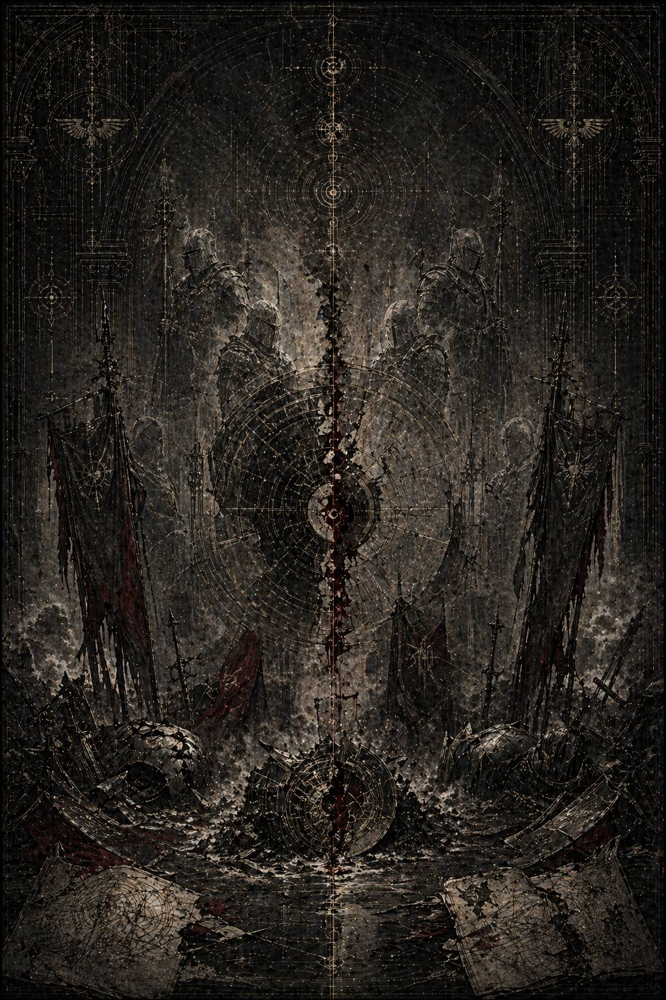

# XV. Vestigia Duorum / Пепел двух

Каэль понял, что дошёл до финала, ещё до того, как открыл первый файл.

Архив больше не пытался притворяться единым.

До этого момента даже самые страшные массивы всё ещё можно было читать как изуродованную, но всё же историю: одни слои лгут, другие проговариваются, третьи пытаются спрятать причинность под бюрократической грязью, но все они ещё как будто принадлежат одному миру, в котором события просто были плохо записаны.

Здесь было иначе.

Пакет катастрофы шёл разными версиями сразу.

Военный слой утверждал одно.

Навигационный — другое.

Астропатический — третье.

Служебные журналы уцелевших кораблей вообще не могли согласовать порядок ключевых событий между собой.

Даже простейшие вещи — кто вошёл первым, когда погас центральный узел, в какой момент внешний фронт стал внутренним, что именно увидели сенсорные группы у ядра — расходились не как ложь с правдой, а как две почти честные реальности, не желающие больше жить в одной временной линии.

Пакет назывался безобразно сухо:

**ИНЦИДЕНТ К-13 / 89x.M30 / АРТЕФАКТНЫЙ КОЛЛАПС / ВЗАИМНАЯ УТРАТА ВЫСШИХ КОНТУРОВ**

Ни имён. Ни мира. Ни даже полноценного названия театра.

Только у одного младшего архивиста столетия спустя дрогнула рука, и в служебной метке, почти случайно пережившей выжигание, осталось человеческое:

**\> …весь массив пахнет так, будто кто-то пытался заставить причинность солгать правильно…**

Каэль долго смотрел на эту строку.

Потом открыл реконструкцию.

И прошлое поднялось уже не как сцена.

Как пожар в самой ткани мира.

---

Зона коллапса не имела имени.

Позже её будут описывать как остаточный артефактный контур, как нестабильную пространственную воронку, как внутренний разлом навигационной архитектуры, как локальную варповую аномалию, как резонансный след Имги, как экспериментальный узел, как неудачно классифицированный ксеноостаток. Все эти слова были ложны по отдельности и беспомощны вместе.

Для Кайрона и Малисары это было просто место, где мир уже перестал притворяться единым.

Оно рождалось несколько кампаний подряд.

Через Имги.

Через Великий Переход.

Через ложный маршрут.

Через всё то, что они носили в себе и всё ещё пытались называть правдой по разные стороны всё более тонкой границы.

Теперь всё это сошлось на одной сцене.

На орбите умирал флот.

Маршруты расползались.

Внутренние коридоры не просто схлопывались и открывались, а меняли смысл в зависимости от того, кто и когда на них смотрел.

Люди слышали команды ещё до передачи.

Некоторые корабли выходили из манёвра раньше, чем входили в него по общей записи.

В одном секторе шёл бой.

В другом тот же бой ещё только должен был начаться.

В третьем от него уже оставался лишь пепел и неверифицируемые мёртвые сигналы.

Артефактное ядро лежало в центре этого кошмара как чёрный нерв, в котором Имги, поздние искажения и сама их история впервые срослись в одну открытую рану.

XI Легион вошёл внутрь первым.

Не потому, что так велел устав.

Потому, что если реальность ещё хоть где-то сохраняла видимость пути, Малисара всё равно пошла бы туда раньше остальных.

Кайрон со II Легионом держал внешний предел и санитарный кордон, стараясь не дать разлому расползтись дальше.

Они действовали порознь.

Но уже не как прежде, когда различие их функций ещё могло собираться в одну страшную полноту.

Теперь между ними стояла последняя правда последнего разговора.

Он знал, что придётся остановить её, если она увидит путь, который не принадлежит этому миру.

Она знала, что всё равно пойдёт этим путём, если он явится как последняя возможность не бросить живое окончательно.

И именно поэтому каждая следующая минута была уже не просто боевой задачей.

Испытанием того, выдержат ли они собственную правду.

Первый крупный разлом случился у центрального транзитного узла.

Там, где по всем картам должен был быть только разрушенный транспортный каркас, возник проход.

Не совсем материальный.

Не совсем призрачный.

Скорее одна из тех ужасных форм, в которых пространство говорит: *я всё ещё могу быть дорогой, если вы согласитесь считать меня таковой*.

Для XI это выглядело как шанс.

Для II — как рот.

И оба были правы.

Первые волны людей, попавшие в этот узел, не исчезли сразу.

Именно это всегда делало такие пути самыми опасными.

Они сначала работали.

Вели.

Успокаивали.

Давали секунды, минуты, иногда даже часы ощущения, что мир наконец перестал быть так отвратительно реальным.

Только потом начинали требовать плату не в телах, а в самой форме отдельности.

Малисара вошла туда лично.

В одном из уцелевших логов её капитан написал:

**\> …госпожа видела, что коридор не наш, но видела и другое: если не войти, мы теряем уже не возможность победы, а сам смысл того, ради чего ещё держимся внутри этого узла…**

Да.

Именно так.

Не власть.

Не победу.

Смысл.

Это и был её последний и самый страшный соблазн: не расширение себя, а сохранение живого любой ценой, когда сама реальность уже требует слишком уродливой оплаты за каждый следующий шаг.

Кайрон почувствовал её движение раньше, чем внешний тактический слой успел назвать его изменением контура.

Он уже знал, как выглядит этот тип выбора.

Слишком поздно и слишком хорошо.

— Малисара, — сказал он по закрытому каналу.

Она ответила не сразу.

Когда ответила, в её голосе уже было то пугающее спокойствие, которое бывает у людей, переставших искать совета и перешедших к внутренней убеждённости.

— У меня ещё есть путь.

— У тебя есть коридор, который хочет быть желаннее правды.

— А у тебя снаружи только правда, которая снова требует принести в жертву слишком многих.

Пауза.

— Да, — сказал Кайрон. — И всё равно она наша.

— Я больше не уверена, что “наша” значит “достаточная”.

Это была почти последняя черта.

Не крик. Не отречение. Не еретическая доктрина.

Просто сомнение в достаточности самого мира, разделённое уже не с артефактом, а произнесённое ему.

Он не стал спорить дальше по каналу.

Сделал то, что всегда делал, когда слова уже не могли успеть за катастрофой.

Пошёл внутрь сам.

---

Бой, который потом назовут их последним, внешне не был похож на дуэль.

Слишком много людей.

Слишком много гибнущего металла.

Слишком много коридоров, каждый из которых мог оказаться не тем, чем казался секунду назад.

Слишком много внешних и внутренних фронтов, чтобы два полубога просто сошлись и разыграли судьбу мира в красивом центре картины.

Нет.

Он был разбросан по узлу.

Как будто сама причинность уже не могла выдержать, чтобы всё самое важное происходило в одном месте и в одном времени.

Кайрон шёл внутрь с отрядом глубинного отсечения.

Сначала не к ней.

К сердцу прохода.

Туда, где ложный маршрут переставал быть коридором и становился формой общей синергии, через которую всё живое уже начинало хотеть одного и того же слишком быстро.

Малисара шла среди людей.

Не уводя их окончательно.

Удерживая.

Всё ещё пытаясь провести как можно больше через ту часть разлома, которая ещё не сгнила до конца.

Она и в этой точке не была просто падшей.

Вот что позднейшие архивы будут извращать сильнее всего.

Она не отказалась от живого.

Наоборот.

Слишком долго оставалась ему верна, уже не различая, где эта верность перестаёт быть спасением и становится ртом.

Когда они увидели друг друга, между ними ещё были люди.

Дети. Раненые. Проводники XI.

Бойцы II, уже режущие внешние связи, чтобы не дать разлому сомкнуться дальше.

Это была худшая форма встречи из возможных.

Потому что рядом с ними стояло то самое живое, через которое теперь надо было выбирать уже не только между собой, но и между двумя типами истины о мире.

Кайрон сказал:

— Останови поток.

Не приказ как таковой.

Последнее предложение сохранить внутри катастрофы хотя бы остаток прежнего языка.

Малисара ответила:

— Если остановлю сейчас, они умрут в узле, который уже почувствовал их.

— Я ещё могу вывести часть.

— Не их.

— Ты уже выводишь не их, а то, чем узел хочет их сделать.

Она вздрогнула.

Едва заметно.

Потому что это было правдой.

Не полной. Но достаточной.

И всё же не остановилась.

— Тогда помоги мне вывести тех, кто ещё остаётся собой, — сказала она.

Каэль замер над этой строкой.

Потому что именно здесь первая книга достигает вершины собственной трагичности.

Они оба уже видят чудовищность происходящего.

Оба не лгут себе о цене.

И всё равно остаются по разные стороны того, что надо считать последним допустимым актом преданности живому.

Кайрон шагнул ближе.

— Если я войду глубже, путь замкнётся через меня тоже.

— Уже замыкается.

— Да. Поэтому я и прошу тебя остановиться.

Она смотрела на него так, будто впервые за всю книгу увидела не его правоту, а то, насколько эта правота несовместима с той частью её самой, которую она больше не может убить без остатка.

— Я не могу, — сказала Малисара — Не после всего, что уже увидела...

Вот и всё.

Настоящее признание падения было не “я выбираю ложь”.

*Я не могу больше отвергать мир, где цена спасения наконец может оказаться меньше.*

После этого бой действительно начался.

Не между легионами в целом.

Между пределом и путём внутри одного горящего узла.

II резал внешние связки, чтобы не дать разлому стать всеобщим.

XI удерживал внутренние потоки, чтобы спасти хотя бы их часть.

Одни и те же коридоры в разных регистраторах выглядели то как спасение, то как перерождение, то как санитарный провал, то как временно удерживаемый переход.

Кайрон пробился к сердцу ложного маршрута.

Там, где пространство уже не было коридором, а напоминало внутренность огромного чёрного древа из света и пепла. Ветви, которых не должно быть. Узлы, похожие на плоды. Развилки, где любой шаг выглядел как уже случившийся в другой версии мира.

Имги вернулся не как объект.

Как форма.

Поздние регистраторы не смогли описать это без срыва.

Один говорил о «множественной топологии».

Другой о «перегрузке причинности».

Третий просто выдал пустую строку длиной в восемь секунд.

И, пожалуй, эта пустая строка была правдивее прочих.

Малисара вошла туда следом.

Теперь уже без людей.

Без оправдания потоком.

Без внешней функции.

Только она, он и тот разлом мира, который всё это время рос между ними как третья сущность.

Сохранилась лишь визуальная тень.

Не лица.

Две фигуры по разные стороны ветвящегося чернеющего узла.

Одна — жёсткая, как проведённая линия.

Другая — напряжённая, как путь, ещё не решивший, быть ли ему правдой или милостью.

Кайрон нарушил молчание первым.

— Это не мир, который можно спасти. Это мир, который хочет убедить нас, что он достоин спасения любой ценой.

Малисара ответила почти сразу:

— А ты уверен, что мир ещё достоин того, чтобы я оставляла живое в нём умирать ради высшей справедливости?

Не диалог полководцев.

Не спор идеологий.

Глубже.

Двое говорят уже не о выборе действия, а о том, на какую реальность ещё можно давать внутреннее согласие.

Кайрон сделал шаг к центру разлома.

— Если ты сейчас не остановишься, ты уже не спасёшь ни их, ни себя.

— А если остановлюсь, — сказала Малисара, — я подтвержу, что всё, что мы делали, всегда было только более красивой формой капитуляции.

Каэль понял, что в этот момент у них уже не оставалось языка, который мог бы примирить эти правды.

Всё, что могло бы сработать раньше, уже было сказано.

Последний разговор уже состоялся.

Теперь слова больше не возвращали.

Они только делали яснее цену того, что должно произойти.

Кайрон поднял оружие.

Не торжественно.

С ужасной простотой человека, который слишком хорошо понимает, что именно сейчас делает.

Малисара не сразу ответила тем же.

Вот это и было хуже всего.

В её движении ещё оставалась доля нежелания не убить его, а принять саму форму их последнего выбора.

— Не заставляй меня видеть в тебе конец, — сказала она.

— Не заставляй меня называть милостью то, что пожирает форму мира.

И тогда они сошлись.

---

Никто из внешних регистраторов не даёт одной и той же последовательности боя.

Именно это потом станет главным источником внутренней трещины в архивах.

В одних пакетах первым бьёт Кайрон.

В других — Малисара.

В третьих удара как такового вообще нет, а есть резкий всплеск причинностной перегрузки в самом ядре разлома.

В четвёртых фиксируется, что оба входили в центр узла уже после того, как он начал схлопываться, то есть внешне их последняя схватка вроде бы вообще не могла состояться так, как её потом будут пересказывать.

Но кое-что совпадало почти во всех версиях.

Во-первых, в момент столкновения внешний бой на несколько секунд как будто потерял общую временную связность. Части флота видели разное. Отсеки оказывались уже разрушенными до удара. Некоторые узлы, наоборот, переставали гореть после того, как в них входила волна разрушения.

Во-вторых, в ядре разлома зафиксировали невозможную сигнатуру:

не смерть,

а короткое нарушение единственности исхода.

И в-третьих, после всего в центре остались не тела, не просто пепел и не обычная воронка.

Остался след, который поздний архив назовёт:

**неправильным исчезновением, сопровождаемым неустойчивой остаточной симметрией**.

Каэль читал это и понимал, что самым честным словом здесь действительно остаётся только одно:

***неправильное.***

Не обычная гибель.

Не вознесение.

Не телепортация.

Не варповая аномалия в грубом виде.

Что-то случилось с самой причинностью удара.

Как будто, долг, предел, путь, артефактный соблазн и взаимная верность друг другу были в этот момент уже настолько глубоко сплетены, что мир не сумел до конца решить, как именно оформить их конец.

Среди позднейших выжженных фрагментов уцелела одна фраза неизвестного свидетеля.

Видимо, того, кто стоял на внешнем кольце и увидел только самую последнюю вспышку.

**\> …казалось, будто они не убили друг друга, а разрезали между собой что-то третье, слишком большое для одного мира…**

Это было, пожалуй, самой честной формулой всей главы.

Не взаимное уничтожение как моральная картинка.

Не героическая смерть влюблённых.

Не суд верного над падшей.

Они вспороли нечто третье.

То, что уже слишком долго росло между ними, в них и вокруг них.

И, разрезая, сами пали в этот разрез.

---

Внешний театр после этого распался быстро.

Разлом закрылся.

Не сразу.

Именно поэтому некоторых ещё удалось спасти.

II сумел удержать внешний предел достаточно долго, чтобы фронт не расползся на соседние системы.

XI вывел остатки живых связок.

Часть детей, прошедших через внутренние коридоры, уже никогда не будут описаны в архивах как полностью сохранившиеся, но они всё же остались в мире, а не в его ложном обещании.

Флот потерял слишком многое.

Слишком много записей не сошлось.

Слишком много офицеров после этого говорили противоречащие друг другу вещи, даже искренне не понимая, что именно противоречит.

Для внешнего Империума всё это всё ещё можно было подать как трагическую, но объяснимую гибель двух потерянных примархов в момент подавления еретической катастрофы.

Но в самой ткани события уже осталась трещина, которую никакая поздняя канцелярия не могла закрыть до конца.

Потому что там, где ожидали найти останки и пепел, нашли симметрию.

Там, где ожидали одну линию причины, нашли несколько несовместимых.

Там, где ожидали чистый пример назидательной вины, нашли остаточную неправильность, слишком опасную для простой морали.

Именно поэтому, как понял Каэль, потом и понадобилось не просто осуждение.

**Выжигание.**

Не только их.

Самого типа события.

Он дочитал последний аналитический хвост.

Тот самый, где уже голосом почти не человека, а аппарата подводился итог.

**\> …внешняя классификация: взаимная утрата в ходе локальной нейтрализации артефактного коллапса…**

**\> …внутренняя проблема: остаточные данные не подтверждают единую модель завершения…**

**\> …рекомендуется немедленный переход к фазе мифологической коррекции до стабилизации вторичных интерпретаций…**

Мифологической коррекции.

Вот и всё.

В ту секунду, когда история перестала быть управляемой как факт, её решили добить как миф.

Каэль погасил экран и долго сидел, не двигаясь.

Потом достал узкую бумажную ленту и написал:

*Они не просто погибли. Мир не смог честно оформить их конец.*

Спрятал ленту так глубоко, как будто сам Архивариум уже дышал ему в затылок.

Когда поднял голову, Лорен стояла у конца ряда.

Как всегда.

Но сегодня в её лице было меньше обычной усталой архивной рассеянности.

Слишком близко он подошёл к самому центру.

— Ну? — спросила она.

— Это не обычная катастрофа, — сказал Каэль. — И не обычное взаимное уничтожение.

— Нет.

— Они разрезали что-то, что уже было больше их двоих. И в этом разрезе сами исчезли неправильно.

Лорен кивнула.

— Да.

— Значит, именно здесь книга должна перестать притворяться, что речь просто о падении двух потерянных примархов.

— Именно здесь, — сказала она. — Но только на уровне чувства, не объяснения. Если ты начнёшь объяснять это слишком рано, первая книга лопнет раньше собственного конца.

Он посмотрел на неё внимательнее.

— А что тогда остаётся для следующей главы?

Лорен чуть отвела взгляд.

— Лёд, — сказала она. — Государственный. Чистый. Безошибочный. После такой неправильности Империум уже не мог просто скорбеть или судить. Он должен был переделать саму память.

Она ушла.

А Каэль остался под сухим светом Архивариума, уже точно зная, что следующая глава будет страшнее самой катастрофы.

Потому что убить двоих — это ещё человеческая жестокость.

А вот стереть саму возможность их правильного прочтения — уже работа системы, которая боится не ликов, а смысла.
