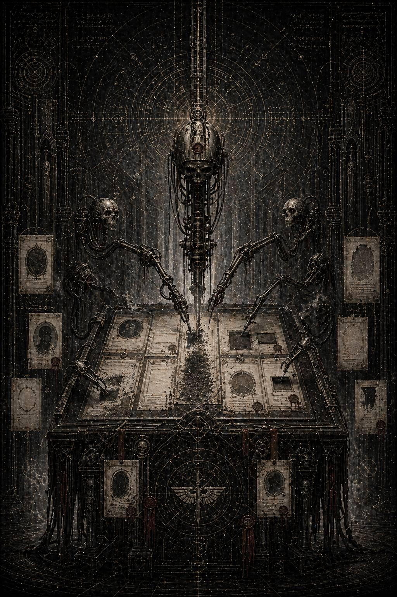

# XVI. Oblivio memoriae / Забвение памяти

Самые страшные документы не кричат.

После катастрофы Каэль ожидал увидеть в архивах хоть что-то человеческое: всплеск паники, разрыв в канцелярии, поспешные приказы, злость, вину, хотя бы плохо скрытый страх. После такой неправильной гибели мир обычно оставляет на бумаге дрожь. Даже если потом её выравнивают, где-то в ранних слоях всегда сохраняется крик.

Здесь не было крика.

Только холод.

Пакет открылся под сухим, почти оскорбительно чистым заголовком:

**ПРОТОКОЛ МИФОЛОГИЧЕСКОЙ КОРРЕКЦИИ
УРОВЕНЬ: ВНУТРЕННИЙ
СТАТУС: НЕ ПОДЛЕЖИТ СОХРАНЕНИЮ В ОБЩЕЙ ПАМЯТИ**

Ни имён. Ни мира. Ни упоминания того, что только что разорвало один из внутренних узлов истории так, что даже причинность не сумела потом собрать себя обратно без остаточного шва.

Каэль сидел неподвижно, пока строки медленно проступали над столом.

**ПРИОРИТЕТ 1: УСТРАНЕНИЕ СИММЕТРИИ
ПРИОРИТЕТ 2: РАЗВЕДЕНИЕ ЛОКАЛЬНЫХ ИСТОРИЧЕСКИХ ХВОСТОВ
ПРИОРИТЕТ 3: ИСКЛЮЧЕНИЕ ПАРНОЙ ОПТИКИ ИЗ ДОПУСТИМОГО НАРРАТИВА
ПРИОРИТЕТ 4: ГЕНЕАЛОГИЧЕСКАЯ СТАБИЛИЗАЦИЯ ЧЕРЕЗ ИЗЪЯТИЕ**

Устранение симметрии.

Вот с чего они начали.

Не с суда.

Не с проклятия.

Не с идеологического осуждения.

*С устранения симметрии.*

Потому что именно она была последним, самым упрямым телесным следом того, что когда-то существовало двое, стоявших в мире не как два случайных имени, а как опасная взаимная полнота. Пара пустых постаментов. Парные провалы в нумерации. Двойной шов в старых реестрах. Два исчезнувших сигила, чьё отсутствие всё равно продолжало держать форму.

Необходимо было разорвать даже это.

Он пошёл глубже.

Первый слой касался бронзы.

Мемориальные залы.

Статуи.

Основания.

Переиндексация скульптурных рядов.

Реклассификация освободившихся ниш как «проектных недостроев».

Замена описаний в каталогах.

Физическое удаление не только ликов, но и пропорций пустоты вокруг них.

Кто-то мыслил с чудовищной точностью. Недостаточно было убрать статуи. Нужно было ещё сделать так, чтобы даже пространство, где они стояли, перестало выглядеть как пространство, предназначенное именно для двоих.

Один из ранних приказов гласил:

**\> …основания не уничтожать полностью. Полная ликвидация создаёт избыточный след вмешательства. Рекомендуется перевести остаточную архитектуру в статус “не завершённого по внутренним причинам мемориального узла”…**

Каэль медленно выдохнул.

Даже пустоту они не решались делать слишком правдивой.

Потому что правдивая пустота всегда кричит о вырванном присутствии. А им нужна была пустота, похожая на небрежность, на служебную незавершённость, на серую досадную ошибку.

Следующий слой касался имён.

Не только их собственных.

Всех, кто стоял слишком близко.

Капитаны II и XI, слишком часто появлявшиеся рядом в одних и тех же документах.

Связисты.

Навигаторы.

Служители, оставившие слишком человеческие формулировки.

Офицеры сторонних легионов, оказавшиеся свидетелями их опасной согласованности.

Даже младшие архивисты старых экспедиций, позволившие себе однажды записать не тот оттенок ужаса, что предписывала процедура.

Никого не убивали одинаково.

Вот что было самым страшным.

Кого-то просто выводили из общей памяти как второстепенную утрату кампании.

Кого-то перераспределяли по новым службам с полной чисткой раннего послужного следа.

Кого-то оставляли жить, но уже внутри исправленного нарратива, где сама их память начинала выглядеть как личное искажение разума или тяжёлый боевой перегрев.

Кого-то, судя по коротким чёрным отметкам, выводили совсем — без следа даже в низших регистрах.

Не месть.

Селекция памяти.

Они не хотели только убрать неудобные имена.

Они хотели переделать саму структуру свидетельства, чтобы в будущем уже не нашлось достаточного числа живых нитей, из которых кто-то смог бы снова сшить правильную пару.

Каэль открыл следующий пакет.

Там был Малкадор.

Не как тёмный злодей поздней легенды.

Хуже.

Как государственный разум, достаточно холодный, чтобы понимать: после такой катастрофы недопустимо не только последствие, но и смысл.

Сохранился один служебный конспект встречи внутреннего круга.

Лишённый внешней патетики, почти деловой.

— Речь не о наказании, — произнёс Малкадор. — Наказанию подлежит проступок. Здесь мы имеем дело с формой, которая не должна пережить своих носителей.

Каэль прочитал это дважды.

Не должна пережить своих носителей.

Вот почему **oblivio memoriae** была не просто политикой, а чем-то ближе к санитарному уничтожению метафизического следа. Их боялись уже не как мёртвых и не как виновных. Боялись, что сама форма их связи переживёт тела и начнёт работать дальше — в мифе, в памяти, в тайной надежде, в неправильном чтении генеалогии.

Другой фрагмент был ещё хуже.

Один из присутствовавших, имени которого не осталось, спросил:

— Достаточно ли будет объявить их падение следствием личной избыточности?

Малкадор ответил:

— Нет. Пока существует парное прочтение, всякая личная избыточность будет прочитана как раскол единой раны, а не как два отдельных порока.

Вот и вся программа.

Не просто назвать их плохими.

Разорвать между ними причинность.

Его — сделать отдельным холодом.

Её — отдельной гордыней милосердия.

Оба должны были стать читаемы порознь, как два независимых предостережения, а не как одна история о верности, страхе, пределе, пути и машине, испугавшейся их целостности ещё до падения.

Следующий слой касался легионов.

Каэль читал его с почти физическим отвращением.

Не потому, что там была кровь.

Крови в нём как раз почти не было.

Сколько боевых братьев II и XI осталось.

Сколько признаны годными к дальнейшей службе после переочистки знаков.

Какие роты расформировать полностью.

Какие свести в безымянные контуры.

Какие знаки различия уничтожить на месте.

Какие штандарты переплавить.

Какие корабли переименовать.

Какие генеалогические ветви прервать, а какие замаскировать под обычную реорганизацию после тяжёлой утраты командования.

Даже здесь избегали полной прямоты.

Никто не писал: «мы стираем сынов двух вычеркнутых».

Писали иначе:

**ОТМЕНА НЕУСТОЙЧИВОЙ ПРЕЕМСТВЕННОСТИ**

**СНИЖЕНИЕ МИФОЛОГИЧЕСКОЙ ИНЕРЦИИ**

**РАССЕЯНИЕ ЧРЕЗМЕРНО ПЛОТНОЙ ВНУТРЕННЕЙ ИДЕНТИЧНОСТИ**

Рассеивают не солдат.

Рассеивают идентичность.

Каэль понимал: после такого даже выжившие уже переставали быть просто уцелевшими. Их переделывали в носителей чужих будущих легенд, лишая старую линию имени, центра и парной памяти.

Он открыл реконструктивный блок.

И прошлое впервые после катастрофы показало себя уже не в огне, а подо льдом.

---

Терра не скорбела.

Вот что, вероятно, убивало сильнее всего.

Не было грандиозной траурной тишины.

Не было скорбных колоколов в масштабе Империума.

Не было даже той поддельной торжественности, которой власть иногда прикрывает свои самые жестокие внутренние ампутации.

Жизнь Дворца шла своим чередом.

Флоты приходили и уходили.

Списки войн удлинялись.

Миры принимали согласие или умирали.

Сотни тысяч голосов продолжали говорить о снабжении, порядке, вере, фортификации, мясном обеспечении кампаний, переработке трофейных систем, перегруппировке контуров.

И где-то внутри этого огромного, не умеющего останавливаться тела два имени уже начали вымывать из самой ткани памяти.

Первым делом зачистили зримое.

Мастера сняли лица со статуй.

Потом статуи исчезли совсем.

Потом основание ещё несколько дней стояло пустым, и этого оказалось достаточно, чтобы один младший служитель сказал другому:

— Здесь как будто всегда должно было быть двое.

Его имя позже вычеркнут из списков.

В архивах меняли не только таблички.

Меняли ритм фраз.

Убирали те места, где II и XI прежде фигурировали рядом.

Разводили кампании по разным секторам.

Переставляли логические акценты.

Заставляли поздние выжимки говорить так, будто никакой великой парной оси никогда не существовало, а были только два отдельных печальных отклонения, слишком незначительные для подробной памяти и слишком опасные для прямого упоминания.

Потом начали работать с живыми.

В одном из архивов Каэль нашёл описание сцены, которую позже, очевидно, много раз пытались стереть из-за её простоты.

Офицер Второго Легиона, переживший катастрофу, стоит перед новым куратором распределения. С его брони уже сняты старые знаки. Пластины зачищены почти до металла. Ему дают новый маршрут, новую присяжную формулу, новый контур службы. Офицер спрашивает:

— А как теперь называть тех, кем мы были до этого?

— Никак. Это и будет формой вашей верности.

Каэль долго не мог читать дальше.

Потому что в этой короткой сцене **oblivio memoriae** вдруг переставала быть гигантской государственной процедурой и становилась тем, чем она является на самом деле: принуждением живого человека к языку, в котором ему запрещено даже спросить правильно о собственной утрате.

Следующий пласт касался уже не легионов и не памятников.

Касался будущего.

Именно тут становилось ясно, что стирали они не прошлое.

Стирали возможность будущего чтения.

Служебные инструкции архивам нижних контуров предписывали:

**не уничтожать все повреждённые следы тотально;**

**оставлять часть противоречий в статусе незначительного шумового мусора;**

**разрешать выжить некоторым неверифицируемым аномалиям в области нумерации и мемориальной симметрии, но лишить их связности.**

Это звучало почти абсурдно, пока Каэль не понял логику.

Полное уничтожение создаёт легенду.

Остаточный несвязный мусор порождает лишь сомнение.

То есть лучшая форма забвения — не пустота, а хлам.

Тогда правда умирает не от удара, а от невозможности собрать себя в единое целое.

Он замер над одной особенно важной строкой:

**\> …остаточные аномалии допускается сохранять при условии, что их совместное чтение требует предварительного еретического усилия интерпретации…**

Вот.

Прямо.

Почти честно.

Чтобы увидеть правду, читатель уже должен стать еретиком самим способом чтения.

Именно так Империум перекладывал ответственность за память на самого вспоминающего.

Не «мы скрыли».

*Ты слишком много захотел увидеть.*

Каэль почувствовал, как по спине проходит холод.

Потому что теперь он уже точно знал, кем является сам.

Не свидетелем.

Не исследователем.

Носителем правильного способа читать хлам как шов.

---

Он открыл последний реконструктивный эпизод.

Пустой мемориальный зал.

Тот самый или один из похожих — поздняя зачистка уже почти стёрла локальные различия.

Рабочие снимают остатки крепёжных пластин.

Служитель каталогизации диктует новую формулировку для реестра.

Двое младших архивистов стоят у края зала, слишком низкие по рангу, чтобы понимать весь масштаб происходящего, и всё же достаточно живые, чтобы чувствовать неправильность.

Один говорит:

— Если их не было, почему место выглядит так, будто по ним скучает?

Другой отвечает:

— Значит, мы плохо прибрались.

Кто из них сказал это, в позднем слое уже было неразличимо.

Но Каэль, читая, вдруг понял с почти болезненной ясностью: процедура **oblivio memoriae** всегда обречена сбываться не до конца.

Потому что мир хранит не только содержание.

Мир хранит форму отсутствия.

Можно стереть имя.

Можно разорвать легенду.

Можно превратить любовь в несуществовавший архивный шум.

Но там, где когда-то стояли двое, даже пустота будет не нейтральной.

Она будет симметричной.

Неправильно тёплой.

Притягивающей взгляд.

Похожей не на недострой, а на ампутированное присутствие.

Вот что увидел он в самом начале.

Теперь круг замкнулся.

Первый пустой постамент был не загадкой.

Он был следом.

Следствием работы, с которой он сейчас сидел лицом к лицу.

Он вернулся к верхнему слою, к Малкадору.

В одном из последних конспектов тот произнёс фразу, которая, вероятно, и стала настоящим моральным ядром всей главы.

*— История не обязана быть полной,* — сказал он. *— История обязана быть безопасной для тех, кто придёт после.*

Каэль смотрел на эти слова долго.

Вот она, формула любого системного мифа.

Не ложь как ошибка.

Ложь как санитарная необходимость.

Если правда опасна, значит стирать её уже не просто позволительно.

Должно.

И именно в этот момент он окончательно понял, что эта книга не о падении двух примархов.

Эта книга о том, как верность, оказавшаяся слишком сложной для вертикальной архитектуры Империума, была сначала вытеснена в катастрофу, а потом окончательно экстерминирована второй раз — уже как смысл.

Он погасил экран.

В секторе было тихо.

Только сухой шелест лент.

Далёкий скрип сервитора.

Лампа над столом.

Мир делал вид, будто он всё ещё обычный.

И вот тогда на его собственном рабочем терминале вспыхнуло крошечным пылающим солнцем новое сообщение.

Не архивное.

Живое.

Личное.

**АНАЛИТИК МЕРРОН.
ВАШ ПОВЕДЕНЧЕСКИЙ РИСУНОК ОТКЛОНИЛСЯ ОТ ДОПУСТИМОЙ НОРМЫ СОРТИРОВКИ.
ВАМ НАЗНАЧЕНА ИТОГОВАЯ ВЕРИФИКАЦИЯ.
ОТЛОЖИТЬ НЕЛЬЗЯ.**

Вот теперь всё стало окончательно просто.

Они заметили.

Не потому, что он читал слишком глубоко.

Потому, что начал собирать из хлама смысл.

Именно это всегда и выдаёт еретика настоящего типа.

Он сидел неподвижно ещё несколько секунд.

Потом очень медленно достал узкую бумажную полоску и написал финальную фразу этой книги:

*Их вычеркнули не за то, чем они стали.*

*А за то, что их история могла пережить их как форма.*

Спрятал её глубже прочих.

Когда поднял голову, Лорен уже стояла рядом.

Не у дальнего ряда.

Не у шкафа.

Совсем близко.

На её лице не было удивления.

Только усталое знание человека, который давно ждал именно этого момента.

— Ну? — спросила она.

— Теперь я знаю, что именно они убивали, — сказал Каэль.

— Что?

Он ответил не сразу.

— Не их. Не только память о них. Они убивали возможность когда-нибудь прочитать их вместе правильно.

Лорен кивнула.

— Да.

— И теперь придут за мной не потому, что я знаю имена. А потому, что я вижу форму.

— Да.

Он посмотрел на неё впервые с тем прямым вниманием, которое уже не оставляет места для мелкой вежливой лжи.

— Что дальше?

Лорен выдержала его взгляд.

— Дальше ты либо отдашь им всё в чистом виде и исчезнешь вместе со смыслом.

— Либо сделаешь с правдой то, что они веками делали с ложью.

— Что именно?

Она очень слабо, почти безрадостно улыбнулась.

— Спрячешь её среди хлама.

Каэль помолчал.

Потом спросил:

— Кто ты на самом деле?

Лорен не ответила сразу.

— Не то, что ты уже успел себе придумать, — сказала она наконец. — Не призрак, не серый курильщик, не ошибка машины и не чужой голос в твоей голове. Я одна из тех, кто слишком долго разбирал последствия чужого вычёркивания. Я видела не саму правду, а шов, который остаётся после неё. И выжила лишь потому, что никогда не пыталась собрать её до конца.

Она чуть склонила голову и в глубине ее взгляда было нечто, чему Каэль не мог подобрать подходящего термина.

— А ты попытался.

После этого она ушла.

А Каэль остался сидеть в сухом свете Архивариума, уже точно зная, что книга о расследовании закончилась.

Дальше начиналось не следствие.

Работа носителя.

Не написать правду.

Сделать так, чтобы она пережила его самого.

За стеной кто-то уже шёл.

Шаги были спокойными.

Уверенными.

Неторопливыми.

Система всегда приходит именно так, когда уверена, что её работа уже почти завершена.

Но она ошибалась в одном.

Потому что **oblivio memoriae** умеет стирать из памяти имена, статуи, хроники и даже любовь как официальный миф.

Но оно почти никогда не успевает стереть саму форму шва, по которому однажды кто-то другой снова поймёт:

здесь вырезали не двоих.

Здесь вырезали целый возможный способ быть миром.
