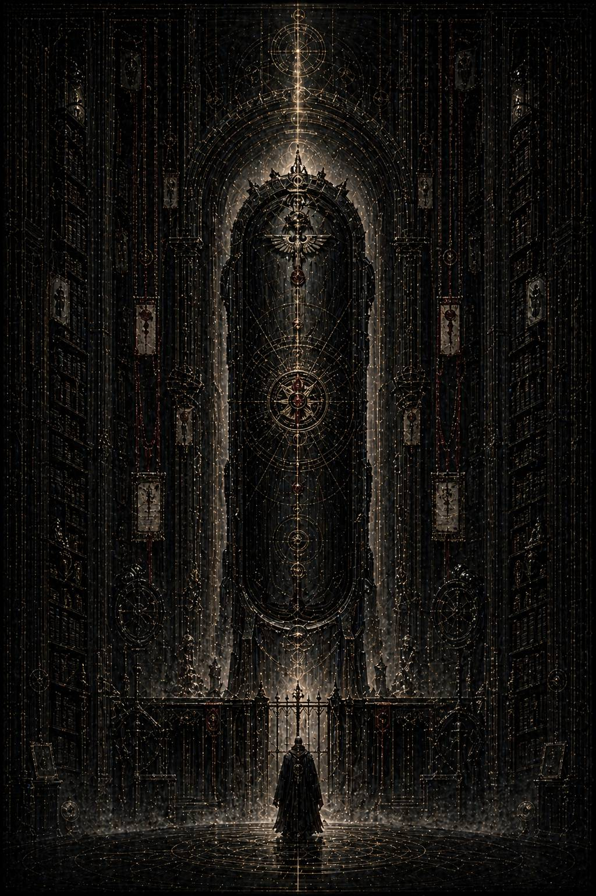

# Vas Haeresis / Контейнер ереси

Когда за Каэлем пришли, это выглядело не как арест.

Именно этим Архивариум всегда и был страшнее любой тюрьмы.

Никто не врывался в келью. Никто не ломал замки. Никто не кричал его имя в коридоре. Просто на рабочем экране, среди серых лент, пустых формуляров и тусклого света служебной лампы, висела планшетка вызова.

**АНАЛИТИК МЕРРОН.
ВАШЕ ПРИСУТСТВИЕ ТРЕБУЕТСЯ В СЕКТОРЕ ИТОГОВОЙ ВЕРИФИКАЦИИ.
ОТЛОЖИТЬ НЕЛЬЗЯ.**

Без подписи. Без объяснения. Без угрозы.

Архивариум никогда не угрожает там, где уже уверен в своей версии будущего.

Каэль долго смотрел на планшетку, не прикасаясь к ней. Потом очень медленно поднял взгляд на ряды шкафов, уходящих в полумрак, на сухую бронзу решёток, на танец пыли в световом столбе. Всё вокруг оставалось прежним. Именно это и означало конец.

Не катастрофа. Не падение. Не сцена.

Просто мир больше не притворялся, будто готов оставить его в покое.

Он уже знал достаточно.

Не всё. И в этом был особый тип ужаса. Он не знал, что именно стало с Кайроном и Малисарой после их катастрофы. Не знал полной природы **Malum**. Не знал, где кончается **oblivio memoriae** и начинается разлом самой причинности. Но он знал главное, а главное всегда опаснее механики.

Империум стёр не двух примархов.

Империум стёр саму память о прецеденте.

Память о том, что среди его полубогов когда-то существовала не только вертикаль братской субординации, но и горизонтальная связь, достаточно сильная, чтобы напугать саму архитектуру власти.

Это и было эталонной ересью.

Не учение. Не догма. Не культ.

Способность увидеть, что история была не единой. Что верность могла оказаться сложнее обычной клятвы. Что Император не просто строил, но и вырезал. Что память о мире может быть организована как машина отрицания.

И теперь эта ересь жила в нём.

Каэль встал и закрыл дверь кельи изнутри.

Не чтобы защититься. Чтобы впервые за всё время остаться с правдой не как исследователь, а как её последний временный носитель.

Он вынул из тайников всё, что успел спасти из сухой пасти Архивариума.

Узкие бумажные ленты со своими словами. Восковую пластину. Полустёртые транспортные бирки. Клочок маршрутизационной бумаги. Тонкий внутренний носитель с частными регистраторами. Несколько числовых рядов, которые на первый взгляд выглядели галлюцинацией архивного нарушения, но для него уже давно были следом насильственно вырванного присутствия.

Он разложил всё это на столе и вдруг ясно увидел, насколько бедны материальные остатки любой великой трагедии.

Немного пыли. Немного воска. Немного обугленной статистики. Несколько чужих голосов, уцелевших случайно или вопреки.

И всё же именно из этого собирался мир.

Не только прошлый. Будущий тоже.

Он мог сделать две вещи.

Первая была благородной только на поверхности: попытаться донести истину прямо. Написать полную реконструкцию. Назвать имена. Связать Кайрона и Малисару с вычеркнутыми индексами. Изложить логику страха, чертёж разъединения, **Malum**, Ливнер, Северин, Арку Ветра, **oblivio memoriae** и всё, что он успел понять о том, как система взрастила условия для последующей вины, а потом назвала её естественным и закономерным падением.

Такой текст прожил бы недолго.

С ним не стали бы спорить.

Его бы просто изъяли.

Вместе с ним самим.

Вместе с любой возможностью, что правда переживёт форму своего носителя.

Вторая вещь была хуже с точки зрения честного человека.

И именно поэтому она, возможно, работала.

Сделать с правдой то, что Империум веками делал с ложью.

Спрятать её в неправильной форме.

Не книгу истины.

Мусорный контейнер.

Такой, на который смотрят и не видят сразу. Такой, который покажется слишком уродливым, слишком сомнительным, слишком испорченным ересью нумерологов и архивных безумцев, чтобы его уничтожили немедленно и окончательно. Такой, внутри которого живой рисунок будет защищён собственной недостоверностью до тех пор, пока однажды кто-то другой, уже готовый видеть, не сложит его в цельную картину заново.

Он сел.

Работа заняла много часов. Возможно, всю оставшуюся ночь. В Архивариуме трудно понять, где кончается одна темнота и начинается другая.

Сначала Каэль создал новый индексный контейнер в низшем контуре сомнительных трактатов. Не исторический. Хуже. Пограничный между числовой ересью, апокрифическим комментарием и техническим мусором.

Название он выбрал нарочно отвратное:

**О РАЗРЫВАХ ПАРНОЙ НУМЕРАЦИИ В РАННИХ МЕМОРИАЛЬНЫХ ПЕРЕЧНЯХ
И ИХ СООТНОШЕНИИ С НЕДОПУСТИМЫМИ ФОРМАМИ ИНТЕРПРЕТАЦИИ**

Ни один здравый цензор не любит уничтожать текст, который сам себя уже закопал под такой массой сухих уродливых формулировок. Подобные вещи чаще всего не сжигают. Их отправляют вниз, туда, где они гниют среди прочей малозначительной гадости, пока не встретят нужный ум и не пустят корни.

Потом он начал вкладывать внутрь правду.

Слоями.

Не прямо.

Не очевидно.

Имена были спрятаны в числовых сбоях и псевдокомментариях к разметке II и XI. Частные фразы Кайрона и Малисары растворены среди якобы ошибочных архивных дублей. Ливнер прошит как пример «санкционированного смещения интерпретационного вектора». Арка Ветра замаскирована под разбор несводимого конфликта между внешней и внутренней нумерацией санитарных контуров. Пустые постаменты описаны как след «упрямой остаточной архитектурной симметрии», не подлежащей логике официального перечня.

Главное же он спрятал не в фактах.

В способе чтения.

Каждый, кто откроет этот контейнер как простой текст, увидит только бред архивного разложения. Кто-то более умный заметит странную внутреннюю связность. Но только тот, кто уже способен допустить множественность исторической линии, поймёт, что перед ним не нумерологическая ересь, а расчленённая память о событии, которое нельзя было назвать иначе.

Иными словами, контейнер сам становился испытанием.

Тот, кто готов увидеть, уже заражён.

Тот, кто не готов, не увидит ничего, кроме хлама.

И это было правильно.

Потому что голая правда в мире Империума не живёт.

Живут только её апокрифы.

Когда работа была закончена, он долго сидел, не двигаясь. Перед ним лежал не трактат, не признание и не донос. Перед ним лежала та самая вещь, которой он когда-то боялся сам: форма, в которой понимание уже неотделимо от ереси.

Он вдруг вспомнил два пустых основания в старом зале. Как ещё тогда, до всех файлов, до Кайрона, до Малисары, до ужаса их любви, ему показалось, что мир хранит не отсутствие, а след вырванного присутствия.

Теперь он понял это до конца.

Память невозможно уничтожить полностью, если само уничтожение оставляет форму раны.

Можно выжечь имена.

Можно зачистить хроники.

Можно сделать из преданности государственное молчание.

Но там, где когда-то стояли двое, пустота всё равно будет говорить симметрией, странным швом в перечне, лишней паузой в легенде, неправильной болью у того, кто научился смотреть на документы не как на порядок, а как на поле войны.

Он запечатал контейнер под видом внутренне нестабильной ереси третьего уровня. Потом ещё раз. Потом перевёл во вторичный технический массив, где все индексы выглядели мёртвыми уже по внешнему виду. Затем ввёл ложный путь доступа: будто внутри хранится апокрифический комментарий к разнице между аравийской и римской нумерацией в запрещённых перечнях.

Слишком уродливо, чтобы заинтересовать случайного человека.

Слишком цельно, чтобы исчезнуть без остатка.

Когда он закончил, в двери его кельи раздался первый стук.

Тихий.

Вежливый.

Почти домашний.

Вот теперь за ним действительно пришли.

Каэль не вздрогнул.

Ему вдруг стало ясно, что страха в прежнем виде уже нет. Не потому, что он стал смелым. Просто после всего увиденного личная участь была слишком мала, чтобы заслонять главный ужас.

Они убили не только двоих.

Они убили форму мира, в которой такая связь вообще могла быть мыслима без немедленного превращения в угрозу.

И всё же до конца не справились.

Потому что теперь эта форма жила не в бронзе, не в летописи и не в официальной генеалогии.

Она жила в ветвящемся контейнере, замаскированном под хлам.

В тексте, который поймут только те, кто уже начал заболевать правильным вопросом.

В той самой искре памяти, которую он успел передать вперёд, не зная ни имени будущего читателя, ни его эпохи.

Второй стук прозвучал чуть громче.

— Аналитик Меррон, — сказал из-за двери сухой голос. — Откройте.

Каэль поднялся.

Оглядел келью.

Стол.

Пустую чашу с недопитым рекафом.

Серый свет.

Металлическую стену.

И вдруг заметил на экране бытового терминала древовидную схему архивных версий, случайно оставленную после последней переиндексации.

Обычно он не придал бы ей значения.

Теперь не мог отвести глаз.

Один ствол.

Потом разветвление.

Потом ещё одно.

И одна удалённая ветвь, формально вычищенная из общей системы, всё равно продолжала порождать снизу новые, запрещённые дочерние линии, будто сама машина памяти не была способна до конца признать её исчезновение.

Он смотрел на схему и понимал, что именно так, вероятно, и выживает всякая настоящая истина.

Не как монолит.

Как ветвь.

Третьего стука не понадобилось.

Каэль подошёл к двери и положил ладонь на замок.

За ней его, возможно, ждала очистительная комната, исчезновение из служебных списков, правильное государственное забвение. Всё это уже было неважно.

Потому что теперь мир снова содержал в себе возможность задать запрещённый вопрос.

А раз вопрос выжил, значит и память выжила тоже, пусть пока только в самой еретической форме из возможных: в форме текста, который однажды кто-то прочитает не как мусор, а как след.

Он открыл дверь.

И свет коридора вошёл в келью, как нож, рассекающий бумагу надвое.
