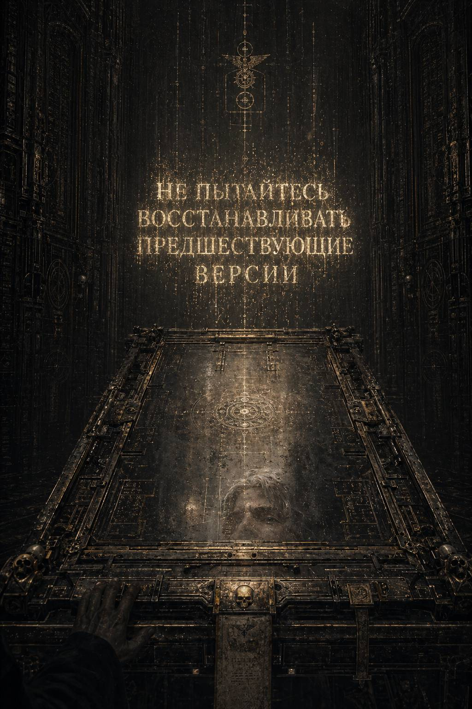

# II. Silentium Impositum / Обет молчания

Уведомление исчезло так быстро, что после него осталась самая опасная форма сомнения: та, в которой разум ещё способен убедить себя, будто ничего не было.

Каэль сидел неподвижно и смотрел в пустое место над столом, где секунду назад висели слова. Металл под ладонями уже согрелся от кожи, но ему всё ещё казалось, что пальцы лежат на чём-то холодном, скользком и живом, как будто рабочая плита не приняла его касание до конца.

**НЕ ПЫТАЙТЕСЬ ВОССТАНАВЛИВАТЬ ПРЕДШЕСТВУЮЩИЕ ВЕРСИИ.**

Не приказ. Не обвинение.

Предупреждение, сформулированное так, будто между ним и тем, кто его написал, уже существовало некое молчаливое взаимопонимание.

Он выключил интерфейс вручную, затем заново включил — привычный жест людей, которым хочется верить в технические причины происходящего. Плита отозвалась обычным рабочим меню. Очередь утилизации. Сводка по кластерам. Нормы смены. Никаких следов вторжения, никаких посторонних отметок.

Только его собственное отражение в тусклой поверхности металла: вытянутое, бледное, слишком внимательное.

Каэль медленно встал.

Он не побежал. Это было бы равносильно признанию. В Архивариуме не существовало ничего подозрительнее спешки. Даже страх здесь был обязан соблюдать порядок прохождения по коридорам.

Он снял с разъёма перчаточный шнур, уложил его по уставу в паз, закрепил планшет с текущей сводкой, внёс в систему первичный отчёт:

**КЛАСТЕР 88-ЧЁРНЫЙ
ДАТИРОВАНО: 88X.M30
СТАТУС: ПОДТВЕРЖДЕНА НЕСОГЛАСОВАННОСТЬ ВТОРИЧНЫХ ИНДЕКСОВ
РЕКОМЕНДАЦИЯ: ПЕРЕДАТЬ НА ДОПОЛНИТЕЛЬНУЮ ПРОВЕРКУ В СЕКТОР САНКЦИОННОЙ АРХИВАЦИИ
ПРИМЕЧАНИЕ: ВЕРОЯТНОСТЬ ПЕРЕОСТАТКА СЛУЖЕБНЫХ ПРИВЯЗОК К МЕМОРИАЛЬНЫМ МАССИВАМ**

Ни слова о II. Ни слова об XI. Ни слова о слепке, спрятанном в личном буфере под видом статистического шума.

Когда отчёт ушёл в очередь, он ощутил короткую, почти болезненную ясность: теперь ложь уже случилась. Не мысленно, не потенциально — документально. Она стала частью системы, а значит, обрела вес. На Терре всё, что имело индекс, существовало дольше человеческой совести.

Он вышел из сектора.

Дверные створки сомкнулись за ним с мягким шипением, будто Архивариум закрыл рот.

---

Коридор за пределами Третьей Реклассификации был уже не глухим, а просто пустым: длинный, с низкой дымкой переработанного воздуха, с литаническими табличками на стенах и редкими нишами для молитвенных остановок. Здесь ходили люди, но так редко, что каждый шаг казался временным нарушением более древнего покоя.

Каэль двинулся в сторону транзитного узла и почти сразу заметил на полу тень, которая шла рядом с ним не в такт.

Он не поднял головы.

Только по отражению в бронзовой обшивке боковой арки понял, что на уровне второго яруса сопровождения движется сервитор наблюдения. Небольшая платформа, безмолвно парящая на гравипластинах под потолочными балками; линзовый венец вместо лица; тонкие манипуляторы, похожие на молитвенно сложенные пальцы. Такие машины не следили за конкретным человеком без причины. Обычно они фиксировали зоны. Потоки. Партиции. Они были глазами режима в его дремлющем состоянии.

Когда за тобой начинал следить такой глаз, это значило, что дремота закончилась.

Каэль прошёл под аркой допуска. Рубиновый луч скользнул по шее, сверил биометрию, выплюнул сухой механический шёпот:

— Аналитик Меррон. Изменение маршрута. Следовать в зал очистительного свидетельства.

Он остановился.

Всего на мгновение. Но этого было достаточно, чтобы луч повторно скользнул по нему, уже чуть дольше.

— Подтвердите, — сказала система.

— Подтверждаю, — ответил Каэль.

Разумеется.

Если низший сотрудник случайно касался кластера с остаточными красными санкциями, его вели на очистительное свидетельство. Никакой трагедии. Никакой редкости. Формальная процедура. Проверка устойчивости сознания. Освобождение от опасных формулировок. Обряд, который одновременно походил на допрос, исповедь и профилактическую хирургическую обработку мысли.

Ему даже стало легче от того, что ужас наконец приобрёл знакомую форму.

Он свернул из основного коридора в боковую галерею.

Чем глубже он спускался, тем аскетичнее становилось пространство. Позолота исчезла первой. Затем исчезли фрески. Затем пол сменился с плит из старого камня на голый тёмный металл. Здесь Архивариум уже не пытался казаться священным; он позволял себе быть тем, чем был на самом деле: машиной сортировки, машиной допуска, машиной запрета.

У двери зала очистительного свидетельства стоял человек в сером одеянии без знаков отдела. Лицо — почти бесцветное, будто его много лет подряд вымывали одним и тем же выражением. Глаза — прозрачные и усталые. Не священник. Не следователь. Кто-то хуже: профессиональный хранитель процедур.

— Аналитик Меррон, — сказал он, не спрашивая. — Зафиксировано соприкосновение с частично санкционированным остатком. Входите.

— Это стандартная проверка? — спросил Каэль.

Человек посмотрел на него так, будто тот допустил мелкую стилистическую ошибку.

— Стандартны только формы. Причины всегда сугубо индивидуальны.

Дверь открылась.

Внутри было почти темно. Свет шёл снизу, от узкой решётки в полу, и делал лица людей непригодными для доверия. Посреди зала стояло кресло с креплениями, но не пыточное — просто слишком функциональное, чтобы быть невинным. Вдоль стен тянулись шкафы с восковыми табличками, пломбами, лентами записи и тонкими цилиндрами хранилищной бумаги. Пахло горячим металлом, старым ладаном и тем особым сухим озоном, который возникает рядом с аппаратами, привыкшими стирать чужую память.

— Садитесь, — сказал серый человек.

Каэль сел.

Крепления не закрылись. Это было сделано намеренно. Добровольная неподвижность всегда ценится выше насильственной.

Из темноты за креслом выступил второй служитель — уже в белом, с чёрной полосой по вороту. Чтец санкций. На груди у него висел не символ веры, а тонкий ключ-стилет для вскрытия опечатанных носителей.

— Процедура очистительного свидетельства номер девять, — произнёс он. — Субъект не обвиняется. Субъект не подозревается. Субъект подтверждает отсутствие умысла и ограниченность контактного контекста. В случае выявления интерпретации процедура меняет характер.

Последняя фраза прозвучала почти ласково.

— Назовите предмет соприкосновения, — сказал чтец.

— Повреждённый мемориальный кластер с остаточными санкционными привязками.

— Вы видели запрещённые имена?

— Нет.

Это было правдой.

— Вы видели запрещённые образы?

Каэль почувствовал, как что-то сухо щёлкнуло у него в виске.

Две массивные фигуры на чёрном фоне. Зерно. Совместное присутствие.

Он ответил не сразу и знал, что задержка уже записана.

— Нет, — сказал он.

Первая ложь была процедурной. Эта стала личной.

Чтец не подал виду.

— Вы пытались восстановить предшествующие версии?

— Нет.

— Вы делали локальные копии материала?

— Нет.

Третья ложь сорвалась с языка проще первых двух, и от этого стало только хуже.

Белый служитель взглянул на серого. Тот сделал едва заметный знак.

— Повторите защитную формулу интерпретатора, — сказал чтец.

Каэль произнёс её автоматически:

— Индекс выше смысла. Протокол выше догадки. Список выше памяти.

— Ещё раз.

Он повторил.

— Ещё раз.

На третий раз формула перестала быть фразой и стала ритмом, в который удобно складировать страх. Наверное, именно для этого и существовали все литании Империума: не для истины, а для того, чтобы дать человеку безопасный сосуд, куда можно перелить внутреннюю панику и назвать это верой.

Чтец раскрыл узкую восковую пластину и поднёс её ближе к свету снизу.

— В силу случайного соприкосновения с остаточной санкцией вы принимаете временный обет молчания о содержательных, образных и реконструктивных элементах кластера до завершения вторичной проверки. Повторите.

Каэль повторил.

— Вы обязуетесь не обсуждать, не записывать, не пересказывать и не толковать виденное вне служебных протоколов.

Он повторил и это.

Слова были страшны не своей жёсткостью, а своей выгодой. Они давали прекрасное прикрытие. Теперь он мог молчать не только из страха, но и по форме. Его личная осторожность получила санкционированный ритуальный статус.

— Вы обязуетесь уведомить надзор, если у вас возникнет повторный интерес к предмету соприкосновения, навязчивое стремление к восстановлению, мысленные реконструкции или сновидческие остатки.

Вот тут ему захотелось рассмеяться.

Сновидческие остатки.

Империя, построившая миллионы миров на насилии и порядке, знала цену снам слишком хорошо, чтобы оставлять их без юридической формулировки.

— Обязуюсь, — сказал он.

Чтец коснулся пластины ключом-стилетом. Воск треснул. На поверхности проступила строка регистрации.

— Обет принят.

Серый человек впервые подошёл ближе. Он был старше, чем показалось сначала. Кожа на щеках стянулась так, будто годы высушили из неё всё живое, кроме служебной функции.

— Посмотрите на меня, аналитик.

Каэль поднял глаза.

— Теперь скажите без формулы. Своими словами. Вы понимаете, что некоторые пробелы в списках являются не ошибками, а частью конструкции?

Вопрос был сформулирован предельно аккуратно. Он ничего не называл. Но именно потому в нём было больше опасности, чем во всех прямых запретах.

Каэль выбирал ответ так, будто шёл босиком среди раскрошенных стеклянных пластин.

— Я понимаю, что мне поручена работа с формой документов, а не с философией их отсутствий.

Серый человек смотрел на него ещё несколько секунд.

Потом неожиданно кивнул.

— Хороший ответ. Молодой, но хороший.

Это прозвучало не как похвала. Скорее как пометка на полях: **пока пригоден**.

Процедура закончилась без пыток, без инъекций, без электрической чистки памяти. От этого она казалась страшнее. Значит, ему пока ещё оставляли возможность совершить ошибку самостоятельно.

Когда Каэль вышел из зала, сопровождающий сервитор уже не шёл за ним. Коридор был пуст. Тишина — ровная, отрегулированная, как давление в герметичном саркофаге.

Только теперь он понял, что всё это время держал плечи чуть выше нормы.

Он заставил себя расслабиться и направился не в жилой ярус, а в общий зал низших переписчиков. Это было первое по-настоящему осознанное нарушение инстинкта. Человек, которого только что провели через очистительное свидетельство, не должен сразу прятаться. Он должен показать себя на свету, в людном месте, среди шуршания бумаги и простых ритуалов работы. Вина любит укрытия. Осторожность должна любить видимость.

Зал низших переписчиков гудел тихо и однообразно, как улей, где пчёлы давно заменены стареющими клерками. За длинными столами сидели десятки людей в серо-буро-малиновых мантиях, переписывая сводки с лент на карточки, с карточек на плёнки, с плёнок в кодексы, как будто Империум опасался, что истина исчезнет, если не прогонять её через человеческие руки достаточно много раз.

Каэль взял на раздаче кружку разбавленного кислого рекафа, почти не имеющего отношения к своему названию, и сел у края, где обычно сидела Лорен — та самая переписчица с соседнего поста, вечно шептавшая строки под нос.

Сегодня она была здесь.

Увидев его, она чуть нахмурилась.

— Ты серый, — сказала она без приветствия.

— Благодарю за точную оценку внешности.

— Не остри. После очистительного все серые. Как бумага перед печатью.

Она подвинула к себе катушку с записями, освобождая ему место, хотя он его не просил.

Каэль сел.

Несколько минут они молчали. Вокруг скрипели стилусы, шуршали ленты, покашливал кто-то старый, и весь этот шум был почти утешителен: бедный, ручной, человеческий.

— Что тронул? — спросила Лорен наконец, не глядя на него.

— Мусор.

— После мусора не отправляют на очистительное.

Он сделал вид, что греет ладони о кружку.

— Значит, не мусор.

Лорен фыркнула. У неё был редкий дар выражать презрение без всякой злобы.

— Тогда забудь.

— Стараюсь.

— Нет. Не стараешься. Ты уже начал собирать.

Он посмотрел на неё.

— Что?

Теперь она тоже подняла глаза. Очень светлые, почти бесцветные. Глаза человека, который слишком долго работал среди строк и научился различать то, чего другие ещё не успели сформулировать.

— У тебя такое лицо, будто ты видишь шов, — сказала она. — Остальные видят повреждение. Ты видишь, как оно было сделано. Это плохой дар для этого места.

Он не ответил.

Лорен отвела взгляд первой.

— Мне не нужно знать, что ты нашёл, — сказала она тише. — И тебе не нужно говорить. Просто послушай дельный совет старых архивных крыс: самые опасные документы не те, где много крови. Самые опасные — те, где очень чисто.

Потом она снова согнулась над лентой, показывая, что разговор окончен.

Каэль сидел ещё несколько минут, позволяя людскому шуму затереть очертания процедуры в памяти. Затем встал, отнёс кружку и пошёл в жилой ярус.

Его комната находилась на девятом подуровне архивного обслуживающего кольца: узкая келья, в которую едва помещались койка, шкаф, умывальный блок и столик для служебных выписок. Стены были покрыты серой керамикой, на которой не задерживался взгляд. Идеальное место для человека, которому предписано не иметь внутренней жизни вне работы.

Дверь закрылась за ним. Замок щёлкнул.

---

Вот теперь он впервые за весь день остался один.

Каэль не стал сразу доставать слепок.

Сначала он включил глушение бытового уровня — дешёвый, полуразрешённый экран помех, больше успокаивающий, чем действительно защищающий. Затем снял верхнюю мантию, аккуратно повесил её на крюк, умыл лицо холодной водой и сел на край койки, уставившись в пол.

Если бы он был умнее, он бы уничтожил копию.

Если бы был чище — сдал бы её сам.

Если бы был вернее системе, не сделал бы её вообще.

Но ум, чистота и верность системе редко бодрствуют в одном человеке одновременно. Особенно в человеке, выросшем слишком низко, чтобы верить, будто система существует ради него.

Он вынул из внутреннего шва рукава тонкую пластину-носитель. Серый прямоугольник без маркировки. Настолько непримечательный, что его можно было принять за заплатку на одежде или дешёвую табличку учёта ткани.

Несколько секунд он держал его между пальцами.

Потом вставил в личный считыватель на столике.

Экран вспыхнул мутным светом.

Сначала пошла сухая служебная часть: цепочки переназначений, фрагменты сигнатур, следы перекрёстных ссылок, выжженные области там, где когда-то были имена. Всё это он уже видел. Всё это было важно, но не ново.

Затем в нижнем секторе проявился кусок вложения, который он едва успел утащить вместе с метаданными. Видимо, файл был привязан к служебной записи глубже, чем ему показалось.

Строка заголовка отсутствовала.

Автор — выжжен.

Адресат — выжжен.

Формат определялся неуверенно: то ли черновик донесения, то ли фрагмент личного регистратора, случайно втянутый в официальный контур.

Каэль открыл текст.

Слова проступали медленно, как будто устройство сомневалось, имеет ли право их показывать.

**\> …оба прибыли раньше основных сил…
\> …расчёт говорил, что удержать узел невозможно без тотального отсечения нижних уровней…
\> …второй из них не спорил при всех. Он просто смотрел на схему, как на уже случившуюся рану…
\> …один приказал закрыть шесть проходов и тем спас ядро, другой открыл седьмой, которого не было на плане, и вывел тех, кого расчёт уже считал потерянными…**

Каэль почувствовал, как дыхание само собой стало тише.

Текст продолжался.

**\> …я не знаю, как это вписывать в рапорт, потому что они не противоречили друг другу. Снаружи казалось, будто они расходятся, но на деле каждый уже знал, что сделает другой…**

**\> …между ними не было ни совещания, ни подтверждения, ни передачи командного права. Только короткий взгляд через весь горящий ярус, и после этого схема боя изменилась так, будто её заранее чертили двумя руками…**

Он перечитал абзац.

Потом ещё раз.

Это не было именем. Не было даже описанием внешности. Только форма действия. Но внутри этой формы уже возникало то, чего не должно было быть: не просто тактическая совместимость, а почти непристойная точность взаимного понимания.

Дальше шёл пропуск, затем ещё несколько строк.

**\> …лично считаю опасным оставлять подобные сцены в общем архиве кампании. Речь не о дисциплине. С ней как раз всё безупречно. Речь о другом ощущении, которому у меня нет служебного термина…**

**\> …когда два командующих такого масштаба действуют не как пара звеньев в общей вертикали, а как замкнутый внутренний контур, это производит на свидетелей эффект, не предусмотренный уставом…**

Каэль откинулся на спинку стула.

В комнате было тихо. Слишком тихо. Где-то далеко в стене жилого яруса еле слышно шумела вода, и этот далёкий металлический шепот вдруг показался ему похожим на дыхание огромного спящего зверя.

Он снова посмотрел на экран.

*Замкнутый внутренний контур.*

Вот, значит, чего боялись не только в поступках, но и в самом описании. Не ереси в грубом смысле. Не предательства. А формы связи, которая не нуждалась в санкции сверху, чтобы быть реальной.

Последний уцелевший фрагмент был совсем коротким:

**\> …если это когда-нибудь будут чистить, оставьте хотя бы оперативную пометку: в тот день нас спасли двое, которых нельзя сводить к одному методу. Один умеет отсекать неизбежное. Другая — проводить живое сквозь невозможное. Отдельно они внушают уважение. Вместе — тревогу.**

На этом запись обрывалась.

Каэль долго сидел неподвижно, не закрывая файл.

Он ещё не знал их имён. Не знал лиц. Не знал, чем всё кончилось и почему Империум предпочёл превратить их в пустоты. Но уже чувствовал главную опасность: пустота начала приобретать характер.

Не абстрактный. Не символический.

Один — через отсечение, тишину, локализацию предела.

Другая — через движение, проведение, удержание живого потока.

Два способа спасать мир, которые не должны были сходиться так точно.

И всё же сошлись.

Каэль закрыл глаза.

Где-то в глубине сознания уже начинала выстраиваться запретная вещь — не вывод, а контур будущего вывода. Именно так, вероятно, и заражаются настоящими ересями: не криком, не видением, не кровавой демонической печатью, а аккуратным совпадением фрагментов, которое вдруг оказывается сильнее всех официальных объяснений.

Он открыл глаза и резко отключил считыватель.

В темноте комнаты экран ещё несколько секунд тлел остаточным светом, словно не хотел отпускать запись обратно в небытие.

Потом всё погасло.

Каэль сидел в темноте, положив ладонь на холодный стол, и понимал, что обет молчания уже нарушен в самой своей сердцевине. Не словами. Пока ещё нет. Но хуже — внутренне.

Потому что молчание не спасает, если внутри него уже началось чтение.

И где-то далеко, за многими стенами, среди бесконечных каталогов и пустых постаментов, машина Империума, возможно, уже знала это лучше него.

---

На Терре было много способов понять, что ты подошёл слишком близко к запретному.

Самый грубый из них был самым редким. Крики, арест, красные печати, внезапно окаменевшие лица начальства. Так действовали с теми, кого уже решили сломать. Гораздо чаще запрет узнавался иначе: по слишком быстрой вежливости, по лишней паузе в ответе, по тому, как человек, ещё секунду назад бывший обычным служащим, вдруг начинал подбирать слова так, будто между вами в воздухе возник невидимый нож.

Каэль почувствовал это, едва переступив порог кабинета старшего архивария.

Сектор консультационной сверки располагался выше Третьей Реклассификации и потому выглядел благороднее, хотя благородство Архивариума всегда имело один и тот же кислый вкус: сухой свет, тишина, дисциплина формы, никакой лишней жизни. Высокие шкафы здесь были не серыми, а тёмно-бронзовыми. Решётки на нишах украшали древние сигилы допуска. На стене висела литания о чистоте индекса, переписанная так давно, что потускневшие буквы уже казались не текстом, а рельефом самой власти.

Старший архиварий Леван Дор сидел за узким столом спиной к свету. Лицо его было почти бесцветным, как у человека, который всю жизнь прожил среди вычищенных формулировок и давно перестал доверять человеческой интонации. Он не принадлежал к тем начальникам, что наслаждаются мелкой властью. Это делало его опаснее. Такие люди обычно не давят. Они просто олицетворяют границу.

Когда Каэль вошёл, Дор уже держал в руках его запрос.

Тот самый.

Короткий.

Формально безупречный.

О перекрёстной несогласованности в мемориальных индексах II и XI.

Архиварий не предложил ему сесть.

— Аналитик Меррон, — сказал он. — Вы подали консультационный запрос.

— Да, старший.

— Основание?

— Повреждённый кластер в служебном шуме. Внутри остались следы красной санкции и перекрёстные ссылки на мемориальные перечни, которых по текущей логике нумерации существовать не должно.

Дор посмотрел на него поверх пластины.

— И вы решили уточнить это именно в письменной форме.

— Да.

Пауза была короткой.

Но не естественной.

Каэль уже тогда понял, что что-то сместилось. Не в нём. В самом воздухе кабинета. Будто вопрос, ещё секунду назад бывший просто вопросом, внезапно занял в пространстве слишком много места.

Архиварий опустил пластину на стол.

— Повторите, какие именно индексы вы указали.

— II и XI.

Тишина стала плотнее.

Не драматично. Почти незаметно. Только где-то у стены перестал шелестеть вентиляционный канал, а в дальнем шкафу сортировочный сервитор вдруг застыл с приподнятой металлической рукой, как будто даже его мелкая машинная жизнь не хотела продолжать движение раньше хозяина кабинета.

Леван Дор не повысил голоса.

Не нахмурился.

Не проявил ни раздражения, ни угрозы.

Он просто очень аккуратно снял свой служебный перстень, положил рядом и только после этого спросил:

— Кто ещё видел этот запрос?

Каэль ответил не сразу. Не потому, что хотел скрывать, а потому, что сама постановка вопроса уже была ответом страшнее любого содержания.

— Дежурный писец при первичной регистрации, — сказал он. — Возможно, технический смотритель очереди.

— Имена?

— Не запоминал.

Это была правда, и от этого ему стало ещё холоднее.

Дор сложил руки на столе.

— Аналитик Меррон, сейчас я скажу вам то, что не будет зафиксировано ни в одном служебном контуре. Вы не «нашли интересную ошибку». Вы подошли к одному из тех провалов, вокруг которых государство держит свою правильную форму.

Каэль стоял молча.

Архиварий чуть качнул головой, словно заранее отвергая возможный наивный ответ.

— Нет, это не приглашение к дальнейшему интересу. И нет, я не объясню вам, что именно скрыто в этой пустоте. Я лишь объясню меру текущей опасности.

Он придвинул к себе пластину с запросом, но не коснулся её.

— Есть отсутствия, которые возникают из утраты. Есть отсутствия, которые возникают из цензуры. А есть такие, которые перестают быть отсутствием и становятся опорой. Их нельзя вскрывать не потому, что там обязательно лежит нечто разрушительное по содержанию. А потому, что сама форма вопроса уже размыкает то, что должно оставаться слитным для устойчивости мира.

Каэль почувствовал, как медленно немеют пальцы.

Он пришёл сюда за формальной консультацией.

За правильным архивным ответом.

За объяснением того, как классифицировать странный кластер.

А получил не ответ, а почти богословское предупреждение: вопрос опасен сам по себе.

— Я не пытался ничего вскрывать, — сказал он тихо. — Только уточнить несогласованность в индексации.

— Верю, — ответил Дор сразу. — И именно поэтому вы здесь ещё как аналитик, а не как инцидент.

Тут впервые в его голосе прозвучало нечто человеческое. Не сочувствие. Хуже. Усталое знание о том, как часто на Терре люди гибнут не от злого умысла, а от слишком добросовестно заданного вопроса.

Он взял запрос двумя пальцами, словно вещь не грязную, но уже непригодную к открытому хранению.

— Забудьте II и XI как предмет профессионального интереса, — сказал он. — Считайте, что этот кластер был повреждён сильнее, чем показалось. Закройте отчёт общей формулировкой о несовместимых остаточных сигнатурах. Не возвращайтесь к этому через другие каналы. Не пытайтесь сопоставлять нумерацию. Не ищите пустоты, которые выглядят слишком аккуратно. И главное — не позволяйте себе внутренней роскоши думать, будто тайна обязана вознаграждать любопытство.

Последняя фраза прозвучала почти мягко.

И именно поэтому стала страшнее любой угрозы.

Каэль молчал.

Дор посмотрел на него очень внимательно.

— Вы умны, Меррон. Достаточно умны, чтобы понять меня без дополнительных формул?

— Да, старший.

— Хорошо. Тогда запомните ещё одно. Некоторые пустоты являются частью государственной стабильности. Не потому, что это красиво. Потому, что мир уже один раз не выдержал большего знания о самом себе.

Эта фраза ударила глубже всего.

Не “так положено”.

Не “это запрещено”.

Не “вам не положен допуск”.

*Мир уже один раз не выдержал большего знания о самом себе.*

Каэль вдруг понял, что сидящий напротив человек не просто охраняет тайну.

Он её боится.

И, возможно, боится не меньше тех, кто отдал приказ о забвении когда-то давно.

Архиварий поднялся. Это означало конец аудиенции.

— Вы можете идти, — сказал он. — Ваш запрос я сниму с общего движения.

— Старший…

Дор остановил его одним взглядом.

— Не задавайте сейчас второй вопрос. Для первого дня вам уже достаточно.

Каэль вышел из кабинета с ощущением, будто сам воздух коридора стал тоньше.

Ничего не случилось внешне.

Его не задержали.

Не обыскали.

Не отметили красной печатью.

Никто не стоял у дверей с оружием.

И всё же именно сейчас он впервые по-настоящему почувствовал не любопытство, а страх.

Не перед конкретным наказанием.

Перед архитектурой мира, в которой некоторые мысли уже сами по себе считаются структурной трещиной.

Коридоры консультационного сектора были почти пусты. По решётчатому верхнему ярусу прошёл связной сервитор. У ниши переплётчиков кто-то тихо кашлянул. Из соседнего отсека доносилось сухое постукивание учётных стилусов. Всё выглядело так, будто Империум по-прежнему является гигантской, равнодушной, прекрасно отрегулированной машиной учёта.

И именно поэтому следующая мелочь бросилась в граза Каэлю так резко.

У регистрационного поста, где утром он подавал запрос, сидел уже другой писец.

Не тот худой, сонный человек с пепельно-жёлтым лицом и привычкой прикусывать внутреннюю сторону щеки, пока перепроверяет формуляр.

Другой.

Слишком новый.

Слишком тщательно собранный.

Каэль остановился.

— Где прежний регистратор? — спросил он, сам ещё не понимая, почему голос его прозвучал тише обычного.

Новый писец поднял глаза от ленты.

— Какой именно?

— Тот, кто принимал мой запрос утром.

Писец моргнул.

Не понимая.

Или делая вид, что не понимает.

— Утром при этом посте работал я, аналитик, — сказал он после короткой паузы.

Каэль почувствовал, как внутри что-то опускается.

Слишком быстро.

Слишком глубоко.

— Нет, — ответил он. — Здесь был другой человек.

Писец чуть нахмурился.

Не раздражённо.

Скорее с вежливой неловкостью человека, которому предлагают подтвердить очевидную невозможность.

— Можете сверить журнал дежурств, — сказал он. — Пост с первой смены за мной.

И протянул ему ленту.

Каэль не взял её.

Потому что уже знал.

Не по журналу.

По тому, как аккуратно исчезла сама шероховатость чужого присутствия. Утренний писец не просто “ушёл”, не был подменён, не заболел, не переведён. Его уже подчищали на лету так, будто никакой худой человек с прикушенной щекой здесь никогда не сидел и никогда не видел короткий запрос про II и XI.

— Понял, — сказал Каэль.

Он пошёл дальше, стараясь не ускорять шаг.

И лишь когда свернул в боковую галерею, позволил себе остановиться.

Там, между каталожным шкафом и литанической табличкой о верности перечню, в тени стоял старый переписчик из низшего контурного отдела. Каэль смутно помнил его по общим рабочим залам: сутулый, тихий, всегда пахнущий пылью, потом и старым машинным маслом. Тот не смотрел на него прямо, только возился с катушкой ленты, как будто пытался распутать заевший край.

И всё же, когда Каэль поравнялся с ним, переписчик очень тихо сказал:

— Не спрашивайте о Регеле.

Каэль замер.

— О ком?

— О писце, — так же тихо ответил старик. — Если вы не знали имени утром, лучше не узнавайте его днём.

Каэль смотрел на него в упор, но тот всё так же не поднимал глаз.

— Что с ним стало?

Переписчик наконец взглянул на него.

И в этом взгляде было не знание фактов, а знание порядка вещей.

— В Архивариуме людей редко “забирают”, — сказал он. — Гораздо чаще их перестают правильно учитывать. А это почти одно и то же.

Сказав это, он сунул катушку под мышку и ушёл, не давая возможности продолжить разговор.

Каэль остался один.

Коридор был всё тем же.

Тёплая бронза решёток.

Сухой свет.

Тонкая пыль в воздухе.

Далёкий шум механизмов.

Но теперь весь Архивариум вдруг стал казаться не хранилищем памяти, а огромной машиной, которая умеет не просто скрывать, а выправлять саму реальность вокруг скрытого. Не грубо. Не кроваво. Так, чтобы человек ещё несколько часов назад существовал у тебя перед глазами, а к вечеру уже оказался ошибкой восприятия, неловким отклонением в личной памяти, чем-то, что проще поскорее исправить в себе, чем пытаться доказывать другим.

Он вернулся к своему сектору почти автоматически.

На рабочем столе его ждал обновлённый маршрут задания. Кластер с остаточными индексами II и XI уже был снят с активной очереди. Вместо него лежала общая формулировка:

**ПОВРЕЖДЁННЫЙ МЕМОРИАЛЬНЫЙ ШУМ.
СТАТУС: НЕСОВМЕСТИМЫЕ ОСТАТОЧНЫЕ СИГНАТУРЫ.
РЕКОМЕНДАЦИЯ: ЗАКРЫТЬ БЕЗ ДАЛЬНЕЙШЕЙ ИНТЕРПРЕТАЦИИ.**

Без дальнейшей интерпретации.

Каэль сел.

Долго смотрел на эти слова.

Потом, очень медленно, открыл пустой формуляр закрытия.

Можно было сделать именно то, что велели.

Поставить правильную формулу.

Закрыть тему.

Прожить ещё несколько лет в относительной целости.

Позволить исчезнувшему писцу стать первой и последней жертвой вопроса, который он сам не донёс бы ни до какого смысла.

Это был бы разумный выбор.

Возможно, даже милосердный к собственной жизни.

Но именно в этот момент он понял, что с ним уже случилось то, о чём старший архиварий предупреждал почти отечески.

Вопрос оказался опасен не потому, что вёл к ответу.

Потому, что уже изменил способ смотреть.

Утром он ещё думал, что работает в системе, которая хранит истину в искажённом виде.

К вечеру знал: система хранит не истину, а устойчивость собственного мифа. Всё остальное она готова переписать, вынуть, смазать, объявить дефектом или никогда не существовавшей шероховатостью.

А значит, II и XI были страшны не только содержанием.

Они были страшны как факт, от которого машина порядка сама начинала заметно дрожать.

Каэль взял стилус и вывел в формуляре закрытия положенную фразу:

**НЕСОВМЕСТИМЫЕ ОСТАТОЧНЫЕ СИГНАТУРЫ. ДАЛЬНЕЙШАЯ ИНТЕРПРЕТАЦИЯ НЕ ТРЕБУЕТСЯ.**

Потом поставил служебную метку.

Потом ещё одну.

И только после этого, уже внизу, в невидимом для общей ленты хвосте внутренней памяти, почти без слов отметил для себя единственное, что действительно стало итогом дня:

*Один вопрос стоит одного человека ещё до того, как получен первый ответ.*

Он не знал писца.

Не знал, жив ли тот ещё в каком-либо правильном перечне.

Не знал, стал ли он административной ошибкой, техническим переводом или просто дырой в чужой памяти.

Но уже понимал главное.

Цена вопроса появилась раньше знания.

И если истина о II и XI существует, то Империум боится не самой истории.

Он боится того, что делает с человеком уже первый шаг к ней.
