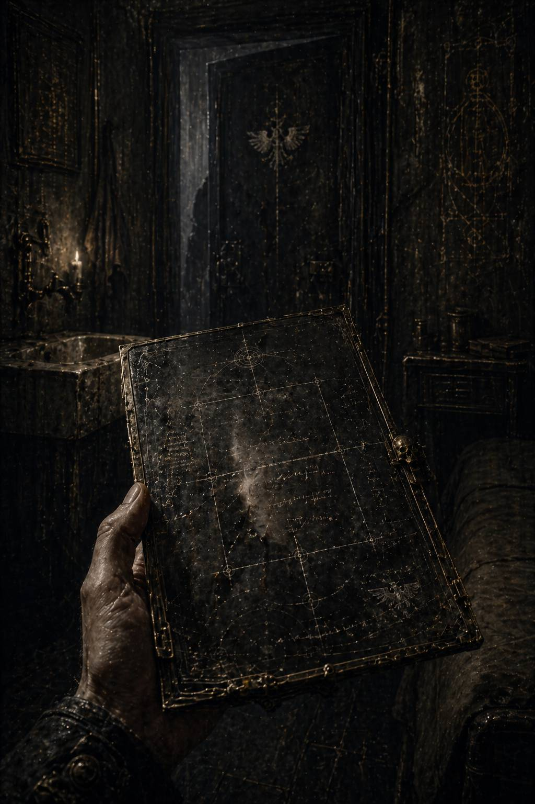

# III. Absentiae Scriptura / Почерк отсутствия

Каэль почти не спал.

Это было не то обычное архивное недосыпание, при котором тело тупеет, а голова продолжает механически перебирать индексы и номера дел. Нет. Ночь прошла в другом режиме: сознание будто лежало на поверхности сна, не проваливаясь в него до конца, и всё время слушало, не прозвучит ли где-нибудь в темноте тот же безличный тон:

**НЕ ПЫТАЙТЕСЬ ВОССТАНАВЛИВАТЬ ПРЕДШЕСТВУЮЩИЕ ВЕРСИИ.**

Он просыпался трижды, каждый раз с ощущением, что кто-то только что стоял у двери его кельи и ушёл ровно за мгновение до того, как он открыл глаза.

На четвёртый раз он уже не стал пытаться уснуть.

Поднялся затемно — хотя в жилом ярусе, как и в Архивариуме, понятия темноты и утра были условностью распорядка, а не природой — умылся ледяной водой и долго стоял, опираясь обеими ладонями о край умывального блока.

Он мог уничтожить слепок.

Мысль была правильной, здоровой, почти благочестивой. Всё, что следовало сделать, — сломать тонкую пластину, разъединить слои, выбросить осколки в три разные шахты переработки, а затем прожить остаток жизни с одной-единственной гниющей раной внутри: знанием, что он увидел достаточно, чтобы понять опасность, и недостаточно, чтобы понять смысл.

Так поступил бы разумный человек.

Но разум и осторожность — не одно и то же. Осторожность хочет выжить сейчас. Разум хочет знать, ради чего потом жить.

Каэль спрятал пластину обратно в шов рукава.

На работу он пришёл раньше смены и специально прошёл не кратчайшим маршрутом, а длинной дугой через два общих коридора, молельный пролёт и зал регистрации ручных носителей. Не потому, что его кто-то вёл. Пока — нет. Просто после очистительного свидетельства прямые линии начинали казаться подозрительно откровенными.

В Архивариуме быстро привыкаешь к мысли, что путь тоже является формой речи.

Сектор Третьей Реклассификации встретил его прежним тусклым светом и прежней мёртвой тишиной. Всё стояло на месте. Столы. Катушки. Ленты. Серые шкафы. Механические тележки у стены. Даже паучий сервитор, ночью ползавший где-то в глубине проходов, теперь был аккуратно припаркован в своей нише, словно ничего в мире не случилось.

Только на его рабочем месте лежала новая планшетка назначения.

**КЛАСТЕР 88-ЧЁРНЫЙ ПЕРЕДАН.
ВАМ НАЗНАЧЕНЫ ВТОРИЧНЫЕ СВОДКИ ПО МЕМОРИАЛЬНОЙ НЕСОГЛАСОВАННОСТИ.
ПРИОРИТЕТ СРЕДНИЙ.
ИНТЕРПРЕТАЦИЯ НЕ ТРЕБУЕТСЯ.**

Он смотрел на последнюю строку чуть дольше, чем следовало.

Обычно такие пометки служили предупреждением для слишком ретивых младших сотрудников. Но теперь Каэлю казалось, что система уже выработала с ним особый стиль общения — сухой, корректный, почти вежливый. Как врач, который не повышает голос на пациента, если болезнь уже проникла достаточно глубоко.

Он сел и открыл сводки.

Первое облегчение пришло почти сразу: ему не подложили ловушку в прямом виде. Никаких санкционированных кластеров, никаких красных уровней, никаких II и XI. Только скучная техническая рутина: расхождения в мемориальных ссылках, плавающие номера статуарных залов, неполные зеркала церемониальных перечней, обрывы в логистических карточках, связанных с архитектурным обслуживанием.

Но уже через несколько минут он понял, зачем это дали именно ему.

Прямой доступ закрыли. Косвенный — оставили.

Система могла лишить его исходного материала. Но она не могла мгновенно вычистить весь мусор, который когда-то этот материал трогал, задевал, тянул за собой. У любой большой лжи есть одно физическое свойство: она требует слишком много мелкой бухгалтерии.

Каэль работал осторожно.

Не задавал запрещённых вопросов напрямую. Не выстраивал поиск вокруг номеров. Не делал запросов к санкционированным уровням. Он шёл по краям: смотрел, где расходятся поставки камня и бронзы для постаментов; где статуарные реестры вдруг меняют нумерацию без формального повода; где в описаниях мемориальных залов появляются странные служебные фразы вроде **«соответствует утверждённой пустоте»** или **«основание сохранено по предписанию»**.

Через час у него уже было достаточно, чтобы ощутить знакомый холод под рёбрами.

Пустые основания II и XI были не просто архитектурным следом.

Они тянули за собой хвосты старых, очень старых коррекций в смежных системах: транспортной, церемониальной, инвентарной, ремонтной, даже в системе ритуальной уборки. Пыль, накапливающаяся на пустом постаменте, тоже фиксировалась где-то внизу, если постамент считался святыней. И если святыня пустовала столетиями, это превращалось в отдельную статью расходов.

Империум платил за отсутствие.

Мысль была настолько кощунственной, что Каэль едва не улыбнулся. Не весело. Скорее с тем коротким отчаянием, которое рождается, когда безумие мира вдруг оказывается идеально бухгалтерским.

Он вывел три независимых массива и стал искать не предмет, а повторяющийся стиль.

Сначала — в старых отчётах по реконструкции мемориальных залов. Затем — в логистических карточках кампаний, чьи индексы были частично выжжены, но вторичные хвосты уцелели. Потом — в списках наград, из которых имена изъяли, а формулировки деяний забыли зачистить до конца.

Постепенно сквозь серую пыль данных начало проступать то, что нельзя было назвать именем, но можно было узнать как почерк.

Один почерк всегда был сухим.

Там, где он проходил, в документах возникали слова: **изоляция**, **периметр**, **отсечение**, **герметизация**, **локализация**, **санация**. Не кровожадность — наоборот, какая-то ледяная, почти хирургическая точность. Жертва, рассчитанная так, чтобы остановить большее гниение. Миры не спасались целиком; спасалось ядро. Узел. Контур. Остальное без колебаний запечатывали, вырезали, оставляли по ту сторону предела.

В таких отчётах всегда не хватало прилагательных.

Будто сам автор стыдился эмоций перед лицом человека, который умеет проводить границу так чисто, что спорить с ней почти неприлично.

Другой почерк был иным.

Там, где появлялся он — или, точнее, она, хотя Каэль ещё не мог доказать даже этого, — документы начинали двигаться. **Маршруты**, **коридоры**, окна **перехода**, **удержание** колонн, **размыкание** блокад, последовательность эвакуационных **волн**, плотность **потока**, **сохранение** гражданского ядра, **перераспределение** живого груза, **сопровождение** миллионов сквозь невозможные пролёты сводчатых арок так, будто путь сам временно соглашался не распадаться.

В этих отчётах тоже почти не было эмоций, но было нечто другое: внутренняя интонация напряжения, как если бы любой клерк, писавший о её действиях, чувствовал, что описывает не просто операцию, а форму удержанного чуда, на которое устав не дал отдельного термина.

Каэль откинулся на спинку кресла и долго смотрел на две колонки выписок.

Один умеет закрывать.

Другая — проводить.

Фраза пришла сама, без усилия, и оттого напугала сильнее, чем готовая цитата.

Он не восстановил запрещённую версию. Не трогал санкционированный кластер. Не открывал прямых лакун. Он лишь сопоставил безопасные хвосты. Но именно это и было по-настоящему опасно: когда истина складывается не из украденного документа, а из совпадения десятков невинных обломков, её уже нельзя конфисковать одним движением.

Он быстро свернул экран, когда в сектор вошла Лорен.

Она, как всегда, казалась немного недособранной: тёмные рукава с чужим старым швом на локтях, тонкие пальцы в чернильных пятнах, взгляд человека, который спит меньше нормы, но давно перестал считать это личной трагедией.

Подойдя к соседнему посту, она не села сразу, а сперва посмотрела на него через стеклянную перегородку каталожного шкафа.

— Ты снова собираешь, — сказала она.

— Я работаю.

— Это разные вещи.

— По уставу нет.

— По уставу у нас и голод называется дисциплиной распределения.

Она села, включила свой стол и несколько минут шуршала лентами молча. Потом, не глядя в его сторону, спросила:

— Они оставили тебе что-то прямое?

— Нет.

— Это хуже.

Каэль не ответил.

Лорен снова зашуршала бумагой, словно разговор её не интересовал. Но через минуту произнесла тише:

— Самые старые зачистки держатся не на том, что из них вырезали. А на том, что вокруг вырезанного заставили выглядеть нормальным. Если будешь касаться края, не ищи смысл в словах. Ищи его в распределении труда. Империя забывает только через очень дорогую логистику.

Он невольно повернулся к ней.

— Откуда ты…

Лорен пожала плечом.

— Я переписываю сметы по реставрации уже восемь лет. В мире нет ничего более болтливого, чем ремонт старой лжи.

После этого она действительно ушла в работу, давая понять, что продолжать разговор не намерена.

Каэль сидел неподвижно.

Фраза ударила точно.

*Распределение труда.*

Он снова раскрыл массивы, на этот раз смещая внимание ещё ниже — туда, где история уже почти не кажется историей: в графики снабжения, в карточки машинного обслуживания, в таблицы расхода герметиков, плазменных печатей, карантинных створок, транспортных маяков, связных реле, полевых реликвариев перехода.

И вот тут картина впервые стала объёмной.

Почерк отсечения тянул за собой одни и те же материальные тени: запорные механизмы, поля тишины, изолирующие стены, резервные крематории, санитарные барьеры, стабилизаторы фронта. Всё, что служит пределу.

Почерк проведения — другие: переходные станции, маяки сопровождения, усилители навигации, подвижные госпитальные связки, транспортные капсулы, литургические конвои, фильтрационные шлюзы для живых масс. Всё, что служит пути.

Но главное было не это.

Главное — в ряде старых кампаний оба хвоста появлялись вместе.

Не часто. Не настолько, чтобы это выглядело стандартной кооперацией между легионами. Наоборот — редко, беспокояще редко. Ровно настолько, чтобы восприниматься как аномалия. В обычной имперской машине силы дублируются, подчиняются, наслаиваются. Здесь же выходило иначе: будто два совершенно разных принципа временами сходились в одной точке, образуя результат, слишком эффективный и слишком странный для нормативной логики.

Каэль вытащил один такой случай и развернул на весь экран.

Большая система. Индекс планеты выжжен. Командные подписи удалены. Боевой итог сокращён до трёх служебных фраз. Но периферия уцелела.

Сначала — закупка карантинных арок и полей молчания для нижних ярусов.

Потом — резкий всплеск снабжения транзитных маяков и эвакуационных якорей.

Затем — одновременное списание колоссального числа жизней в шести секторах и аномально высокий процент сохранённых гражданских в седьмом.

Каэль вспомнил фрагмент из личного регистратора: **один приказал закрыть шесть проходов и тем спас ядро, другой открыл седьмой, которого не было на плане…**

Значит, это был не единичный эпизод красивой легенды. Это было их свойством.

Он почувствовал, как внутри него медленно, мучительно точно начинает складываться новая форма страха.

До этого момента запрет был вертикальным: **не смотри, не спрашивай, не восстанавливай.** Теперь он впервые увидел горизонтальную угрозу — нечто, что пугало саму систему уже на уровне принципа.

Эти двое были опасны не только тем, что существовали.

Они были опасны тем, как существовали рядом.

В полдень в сектор пришёл старший контролёр с обходом. Невысокий, сухой человек с механическим левым глазом и идеальной памятью на чужие задержки в работе. Он прошёл вдоль рядов, сверяя статус заданий, и на несколько секунд остановился у стола Каэля, пощёлкивая бионикой.

— Продвижение, аналитик?

— Вторичные хвосты подтверждают глубину старой мемориальной коррекции, — ответил Каэль, не давая ни грамма лишнего содержания. — По форме похоже на комплексный пересмотр смежных систем.

Механический глаз контролёра тихо сфокусировался.

— Выводы?

— Выводы преждевременны.

Старший выдержал паузу.

— Хорошо. Не торопитесь с ними.

И пошёл дальше.

Фраза была безупречно невинной. Но после вчерашнего вежливость снова прозвучала как нож, аккуратно положенный рядом с тарелкой.

Остаток смены Каэль работал уже вручную, почти без системных связок. Он выводил нужные карточки, переписывал куски на бумажные ленты, делал пометки условными значками, понятными только ему самому. Машина хороша, пока надо сортировать объёмы. Когда нужно спрятать мысль от машины, старый почерк снова становится самым умным инструментом.

К концу дня у него было уже семь кампаний с совпадающими хвостами.

Семь раз два разных почерка касались одного события.

Семь раз сухой предел и удержанный путь образовывали вместе что-то третье — не компромисс, не сумму и не борьбу методов, а почти страшную форму согласованности. В одном случае планета была официально признана потерянной, но часть населения исчезла из статистики потерь без объяснения. В другом — карантин, который по нормативам должен был завершиться тотальным *exterminatio*, почему-то имел узкий коридор вывода для детей и навигаторов. В третьем — боевой отчёт указывал на абсолютную герметизацию фронта, однако на периферии числились сотни тысяч спасённых, будто кто-то успел провести их прежде, чем чревоточина закрылась окончательно.

В одном из обломков он нашёл особенно странную служебную сноску. Без подписи. Без адресата. Почти наверняка написанную каким-то младшим логистом, который не понимал, что оставляет после себя человеческое свидетельство.

**\> ...необходимо прекратить рассматривать совместное применение этих двух архитектур как случайное совпадение ресурсов. При их одновременном присутствии расчёт потерь перестаёт соответствовать базовым моделям. Отдельно каждый из них предсказуем в пределах допущения. Вместе — нет.**

Каэль перечитал строку много раз.

**Вместе — нет.**

Вот оно.

Не мораль. Не позор. Не ересь в грубом богословском смысле.

Непредсказуемость.

Для Империума это было едва ли не страшнее любого мятежа. С мятежом можно бороться. Хаос можно клеймить. Предателя можно назвать. Но что делать с двумя идеальными инструментами завоевания и спасения, которые рядом начинают нарушать саму модель расчёта?

Он аккуратно переписал сноску на узкую бумажную ленту и спрятал её внутрь пустого корпуса от учётного стилуса.

К моменту окончания смены у него уже не было прежнего ощущения, будто он просто копается в мусоре.

Теперь он чувствовал себя человеком, который стоит посреди большого, очень древнего механизма и внезапно понял, что внутри этого механизма когда-то существовал живой узел — не вписанный в основную схему, но работавший так хорошо, что его пришлось не демонтировать, а объявить невозможным.

Когда сектор опустел, Каэль задержался ещё на несколько минут. Не для поиска. Для того, чтобы просто посмотреть на собственные заметки, будто проверяя, действительно ли они сложились в то, что он уже видел внутренним взором.

Два почерка.

Один — через отсечение, предел, тишину и герметичную милость.

Другая — через путь, движение, удержание живого и невозможную проводимость.

Их имена были выжжены. Лики стёрты. Статуи сняты. Но характер пустоты всё равно проступал.

В этом было что-то пугающе интимное.

Как если бы человека убили, стёрли все записи о нём, соскоблили портрет и запретили упоминать его, а он всё равно выдавал бы себя тем, как закрывал дверь или как держал чашку в руках.

Каэль выключил стол.

В темнеющем стекле интерфейса на мгновение отразилось его лицо — усталое, чуть осунувшееся, старше, чем два дня назад. Он подумал, что раньше верил в одну простую вещь: документы хранят истину. Теперь становилось ясно, что документы хранят и ложь тоже, но ложь всегда тяжелее и оставляет больше технических следов.

Он уже собирался уходить, когда на нижнем краю погасшего экрана вдруг проступил бледный остаточный отблеск. Не новое уведомление. Не текст. Просто на секунду — два вертикальных штриха, затем косой излом, будто сама матрица экрана запомнила запрещённые индексы лучше, чем позволял устав.

**II.**

**XI.**

Миг — и всё исчезло.

Каэль не шелохнулся.

Он не верил в мистику дешёвых машинных сбоев. Но в Архивариуме даже случайность быстро становилась ритуалом, если воспроизводилась достаточное количество раз.

Он медленно поднял руку и коснулся холодного стекла.

— Кто вы были, — очень тихо спросил он, сам не понимая, обращается ли к мёртвым, к документам или к собственной уже заражённой способности видеть связь там, где велено видеть провал.

Разумеется, никто не ответил.

Но ответ в каком-то смысле уже был рядом.

Не в имени. Не в лике. Не в героическом титуле.

В способе действия.

Один — предел.

Другая — путь.

И, возможно, именно это было первым настоящим кощунством: понять, что Империум стёр не просто двух забытых сыновей своей мифологии, а две взаимодополняющие формы милости, которым нельзя было позволить стоять рядом слишком долго.

Когда он вышел в коридор, там никого не было.

Только далёкий гул вентиляции, лампы, уходящие в бесконечность, и собственные шаги, звучащие так, будто он идёт не домой, а глубже внутрь вопроса, у которого уже появился характер.
