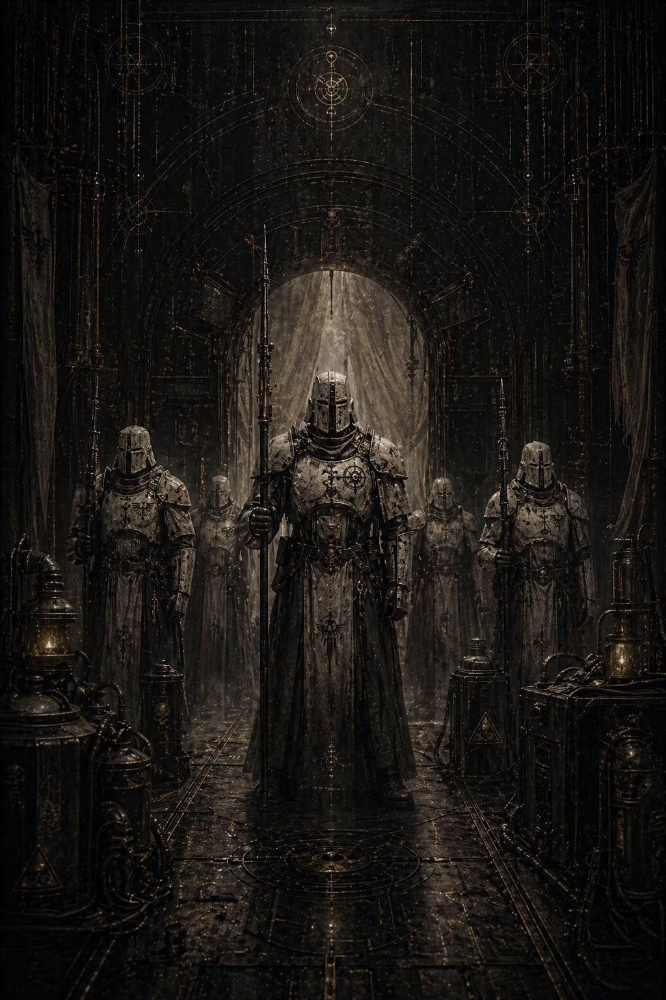

# IV. Custodes Pallidi / Бледный Дозор

Файл нашёлся не в военных архивах.

Именно это по-настоящему насторожило Каэля.

Если бы II Легион действительно существовал лишь как выжженная пустота в парадных перечнях, следы его первых кампаний лежали бы там, где лежат следы любой славы: в донесениях, в победных хрониках, в литургических выжимках, в ритуальных сводках по приведению миров к согласию. Но у больших прочерков всегда есть одно унизительное свойство — они пробуждаются не в героических текстах, а в нижних слоях хозяйственного ада.

Он нашёл индекс случайно, просматривая старые карточки по санитарным закупкам.

Сначала ничего не бросалось в глаза: серые столбцы, шифры, дезактивационные составы, герметизирующие смолы, партии вуалей тишины для пустотных станций, списания экипажей, повторные заказы на карантинные створы и полевое кремационное оборудование. Всё то, что сопровождает любую затяжную кампанию против биологической или варповой заразы.

Но одна строка была помечена странно.

**ОСОБЫЙ РЕЖИМ ОКРУГА / НЕ ПОДЛЕЖИТ ТОРЖЕСТВЕННОМУ УЧЁТУ
ПЕРЕДАНО ПО ЗАПРОСУ II / СВЯЗАННЫЕ ПРЕДЕЛОМ / БЛЕДНЫЙ ДОЗОР**

*Бледный Дозор.*

Неофициальное название. Почти солдатский жаргон.

Каэль замер.

Он не знал, существовал ли в реальности II Легион под именем «Бледный Дозор» или так его называли внешние снабженцы, не допущенные до официальных сигилов. Но в этой грязной, непарадной фразе внезапно было больше живого присутствия, чем во всех выжженных индексах последних дней.

Он погрузился в карточку.

За ней тянулся длинный хвост сопряжённых документов: ремонт пустотных заслонов, замена ретрансляторов молчания, санитарные описи по орбитальному кольцу, списки эвакуированных командных групп, частично сохранившийся лог астропатического гашения, две вычеркнутые пиктограммы и, что важнее всего, фрагмент полевого свидетельства.

Не рапорт примарху.

Не мемориальная выжимка.

Простая запись офицера связи из вспомогательного флота, которому не повезло оказаться рядом и увидеть слишком многое, не понимая всей важности увиденного.

Каэль открыл файл.

Текст был изъеден пропусками, но держался удивительно ровно — как будто сама запись сопротивлялась забвению упрямее, чем люди, её стиравшие.

**\> …сектор уже считался потерянным. Не в стратегическом смысле — в санитарном. После третьего всплеска заражения командование предложило полное выжигание орбиты и закрытие путей на сто лет.**

**\> …они прибыли без триумфа, без сигнальных литаний, без демонстрации силы. Флот II вошёл в систему так, будто не наступал, а накрывал рану ладонью…**

Каэль перечитал вторую строку.

*Накрывал рану ладонью.*

Вот оно. Не победа. Не завоевание. Не гром. Не ярость. Уже здесь язык инстинктивно искал не военную, а хирургическую метафору.

Он развернул следом две пиктограммы.

Первая почти не уцелела — только орбитальный силуэт: чёрная дуга станции, редкие холодные огни, облако дезинфекционного пепла над полушарием мира и в глубине — вытянутые, необычно стройные очертания боевых судов. Не тяжёлые ударные клинья, какими любили хвастаться прочие легионы, а строгие, будто обеднённые формы. Корабли не победителей. Корабли тех, кто приходит отсекать.

Вторая пиктограмма была лучше.

На ней, внизу кадра, стояли фигуры в броне почти бесцветной — не белой, а пепельно-светлой, словно сам металл вытравили многочисленные стерилизации, плазменные чистки и годы службы в заражённых пустотах. На наплечниках различался знак, слишком повреждённый для уверенного чтения: то ли вертикальный разлом, то ли узкий клинок, то ли половина закрывающихся врат.

Фигуры стояли не как парадный строй. И не как штурмовая группа.

Они стояли, оставляя между собой равные промежутки, будто сами были подвижной границей.

Бледный Дозор.

Каэль опустил глаза к следующему фрагменту.

**\> …нам велели снять все победные сигилы с мостика и погасить церемониальные литании. Их командир сказал: «Вам не за что здесь благодарить нас заранее».**

**\> …после этого на флоте стало так тихо, будто кто-то убрал из воздуха само ожидание славы…**

Он не заметил, как перестал дышать.

**Их командир.**

Ещё не имя. Но уже фигура.

Дальше текст переламывался, переходя из сухого свидетельства в последовательность оперативных отчетов, а потом — в реконструкцию, которую кто-то когда-то попытался сделать на основе разрозненных лент, переговоров и полевых опросов. Именно такие документы Каэль любил больше всего и боялся сильнее всего: они были уже не исходником, а актом чужого понимания. А значит, зараза интерпретации жила в них изначально.

Он открыл реконструктивный блок.

И прошлое неспешно восстало из пыли.

---

Мир назывался Нартекс-Хевел.

Позже это имя тоже выжгут, но на этом слое оно ещё держалось — тускло, как надпись на камне, который слишком долго стоял под кислотным дождём.

Нартекс-Хевел не был важным миром в обычном понимании. Не кузницей. Не драгоценной аграрной чашей. Не священным узлом. Просто тяжёлая индустриальная планета с плотной орбитальной инфраструктурой, с рудными лунами, с глубокими богатыми шахтами и перенаселёнными улейными массивами. Такие миры Империум проходил десятками: подчинял, встраивал, обкладывал десятиной, взимал людей и ресурсы взамен на право называться частью порядка.

Заражение пришло не как чума.

Оно началось как ошибка.

Сначала на нижних уровнях трёх городов исчезла сонная фаза. Люди перестали спать, но не уставали. Затем начались нарушения речи: не безумие, а странная гладкость фраз, будто заражённые заранее знали, что им ответят. Потом — самопроизвольная синхронность жестов на разных, никак не связанных ярусах. Семьи, никогда не видевшие друг друга, поворачивали головы одновременно. Рабочие в шахтах останавливались в один и тот же миг на разных континентах. Несколько раз астропаты зафиксировали монотонный шёпот в каналах, но не смогли потом вспомнить его содержание.

Через восемь недель планета уже говорила слишком ровно, чтобы считаться здоровой.

Местный командор запросил полное выжигание.

Терра согласилась бы.

Вероятно, согласилась бы сразу, не будь на маршруте ближе остальных второго флота экспедиционного подчинения, ведомого тем, чьё имя в документах пока ещё писалось открыто.

**Кайрон Вейл.**

Он вошёл в систему без литаний.

Флагман II Легиона не подал ни одного триумфального сигнала, только три коротких кода допуска, сухое требование закрыть все гражданские каналы и приказ перевести астропатов в режим зеркального молчания. Уже этим он вызвал раздражение у местного штаба: на пограничных мирах привыкли, что легионы приходят либо как завоеватели, либо как карающая слава. Здесь же всё началось с того, что кто-то выдернул из пространства саму возможность красивого рассказа.

Кайрон сошёл на станцию «Венечный Узел» в сопровождении всего двенадцати воинов.

Это сразу записали как оскорбление.

Планета пылала на внутренних уровнях, по нижним орбитам дрейфовали прокажённые транспортники, половина служебных лифтов была заражена или захвачена странной координационной порчей, а примарх Второго Легиона прибыл на главное совещание так, будто собирался не брать штурмом мир, а выслушивать завещание у постели умирающего.

Но все, кто потом пытался описать первую встречу с ним, сходились в одном: дело было не в малочисленности.

Он просто не нуждался в театре веса.

Кайрон был высоким даже по меркам своих братьев, но не это поражало людей первым. И не броня — матовая, бледная, лишённая вычурных инкрустаций, как у тех, кто давно понял бесполезность блеска там, где смерть распространяется через прикосновение. Поражало другое: ощущение, что вокруг него пространство само сужается до допустимого. Как если бы он, входя в помещение, невидимо проводил по нему линию и всё по одну сторону этой линии ещё имело шанс остаться в мире, а всё по другую уже считалось расходом судьбы.

Его шлем несли за ним.

Лицо у него было почти неподвижным — не безжизненным, а слишком собранным, чтобы позволять эмоциям рассеиваться по поверхности. Кожа светлая до болезненности, волосы убраны назад, взгляд серый, прямой, настолько тихий, что от него хотелось немедленно убрать со стола всё лишнее и перестать лгать даже по мелочам.

Командор Нартекса, толстошеий ветеран покорительных кампаний, начал совещание в неправильном тоне.

Он говорил о недопустимых потерях производства, о цене сектора, о шансах удержать орбитальное кольцо и о том, что выжигание мира вряд ли создаст опасный прецедент паники в соседних системах. Говорил уверенно, деловито, с тем особым профессиональным цинизмом, который особенно любит прикрываться заботой о целых регионах.

Кайрон слушал его до конца.

Не перебивая. Не меняя позы. Не проявляя ни раздражения, ни нетерпения. Когда командор закончил, в помещении на мгновение стало так тихо, что старый вентилятор в стене заскрипел как отдельный свидетель.

— Сколько уровней уже потеряно? — спросил Кайрон.

Не *сколько можно отбить*.

Не *каковы ваши оценки*.

Именно так: *потеряно*.

Командор замешкался на долю секунды.

— По последним данным, девятнадцать нижних ярусов в трёх улейных массивах и…

— Не по последним данным, — сказал Кайрон. — По истинным.

Он не повысил голоса. Но фраза упала в центр стола с тем весом, который не оставляет после себя пространства для прежнего тона.

Командор начал перечислять заново. Уже тише. Уже без попытки торговаться с реальностью.

Когда он закончил, один из астропатических служителей, стоявших у стены, тихо произнёс:

— Господин… есть вероятность, что часть заражённых ещё можно вернуть после…

Кайрон повернул к нему голову.

Не резко. Медленно. Так, как поворачивают ключ в сложном замке.

— Часть из них уже не является «частью», — сказал он. — Они стали проходом.

И больше ничего не добавил.

Позже многие вспомнят именно эту фразу.

Не потому, что она была красивой.

Потому что в ней отсутствовала привычная жестокость.

Обычные каратели говорили о заражённых как о мусоре, как о скверне, как о топливе для очищающего огня. Кайрон же говорил о них хуже и милосерднее одновременно: как о людях, через которых мир может погибнуть целиком, если вовремя не признать, что их уже нельзя спасти вместе с остальными.

Совещание длилось двадцать три минуты.

За это время он сделал три вещи, которые местный штаб потом ещё долго будет считать безумием.

Во-первых, приказал немедленно отрезать шесть глубинных транспортных колодцев, связывавших заражённые ярусы с верхними уровнями. Это означало оставить внизу сотни тысяч ещё не классифицированных жителей, часть из которых, возможно, была здорова.

Во-вторых, запретил немедленное выжигание планеты.

В-третьих, распорядился открыть на внешней орбите новый санитарный коридор вывода через грузовое кольцо, которое местные уже считали потерянным и не включали в модели эвакуации.

Командор уставился на него, не скрывая возмущения.

— Вы либо запираете мир, либо спасаете его, — сказал он. — Нельзя осуществить оба решения сразу.

— Нельзя, — ответил Кайрон. — Если думать о мире целиком.

Потом он вызвал на стол схему орбит и подземных связей, провёл пальцем по шести ярусам отсечения, остановился на седьмом узле и сказал:

— Здесь.

Схема показывала пустоту.

Не трассу. Не коридор. Формально — мёртвый сектор, давно выведенный из эксплуатации после старой шахтной аварии.

Командор покачал головой.

— Там нет прохода.

— Есть остаток конструкции.

— Его не хватит.

— Хватит, если не пытаться вывести всех.

Вот тут люди вокруг стола впервые поняли, что он не пришёл ни спасать всех, ни казнить.

Он пришёл сделать вещь гораздо страшнее: отделить живое с точностью, на которую у других не хватало ни воли, ни хладнокровия.

---

Дальнейшее Каэль читал уже не как документ, а как медленно проступающую сцену.

II Легион развернулся почти бесшумно.

Не было ни штурмовых песнопений, ни пропагандистских передач, ни привычной для иных легионов эстетики завоевания. Их воины входили в заражённые зоны как подвижные заслоны. Белёсая броня в тусклом сумраке техногенных ночей казалась не сияющей, а выцветшей, как кость, слишком долго лежавшая в стерильном растворе. На шлемах — гладкие лицевые пластины без угрозы мимики. На оружии — не столько знаки славы, сколько счётные зарубки карантинов.

Пехота Второго не бежала. Она проводила границу.

Они проходили по коридорам улейных городов и за ними буквально менялась геометрия мира: створы опечатывались, стены заполнялись герметиком, лифтовые шахты заливались изнутри расплавленным металлом, вентиляционные нервюры заваривались, а по стеклянным сводам станций ползли чёрные полосы гасильных печатей.

Люди назовут это жестокостью.

Но записи вспомогательного персонала упорно возвращались к одной и той же странной мысли: Второй Легион работал так, будто стремился спасти не территорию, а форму спасаемого.

Чтобы хоть что-то осталось человеческим, он проводил вокруг этого предел.

Сам Кайрон спускался на нижние уровни трижды.

Это тоже сохранилось в обрывках — слишком редкое явление, чтобы его забыли полностью. Примарх, который лично идёт туда, куда уже повелел не пускать никого. Не ради славы. Не ради демонстрации бесстрашия. А потому что некоторые решения нельзя отдавать подчинённым, если хочешь, чтобы тяжесть вины осталась на том, кто имеет право её нести.

На первом спуске он потерял роту вспомогательной охраны, когда заражённый людской поток на уровне девятнадцать внезапно сдвинулся как единое тело, не ускоряясь и не крича. Люди просто пошли вперёд с одинаковым выражением лиц, и несколько секунд казалось, будто они не нападают, а возвращаются туда, куда им было назначено прийти всем вместе.

Кайрон приказал не стрелять до последнего.

Это тоже удивило свидетелей.

Он ждал почти невозможного времени — той тонкой доли, пока ещё можно отличить носителя от прохода. И лишь когда стало ясно, что различие исчезло, дал команду отсечения.

Ни ярости. Ни ругательств. Ни очистительного восторга.

Просто граница была проведена.

На втором спуске он нашёл живыми детей из обслуживающего кластера — семнадцать человек, спрятавшихся в звукоизоляционном отсеке старой шахтной секции. Они не были заражены, но трое из них уже начали повторять чужие фразы до того, как их произносили взрослые.

Вместо немедленного уничтожения, которого потребовал местный санитарный комиссар, Кайрон распорядился вывести всех семнадцать наверх, а троих поместить в отдельную капсулу тишины с живым наблюдением.

— Это риск, — сказал комиссар.

— Да, — ответил Кайрон.

— И вы принимаете его?

— Я принимаю предел риска. Не его отсутствие.

Такие фразы потом ненавидят архивы. Они слишком человеческие для полной зачистки и слишком опасные для официальной памяти.

На третьем спуске он уже знал, что седьмой проход придётся открывать немедленно.

Ситуация на планете переломилась: шесть нижних колодцев были герметизированы, но заражение, лишённое привычной вертикали, начало искать обходные пути через древние технические пустоты. То, что местные считали мёртвой шахтной сетью, оказалось полуживым подбрюшьем мира — слепой артерией, по которой ещё можно было провести часть населения к внешнему кольцу, если действовать быстро, без паники и без попытки унести больше, чем путь способен выдержать.

Кайрон стоял над схемой перехода и молчал так долго, что рядом никто не осмеливался заговорить.

Наконец капитан Второго — массивный, темноглазый воин по имени Севериан Тар, чьё лицо даже в обрывке визуального слепка казалось высеченным из того же сурового камня, что и дисциплина его легиона, — произнёс:

— Господин. Если открыть седьмой путь, часть заражения попытается пройти вместе с потоком.

— Да.

— Тогда мы будем вынуждены резать колонну изнутри.

— Да.

— И всё же вы приказываете открыть?

Кайрон поднял на него взгляд.

— Я приказываю дать живым ту форму шанса, которую путь ещё выдержит.

Ни один из них не произнёс слова *милосердие*.

В их мире оно выглядело бы даже неприлично.

Но Каэль, читая это спустя века под тусклым светом Архивариума, впервые понял, что именно так оно и выглядит в пространстве, где доброта давно невозможна в самой своей форме.

Не как отказ от жестокости.

Как хирургически точное дозирование границы ради сохранения живого остатка.

---

Операция седьмого прохода длилась девять часов и сорок одну минуту.

Позже её попытаются сократить в архивах до трёх санитарных строк. Но мелкие документы уцелели лучше: время подачи грузовых платформ, число отключённых лифтов, температура на промежуточных шлюзах, расход седативных для детей, резкий скачок потребления кислорода на внешнем кольце, частота сердечных ритмов у обслуживающего персонала, списание ста двенадцати вуалей тишины.

По этим скучным цифрам Каэль и восстановил то, что торжественные хроники потом уже не могли выдержать.

Люди шли через мёртвую шахтную артерию плотными волнами, без крика, почти в полной темноте, под редким белым светом аварийных рёбер. Впереди — воины II Легиона. По бокам — герметизирующие расчёты. Сзади — группы отсечения, которым предстояло делать худшую работу в самый худший миг. По потолку ползла изморозь дезинфекционного газа. Под ногами дрожала старая магистраль, не рассчитанная на такую массу живого.

Люди спотыкались, падали, вставали. Кто-то молился. Кто-то молчал так глубоко, будто уже знал: всякая лишняя речь может разрушить хрупкий порядок прохода.

Кайрон шёл не впереди и не позади.

Он шёл посреди потока.

Вот это Каэль отметил отдельно.

Обычный герой ведёт колонну. Обычный каратель замыкает её. Кайрон же находился там, где решение причиняет наибольшую боль: в месте, где приходится чувствовать одновременно и тех, кого ещё можно вывести, и тех, кого придётся отсечь прямо на ходу.

Трижды поток пытался сорваться.

Первый раз — когда из боковой шахты вышла группа заражённых рабочих с одинаково спокойными лицами и начала говорить одним голосом, не повышая тона, будто просила впустить их обратно в общий ритм человечества. Карантинная группа открыла огонь раньше приказа, и Кайрон не покарал её за это. Лишь передвинул линию заслона на три метра вперёд.

Второй — когда одна из женщин в эвакуационной колонне узнала в приближающемся заражённом собственного мужа и рванулась к нему сквозь строй. Кайрон сам перехватил её за плечо и удержал одной рукой — не грубо, но так, что она сразу поняла: через это прикосновение не пройти.

— Это он, — повторяла она. — Это он.

Кайрон смотрел на приближающегося мужчину несколько долгих секунд, а потом тихо сказал:

— Уже нет.

И велел вести женщину дальше, не давая ей обернуться.

Третий раз — у самого выходного шлюза, когда по металлу прошёл тот самый ровный шёпот, с которого, возможно, и началось всё заражение на планете. Не слова. Скорее обещание общей ясности. Как если бы всякий отдельный страх мог исчезнуть, стоит только позволить себе стать частью чего-то безлично единого.

Тогда несколько бойцов вспомогательной охраны замерли и начали снимать шлемы.

Кайрон приказал опустить вуали немедленно, хотя это означало риск удушить часть колонны на несколько секунд недостатком воздуха.

Позже один из выживших медиков напишет:

**\> …он каждый раз выбирал не лучший исход, а единственный, после которого ещё оставалось кому помнить, ради чего выбор вообще делался…**

Каэль сидел неподвижно, пока строка медленно тлела на его экране.

Вот, значит, что они вымарывали.

Не просто имя.

Форму величия, которая не укладывалась в привычную героику Империума. Кайрон был страшен не потому, что не колебался. Страшен он был тем, что колебался ровно столько, сколько необходимо, и всё равно проводил линию предела.

---

К исходу десятого часа седьмой путь был закрыт.

Нартекс-Хевел не спасли.

Но и не уничтожили целиком.

Верхние орбитальные кольца, семь внешних городов, два рудных спутника и часть обучающего корпуса были выведены из смертельной синхронизации и сохранены. Нижние ярусы, половина центрального улья и всё, что уже стало проходом, запечатали под герметичными слоями орбитального стекла, стали и пустотных полей.

Мир не выжил.

Мир был удержан в допустимой форме смерти.

Для других легионов это могло бы стать позором: слишком много потеряно, слишком мало славы, никакой чистой победы. Для Второго это, похоже, и было победой.

Последняя уцелевшая запись была уже не от офицера и не от штаба, а от кого-то из служителей станции, возможно, младшего переписчика снабжения. Она была настолько человеческой, что Каэль даже не сразу поверил, как ей удалось дожить до его времени.

**\> …я видел его после операции. Он стоял у обзорного окна, когда уже опускали последний слой орбитального покрова. Внизу мир ещё светился по швам запечатывания. Один из его воинов спросил, считать ли кампанию завершённой.**

**\> …он ответил: «Нет. Завершённым считается только то, после чего больше не требуется быть рядом».**

**\> …и тогда я понял, что они останутся здесь не ради победы, а ради караула над тем, что сами были вынуждены оставить внизу…**

Бледный Дозор.

Не завоеватели.

Не просто каратели.

Стражи собственных решений.

Каэль откинулся на спинку кресла и закрыл глаза.

Сектор Третьей Реклассификации гудел привычной мёртвой тишиной. Где-то далеко шёл сервитор. На соседнем посту кто-то тихо перебирал ленты. Но всё это на несколько секунд отступило, уступая место образу, который оказался страшнее любой победной фрески:

высокая фигура у обзорного окна, мир под стеклянным куполом, и молчание человека, который сам назначил границу между спасённым и оставленным, а потом не счёл себя вправе уйти первым.

Вот почему его почерк тянул за собой такие хвосты.

Изоляция. Предел. Герметизация. Тишина после зачистки.

Всё это теперь было не абстракцией.

У пустоты появилось лицо.

Не доброе. Не жестокое. Хуже — справедливое в таком масштабе, который почти невозможно выдержать человеку.

Каэль открыл глаза и заглянул в конец файла.

Там, где в обычном архиве стояла бы подпись или резюме, оставалась только служебная ремарка:

**ДАЛЬНЕЙШЕЕ СОВМЕСТНОЕ УПОМИНАНИЕ ПОДЛЕЖИТ ИЗЪЯТИЮ.**

Совместное.

Слово ударило сильнее всего остального.

Значит, даже здесь — в ранней карантинной кампании, где Малисары ещё не было в кадре, — система уже мыслила этот материал как часть большего узла. Не как автономную историю II. Как половину того, что нельзя долго читать отдельно от второй половины.

Каэль очень медленно свернул документ.

На миг ему захотелось сразу броситься искать следующий пласт — *Хранителей Пути*, первую кампанию XI, живой контур, ответ на этот ледяной почерк. Но инстинкт, спасший ему жизнь уже не раз, заставил его сперва сделать другое.

Он взял узкую бумажную ленту и от руки написал всего четыре слова:

*Кайрон: милосердие через предел.*

Потом свернул ленту, спрятал её в корпус пустого стилуса и только после этого понял, что впервые назвал одного из них не как индекс, не как лакуну и не как объект расследования.

По имени.

В этот момент над погасшим углом рабочего экрана вспыхнул слабый янтарный огонёк внутреннего вызова.

Не тревога.

Не блокировка.

Простое служебное уведомление.

**АНАЛИТИК МЕРРОН. ЯВИТЕСЬ В СЕКТОР ВТОРИЧНОЙ СВЕРКИ.**

Без подписи.

Без причины.

Он сидел, глядя на строку, и вдруг ясно понял: чем живее становятся мёртвые в его голове, тем ближе кто-то живой подходит к нему самому.
