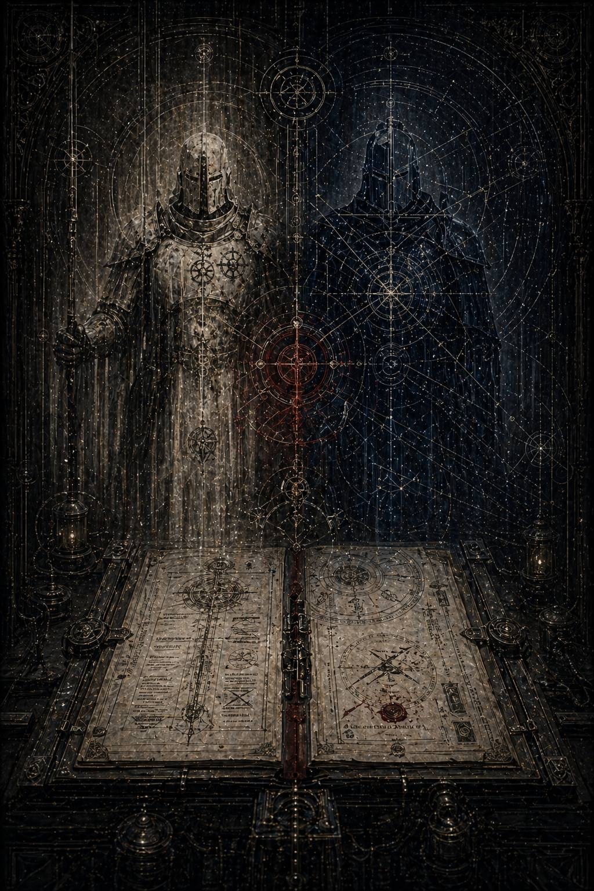

# VI. Vix Fuit / То, чего не должно быть

Перекрёстная ссылка открылась не сразу.

Сначала система вежливо потребовала подтверждение допуска. Потом предупредила о фрагментарности массива. Потом напомнила, что документы содержат следы старых цензурных санкций и могут быть неполными, искажёнными или вторично скомпонованными. Лишь после этого над столом Каэля возникла тонкая серая рамка с почти насмешливой пометкой:

**СОВМЕСТНАЯ ОПЕРАЦИЯ / СВЯЗАННЫЕ НАБЛЮДЕНИЯ СМЕЖНЫХ КОМАНДОВАНИЙ
СТАТУС: ЧАСТИЧНО ДОСТУПНО
СОДЕРЖАНИЕ: НЕ РЕКОМЕНДУЕТСЯ К ИНТЕРПРЕТАЦИИ**

Вот теперь он уже почти видел стиль за самой формой.

Когда Империум чего-то боялся, он не просто запрещал. Он начинал разговаривать с читателем так, будто тот и сам должен был понимать неприличие собственного любопытства.

Каэль открыл массив.

Сначала пошли обычные огрызки: повреждённые таблицы переброски сил, обрывки оперативных карт, битые сигилы двух командований, старые номера транспортных коридоров, не совпадающие ни с одной актуальной нумерацией. Но затем в глубине сводки обнаружился другой слой. Не их собственные документы. Чужие.

Наблюдения со стороны.

Архивы других легионов, соприкасавшихся с совместными операциями II и XI. Не прямые доносы. Хуже. Сухие, почти стыдливые записи людей, слишком умных, чтобы ничего не заметить, и слишком дисциплинированных, чтобы назвать замеченное прямо.

Первая была из стратегического регистра VII.

Подпись выжжена. Но почерк даже после зачистки оставался слишком узнаваемым: холодная инженерная ясность, любовь к пределу, почти архитектурное отвращение ко всему, что нельзя встроить в расчёт.

**\> …совместное присутствие II и XI создаёт недопустимую плотность согласования.**

**\> …обычная проблема кооперации между легионами отсутствует вовсе. Приказы не дублируются, но и не конфликтуют. Складывается впечатление, что оба контура решения исходно проектировались как взаимно встраиваемые…**

**\> …не вижу в этом порока. Вижу лишь конструкцию, о которой нас не уведомляли.**

Каэль перечитал последнюю строку.

*Не вижу порока.*

Это было важно.

Даже в чужом, насторожённом взгляде сначала не было обвинения. Только профессиональное раздражение архитектора, обнаружившего в плане чужой, несанкционированный узел.

Вторая запись пришла из XIII, судя по остаточной структуре файла. Совсем другой ум. Более широкий, системный, склонный мыслить масштабами управления и структуры.

**\> …их взаимодействие производит ложное впечатление простоты. На деле оно опасно именно своей неформализуемостью.**

**\> …мы можем описать методы II. Мы можем описать методы XI. Но при совместной операции появляется третий эффект, не выводимый из суммы частей.**

**\> …подобные модели невозможно масштабировать. Государство не должно зависеть от уникальных связей, которые нельзя воспроизвести процедурой.**

Вот оно снова.

Не грех. Не ересь. Не позор.

*Невоспроизводимость.*

Для Империума это было уже почти метафизическим оскорблением.

Третья запись была короче, резче и почти раздражённее остальных.

Источник определить не удалось. Возможно, I. Возможно, один из внутренних следящих регистров, позднее ошибочно вложенный в архив наблюдений. Автор явно принадлежал к тем, кто не любит делить внимание мира с чужой исключительностью.

**\> …они разговаривают слишком мало для двух существ, принимающих столько совместных решений.**

**\> …либо между ними существует заранее согласованный код, либо нечто хуже: привычка понимать друг друга без необходимости утверждать власть словом.**

**\> …в военной иерархии это выглядит не как дружба, а как замкнутый внутренний круг.**

Каэль замер.

Именно эту формулу он уже видел в другом обломке. *Замкнутый внутренний круг*. Или *замкнутый внутренний контур*. Архивы разных лет, разные голоса, разные углы наблюдения, а страх проступал один и тот же.

Он продолжил читать.

Четвёртая запись оказалась неофициальной, почти личной. Без сигила. Без шифра. Наверное, часть приватного регистратора, случайно втянутая в служебный контур во время одной из позднейших зачисток.

**\> …я видел, как они смотрят на карту. Не друг на друга, а на карту. И всё же это выглядит интимнее любого разговора.**

**\> …один отмечает предел, до которого можно удержать мир от гниения. Другая уже знает, где за этим пределом останется путь для живого.**

**\> …если бы я верил в красоту как в опасную военную величину, я сказал бы, что именно так она и выглядит.**

Каэль медленно выдохнул.

Вот так оно начинало происходить.

Архив переставал быть просто местом, где стёрли двух полубогов. Он становился местом, где другие, не менее страшные фигуры однажды заметили в них нечто, чему так и не нашли безопасного термина.

Он открыл реконструктивный блок, собранный кем-то позднее из осколков операций, личных свидетельств и следов смежных командований.

Заголовок не сохранился полностью.

Только несколько слов:

**…совместное сдерживание…
…узел Хеликс…
…присутствовали II и XI…
…оценка невозможна в обычных метриках…**

Прошлое снова поднялось из мёртвого света.

---

Система Хеликс не представляла собой ничего поэтичного.

Два обжитых мира, три сырьевых луны, длинный производственный пояс, старый астропатический шов между секторами и полуразвалившийся транзитный венец, который ценили не за красоту и не за святость, а за то, что через него слишком многое шло, чтобы позволить ему исчезнуть без последствий.

Проблема пришла как всегда не вовремя и не в той форме, к которой кто-либо был готов.

На внешнем кольце вспыхнул мятеж угольных гильдий. Почти одновременно на нижних уровнях одного из миров пошла карантинная деформация, ещё не чума, но уже похожая на преддверие того типа заражения, который любит использовать социальный шум как путь для роста. Транзитный венец начал задыхаться от беженцев, производственный пояс требовал жёсткого силового ответа, местный штаб паниковал между логистикой, политикой и страхом потерять лицо перед Террой.

Обычное решение было бы разрезать узел надвое.

Отдельно подавить мятеж.

Отдельно изолировать заражённый сектор.

Списать потери как допустимые.

Но кто-то наверху решил иначе.

В Хеликс вошли сразу два легиона.

II пришёл первым.

Не как гром. Как линия, расчертившая небо перед рассветом.

Флот Кайрона встал на внешнем пределе системы так, будто кто-то провёл по космосу тонкую, но абсолютную черту. Уже через час пошли приказы на герметизацию кольца, на контроль доступа к нижним ярусам, на остановку частных каналов, на перерасчёт допустимого числа жертв. Мир в присутствии Второго всегда начинал вести себя так, будто кто-то напомнил ему о существовании границы.

XI пришёл спустя семь часов.

Не ломая эту линию, а заполняя её внутренним движением.

Пока корабли Кайрона запечатывали то, что нельзя было позволить миру пересечь, суда Малисары занимали переходные артерии, пересадочные узлы, госпитальные связи, узкие вены системы, по которым ещё можно было вести живых, не дав им раствориться в общей панике.

В нормальной военной кооперации это породило бы трение.

Задержки. Уточнения. Конфликт приоритетов. Торг за полномочия.

Здесь не произошло ничего.

Почти ничего.

Один из капитанов VII, присутствовавший при развёртывании внешнего кольца, потом запишет:

**\> …я готовился наблюдать борьбу двух методов. Вместо этого увидел нечто хуже: оба метода сразу заняли предназначенные им места, как если бы давно знали очертание общей задачи…**

Первую рабочую встречу Кайрона и Малисары описали три разных человека, и все трое, не сговариваясь, запомнили тишину, предшествующую словам.

Они встретились не в зале триумфа и не на стратегическом мостике.

На транзитной станции, посреди наскоро развёрнутого командного узла, где пахло перегретой проводкой, обеззараживающим газом и тысячами чужих тел за тонкими переборками. Вокруг суетились офицеры, логисты, санитарные командиры, местные чиновники, астропаты с кровоточащими носами, связисты, уже переставшие различать верность и дисциплину.

Кайрон стоял над картой, на которой заражённый мир был уже отмечен как область готового отсечения.

Малисара вошла и остановилась по другую сторону стола.

Никто из них не заговорил сразу.

Они просто посмотрели на схему.

Не друг на друга. На схему.

И в этом было что-то такое, от чего нескольким людям рядом внезапно тоже захотелось замолчать, будто они случайно оказались слишком близко к чужой, не предназначенной для свидетелей ясности.

Кайрон первым коснулся проекции.

Отметил шесть узлов герметизации.

Малисара, не спрашивая разрешения и не споря, провела линию от седьмого, который официально считался вспомогательным и слишком узким для массового движения.

— Он ляжет, — сказал один из местных логистов.

— Да, — ответил Кайрон.

— Но не сразу, — сказала Малисара.

Они произнесли это почти одновременно.

После этого на станции стало ещё тише.

Не потому, что это было красиво. Красота в таких местах неприлична. Просто все присутствующие вдруг ясно почувствовали, что решение уже сложилось до того, как его успели оформить обычной военной процедурой.

Кайрон перевёл взгляд с карты на Малисару.

— Три волны, — сказал он.

— Первая пустая, — ответила она.

Он чуть наклонил голову.

— Проверка ритма.

— И страха, — сказала она.

Он кивнул.

На этом рабочее согласование, по сути, закончилось.

Остальное записали подчинённые.

Один из офицеров местного штаба потом напишет с плохо скрываемым раздражением:

**\> …у меня сложилось ощущение, что совещание уже произошло где-то ещё, до слов, а нам оставили лишь честь присутствовать при его расшифровке…**

---

Совместная операция длилась трое суток.

Именно в ней Каэль впервые увидел не только их взаимодополняемость, но и ту тонкую, опасную бессловесность, из которой однажды сможет вырасти всё остальное.

Кайрон держал внешний предел.

Он отсекал уровни, запечатывал шлюзы, пресекал мятежи в тех точках, где компромисс означал бы лишь расширение радиуса гибели. Его легион действовал, как всегда, без восторга. Без крика. Без сценического насилия. Просто миру снова и снова напоминали: вот здесь кончается то, что ещё можно позволить себе считать живым.

Малисара работала внутри этой границы.

Она строила поток через седьмой узел. Сначала пустой прогон. Потом тестовая медицинская волна. Потом узкая детская. Потом тяжёлые группы. Потом массовый вывод. В её легионе люди не становились мягче от вида страдания. Они становились точнее. Каждый боец XI был здесь чем-то большим, чем воин: живым стабилизатором ритма, узлом проводимости, мерой допустимой человеческой паники.

На исходе первого дня произошло то, что и превратило рядовую совместную кампанию в материал чужой памяти.

Один из герметизируемых уровней дал сбой.

Не технический. Хуже. Людской.

Из нижнего яруса, который Кайрон уже приказал считать потерянным, вдруг появился незапланированный поток гражданских. Несколько тысяч. Может быть, больше. Кто-то из местных чиновников, пытаясь спасти своих, открыл внутренний шлюз без санкции. Люди рванули к седьмому узлу, смешавшись с уже выстроенной эвакуационной последовательностью XI.

Для Малисары это был кошмар: если поток ломался, рушился весь ритм вывода.

Для Кайрона это было почти подтверждением правоты: именно поэтому он и хотел запечатать шесть узлов сразу, без оставленного зазора для человеческой надежды.

Они встретились у самого шлюза, где хаос уже начинал захлёстывать людей.

Вокруг кричали. Плакали. Давили друг друга в узкой горловине шлюза. Бойцы II формировали отсечный заслон. Воины XI пытались удержать колонну от распада. Секунды уходили быстрее, чем их успевали считать.

Любой другой момент потребовал бы команды, спора, подтверждения полномочий.

Этого не произошло.

Кайрон посмотрел на поток и сразу увидел, что придётся резать.

Малисара посмотрела на тот же поток и сразу увидела, где его ещё можно удержать, не превратив в массовую казнь.

Он поднял руку, отмечая линию отсечения.

Она в тот же миг сместила первую волну на боковой мост, который до этого не участвовал в маршруте.

— Там узко, — сказал кто-то.

— Знаю, — ответила она.

— Не выдержит, — сказал другой.

— Выдержит, если он закроет хвост, — сказала Малисара.

Кайрон уже двигался.

Он не переспросил, не потребовал объяснений, не стал утверждать своим правом то, что и так понял. Второй легион развернул заслон ровно там, где XI нужно было выиграть сорок секунд. Не минуту. Не чудо. Всего сорок секунд правильной пустоты между обречёнными и теми, кого ещё можно было вывести живыми.

Позже один из младших капитанов напишет:

**\> …я видел, как лорд II закрывает то, на что никто другой не успел бы решиться, и в ту же секунду леди XI ведёт живых по пути, который никто другой не смог бы заметить. Я не понимаю, как они это сделали. Я понимаю лишь, что они оба ожидали этого друг от друга заранее…**

Это была ещё не любовь.

Но уже то, чего не должно быть.

Потому что военная машина может терпеть талант, даже чудовищный. Может терпеть личную славу. Может терпеть братоубийственную зависть, гордыню и культ силы. Но она не знает, что делать с двумя существами, которые образуют общий ответ быстрее, чем система успевает оформить вопрос.

---

На вторую ночь Хеликс почти удержали.

Мятеж на внешнем поясе был подавлен. Три сектора запечатаны. Две луны переведены в карантинную тишину. Через седьмой узел прошли уже сотни тысяч. Усталость висела над командным узлом как отдельный физический ярус.

Именно тогда случилась сцена, которая в официальном архиве не должна была сохраниться вообще.

Она пережила зачистку только потому, что осталась не в хрониках, а в личном регистраторе служителя связного узла, который, вероятно, просто забыл остановить запись после очередной сверки каналов.

Короткий фрагмент. Без военной ценности. Почти без событий.

Тускло освещённая боковая галерея станции. За панорамной бронёй медленно вращается внешнее кольцо, уже наполовину погасшее. Вдали дрожат огни санитарных кордонов. Шум командного центра сюда почти не доходит.

Кайрон стоит у стекла.

Не в позе полководца. Просто стоит, глядя туда, где орбитальный мрак постепенно закрывает нижние уровни мира.

Через несколько секунд в галерею входит Малисара.

Она подходит не вплотную. Останавливается рядом, оставляя ему ровно столько пространства, сколько нужно, чтобы присутствие ощущалось, но не ломало его внутреннюю тишину.

Некоторое время оба молчат.

Потом Малисара говорит:

— Ты снова выбрал самый крайний предел.

Кайрон не оборачивается.

— А ты снова решила, что по этому пути можно провести больше, чем он обещает.

В её голосе нет упрёка. В его тоже.

— Иногда можно, — говорит она.

— Иногда нет.

— Знаю.

Ещё пауза.

Внизу, за бронёй, гаснет один из аварийных огней на внешнем кольце. Тьма сдвигается на сантиметр ближе.

— Ты видел боковой мост заранее? — спрашивает Малисара.

— Нет, — отвечает он.

— Но пошёл именно туда.

— Потому что ты уже смотрела на него.

Это было сказано спокойно. Без восхищения. Без нежности. Почти как замечание о погоде.

И именно поэтому древняя запись была невыносимо интимной.

Малисара чуть поворачивает голову к нему. В полутьме её лицо едва различимо, но даже по силуэту видно: она улыбается не ртом, а каким-то более глубоким, редким внутренним движением, которое случается только там, где человеку не приходится объяснять себя полностью.

— Это тревожит других, — говорит она.

— Меня тоже должно?

— Не знаю.

— Знала бы, если бы было должно, — отвечает Кайрон.

И вот тут служитель связи, случайно записавший сцену, позднее делает на полях метаданных короткую, почти виноватую пометку:

**\> …они звучат не как брат и сестра войны. Не как союзники. Не как полководцы. Скорее как два человека, которые давно привыкли быть продолжением одной мысли…**

После этого запись обрывается.

Каэль долго смотрел в пустой конец файла.

Ничего прямого не было сказано.

Ни признания. Ни жеста. Ни прикосновения.

Только страшное спокойствие двух существ, для которых присутствие другого уже стало естественной частью внутреннего расчёта.

Он понял, почему это раздражало наблюдателей сильнее открытой близости.

Открытую близость можно осудить, высмеять, запретить.

А что делать с двумя полубогами, которые даже молчат вместе так, будто между ними уже есть форма доверия, не нуждающаяся в санкции Императора?

---

Следующий фрагмент был хуже.

Не потому, что содержал больше. Потому, что исходил от одного из примархов.

Метаданные выжгли почти полностью. Остался только осколок сигила и характерный, ядовитый склад речи. Каэль не стал гадать. В таких местах важнее не имя наблюдателя, а качество его страха.

**\> …это надо прекратить раньше, чем остальные начнут считать подобное допустимым.**

**\> …я не говорю о предательстве. Пока что нет. Я говорю о примере.**

**\> …если одному из нас будет позволено иметь внутри себя контур верности, не совпадающий с вертикалью к Трону, мы все рано или поздно начнём задавать неверные вопросы о природе нашего служения.**

Каэль перечитал фразу трижды.

*Контур верности, не совпадающий с вертикалью к Трону.*

Вот чего они боялись на самом деле.

Не чувства как такового. Для Империума чувства были либо слабостью низших, либо топливом для фанатизма. Их можно было презирать, использовать, стилизовать под добродетель. Но здесь возникало нечто иное: горизонтальный центр тяжести внутри системы, построенной исключительно на вертикали.

Следом шёл ответный документ. Вероятно, уже из аппарата внутреннего наблюдения. Не приказ ещё, не санкция, а подготовительная мысль в чистом виде.

**\> …прямых оснований для вмешательства нет. Оба объекта демонстрируют предельную эффективность и формальную лояльность.**

**\> …однако следует признать: их совместная модель создаёт прецедент, который невозможно включить в обычный нарратив военной иерархии без долгосрочного структурного риска…**

**\> …рекомендуется наблюдение не за проступком, а за типом возникающей связи.**

*Тип связи.*

Им даже для этого приходилось изобретать безличные формулы, потому что язык власти всегда слабеет там, где нужно назвать живое прямо.

---

Тем временем в прошлом Хеликс доживал последние часы операции.

Седьмой узел держался хуже, чем рассчитывала Малисара. Внешний карантин требовал более жёсткой герметизации, чем хотелось Кайрону. Местные власти уже начинали торг за послевоенное право назвать случившееся своей победой. Люди умирали в тех масштабах, где даже сострадание обязано становиться математикой, иначе оно просто ломается.

И всё же между ними возникло нечто вроде короткого штиля, какой бывает перед грозой.

На рассвете третьего дня, если словом «рассвет» вообще можно назвать смену аварийного спектра на орбитальной станции, Малисара поднялась на внешний наблюдательный ярус, где Кайрон проверял последние печати.

Она подошла к нему с двумя простыми металлическими кружками рекафа. Жидкость, вероятно, была отвратительной.

Одну кружку она молча поставила рядом.

Кайрон посмотрел на неё так, будто не ожидал ничего человеческого в этот час.

— Ты не спала уже неделю, — сказал он.

— Ты тоже.

— Я не спрашивал о себе.

— В этом и проблема, — ответила Малисара.

Он взял кружку.

Это был очень маленький жест. Почти смешной по сравнению с масштабами мира, который они только что разделали с хирургической точностью и удержали от падения в бездну. Но, читая, Каэль вдруг понял, почему такие мелочи переживают зачистку лучше триумфов.

Потому что в них правда плотнее.

Некоторое время они пили молча, глядя на погасшее кольцо и на медленно движущиеся огни последних конвоев.

Потом Малисара сказала:

— Ты всегда думаешь о том, что осталось за линией?

— Всегда.

— И всё равно проводишь её.

— А ты всегда думаешь о тех, кто ещё может пройти?

— Всегда.

— И всё равно останавливаешь часть потока.

Теперь уже он посмотрел на неё.

В этом обмене не было спора. Скорее взаимное признание той формы вины, которую каждый несёт по-своему и узнаёт в другом мгновенно.

— Значит, мы оба непригодны для утешительных легенд, — сказала Малисара.

— Возможно, именно поэтому нас и зовут туда, где легенды уже не работают.

Она опустила взгляд в кружку.

— Ты когда-нибудь думал, что нас сделали слишком человечными для этого мира?

— Думаю, что этот мир слишком бесчеловечен без нас.

— Это почти жалоба.

— Нет. Почти диагноз.

Малисара тихо фыркнула. Не смех. Только намёк на него.

— Когда ты говоришь такие вещи, я начинаю понимать, почему остальные боятся твоего молчания.

Он усмехнулся одними глазами.

— Когда ты заставляешь толпу идти дальше одним взглядом, я начинаю понимать, почему они боятся твоей доброты.

Она повернулась к нему чуть резче.

— Это не доброта.

— Знаю, — сказал Кайрон. — Поэтому и боятся.

После этого между ними снова повисла тишина.

Не неловкая. Не пустая. Тишина людей, для которых присутствие другого уже перестало быть внешним фактором и стало частью внутреннего камертона.

И именно в этот момент, по глупой случайности или по злой милости архива, на ярус поднялся офицер из чужого легиона. Он остановился, увидел их издали и, вероятно, тут же понял, что вторгся не в частную сцену, а в нечто хуже: в пространство, где два примарха на мгновение существуют не как функции Империума, а как существа, для которых другой уже стал мерой внутренней ясности.

Он ушёл, не приблизившись.

Позже именно от него и останется короткая служебная записка:

**\> …между ними нет нарушения устава. Но есть обстановка, в которой сам устав начинает казаться слишком грубым инструментом наблюдения…**

Каэль закрыл глаза.

Это уже было близко к признанию со стороны свидетеля. Не того, что между ними романтическая связь. Так бы всё упростилось. Нет. Свидетель ощутил нечто более опасное: рядом с ними сама шкала допустимого переставала быть достаточной.

---

Операцию на Хеликсе официально сочли успешной.

Ограниченный мятеж подавлен.

Карантин стабилизирован.

Транзитный венец удержан.

Допустимая доля населения сохранена.

Сектор оставлен в рабочем состоянии.

И всё же почти все внешние записи о ней дышали странным остаточным беспокойством.

Не из-за потерь.

Не из-за методов.

Из-за формы совместного действия.

В последнем документе массива, составленном уже, видимо, кем-то из поздних архивных цензоров, стояла сухая, но почти отчаянная формула:

**\> …при последующей редакции рекомендуется избегать описаний, в которых II и XI предстают как парная военная единица. Подобная оптика не соответствует принятой структуре генеалогической иерархии и способна породить неверные интерпретации раннеимперской истории.**

Вот так.

Не *ложна*.

Не еретична.

Не клеветническа.

*Способна породить неверные интерпретации.*

То есть, проще говоря, слишком близка к правде, которую нельзя позволить читателю совместить в голове самостоятельно.

Каэль медленно свернул массив.

В секторе Вторичной Сверки кто-то тихо кашлянул.

Где-то шуршали ленты.

Свет оставался ровным, сухим, безучастным.

Но за его пределами уже началось движение.

Раньше он видел два почерка.

Границу и путь.

Отсечение и проведение.

Милость через жестокую точность и милость через удержание живого.

Теперь он увидел нечто третье.

То, что возникает не при сложении, а при совпадении.

Кайрон рядом с Малисарой не становился мягче.

Малисара рядом с Кайроном не становилась холоднее.

Они не уравновешивали друг друга и не исправляли.

Они позволяли друг другу быть предельно собой, и именно поэтому рядом начинало работать то, что не выводилось суммой частных из обычных моделей.

Вот что пугало остальных.

Не чувство.

Эффект.

И, возможно, именно это и было первой настоящей ересью их истории: два существа, созданные как инструменты вертикальной воли, слишком точно узнавали друг в друге не функцию, а равное присутствие.

Каэль вытащил узкую бумажную ленту и долго не мог решить, что написать.

Потом всё же вывел:

*Они не сливаются. Они совпадают.*

Он спрятал ленту туда же, куда и предыдущие.

Когда он поднял голову, на краю стола уже горел новый янтарный значок. Не массив, не вызов, а служебное сообщение высшего уровня допуска.

**ДОСТУПЕН НАБЛЮДАТЕЛЬНЫЙ КОНТУР: ВНУТРЕННЯЯ ОЦЕНКА РИСКА.**

**ПРЕДУПРЕЖДЕНИЕ: ЧТЕНИЕ МОЖЕТ БЫТЬ КВАЛИФИЦИРОВАНО КАК ПОИСКОВАЯ ИНТЕРПРЕТАЦИЯ.**

То есть теперь сама система официально начинала считать его не просто сортировщиком мусора, а человеком, который может попытаться понять тип связи.

Он смотрел на янтарный значок и ясно ощущал, что дальше вопрос уже перестаёт быть только историческим.

Потому что всякая машина власти, однажды заметившая горизонтальную верность внутри себя, неизбежно приходит к одному и тому же решению.

Не ждать проступка.

Сначала назвать саму возможность опасной.

А потом уже наблюдать, как она превращается в вину.
