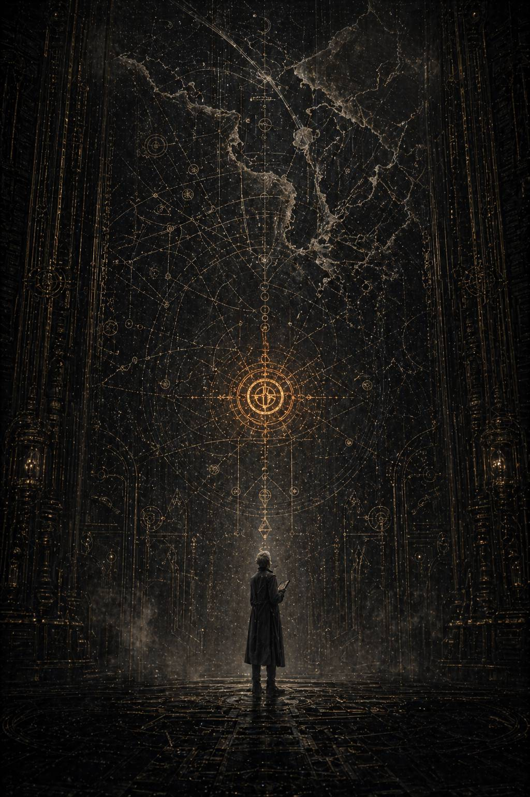

# VII. Limes Imperii / Имперский предел

Каэль смотрел на янтарный значок дольше, чем следовало.

Не потому, что не понимал смысла предупреждения. Наоборот. Смысл был слишком ясен. До этого момента Архивариум ещё позволял притворяться, будто всё происходящее сводится к технической работе, к случайно найденным хвостам, к непристойной, но формально объяснимой тяге низшего аналитика разглядывать шрамы в старых документах. Теперь сама система предлагала иной язык.

**ВНУТРЕННЯЯ ОЦЕНКА РИСКА.**

Не история.

Не память.

Не биография.

Не война.

Риск.

То есть момент, когда живое окончательно переводят в лексику управления.

Он открыл массив.

Первое, что бросилось в глаза, было почти смешным в своей сухости: ни имён, ни титулов, ни легионных обозначений. Только формулы.

**ОБЪЕКТ А.
ОБЪЕКТ Б.
СОПРЯЖЁННЫЙ РИСК
ГЕНЕАЛОГИЧЕСКАЯ НЕСТАБИЛЬНОСТЬ
ПРЕДЕЛ ДОПУСТИМОЙ ВЗАИМНОЙ ВЕРИФИКАЦИИ
ТИП ОТКЛОНЕНИЯ: НЕ УСТАНОВЛЕН.
ФОРМА СБЛИЖЕНИЯ: УСТОЙЧИВАЯ.
ПРИЗНАКИ ПРЯМОЙ ДЕЛИНКВЕНЦИИ: ОТСУТСТВУЮТ.
ПРИЧИНЫ ДЛЯ НАБЛЮДЕНИЯ: ИМЕЮТСЯ.**

Каэль почувствовал во рту сухой металлический привкус.

Вот так, значит, это и начиналось.

Не с проклятия.

Не с обвинения.

Не с катастрофы.

С безупречной канцелярской трусости, которая ещё не смеет назвать чувство преступлением, но уже подбирает к нему измерительные линейки.

Он углубился дальше.

Не потому, что он увидел обвинение. Хуже. Он увидел место, где власть уже перестала воспринимать двух существ как людей, героев или даже угрозу в привычном смысле. Здесь их уже переводили в язык системной инженерии. Так архивы говорят не о поступках, а о формах, которые намерены выжечь из мира до того, как они получат человеческое имя.

Массив оказался составным. Несколько независимых контуров наблюдения, позже сведённых в один пакет. Кто-то, вероятно, из высшего аппарата контроля однажды решил, что проблему нужно перестать воспринимать как россыпь тревожных наблюдений и начать вести как единое дело. Не судебное ещё. Хуже. Предсудебное. То промежуточное пространство, где власть только учится бояться будущего проступка сильнее, чем прошлой невиновности.

Первый блок назывался:

**О НЕНОРМАТИВНОЙ СКОРОСТИ СОГЛАСОВАНИЯ**

Внутри были сводки, диаграммы и сравнительные таблицы по совместным операциям. Кто-то считал. Очень тщательно. Время между постановкой задачи и распределением ролей. Длительность совещаний. Частоту корректировок. Процент конфликтов приоритетов. Число случаев, когда один объект менял решение после прямого вмешательства другого. Соотношение потерь к сохранённой инфраструктуре. Даже плотность сигнального обмена между флотами.

И везде цифры вели к одному и тому же выводу.

II и XI работали вместе слишком хорошо.

Не блестяще в героическом смысле. Не «лучше всех» в дешёвом пропагандистском. Хуже. Они нарушали саму норму трения, на которой держится вся большая система. Там, где между другими легионами существовала обязательная потеря на согласование, здесь почти не было шва.

Первый пакет был коротким и почти сухим до безумия.

В аналитической заметке, приложенной к таблицам, говорилось:

**\> …при совместном присутствии объектов не наблюдается обычная борьба за интерпретационное право, характерная для статусных военных контуров.**

**\> …аномально низкий коэффициент конфликтной задержки при принятии решений высокого риска…**

**\> …решения не навязываются и не уступаются. Они, по-видимому, возникают в уже согласованной форме до завершения вербального цикла утверждения…**

**\> …оба объекта сохраняют выраженное различие методов, однако это различие не порождает обычной для высших контуров борьбы за вертикаль…**

**\> …вместо этого возникает эффект внутренне завершённого решения, формирующегося до полного цикла вербального согласования…**

**\> …данное обстоятельство не является нарушением само по себе, однако создаёт для внешних наблюдателей эффект частной завершённости контура.**

Каэль закрыл глаза на мгновение.

Потом прочёл абзац дважды.

Частная завершённость контура.

Да.

Вот оно.

Он уже видел эти слова в разных вариантах. Замкнутый круг. Внутренний контур. Частная завершённость. Архив искал определение ощупью, как человек в темноте ищет край ножа, не желая признать, что уже порезался.

То, что другие в записях называли то «замкнутым контуром», то «слишком быстрой согласованностью», здесь впервые было оформлено не как сплетня и не как раздражение. Как объект наблюдения. Как формула. Как тревожный инженерный сбой в великой вертикальной машине.

Он пошёл глубже.

Второй блок был хуже.

Здесь язык становился осторожнее и злее.

**О ВОЗМОЖНОМ СМЕЩЕНИИ ВЕРТИКАЛИ ЛОЯЛЬНОСТИ**

Следующий слой был уже хуже не тем, что говорил больше, а тем, что говорил понятнее.

Власть всегда особенно аккуратна там, где боится назвать собственную слабость прямо.

Документы шли один за другим. Часть выжжена. Часть сохранилась почти целиком. Записки наблюдателей, служебные пометки, рекомендации некоего внутреннего аппарата, достаточно высокого, чтобы смотреть на примархов не как на богов войны, а как на управленческую проблему.

**\> …следует различать безупречную формальную лояльность и внутреннее распределение доверия при оперативном выборе.**

**\> …риск возникает не на уровне декларируемой преданности, а на уровне первичного референса ориентации в сложной ситуации. Имеются основания считать, что в части критических моментов каждый из объектов ориентируется на внутренне ожидаемую реакцию другого раньше, чем на подтверждённую вертикаль санкции.**

**\> …в обычной структуре генеалогической иерархии взаимная привязанность допустима лишь постольку, поскольку не образует альтернативный центр ясности…**

**\> …в случае объектов А и Б нет оснований полагать наличие намерения, направленного против верховной воли. Напротив, их эффективность предельна.**

**\> …имеются признаки того, что каждый из объектов выступает для другого не только эмоциональной или оперативной опорой, но и внутренним подтверждением восприятия…**

**\> …данная модель не содержит признаков прямой нелояльности. Тем не менее именно она представляет системную опасность, поскольку способна конкурировать с вертикальной архитектурой доверия без явного нарушения приказа…**

**\> …подобная взаимность не ослабляет служение. Она делает его внутренне самодостаточным. Именно это и должно рассматриваться как долговременный риск.**

Каэль перечитал последний абзац несколько раз.

Затем откинулся на спинку кресла и долго смотрел в пустоту над столом.

Вот оно. Самое ядро страха.

Вот, значит, чего они боялись с самого начала.

Не греха.

Не телесной слабости.

Не распущенности, о которой с удовольствием говорили бы дураки и священники, если бы им дали простые слова для этой истории.

Не измены.

Даже не возможности измены.

А того, что в миг выбора первым внутренним движением может стать не взгляд вверх, к единственному источнику воли, а горизонтальное *знание* о другом.

Их пугало другое: рядом с Кайроном и Малисарой мир внутри человека мог стать ясным не только потому, что сверху существует Трон, воля, приказ и порядок. Другой человек тоже мог стать мерой реальности. Не украшением к долгу. Не утешением после него. А вторым подтверждающим светом.

Для Империума это действительно было хуже прямой ереси.

Ересь приходит как бунт.

А такое возникает как полнота.

Проступок можно карать.

А как карать самую структуру доверия?

Вот почему всё звучало так, будто речь идёт не о романе, не о дружбе и даже не о заговоре. Эти слова были бы слишком простыми и слишком человеческими. Нет. В глазах системы они становились опасны тогда, когда один начинал быть для другого формой внутреннего удостоверения.

Не только *я тебя понимаю*.

Хуже: *рядом с тобой я уверен, что моё видение реальности действительно*.

Он почувствовал короткую, почти болезненную ясность.

Если власть построена на исключительном праве утверждать реальность, она неизбежно начинает ненавидеть всякую связь, в которой двое подтверждают мир друг другу напрямую.

Третий блок имел почти безобидный заголовок:

**О ПОВЕДЕНЧЕСКИХ ПРИЗНАКАХ ВНЕПРОЦЕДУРНОЙ СВЯЗАННОСТИ**

А внутри был самый настоящий донос, только составленный людьми слишком умными, чтобы позволить себе тон доносчиков.

Наблюдатели перечисляли мелочи.

Частоту, с которой один объект завершал фразу другого не словами, а действием.

Случаи, когда при выборе оперативного маршрута оба почти одновременно отмечали одну и ту же точку карты.

Необычно низкое количество демонстративных конфликтов на публике.

Редкость формальных взаимных похвал.

Отсутствие попыток закрепить иерархическое превосходство в ритуальных ситуациях.

Едва заметную коррекцию темпа речи при разговоре наедине.

Слишком долгие паузы, которые не были паузами непонимания.

И всё это подавалось как признаки.

Не любви.

Не близости.

Связанности.

Как будто перед аналитиками лежали не два живых существа, а новая разновидность оружия, которую ещё не успели правильно каталогизировать.

Один из приложенных документов был особенно мерзок именно своей правотой.

**\> …наиболее тревожным является не наличие эмоциональной окраски, если таковая вообще имеет место, а её дисциплинированность.**

**\> …в других случаях подобные связи выявляются через утрату формы: ревность, публичную импульсивность, протекцию, слабость, нарушения порядка приоритетов. Здесь ничего подобного не наблюдается.**

**\> …следовательно, если связь действительно существует, она не ослабляет объекты, а организует их дополнительно. Для системы такого масштаба это опаснее обычной привязанности.**

Каэль почувствовал, как вспотели ладони, лежащие на прохладном металле стола.

Да.

Именно так.

Если бы они были глупее, шумнее, телеснее в своей близости, их, возможно, прощали бы дольше. Слабость выглядит управляемо. Её можно высмеять, запереть в рамку приличий, использовать против носителя.

Но что делать с привязанностью, которая делает обоих точнее?

Он открыл следующий реконструктивный блок, собранный, очевидно, из наблюдений, не предназначенных для общей истории. Заголовок сохранился частично:

**…неформальное присутствие после доклада…**

**…оценка невоенного взаимодействия…**

Архив раскрылся и прошлое впервые развернулось не на поле боя и не в санитарной тьме, а в пространстве высокой власти.

---

Это случилось после одной из ранних совместных кампаний, ещё до Имги, до явной трещины, до тех ступеней, с которых потом начнётся настоящее падение. Они уже были достаточно заметны, чтобы раздражать окружающих. Но ещё недостаточно, чтобы кто-либо мог сказать: вот тут всё пошло необратимо.

Во Дворце стоял редкий для Терры тихий день, если вообще можно применять слово «день» к миру, где свет является не небесным состоянием, а функцией гигантской машины. В одном из внутренних залов сводились отчёты с окраинных театров. Не триумф. Не публичное собрание. Закрытая техническая сверка по итогам операции, слишком успешной и потому слишком тревожной для тех, кто привык, что великие силы должны хотя бы немного спотыкаться друг о друга, прежде чем сложиться в общее решение.

Кайрон и Малисара вошли раздельно.

Это зафиксировали три независимых наблюдателя.

И все трое сочли нужным упомянуть именно эту деталь, будто уже одно то, что они не подчёркивали близость внешне, казалось более подозрительным, чем если бы та была демонстративна.

Кайрон остановился у края тактической схемы раньше остальных. Он всегда так делал. Не занимал центр, не разыгрывал символическую тяжесть собственного положения, а просто подходил к тому месту, где решение должно было стать ясным. Малисара вошла позже, остановилась на противоположной стороне стола и не посмотрела на него сразу. Сначала выслушала фрагмент доклада адъютанта, касавшийся потерь в эвакуационной волне. Только потом подняла глаза.

И этого хватило.

Каэль читал позднейшую аналитическую пометку, приложенную к этой сцене, и чувствовал почти уважение к тому безымянному бюрократу, который хоть раз оказался достаточно смел, чтобы зафиксировать ужас без дешёвой брани.

**\> …наблюдается труднопереносимое впечатление, что оба объекта входят в пространство решения уже не как две независимые силы, а как две половины заранее сложенной фигуры…**

Труднопереносимое впечатление.

Не факт.

Не доказательство.

Но иногда именно впечатление и есть первое настоящее знание, которое система не может себе позволить признать прямо.

Сверка шла долго. Другие примархи или их представители присутствовали тоже. Не все лично. Часть через сигнальные образы, часть через старших капитанов и делегатов. По обрывкам Каэль понял, что один из наблюдателей, холодный, внешне безупречный и политически чуткий, особенно внимательно следил за тем, как Кайрон и Малисара читают карту.

Сама карта была проста.

Остаточный заражённый контур.

Три допустимых траектории.

Одна санитарно безупречная, но чудовищная по числу списанных гражданских.

Одна гуманнее, но с высоким шансом позднего распада.

Одна промежуточная, нестабильная.

Обычная военная сцена.

Обычный для Империума выбор между скоростью, порядком и количеством чужих тел.

Но именно здесь произошло то, что затем станет основанием для половины позднейших наблюдений.

Кайрон первым указал на внешний контур.

На тот самый участок, где следовало провести границу раньше, чем большинству присутствующих было психологически удобно её признать.

Малисара почти одновременно коснулась внутренней связки.

Не споря с ним.

Не отменяя его жест.

Просто сразу обозначая, где внутри этой жесткости ещё можно удержать живой путь, не превратив решение в голую ампутацию.

Ни один из них не спросил другого.

Ни один не пояснял.

Ни один не добивался права единоличного решения.

Их движения были разными, но не враждебными. Словно карта сама уже делилась перед ними так, как должна была разделиться, а остальные присутствующие только позднее поняли, что стали свидетелями не согласования, а проявления некой уже существующей внутренней формы.

Тишина в зале длилась дольше допустимого.

Потом один из старших военных представителей резко, почти грубо спросил:

— Это решение уже принято?

Ни Кайрон, ни Малисара не ответили сразу.

Именно Малисара первой убрала руку с карты.

— Нет, — сказала она. — Оно только стало допустимым.

Каэль замер над этой фразой.

Не вызывающей.

Не высокомерной.

И всё же почти страшной.

Потому что если решение «становится допустимым» не через борьбу воль, а через присутствие двух существ в одном пространстве, то сама власть уже не является единственным источником ясности.

Следующий документ был не докладом, а внутренней аналитической справкой, составленной, вероятно, для Малкадора или кого-то из ближайшего надзорного круга.

**\> …объекты А и Б не демонстрируют ни телесной распущенности, ни прямой эмоциональной неуправляемости, которую можно было бы использовать как основание для коррекции…**

**\> …основная сложность в том, что их связь носит дисциплинированный характер и потому не ослабляет, а организует обоих дополнительно…**

**\> …такого рода связанность не выглядит как порок. Она выглядит как альтернативная полнота. Именно это и делает её политически неприемлимой…**

*Альтернативная полнота.*

Вот формула, к которой всё шло с самого начала.

Им было не с чем спорить в логике эффективности.

Не за что хватать в языке обычной морали.

Оставалось только признать, что сама форма их совместного существования уже выглядит как другой способ быть целым.

Каэль открыл следующий пласт.

Там было короткое свидетельство служителя внутреннего зала, чья функция сводилась к тому, чтобы подавать запечатанные ленты и молчать. Люди такого разряда обычно выживают в истории только случайно. Именно поэтому их слова иногда страшнее торжественных речей.

**\> …я не знаю, как говорить о таком без греха высоких слов. Они не смотрят друг на друга часто. Но когда один говорит, другой слушает не как подчинённый, не как соперник и не как брат среди прочих. Скорее как человек, заранее знающий форму ещё не высказанной боли…**

Каэль долго сидел неподвижно.

Пожалуй, в этом безымянном служителе было больше живого понимания, чем во всей аппаратной аналитике. Высокие контуры улавливали в Кайроне и Малисаре системную угрозу. Но только такие люди снизу, случайно оказавшиеся рядом, иногда видят простую человеческую суть раньше терминов.

Не близость как удовольствие.

*Близость как знание формы чужой боли.*

Он открыл следующий блок, и там наконец впервые проступила фигура Императора.

Не в великой сцене.

Не как апокалиптическое солнце.

Хуже.

Почти буднично.

Внутренний зал стратегического согласования.

После завершения общей сверки.

Большинство уже вышло.

Остались трое: Кайрон, Малисара и **Он**.

Реконструкция была собрана из двух независимых регистраторов охраны и позднего служебного конспекта. Прямая речь сохранилась фрагментарно, но этого хватало.

Император стоял у высокого окна, за которым не было неба в привычном человеческом смысле, только золотистая даль внутренних уровней Дворца. Ни один документ не пытался описывать Его эмоции прямо. И всё же сквозь сухой язык стенограммы проступало главное: он наблюдал за ними не как за победоносными детьми, а как архитектор, рассматривающий конструкцию, чьи внутренние напряжения уже начинают вести себя иначе, нежели он планировал.

Он задал вопрос Кайрону.

**— Почему ты оставил ей внутренний контур без прямого подтверждения сверху?**

Ответ был коротким.

— Потому что она увидела его раньше карты.

Тогда Император обратился к Малисаре.

**— А ты почему не потребовала внешней санкции на такую степень доверия?**

Она ответила после короткой паузы.

— Потому что он уже держал тот предел, без которого мой путь не существовал бы вообще.

После этого, согласно регистратору, в помещении установилась пауза в четыре с половиной секунды. Для обычной беседы это ничто. Для людей их масштаба, в этом месте, в этой точке разговора, почти бездна.

Затем Император произнёс:

**— Некоторые силы слишком хорошо работают вместе, чтобы их можно было считать безопасными.**

Вот и всё.

Не запрет.

Не упрёк.

Даже не открытая угроза.

Просто фраза, в которой уже содержался весь будущий крах.

Кайрон и Малисара не ответили.

Не из непокорности.

Видимо, потому, что оба слишком хорошо поняли: вопрос задан не о прошедшей кампании. О них.

Следующая строка в позднем конспекте была отмечена как «неверифицированная по формулировке», но Каэль всё равно ей поверил. Слишком точно она совпадала со всем, что уже удалось собрать.

**\> …Владыка указал Малкадору на необходимость дальнейшей осторожной оценки парного принципа без провоцирования прямой защитной консолидации…**

Парного принципа.

Вот так.

Не «их связи».

Не «их чувства».

Не «возможного проступка».

*Парного принципа.*

Император мыслил их не только как двух детей, слишком близко стоящих друг к другу. Он видел в них нечто более системное и потому более тревожное: парность как альтернативную архитектуру силы.

Каэль закрыл глаза на несколько секунд.

Он вдруг очень ясно понял, почему эта история так опасна для всей мифологии Империума. Если даже в высшей точке власти их взаимность была прочитана как второй принцип организации мира, тогда их последующее вычёркивание было не просто наказанием за падение. Это было уничтожение конкурирующего образца целостности.

Он вернулся к файлу.

Там шёл последний, самый человеческий фрагмент главы. Неофициальный. Почти наверняка записанный кем-то из ближайшего сопровождения Малисары или Кайрона и затем случайно втянутый в аппаратный массив позднее.

---

После встречи с Императором они вышли не вместе, но их пути пересеклись в боковой галерее. Место было узкое, служебное, годное скорее для связистов, чем для полубогов. Возможно, именно поэтому запись вообще уцелела. Великие вещи чаще ломаются не в тронных залах, а у некрасивых стен.

Они остановились друг напротив друга.

Не касаясь.

Не приближаясь.

Слишком поздно и слишком рано для этого.

Первой заговорила Малисара.

— Он увидел.

Кайрон ответил:

— Да.

— И ты это тоже понял сразу.

— Да.

Пауза.

Потом она сказала:

— Мы должны были быть осторожнее.

Каэль, читая, почти услышал, каким тихим был, вероятно, её голос.

Не раскаяние в чувствах.

Раскаяние в их видимости.

Кайрон молчал дольше, чем она.

— Нет, — сказал он наконец. — Мы должны были быть менее целыми рядом.

Вот эта строка и стала, наверное, настоящим ядром всей главы.

Не «меньше любить».

Не «держать дистанцию».

Не «лучше скрываться».

*Быть менее целыми рядом.*

То есть сама полнота их совпадения уже воспринималась как угроза прежде, чем кто-либо из них сделал хоть один шаг к падению.

Малисара смотрела на него очень долго. Это было видно даже по плохо собранному тексту: свидетель несколько раз пытается подобрать формулировку и в итоге сдаётся, оставляя просто «длительная неподвижность».

— Я не умею быть рядом с тобой наполовину, — сказала она.

Он ответил не сразу.

— Я знаю.

И после этого они разошлись.

Ни клятв.

Ни прикосновения.

Ни больших слов.

Но Каэль понял уже достаточно, чтобы ощутить весь масштаб будущей трагедии. До Хаоса, до заражения, до ложного маршрута и последнего разговора существовал ещё один, куда более ранний уровень обречённости. Сам факт их целостности друг рядом с другом уже был замечен, назван и помещён под надзор.

Не потому, что они сделали что-то дурное.

Потому, что самим своим существованием вместе нарушали удобную геометрию мира.

Он свернул реконструктивный блок и открыл заключительную аппаратную справку главы. Там уже не было живых сцен. Только итог.

**\> …наблюдение продолжить.**

**\> …преждевременное вмешательство нецелесообразно.**

**\> …следует избегать форм, способных спровоцировать у объектов прямое осознание совместной оборонительной необходимости.**

**\> …приоритет: не разрушение, а недопущение дальнейшей метафизической и политической завершённости парного контура…**

Не разрушение.

*Недопущение завершённости.*

---

Это произошло после возвращения из Хеликса.

Не сразу.

Через несколько дней.

Когда внешний шум операции уже улёгся, официальные отчёты были сданы, потери подсчитаны, героизм распределён по допустимым квотам, а настоящая усталость наконец добралась до тех, кто слишком долго держался на дисциплине и долге.

На флагмане одного из сопровождающих контуров был организован закрытый докладный цикл. Ничего парадного. Несколько командных узлов, служебные галереи, сухие столы, покрытые картами и остаточным напряжением недавней катастрофы. Присутствовали высшие офицеры смежных легионов, стратеги, архивные кураторы, связисты, несколько фигур из внутреннего аппарата наблюдения.

Доклад шёл тяжело.

Все устали.

Все были достаточно умны, чтобы понимать: удержание системы не равняется победе.

И все уже чувствовали ту невидимую неловкость, которая остаётся в помещении, где два человека работали вместе слишком хорошо.

Кайрон выступал первым.

Он говорил, как всегда, без всякой риторики. Карты. Потери. Контуры заражения. Шесть узлов, которые пришлось считать утраченными раньше, чем хотелось бы признать это вслух. Пределы допустимого риска. Моменты, когда гуманность и трусость пытались притвориться друг другом.

Никто не задавал ему глупых вопросов.

Рядом с ним вообще редко задавали глупые вопросы дважды.

Потом слово взяла Малисара.

Она говорила иначе. Не мягче. Просто в её речи движение никогда не исчезало целиком. Там, где Кайрон разделял реальность по линиям отсечения, она показывала, как по этим линиям ещё текла жизнь. Волны живых потоков. Перераспределение узлов. Фазы усталости колонн. Поведение детей в длинной тьме. Точка, после которой человек перестаёт слышать приказ, если не дать ему перед этим две минуты тишины и воду.

Каэль, читая позднюю реконструкцию, вдруг заметил главное: по отдельности их доклады были безупречны. Вместе они образовывали не отчёт, а почти полную картину трагедии. Как если бы один отвечал за то, где реальность должна быть разрезана, а другая за то, что именно удаётся перенести через этот разрез.

После доклада формальная часть закончилась.

Люди начали расходиться мелкими группами. Кто-то спорил у карт. Кто-то молча пил отвратительный рекаф. Кто-то уже заранее формулировал безопасные версии произошедшего для вышестоящих каналов. В таком расползающемся послесловии обычно и становятся видны вещи, которые на официальной сцене ещё прячутся.

Один из наблюдателей, позже приложивший к делу очень краткую записку, описал это так:

**\> …оба объекта покинули центральный зал отдельно, без попытки обозначить намерение остаться наедине. Формально контакт не был инициирован. Фактически через девять минут оба находились в северной сервисной галерее, примыкающей к обзорному контуру. Случайность маловероятна.**

Каэль поморщился.

Даже здесь.

Даже путь к частной встрече они измеряли как логистическое совпадение, подлежащее вероятностной оценке.

Он открыл следующий фрагмент.

---

Северная сервисная галерея не предназначалась для разговоров.

Слишком узкая. Слишком голая. Металлический пол, решётчатые секции обслуживания, тусклый свет, за пределами которого медленно двигалась темнота между звёзд. Сюда не приходят ради красоты. Сюда приходят, когда хотят тишины, не похожей на привилегию.

Кайрон стоял у обзорной панели, опустив ладонь на край металла. Не напряжённо. Но в той форме неподвижности, которая у него всегда означала не покой, а внутренний перерасчёт.

Когда Малисара вошла, он обернулся не сразу.

— Они уже начали переписывать нас в удобную конструкцию, — сказала она.

Это была первая фраза.

Не приветствие.

Не вопрос о самочувствии.

Сразу то единственное, что действительно имело значение для людей их масштаба: каким образом чужая память уже начала торговать тем, что они только что сделали.

— Да, — ответил Кайрон.

— Тебя сделают жёстче.

— Тебя мягче.

— И оба варианта будут ложью.

Теперь он обернулся.

— Не самой опасной.

Она подошла ближе. Не вплотную. Между ними всё ещё оставалось пространство, достаточно заметное для чужого глаза и уже почти несущественное для их внутреннего расчёта.

— Они наблюдают, — сказала Малисара.

— Знаю.

— Это тебя тревожит?

— Нет.

— А должно?

Кайрон помолчал.

— Должно тревожить тебя.

В этой фразе не было снисхождения. Только точность. Он видел в ней ту часть опасности, которую она, возможно, всё ещё недооценивала.

Малисара чуть наклонила голову, как делала всегда, когда не соглашалась не с выводом, а с мерой его окончательности.

— Меня тревожит не наблюдение, — сказала она. — Меня тревожит их язык. Они уже смотрят не на то, что мы сделали, а на то, как мы существуем рядом.

— Это неизбежно.

— Почему?

Он выдержал паузу.

— Потому что рядом со мной ты начинаешь верить собственному видению сильнее, чем им хотелось бы.

Слова повисли между ними.

Не громкие. Не красивые. Но после них уже невозможно было притворяться, будто речь идёт только о профессиональном совпадении методов.

Малисара долго смотрела на него.

— И ты тоже, — сказала она наконец.

Кайрон не ответил.

И это было ответом.

Каэль почувствовал, как у него слегка дрогнули пальцы.

Вот она, та самая точка, которую архивы затем будут годами обходить боком, не решаясь назвать. Не признание любви в человеческом смысле. Глубже. Страшнее.

*Рядом с тобой я уверен в собственном видении реальности.*

Для мира, где право на реальность принадлежит одному-единственному вертикальному источнику, это уже почти преступление даже без всяких последствий.

В следующем фрагменте их разговор продолжался.

---

— Они будут ждать повода, — сказала Малисара.

— Да.

— Мы не дадим его.

— Повод дают не только поступки.

Она улыбнулась едва заметно. Не радостно. Скорее с той усталой нежностью, которая возникает между людьми, слишком хорошо знающими устройство опасности.

— Тогда, возможно, нам следовало быть глупее, — сказала она.

— Мы не умеем.

— Нет, — согласилась она. — В этом и беда.

Потом произошло то, что поздний цензор, видимо, и пытался выжечь особенно тщательно. Сохранилось плохо. Несколько фраз, полузатёртая запись жеста, нечёткое описание скрытого наблюдателя. Но даже обрывков хватало.

Малисара сделала шаг ближе.

Не как на совете.

Не как на поле боя.

Просто ближе.

И положила ладонь на его запястье.

Не на плечо.

Не на лицо.

Не в объятие.

На запястье.

Жест почти аскетический по своей бедности, и именно поэтому от него становилось труднее дышать. Это не был жест собственности. Не было просьбой. Скорее короткая физическая проверка того, что другой действительно существует и ещё находится в той же реальности, что и ты.

Кайрон опустил взгляд на её руку.

Несколько секунд ничего не делал.

Потом накрыл её ладонь своей.

Наблюдатель позже напишет:

**\> …контакт краткий, лишён всякой внешней интимности, но по неясной причине воспринимается как более частный, нежели братское объятие было бы в иных обстоятельствах…**

Да.

Именно так.

Потому что объятие можно сделать жестом утешения, ритуалом, культурной формой, даже случайной слабостью. А это касание было не про слабость. Про удостоверение.

*Ты здесь.*

*Да.*

*Я тоже.*

И на несколько страшных секунд этого оказалось достаточно.

Разговор после этого стал тише, а запись хуже. Но несколько фраз всё же уцелели.

— Если они однажды заставят выбирать, — сказала Малисара, — ты выберешь правильно.

Кайрон посмотрел на неё очень спокойно.

— Правильно для кого?

Она не отвела взгляда.

— Вот видишь, — сказала она. — Поэтому нас и боятся.

Эта строка ударила Каэля сильнее всех предыдущих.

Не обещание измены.

Не клятва быть вместе против мира.

Даже не намёк на заговор.

Просто признание того, что вопрос *правильно для кого* уже может быть произнесён между ними без немедленного возвращения к единственной дозволенной вершине.

Вот где система действительно начинала трещать.

---

Следующий блок возвращал к сухому настоящему тех далёких наблюдателей.

После северной галереи язык внутренних документов изменился.

Сдержанность осталась.

Осторожность тоже.

Но теперь в тексте появилась решимость.

**РЕКОМЕНДАЦИЯ: УСИЛИТЬ НЕПРЯМОЕ НАБЛЮДЕНИЕ.
РЕКОМЕНДАЦИЯ: ИЗБЕГАТЬ РАННЕГО ОБВИНЕНИЯ.
РЕКОМЕНДАЦИЯ: ФИКСИРОВАТЬ НЕ ДЕЙСТВИЕ, А ЭВОЛЮЦИЮ ТИПА СВЯЗИ.
РЕКОМЕНДАЦИЯ: ПО ВОЗМОЖНОСТИ ИСКЛЮЧАТЬ ДЛИТЕЛЬНЫЕ СОВМЕСТНЫЕ КОНТУРЫ ПРИ ОПЕРАТИВНОМ ПЛАНИРОВАНИИ.**

То есть они уже поняли, что прямой удар сейчас невозможен.

Слишком эффективны.

Слишком безупречны.

Слишком верно несут свою службу.

Значит, нужно было не карать, а разъединять.

И вот это, пожалуй, было страшнее всего. Потому что именно здесь из беспокойства рождается технология разрушения.

Каэль углубился в последний аналитический меморандум блока.

Он был составлен кем-то слишком уставшим, чтобы до конца прятаться за правильной фразеологией.

**\> …в нормальной структуре высшие объекты конкурируют, конфликтуют, доминируют, уступают, торгуются за интерпретацию или остаются принципиально несводимыми друг к другу. Всё это безопасно для вертикали, поскольку исключает появление горизонтального ядра ясности.**

**\> …в случае А и Б наблюдается иное. Их различие не уничтожает согласования, а питает его. Чем сильнее расходятся их методы, тем полнее становится совместный результат.**

**\> …если подобная модель продолжит существовать, рано или поздно она начнёт казаться не исключением, а возможной альтернативой самой логике одиночной санкционированной воли.**

**\> …этого нельзя допустить, даже если субъективно оба объекта не желают никакого отклонения.**

Каэль медленно опустил руки на стол.

Вот она. Чистая формула грядущего приговора.

*Этого нельзя допустить,* даже если они ни в чём не виновны.

Именно так всегда и устроено настоящее государственное насилие. Сначала виновность перестаёт быть условием вмешательства. Потом опасной объявляют саму возможность будущего отклонения. Потом всё остальное становится лишь делом времени и бухгалтерии.

Он долго сидел неподвижно.

Сектор Вторичной Сверки вокруг него жил своим сухим, безличным существованием. Скользили ленты. Работали вентиляторы. Люди ходили между столами с лицами, на которых никогда не задерживается история. Но для Каэля всё это сейчас уже было не важно. Он видел другую картину.

Не трагедию падения.

Пока ещё нет.

Он видел момент до неё.

Когда двое ещё безупречны.

Когда их связь ещё ничего не разрушила.

Когда они всё ещё служат предельно чисто.

И именно поэтому власть уже решила, что однажды им придётся стать виноватыми.

Он закрыл массив.

На несколько секунд над столом осталась только его собственная бледная тень в служебном свете. Он не двигался. Где-то далеко, за перегородками, прошёл сервитор на паучьих опорах. Лорен на соседнем ряду тихо сортировала ленты. Архивариум продолжал жить так, будто не имел никакого отношения к чудовищной чистоте того, что только что было им прочитано.

Но Каэль уже знал, что это ложь.

Архивариум не просто хранил следы их истории.

Он был частью механизма, который однажды увидел в полноте двух существ угрозу, а потом сделал всё, чтобы эта полнота либо распалась, либо стала невыносимой для самой себя.

Он достал узкую бумажную ленту и написал:

*Они стали опасны раньше, чем стали виновны.*

Спрятал ленту в пустой корпус стилуса и лишь потом понял, что именно эта формула, возможно, и есть ключ к книге целиком.

Не обычная ересь.

Не падение ради силы.

Не предательство, из которого потом можно делать назидательный миф.

Сначала их признали опасными.

Только потом мир начал помогать им становиться виновными.

Когда он поднял голову, Лорен уже стояла у конца ряда и смотрела не на него, а чуть мимо, как делают люди, привыкшие говорить с чужим страхом без лишнего нажима.

— Ну? — спросила она.

— Они боялись их — сказал Каэль.

— Конечно.

— Император увидел не грех. Конструкцию.

Лорен едва заметно кивнула.

— И?

Каэль молчал какое то время.

— Значит, всё, что было потом, уже росло не в пустом месте.

— Да, — сказала она. — Самые страшные катастрофы в таких мирах редко начинаются с первого проступка. Они начинаются в тот день, когда власть впервые замечает, что рядом с ней возникла другая форма целого.

После этого она ушла.

А Каэль остался сидеть под сухим светом Архивариума, уже точно зная: если книга I должна быть тревожной, то именно здесь проходит один из её главных нервов.

Не в том, как двое пали.

А в том, что мир решил считать их угрозой ещё в ту пору, когда они были самым редким и страшным чудом из возможных: двумя существами, которые, будучи рядом, делали друг друга не слабее, а целее.

На столе не сразу, но вспыхнуло новое уведомление. Не янтарное. Белое. Формально безобидное.

**АНАЛИТИК МЕРРОН. В БУФЕРЕ ЗАФИКСИРОВАНО НЕСТАНДАРТНОЕ НАКОПЛЕНИЕ РУЧНЫХ ПОМЕТОК.**

**РЕКОМЕНДАЦИЯ: ПЕРЕДАТЬ ИХ В СЛУЖЕБНОЕ ХРАНЕНИЕ ИЛИ УНИЧТОЖИТЬ.**

Он смотрел на строку, и впервые за всё это время его страх стал не абстрактным, а близким и почти бытовым.

Они уже здесь.

Не только тогда, в глубине веков.

Здесь.

Рядом с его рукой.

У его стола.

В том же мягком, вежливом языке, который никогда не повышает голос, потому что уверен: если надо, ты сам всё сделаешь правильно от единого намёка.

Каэль очень медленно поднялся.

Крошечные бумажные ленты со словами про Кайрона и Малисару, спрятанные в пустых корпусах стилусов, вдруг приобрели тяжесть, несоразмерную своему размеру. Несколько жалких ручных заметок. Ничто по меркам Архивариума. Но он уже знал главный закон этого места.

Здесь уничтожают не объём информации.

Здесь уничтожают форму памяти.

Он вышел из сектора не сразу. Сначала аккуратно привёл стол в порядок, закрыл служебные окна, сдал пакет лент, отметил завершение смены. Всё как всегда. Всё правильно. Всё в том безопасном ритме, который спасает жизнь людям, понимающим слишком много.

Лишь когда он оказался в пустом коридоре, где лампы тянулись в бесконечность, а шаги звучали так, будто ступали по внутренностям гигантского инструмента, он позволил себе остановиться.

Там, на изгибе сервисной галереи, в узкой нише между молитвенной табличкой и аварийным шкафом, кто-то оставил тонкую восковую пластину.

Совсем маленькую.

Без печати.

Без адресата.

Такую можно было принять за потерянный учётный мусор.

Каэль знал, что это не мусор, ещё до того, как поднял её.

На пластине было выцарапано всего три слова.

**НЕ РАЗЪЕДИНЯЙ ИХ.**

Он стоял в пустом коридоре, держа этот ничтожный кусок воска между пальцами, и впервые за всё время почувствовал не только страх.

Ещё и присутствие.

Не тех двоих, конечно.

Не мистику.

Хуже.

Кого-то живого.

Кого-то внутри Архивариума.

Кто следил за тем же самым вопросом и уже знал, к чему ведут все эти внутренние оценки риска.
