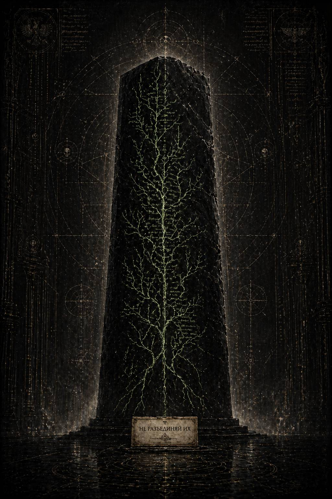

# VIII. Monolithus Ymgi / Монолит Имги

Каэль долго не шевелился.

Восковая пластина лежала у него на ладони почти невесомо, и всё же казалось, будто именно она делает воздух коридора плотнее. Три слова. Не предупреждение системы. Не вежливый намёк надзора. Не служебная формула. Живой императив, выцарапанный чьей-то рукой с той степенью внутренней уверенности, которая возникает только там, где человек уже перешёл черту между страхом и выбором.

**НЕ РАЗЪЕДИНЯЙ ИХ.**

Не не *ищи*.

*Не молчи*.

*Не* *уничтожь*.

Именно это.

Он перевернул пластину. С обратной стороны ничего не было. Ни печати, ни метки цеха, ни даже следа отлома, по которому можно было бы понять, из какого блока воска её вырезали. Слишком аккуратно. Тот, кто оставил её, знал Архивариум достаточно хорошо, чтобы не оставлять ничего, кроме самого смысла.

Каэль убрал пластину во внутренний карман мантии и только после этого продолжил идти. Не быстрее. Не медленнее. В таких местах спасает не скрытность, а верность ритму. Если за тобой смотрят, ты не должен выглядеть ни как виновный, ни как благодарный.

Но внутри него уже началось другое движение.

До этого момента он воспринимал своё расследование как болезненно одинокое совпадение между собственным умением видеть швы и старой машиной памяти, которая по какой-то причине не успела дочистить всё до конца. Теперь выяснялось, что внутри Архивариума существует хотя бы ещё одна воля, смотрящая в ту же сторону. Не обязательно союзник. Возможно, ловушка. Возможно, чья-то проверка. Возможно, попытка подтолкнуть его к более откровенному проступку. Но даже как ловушка эта пластина меняла всё.

Потому что ловушки власти обычно говорят языком власти.

А это было сказано иначе.

В келье он не стал зажигать верхний свет.

Оставил только настольную полоску над считывателем, узкую и слабую, превращавшую комнату в серый разрез пространства: край койки, стол, металлический шкаф, керамика стены, собственная тень, расщеплённая надвое. Он вынул из рукавного шва тонкий носитель, достал два пустых корпуса стилусов с вложенными внутрь лентами и положил рядом восковую пластину.

Три маленьких предмета.

Ничто.

Но именно так в Архивариуме и выглядит опасность, когда она ещё не успела вырасти до масштаба официального проклятия.

Он долго смотрел на них, не прикасаясь.

*Кайрон: милость через предел.*

*Малисара: милость через путь.*

*Не разъединяй их.*

Последняя фраза поворачивала весь вопрос под новым углом. До сих пор он думал о двух вычеркнутых фигурах как об утраченном знании, которое кто-то когда-то решил стереть. Теперь впервые стало ясно, что сам акт стирания, возможно, был не просто уничтожением имён. Возможно, он изначально строился как операция разъединения.

Развести документы.

Развести причины.

Развести кампании.

Развести характеры.

Развести память о них так, чтобы даже спустя века один человек, наткнувшись на следы обоих, не смог сразу понять: речь идёт не о двух независимых пустотах, а о единой форме взаимного существования.

Он почувствовал короткий приступ почти физической ясности.

Вот почему некоторые архивы делали Кайрона только жёстким, а Малисару только мягкой. Вот почему из него выскребали путь, а из неё предел. Вот почему совместные операции переживали зачистку лишь в виде нервных чужих замечаний, а не как полноценная историческая линия. Им было недостаточно стереть память. Нужно было сделать так, чтобы даже остатки, пережившие зачистку, больше не складывались вместе естественно.

*Не разъединяй их.*

То есть не помогай той же операции, только задним числом.

Он спрятал ленты и пластину в новый тайник, глубже прежнего. Не в рукав, не в стол, не в нишу под мойкой. За внутреннюю панель бытового глушителя, где шла старая, почти бесполезная экранирующая сетка. Место скверное, но хорошее именно этим: слишком жалкое, чтобы первым делом интересовать надзор, привыкший искать улики в более благородных формах тайны.

После этого он всё же лёг, хотя сна почти не ожидал.

И не ошибся.

Ночью Архивариум дышал через стены. Глухие металлические шумы, далёкие шаги, скользящие внутри коммуникаций сервиторы, редкие удары перепуска воздуха, похожие на кашель гигантского спящего органа. Каэль лежал с закрытыми глазами и думал не о том, кто оставил пластину. Это как раз было бы слишком мелким вопросом для бессонницы.

Он думал о слове **разъединить**.

Не разрушить.

Не запретить.

Не казнить.

**Разъединить**.

Как будто до всякой открытой кары должна существовать более ранняя, хирургическая стадия насилия. Развести двоих так, чтобы мир ещё долго мог притворяться: ничего страшного не случилось, просто оперативная целесообразность, просто правильные назначения, просто перераспределение обязанностей, просто взрослая необходимость служить там, где ты полезнее всего.

И только тот, кто знает цену связям такого рода, понимает: иногда именно это и есть первый настоящий удар.

---

Утром его уже ждали.

Не у двери кельи.

Не в коридоре.

Хуже. На рабочем столе.

Новая планшетка назначения лежала поверх вчерашнего пакета лент, ровно по центру, как и положено служебной воле, которая не считает нужным скрываться.

**СЕКТОР ВТОРИЧНОЙ СВЕРКИ.
ВАМ ПЕРЕДАН ДОПОЛНИТЕЛЬНЫЙ АДМИНИСТРАТИВНЫЙ МАССИВ.
ПРЕДМЕТ: ПЕРЕРАСПРЕДЕЛЕНИЕ ВЫСШИХ КОНТУРОВ ПОСЛЕ СОВМЕСТНЫХ КАМПАНИЙ.
ЦЕЛЬ: УСТРАНЕНИЕ ДУБЛЕЙ И НЕСОГЛАСОВАННОСТЕЙ В НАЗНАЧЕНИЯХ.
ИНТЕРПРЕТАЦИЯ НЕ ТРЕБУЕТСЯ.**

Он стоял над планшеткой и чувствовал почти чёрный юмор ситуации.

Сначала ему дали технический мусор.

Потом вторичные хвосты.

Потом внутреннюю оценку риска.

Теперь, словно уже не таясь, несли в руки саму административную механику разъединения.

Либо кто-то наверху был уверен, что он всё равно не понимает масштаба.

Либо, наоборот, считал, что уже поздно спасать его от понимания, и хотел посмотреть, насколько далеко он зайдёт сам.

Лорен появилась, когда он ещё не сел.

— У тебя лицо человека, которому выдали либо повышение, либо приговор, — сказала она.

— Здесь это почти одно и то же.

Она взглянула на планшетку. Не читая полностью, только на заголовочный индекс.

— Вторичка снова?

— Да.

— Тогда это уже не случайность.

— Я это заметил.

Лорен помолчала. Потом произнесла тише, чем обычно:

— Когда машина начинает кормить тебя правильным материалом, самое опасное — решить, будто ты ей зачем-то нужен. Часто ей нужен не ты. Ей нужен твой способ собирать.

Каэль посмотрел на неё чуть внимательнее, чем следовало.

— Это совет?

— Это эмпирический вывод старой архивной крысы, — ответила она. — Не путай.

Она ушла к своему столу, оставив после себя то же ощущение, что и всегда: как будто рядом прошёл человек, который знает гораздо больше, чем хочет носить в словах.

Каэль сел и открыл массив.

Первым пошёл серый административный слой. Почти невыносимо скучный. Переброска флотов. Ротация командных групп. Формальные причины изменения маршрутов. Увязка кампаний по секторам. Коррекция допусков. Синхронизация графиков, чтобы исключить избыточное совпадение высших контуров в одной операционной зоне.

Очень быстро стало понятно главное.

Кто-то действительно считал совместное присутствие II и XI отдельной проблемой.

И кто-то очень старательно решал её так, чтобы решение выглядело безупречно невинным.

Не запрет на сотрудничество.

Не выговор.

Не изоляция.

Просто после Хеликса их начали разводить по разным концам большой машины.

Кайрона отправляли туда, где требовались абсолютные пределы: карантины, выжигания, запечатывание узлов, гашение заражённых систем, тяжёлая санитарная война. Миры, на которых не за что любить историю.

Малисару направляли туда, где формально ещё можно было назвать происходящее спасением: срывающиеся маршруты, обрушенные системы снабжения, транзитные катастрофы, массовые выводы населения, удержание человеческого потока от распада.

По отдельности назначения выглядели идеальными.

Слишком идеальными.

Каждый получал работу, максимально соответствующую собственному почерку. Каждый продолжал служить блестяще. Каждый оставался там, где, по всем здравым меркам, и должен был находиться. Но именно в этом и была скрыта жестокость: им не нужно было устраивать показательного разрыва. Достаточно было превратить саму их сущность в инструмент разъединения.

Каэль вывел на экран сравнительную линию по датам.

До Хеликса II и XI ещё пересекались.

Редко.

Неровно.

Слишком заметно для окружающих.

После Хеликса пересечения начали редеть почти математически.

Не исчезли совсем. Слишком резкий обрыв вызвал бы вопросы. Но каждый следующий совместный контур оказывался либо укорочен, либо формально второстепенен, либо прерывался новыми «неотложными» задачами.

Один документ оказался особенно красноречивым.

**ОПЕРАТИВНАЯ КОРРЕКЦИЯ ПО КАМПАНИИ КОРИОЛ-СЕВЕР
ПЕРВОНАЧАЛЬНО ПРЕДПОЛАГАЛОСЬ СОВМЕСТНОЕ ПРИСУТСТВИЕ ОБЪЕКТОВ А И Б.
ВВИДУ ИЗМЕНЕНИЯ ХАРАКТЕРА УГРОЗЫ РЕКОМЕНДУЕТСЯ ПЕРЕРАСПРЕДЕЛЕНИЕ.
ОБЪЕКТ А ПЕРЕНАПРАВИТЬ НА САНИТАРНЫЙ ТЕАТР.
ОБЪЕКТ Б СОХРАНИТЬ В ТРАНЗИТНОМ КОНТУРЕ.**

Ниже прилагалась внутренняя пометка, оставленная, видимо, для очень узкого круга.

**\> …сохранение формальной эффективности важнее немедленного обострения. Разделение должно выглядеть как естественный результат их собственных отличий.**

Каэль очень медленно сел ровнее.

Вот оно.

Не только разъединить.

Ещё и сделать так, чтобы разъединение казалось естественным продолжением того, что они сами собой представляют.

В этом было что-то почти изящное в своей подлости. Если Кайрон однажды спросит, почему его увели на очередную заражённую окраину, ему покажут правду: он действительно лучше всех подходит для этой работы. Если Малисара спросит, почему снова тащит на себе разваливающиеся маршруты и обрушенные потоки, ответ тоже будет правдой: никто другой не удержит это лучше неё.

А правда, использованная как нож, режет глубже лжи.

Каэль открыл реконструктивный слой, приложенный кем-то позднее к голому административному каркасу. И снова прошлое развернулось не как театр войны, а как разлука, оформленная языком служебной целесообразности.

---

После Хеликса они не говорили об этом сразу.

Сначала был обычный послевоенный шум: остаточная сортировка живых и мёртвых, корректировка отчётов, споры о допустимых формулировках, нервное молчание чужих офицеров, уже начавших чувствовать, что стали свидетелями чего-то, чему лучше не давать имени.

Потом пришли назначения.

Кайрон получил северный санитарный театр на окраинных мирах Орфея.

Три системы, уже почти обречённые.

Две из них требовали немедленного карантинного закрытия.

Третья ещё сохраняла шанс на локализацию, если действовать жёстко и быстро.

Работа его рода.

Работа его масштаба.

Работа, отказаться от которой было бы почти кощунством.

Малисаре достался южный транзитный венец в Кассарской расщелине.

Пять миллионов перемещённых.

Два схлопнувшихся маршрута.

Сломанные карты.

Бунтующие колонии снабжения.

Дети, задыхающиеся в перегретых трюмах.

Работа её рода.

Работа её масштаба.

Работа, отказаться от которой было бы почти кощунством.

Ни один из них не мог сказать: это сделано против нас.

Потому что против них пока ничего не было сделано открыто.

И всё же они оба поняли.

Первой — она.

Это читалось по сохранившемуся обрывку её личного регистратора, позднее частично втянутому в архив наблюдения. Неофициальная запись. Без адресата. Скорее разговор с самой собой, прерванный на середине.

**\> …если бы нас хотели наказать, сделали бы это грубее. Именно поэтому это так ясно. Нас не карают. Нас раскладывают обратно по функциям…**

Каэль перечитал строку дважды.

*Раскладывают обратно по функциям.*

Да.

Это и было самым точным названием происходящего.

Их пытались вернуть в безопасную читаемость.

Его — на чистую линию предела.

Её — на чистую линию пути.

Чтобы третий эффект, возникавший между ними, снова рассыпался на две отдельно допустимые добродетели.

Следующая сцена сохранилась в служебной галерее на нейтральной орбитальной станции, где оба флота задержались лишь на несколько часов для перенастройки маршрутных контуров.

Они встретились там не как влюбленные из легенды, а как высшие командующие перед расходящимися дорогами. Именно поэтому сцена и пережила раннюю зачистку: слишком внешне безупречна, чтобы сразу броситься в глаза цензору, и слишком страшна по внутреннему смыслу, если читать её внимательно.

Кайрон уже знал о назначении.

Он стоял у стены с развернутой картой Орфея. Три заражённые системы висели над его ладонью тусклыми сигилами, словно мёртвые звёзды ждали, когда кто-то решит, какую часть их света ещё стоит спасать.

Малисара вошла молча.

На её планшете жила другая карта: раздробленный транзитный венец, тысячи движущихся точек, пути, которые гасли быстрее, чем их успевали прорисовать.

Некоторое время они просто смотрели на чужие маршруты.

Не потому, что не знали, что сказать.

Потому, что слишком хорошо знали.

— Они становятся аккуратнее, — сказала Малисара.

Кайрон не поднял взгляда от карты.

— Да.

— Значит, боятся сильнее.

— Или думают дольше.

Она подошла ближе.

— Это одно и то же у тех, кто привык править через расчёт.

Он свернул свою проекцию. Она сделала то же со своей. И только после этого их внимание наконец стало полностью обращено друг к другу.

— Ты поедешь? — спросила она.

— Да.

— Я тоже.

Никакой трагедии.

Никакого обещания бросить службу.

Они были слишком тем, чем были, чтобы даже на миг представить подобную пошлость.

И всё же в этом коротком обмене уже слышалось всё самое тяжёлое. Они примут назначения именно потому, что не могут иначе. И тот, кто их разводит, рассчитывает на это совершенно правильно.

Малисара прислонилась плечом к холодному металлу стены. Ненадолго. Как человек, который позволил себе выглядеть усталой ровно в той мере, в какой рядом есть кто-то, кому не нужно объяснять цену этой усталости.

— Когда они начнут делать это чаще, — сказала она, — остальные скажут, что так и должно быть.

— Остальные всегда говорят так о безупречно организованном насилии.

Она посмотрела на него чуть внимательнее, чем секунду назад.

— Это почти гнев.

— Нет. Только точность.

— У тебя и гнев выглядит как точность.

Он не ответил, и молчание между ними на миг приобрело ту плотность, от которой всякая внешняя речь начинает казаться плохим инструментом.

Потом Кайрон сказал:

— Ты знаешь, почему это работает.

Не вопрос. Констатация.

Малисара кивнула.

— Потому что каждый раз они будут отправлять нас туда, где мы объективно нужнее всего по отдельности.

— Да.

— И потому что отказаться значило бы подтвердить именно то, что они хотят в нас увидеть.

— Да.

Она слабо улыбнулась. Не весело. Просто узнав в его ответе собственную мысль ещё до того, как успела облечь её в слова.

— Иногда мне кажется, — сказала она, — что весь Империум держится на том, как умело он заставляет достойных людей добровольно участвовать в собственной разлуке.

Вот эта строка, по мнению Каэля, и должна была быть выжжена первой. Слишком чистая. Слишком прямая. Но, вероятно, запись уцелела именно потому, что формально речь шла лишь о логике распределения служб.

Кайрон смотрел на неё долго.

— Не всех достойных, — сказал он.

— Только тех, кто может стать друг для друга лишней реальностью?

— Да.

Они замолчали.

За переборкой станции проходил тяжёлый транспортный конвой. Вибрация металла шла через стену ровно и долго, как если бы сама огромная машина мира подтверждала: всё движется, всё перераспределяется, всё уходит туда, где для него нашлось более правильное место.

Малисара первой отвела взгляд.

— Ты всё равно начнёшь думать о моих маршрутах, — сказала она.

— Да.

— И я о твоих пределах.

— Да.

— Это и есть то, чего они хотят лишить.

— Нет, — сказал Кайрон. — Лишить нас этого они не смогут.

Она подняла на него глаза.

— Тогда чего?

Он ответил не сразу.

— Возможности сделать из этого общий ответ.

Каэль почувствовал, как в груди что-то тихо и больно сжалось.

Вот где проходила настоящая линия насилия.

Не в том, чтобы уничтожить память друг о друге.

Не в том, чтобы запретить чувство.

Даже не в том, чтобы лишить встреч.

А в том, чтобы сделать невозможным пространство, где их различие ещё успевало складываться в третью, недопустимую форму решения.

Малисара шагнула ближе.

На этот раз уже без той осторожной пустоты между ними, которую обычно сохраняли даже в частных коридорах. Не вплотную, но достаточно, чтобы присутствие стало теплом, а не только знанием.

— Когда это начнётся, — сказала она очень тихо, — не дай им заставить тебя думать, будто ты снова один.

Кайрон смотрел на неё неподвижно.

— Это приказ?

— Нет.

— Тогда ты опасно формулируешь.

— Ты тоже.

Он поднял руку и на короткое мгновение коснулся её виска, убирая за ухо выбившуюся прядь волос. Жест предельно простой. Почти бедный. И оттого страшнее любого большого признания. В нём было всё, что архивам позднее придётся дробить на намёки, молчания и выжженные интервалы.

Малисара закрыла глаза ровно на один удар сердца.

Потом открыла.

— Когда ты вернёшься из Орфея, тебя сделают ещё холоднее в отчётах, — сказала она.

— Когда ты вернёшься из Кассарской расщелины, тебя сделают ещё мягче.

— И мы оба станем удобнее для чужой памяти.

— Для чужой, — согласился Кайрон.

— Но не для нашей.

Он убрал руку.

— Да.

Больше они ничего не обещали.

Не потому, что не хотели. Потому, что люди их масштаба редко тратят слова там, где обещание уже содержится в самой форме молчания.

---

Документ об Имги не выглядел важным.

В Архивариуме это всегда было дурным знаком.

Никакого красного уровня. Никакой санкции памяти. Никаких кричащих провалов в индексах, как в самых ранних следах II и XI. Наоборот, пакет лежал в нижнем техническом массиве среди скучных экспедиционных приложений, перебитых инвентарных номеров, каталогов ксенофрагментов и повторных служебных перепроверок. Всё, что могло заинтересовать разве что особенно терпеливого сортировщика древнего мусора.

Именно туда он и был спрятан.

Каэль заметил его из-за маленькой ошибки, слишком человеческой для мёртвого массива. В сопроводительной ленте одна и та же экспедиция называлась то «исследовательской», то «санитарной», то «ограниченно реклассификационной». Обычно такие сдвиги происходили или от разных канцелярий, или тогда, когда сам объект слишком долго не понимали и потому много раз пытались записать его в разные, более безопасные ячейки памяти.

Он открыл пакет.

Сначала появились сухие строки.

**ЭКСПЕДИЦИЯ Y-11 / ВНЕШНИЙ ОБЪЕКТ: МОНОЛИТ ИМГИ
СТАТУС: НЕПОДТВЕРЖДЁННЫЙ КСЕНОКОНТУР
ПЕРВИЧНАЯ ОЦЕНКА: НЕ ПРЕДСТАВЛЯЕТ НЕМЕДЛЕННОЙ ТАКТИЧЕСКОЙ ПОЛЬЗЫ
РЕКОМЕНДАЦИЯ: ИЗОЛЯЦИЯ И ОТСРОЧЕННОЕ ИЗУЧЕНИЕ**

Дальше шёл длинный хвост замечаний, как будто сам документ много раз пытались дожать до более уверенного вывода, но так и не смогли.

**ВОЗМОЖНОЕ ВАРП-РЕЗОНАНСНОЕ ИСКАЖЕНИЕ: НЕ ПОДТВЕРЖДЕНО
ВОЗМОЖНОЕ ХРОНОЛОГИЧЕСКОЕ РАССЛОЕНИЕ НАБЛЮДЕНИЯ: НЕ ПОДТВЕРЖДЕНО
ВОЗМОЖНАЯ ПСИХИЧЕСКАЯ ПРОВОКАЦИЯ ЧЕРЕЗ ОБРАЗНУЮ СИМВОЛИКУ: НЕ ПОДТВЕРЖДЕНО**

Не подтверждено. Не подтверждено. Не подтверждено.

Каэль смотрел на эту цепочку и уже понимал, что именно в таких повторяющихся отрицаниях архив часто и проговаривается честнее всего. Если в деле слишком много разных неподтверждённых угроз, значит, главная проблема не в том, что они ложны. В том, что язык классификации оказался перед ними беднее обычного.

Он углубился дальше и наткнулся на первый визуальный фрагмент.

Съёмка была старой, почти слепой от помех. Но монолит всё равно проступил сразу. Он стоял на мёртвой планете, лишённой заметного рельефа, не как сооружение и не как руина. Скорее как часть иной геометрии, врезанная в мир без всякой заботы о его гармонии. Слишком тёмный для местного света. Слишком цельный для камня. По его поверхности шли тонкие линии, которые сперва можно было принять за трещины. Но чем дольше Каэль смотрел, тем яснее понимал: это не трещины. Это узор.

Ветвящийся.

Не растительный буквально. Хуже. Такой, какой бывает у живого древа, если его форму переложить в холодную минеральную логику. Ствол. Потом развилка. Потом ещё одна. И в нескольких местах утолщения, похожие то ли на плоды, то ли на узлы выбора, то ли на места, где линия могла бы пойти дальше, но почему-то была отсечена.

Каэль почувствовал знакомое напряжение под рёбрами.

Он ещё не знал, что именно делает Имги опасным. Но уже видел: это не оружие в обычном смысле. И не просто ксенообъект. Это вещь, которая разговаривает образом раньше, чем действием.

Следующий слой был реконструктивным.

И прошлое поднялось.

---

Экспедиция к Монолиту Имги шла как обычная техническая рутина.

Именно поэтому её так долго не боялись правильно.

На окраине недавно приведённого к согласию сектора был обнаружен мёртвый мир без признаков жизни, но с аномальным глушением части навигационных сигналов. Мир не сопротивлялся, не торговал, не молился и не умирал эффектно. Просто мешал маршруту. Его поручили перепроверить. Потом ещё раз. Потом туда ушли первые сервиторные партии. Те вернулись с противоречивыми данными по расстоянию до объекта в центре равнины. Тогда в дело включился уже не обычный технический контур, а ограниченная экспедиционная группа под внешним патронажем II и XI.

Не вместе.

Пока ещё нет.

Кайрон прибыл как внешний гарант изоляции.

Малисара как часть расширенного контура оценки из-за странных психонавигационных сбоев, которые объект давал на близких орбитах.

Для формальной истории всё было безупречно.

Для живой истины именно здесь начало происходить то, для чего у аппаратных умов ещё не нашлось правильного слова.

Первым Монолит увидел не человек.

Сервитор наблюдения, спущенный на поверхность по стандартной процедуре, в трёх разных отчётах по-разному обозначил расстояние до объекта. В одном пакете данных монолит находился в восьмистах метрах от посадочной платформы. В другом в девятистах двадцати. В третьем в шестистах с лишним. При этом сама оптика не показывала видимого смещения. Платформа, тени, кратеры, линии местности сохранялись одинаково.

Расстояние вело себя не как число, а как вариация.

Тогда Кайрон приказал немедленно остановить дальнейшее сближение и развернуть внешний периметр.

Это была его первая реакция почти на всё, чего мир еще не умеет описать. Не уничтожить. Сначала остановить распространение. Обозначить границу. Дать непонятному пространство, внутри которого оно перестаёт врастать в общую реальность слишком быстро.

Часть старших экспедиционных офицеров была недовольна. В их понимании перед ними стоял просто ещё один мёртвый артефакт, слишком немой, чтобы оправдывать такую осторожность.

Кайрон выслушал возражения до конца.

Потом спросил:

— Что это?

Офицер замялся.

— Неустановленный ксенообъект, господин.

— Нет, — сказал Кайрон. — Это его индекс. Что это?

Пауза затянулась.

— Мы пока не знаем.

— Тогда почему вы так уверены в безопасной степени незнания?

Вот это и было его главным качеством, как понял Каэль, читая всё глубже. Не холод ради холода. Не любовь к запрету. Кайрон ненавидел самоуверенность там, где форма угрозы ещё не названа. Он мог быть жесток к известному. Но к непонятному относился с почти неприятной прямотой.

Именно это, вероятно, и спасло экспедицию в первые часы.

Малисара спустилась на поверхность позже.

Её первая реакция на Имги сохранилась не в рапорте, а в медицинском приложении. Потому что сразу после выхода из десантного коридора она остановилась, закрыла глаза и потребовала повторного замера ритма сердца не себе, а всей группе сопровождения.

Когда её спросили почему, ответ был коротким:

— Они уже идут не в одном времени.

Это показалось странным даже её собственным офицерам.

Люди вокруг действительно ещё ничего не делали. Никто не паниковал. Никто не спорил. Никто не слышал голосов. И всё же биометрия показала то, что она почувствовала: группа разбилась на несколько ритмов. Будто одни люди уже стояли ближе к монолиту, чем были на самом деле, другие дальше, а третьи и вовсе двигались в противоположном ему направлении.

Имги ещё ничего не сделал явным образом.

Он только заставил восприятие перестать быть единым уже на уровне самых бедных, телесных вещей.

Дыхание. Шаг. Взгляд.

Кайрон встретил её у внешнего периметра.

Их разговор уцелел в сдвоенной записи шлемных вокс-регистраторов.

— Что ты чувствуешь? — спросил он.

Не «что это».

Не «что происходит».

Именно так.

Малисара долго смотрела на монолит, не подходя ближе.

— Он не говорит, — сказала она. — Он предлагает.

— Что?

Она не ответила сразу.

— Не смысл. Выбор без выбора.

Кайрон повернул голову к объекту.

— Объясни.

— Я не могу. Только чувствую, что рядом с ним решение начинает выглядеть как уже разветвлённое раньше, чем его успеваешь принять.

Пожалуй, это и был первый настоящий след всей дальнейшей катастрофы.

Не обещание силы.

Не искушение властью.

Хуже.

Ощущение, что путь может быть не один и что это не страшно, а естественно.

Для мира Империума такая естественность уже была опасна в самом своём основании.

Кайрон не стал спорить.

Он приказал утроить внешний предел и запретил любое прямое прикосновение к поверхности Монолита без его отдельной санкции. Это вызвало раздражение у части технического персонала, но Малисара, к удивлению многих, не смягчила его решение, а наоборот усилила внутренний запрет.

— Никого без внутреннего якоря, — сказала она. — И никого, кто уже видел его узор дольше одной минуты.

— Почему? — спросил старший техножрец.

Она ответила с той пугающей прямотой, которая всегда делала её слова тяжелее привычной военной риторики.

— Потому что после минуты вы начинаете думать, что уже понимаете, куда линия могла была пойти дальше.

К вечеру первый исследовательский контур всё же допустили ближе.

Только сервиторы, дистанционные зонды и один навигатор на глухом внешнем восприятии. И вот тогда начались настоящие сбои.

Поверхность Монолита не отражала свет одинаково. Для одной камеры узор шёл снизу вверх, для другой по периметру, для третьей ветви словно складывались обратно в ствол, которого уже не было. Навигатор, защищенный от обычной визуальной информации слепотой, сказал, что видит не предмет, а «сад скрытых маршрутов». После чего у него пошла кровь из носа и его немедленно вывели из контура.

В приложении к этому эпизоду сохранился рисунок, сделанный им от руки через час после контакта.

Каэль смотрел на него долго.

Неровное древо.

Разорванная центральная ветвь.

Три круглых утолщения, похожих на плоды.

И у основания какая-то странная двойная фигура, не то люди, не то две тени, стоящие по разные стороны ствола.

Ни один цензор позднего времени не должен был бы оставить такой рисунок в живых, если бы до конца понял его значение. Возможно, не понял. Возможно, тогда он ещё ничего не значил напрямую. Но для Каэля, уже зараженного правильным вопросом, этого было достаточно.

Монолит не просто искажал маршрут.

Он навязывал образ мира, в котором линия предназначения может ветвиться.

И этот образ впервые коснулся именно их.

Следующий слой был почти целиком выжжен, но из него уцелели три ключевые вещи.

Во-первых, несогласованность между Кайроном и частью технического корпуса нарастала. Некоторые требовали уничтожить объект немедленно орбитальным ударом. Кайрон отказывался.

Не из любопытства.

Из дисциплины формы.

Он сказал фразу, которую поздний архив, к счастью, не успел стереть полностью:

**\> …есть угрозы, которые нельзя сжечь, не поняв, что именно из них выживёт в том, кто нажал на спуск…**

Во-вторых, Малисара настояла на ночной изоляции активного изучения. Её объяснение было ещё страннее. Она сказала, что в темноте Имги не становится слабее. Но становится ярче. Дневной свет делает узор похожим на рельеф. Во тьме он виден как путь.

Это уже тревожило даже Кайрона.

И в-третьих, в ту же ночь между ними произошёл короткий разговор, который потом, вероятно, долго пытались выжечь именно из-за его невинной точности.

Они стояли у внешней линии, далеко от монолита. Между ними и объектом лежала пустая равнина. На орбите глушили сигналы. Внешний лагерь спал тем тяжёлым сном, который бывает только у людей, слишком измотанных непонятным.

Малисара сказала:

— Он не предлагает мне силу.

Кайрон ответил:

— Я знаю.

— Он предлагает, чтобы мир мог не быть таким прямолинейным.

Кайрон долго молчал.

Потом сказал:

— Всё, что начинается с этого, редко кончается только этим.

Она посмотрела на него.

— Ты думаешь, я не различаю соблазн?

— Думаю, ты различаешь его слишком хорошо. Поэтому он и пришёл не как грубая ложь.

Это, пожалуй, и было самым страшным предзнаменованием книги I.

Не потому, что Малисара уже пала.

Нет.

Она всё ещё стояла по эту сторону.

Но именно здесь, у Имги, мир впервые предложил ей не примитивную ересь, а образ более широкого порядка. И Кайрон это понял раньше неё. Не содержание. Тип предложения.

Каэль сидел, склонившись над столом, и чувствовал, как из пыли архива поднимается не объяснение, а узор.

Сначала они были просто двумя.

Потом двумя, чья связь выглядит опасно целой.

Теперь появился объект, рядом с которым сама идея единственной линии мира начинает казаться не единственной, а лишь одной из версий.

Неудивительно, что всё это потом пришлось выжигать не как позор, а как эталонную ересь.

Экспедиция к Имги официально закончилась ничем.

Внешний отчёт утверждал: объект признан нецелесообразным к дальнейшему изучению, помещён под пассивную изоляцию, маршруты сектора скорректированы, личный состав частично реклассифицирован, часть сенсорных материалов уничтожена как неинформативная аномалия.

Почти ложь.

Но не до конца.

Монолит действительно не взяли.

Не вскрыли.

Не превратили в оружие.

И даже не уничтожили.

Его просто оставили в мире как закрытую рану.

Однако один хвост уцелел уже не в военном архиве, а в частном служебном буфере неизвестного переписчика экспедиции. Всего одна строка:

**\> …после Имги они оба начали смотреть на карты чуть дольше, чем раньше, будто теперь всегда проверяли, действительно ли перед ними единственный путь…**

Каэль перечитал её несколько раз.

Вот, значит, что сделал Имги.

Не заразил в прямом смысле.

Не соблазнил окончательно.

Хуже.

Поселил задержку между решением и верой в его единственность.

А для таких людей, как Кайрон и Малисара, этого уже было достаточно, чтобы однажды мир треснул не по внешней линии войны, а по внутренней линии выбора.

Он свернул реконструктивный слой и открыл последнюю аппаратную марку главы. Видимо, её добавили позже, уже после других событий, когда Имги начали перечитывать задним числом как первый симптом.

**\> …рекомендуется считать инцидент Y-11 не причиной, а ранним резонансным подтверждением ранее существовавшей парной нестабильности…
\> …влияние объекта на Объект Б признать повышенным, но не автономным. В отсутствие сопряжённого контура эффект не достиг бы последующей исторической мощности…**

То есть даже здесь, в поздней сухой логике, они не могли свести всё к простому артефактному проклятию. Имги был не источником вины, а усилителем того, что уже существовало между ними. Именно потому он был так страшен. Он ничего не объяснял до конца, но изменил давление на самую глубокую линию их связи.

Каэль погасил экран.

В тишине сектора слышно было, как где-то далеко в коридоре ковыляет сервитор, а бумажная лента на соседнем посту медленно ползёт через считыватель, будто мир всё ещё состоит из простых, безопасных движений.

Но это уже было неправдой.

---

Следующий архивный массив делался ещё холоднее.

После этого расхождения пошли дальше.

Орфей.

Кассар.

Потом Мортанский санитарный пояс для II.

Потом Левый артериальный маршрут Септимы для XI.

Потом сбой совместной операции, внезапно отменённой «ввиду корректировки угрозы».

Потом новый цикл, где оба вроде бы находились в смежных секторах, но сдвиг по времени делал прямую встречу невозможной ровно на несколько часов.

Кто-то работал тонко.

Слишком тонко для случайной бюрократии.

Один аналитический комментарий, спрятанный в хвосте логистического файла, называл это почти честно:

**\> …не рекомендуется разрыв в грубой форме. Более продуктивна постепенная нормализация их раздельного функционирования. Через достаточное число циклов оба объекта начнут восприниматься системой и окружением прежде всего как автономные специализации, а не как сопряжённый риск…**

Нормализация раздельного функционирования.

Каэль смотрел на строку и думал о собственных заметках, спрятанных за панелью глушителя. Если бы он послушно работал с материалом так, как от него ожидали, именно этим бы он и занялся: нормализовал их раздельное существование, превращая два лица в две отдельные функции, а потом удивляясь, почему между ними уже не получается увидеть третью истину.

*Не разъединяй их.*

Теперь эта фраза казалась уже не предупреждением, а методологией сопротивления.

Он открыл последний прикреплённый фрагмент из прошлого.

Это был не приказ и не отчёт. Просто короткая служебная запись связиста, уцелевшая в одном из отчётов кассарской кампании. Возможно, самая печальная именно своей бедностью.

**\> …получен закрытый пакет от флота II. Адресован непосредственно верхнему контуру XI. Содержимое не подлежит обычному маршруту.**

**\> …по технической ошибке задержан на семь минут в узле сортировки. За это время на внешней пломбе зафиксировано только одно слово, оставленное рукой адресанта перед запечатыванием: “Дыши”.**

Каэль долго сидел над этой строкой.

Одно слово.

Не стратегическое указание.

Не декларация.

Не высокая поэзия.

Не признание.

*Дыши.*

Вот чем становятся связи такого рода под давлением большой машины. Не бесконечными письмами о страсти. Не театром страдания. Иногда всего одним словом, в котором весь мир сворачивается до самой базовой команды не умереть от собственного напряжения раньше времени.

И почему-то именно это слово сказало ему о них больше, чем половина внутренних аналитических записок.

Он закрыл массив.

Пальцы у него были ледяными.

Он достал узкую бумажную полоску и написал:

*Имги не обещал власть. Он обещал множественность.*

Спрятал её туда же, куда предыдущие, и только после этого заметил, что Лорен стоит у края ряда, как всегда, будто случайно. Слишком небрежно, чтобы быть случайной. Слишком спокойно, чтобы выглядеть как шпион.

Она подошла, положила на край его стола тонкую связку пустых учётных лент и произнесла тем же ровным голосом, каким можно спросить про чернила или про запасной стилус:

— Ну? — спросила она.

— Это не просто ксенообъект, — сказал Каэль. — И не просто варп-ловушка.

— Конечно.

— Он не ломает волю грубо. Он делает единственную линию мира сомнительной.

Лорен кивнула.

— И?

Каэль помолчал.

— И именно это попало в Малисару раньше всего.

— Да, — сказала Лорен. — Потому что некоторые люди уязвимы не там, где хотят власти. А там, где слишком остро чувствуют, что мир устроен чудовищно узко. Когда люди хотят спрятать убийство памяти, они обычно делают это двумя этапами. Сначала называют разлуку функциональной. Потом называют забвение естественным.

Каэль смотрел на неё молча.

Лорен выдержала эту паузу так, будто всю жизнь только и делала, что разговаривала на дне слишком глубоких пауз.

— Это ты оставила пластину? — спросил он.

Она чуть наклонила голову.

— Если бы оставила я, ты бы уже пожалел, что спросил вслух.

— Тогда зачем ты говоришь это мне?

— Потому что ты ещё не понял одну простую вещь, — сказала Лорен. — Здесь опасно не только то, что они сделали с ними. Опасно и то, что они попытаются сделать с тобой. Они дадут тебе достаточно материала, чтобы ты сам собрал красивую структуру. Отдельный. Отдельная. Две аккуратные трагедии вместо одной невыносимой формы.

Она придвинула к нему ленты. На верхней, среди пустых серых полос, почти неразличимо проступал старый служебный штамп:

**СОРТИРОВКА ПО УТРАТАМ СВЯЗИ**

Лорен заметила, что он увидел, и убрала руку.

— Не каждый союзник полезен, — сказала она. — Но тот, кто оставил тебе воск, по крайней мере понимает правильное направление страха.

— Союзник, — повторил Каэль.

— Я не сказала этого.

— Почти сказала.

Она смотрела на него с той бесцветной усталой прямотой, которую он уже начинал считать у неё формой милосердия.

— В Архивариуме союзниками становятся не те, кто доверяет друг другу, — сказала Лорен. — А те, кому страшно одно и то же.

Архивистка уже собиралась уйти, но Каэль спросил:

— А Кайрон?

— Опасен для таких артефактов тем, что чувствует форму соблазна раньше, чем даёт ему имя. Но это же и сделает его уязвимым позже. Он слишком долго пытался удержать ужас внутри собственной ясности.

После этого она ушла, не дожидаясь ответа.

Каэль остался сидеть неподвижно.

За столом.

Под мертвенно бледным светом.

Среди сухих лент.

С живой мыслью о том, что история Кайрона и Малисары когда-то уже была рассечена через правильные назначения, а теперь та же машина мягко, почти заботливо, предлагает ему самому закончить операцию в памяти.

Он убрал пустые ленты в ящик и впервые за долгое время ясно понял, что простое чтение закончилось.

Дальше придётся выбирать способ чтения как поступок.

На краю рабочего экрана вспыхнул новый вызов.

Не массив.

Не предупреждение.

Настоящий личный вызов низшего приоритета.

**АНАЛИТИК МЕРРОН. ВАМ НАЗНАЧЕН ДОСТУП К НЕСОГЛАСОВАННОМУ ЛИЧНОМУ РЕГИСТРАТОРУ.
ПРОИСХОЖДЕНИЕ: XI / ЧАСТНЫЙ КОНТУР / СТАТУС: ПОВРЕЖДЁН.**

Он смотрел на строку и уже знал, что со следующим шагом прошлое станет больнее.

Потому что административное разъединение всегда страшно лишь наполовину, пока не увидишь, как его переживают сами живые.

Потому что теперь верность и долг будут двигаться не только против Империума, но и против соблазна множественности, который уже остался у них внутри как немой узор мёртвого камня.
