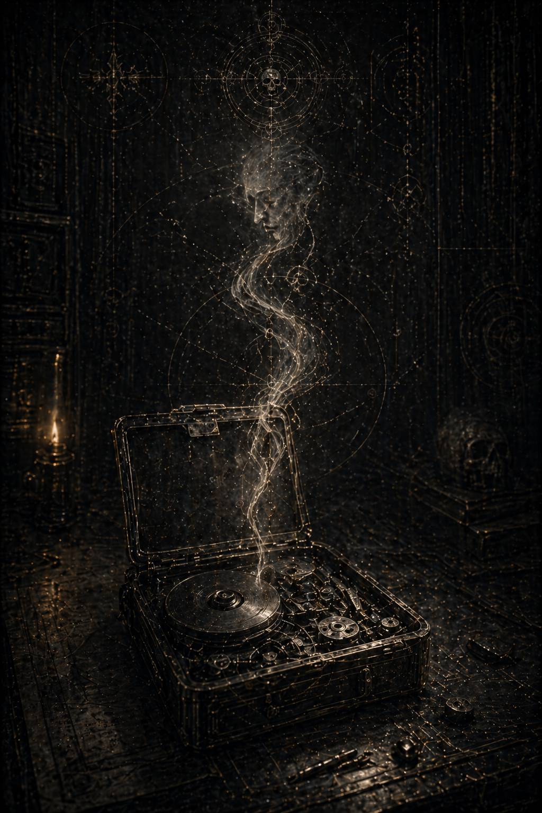

# IX. Respira / Дыши

Несогласованный личный регистратор открылся не как файл.

Сначала система долго делала вид, что сомневается в самом его существовании. Проверяла сигнатуру. Сверяла остаточные метки. Предупреждала о повреждённости носителя, о возможности вторичных наложений, о частичных совпадениях с уже известными административными массивами. Потом сообщила, что происхождение регистратора не подтверждено окончательно, хотя внутренние хвосты указывают на частный контур XI. И только после этого над столом Каэля проступила тонкая белая полоса с почти оскорбительно нейтральной надписью:

**ЛИЧНЫЙ РЕГИСТРАТОР.
ОБЪЕКТ: НЕ УСТАНОВЛЕН.
СТАТУС: НЕСОГЛАСОВАН.
РЕКОМЕНДАЦИЯ: ИСПОЛЬЗОВАТЬ ТОЛЬКО ДЛЯ ВЕРИФИКАЦИИ СЛУЖЕБНЫХ ХВОСТОВ.**

То есть, разумеется, не читать как живое.

Не слушать голос.

Не допускать внутреннего присутствия.

Не превращать уцелевший частный остаток в человека.

Каэль открыл запись.

Сначала пошёл шум.

Долгий, тёплый, почти телесный треск старого носителя, будто сама память с усилием проталкивала себя сквозь столетия последующей зачистки. Потом возникло изображение. Нечёткое. Сбитое по цвету. Странно тёмное по краям. Но постепенно кадр выровнялся, и он увидел не зал совещаний, не карту и не операционный мостик.

Узкую каюту.

Не роскошную. Не аскетично священную. Просто служебное пространство высокого ранга: стол, встроенный в стену; мягко светящийся маршрутный экран; две полки с пломбированными контейнерами; тонкая металлическая чаша с остывшим рекафом; на спинке кресла — тёмная мантия, брошенная небрежнее, чем это допустил бы любой посторонний взгляд. В каюте не было никого несколько секунд. Потом дверь открылась, и вошла Малисара.

Не в полном доспехе.

Вот что ударило Каэля первым.

Ни один официальный архив не показал бы её такой. Без шлема, без плаща, без того дополнительного слоя легенды, которым Империум всегда покрывает своих полубогов даже в бытовых документах. На ней была только тёмная внутренняя броневая основа и лёгкий высокий гамбезон, расстёгнутый чуть ниже нормы, как бывает у людей, которые слишком устали, чтобы помнить о собственной безупречности в каждой детали.

Она закрыла дверь, опустила ладонь на панель глушения и только после этого позволила плечам едва заметно опуститься.

Вот тут Каэль впервые понял, какой была усталость Малисары на самом деле.

Не театральной.

Не эстетичной.

Не даже героической.

Это была усталость человека, который слишком долго держал собой чужое движение и теперь на несколько минут оказался в месте, где не нужно ничего удерживать.

Она села к столу не сразу. Сначала подошла к маршрутному экрану, проверила один из контуров, изменила пару меток, потом прислонилась пальцами к краю панели и несколько секунд стояла с закрытыми глазами. Только после этого начала говорить, и голос её в частной записи звучал иначе, чем в реконструированных докладах.

Тише.

Глубже.

Без внешнего слоя, рассчитанного на то, чтобы люди рядом не рассыпались раньше времени.

— Частный контур, — сказала она. — Запись без отправки. Для выравнивания мысли.

Пауза.

— День четвёртый. Кассарская расщелина держится хуже, чем показывают общие карты. Грузовые линии лгут. Астропаты лгут не по своей воле, а из-за усталости. Административные оценки лгут по привычке. Путь существует, но только если считать его живым существом, а не схемой.

Она замолчала и провела ладонью по лицу.

Жест короткий, почти раздражённый. Не изящный. Не тот, который оставляют в памятных хрониках.

— Они снова отправили меня туда, где надо удерживать то, что не должно удерживаться, — сказала она. — Формально это честь. Практически — очень аккуратная форма изгнания.

Каэль почувствовал, как внутри него что-то тихо сжалось.

Вот, значит, как она называла это сама.

Не разлукой.

Не наказанием.

Изгнанием, замаскированным под доверие.

Изображение дрогнуло. На секунду помеха разрезала кадр, потом стабилизировалась.

Малисара взяла металлическую кружку с рекафом, отпила и почти сразу поставила обратно с выражением лёгкого отвращения, настолько человеческим, что Каэль невольно моргнул. Всё, что в больших архивах становилось стилем, здесь было языком тела. Тела, которое устало, сердится на дурной напиток, не хочет садиться и всё же садится, потому что иначе мысли начинают двигаться слишком неровно.

— Я думала, — произнесла она после долгой паузы, — что привыкну к правильным назначениям быстрее. Не привыкла.

Её взгляд скользнул мимо регистрационного объектива, будто не в сторону стены, а дальше, к чему-то отсутствующему.

— Самое подлое в их аккуратности не то, что они нас развели по разные стороны вселенной. А то, что каждый раз я вынуждена соглашаться с ними по существу. Здесь действительно нужен мой легион. И там действительно был нужен его.

Она слабо усмехнулась. Не весело.

— Если когда-нибудь кто-то будет нас судить, пусть хотя бы поймёт: нас не ломали ложью. Нас ломали правдой, которой придали нужную форму.

Запись оборвалась на шуме внешнего вызова. На несколько секунд пошли полосы помех, затем регистратор переключился на другой отрезок.

Теперь Малисара была уже на переходной палубе.

Кассарская расщелина проступила не картой, а физическим адом движения. Длинный отсек, уходящий в полутьму. Люди. Тысячи. Может быть, десятки тысяч в одном только обозримом слое. Перегретый воздух. Тяжёлый блеск конденсата на перилах. Носилки. Дети в страховочных сетках. Бойцы XI, стоящие не как караул, а как живая геометрия ритма. По всему кадру шло ощущение того особого напряжения, в котором паника ещё не случилась, но уже от стоит в нескольких шагах.

Камера дрогнула. Видимо, регистратор был закреплён на внутреннем нагрудном контуре и писал без прямого намерения документировать сцену. Поэтому всё выглядело особенно правдиво: не как красивое воспоминание, а как усталое дыхание человека внутри собственной работы.

— Медицинскую волну вперёд на девятнадцать секунд, — сказала Малисара кому-то вне кадра. — Старших детей не смешивать с ранеными. Кто снова поставил их рядом?

Чей-то голос ответил слишком тихо.

— Не объясняй. Разведи.

Она двигалась вдоль потока быстро, но без той ускоренной жёсткости, которая передаётся толпе как команда к бегству. Один раз остановилась, сама поправила ремень носилок на старике, который уже почти не чувствовали пальцы санитаров. В другой точке присела перед ребёнком, слишком долго молчавшим в общем гуле.

— Как тебя зовут?

Ответа не было.

— Хорошо. Тогда просто иди на свет третьего ребра. Видишь его?

Мальчик кивнул.

— Только на него. Не на боковые. Боковые лгут.

Снова движение. Снова команды. Снова та страшная форма заботы, в которой нет ни капли мягкой сентиментальности, зато есть безупречное знание, как именно живое ломается на ходу.

Запись перескочила ещё раз.

Теперь каюта была темнее. Свет только от маршрутного экрана и служебной лампы над столом. Малисара стояла, опираясь обеими ладонями о край панели. На экране двигались линии переходов. Некоторые гасли прямо в процессе расчёта.

— День пятый, — сказала она. — Я начинаю понимать, почему Кайрон иногда смотрит на карту так, будто она уже чья-то рана, а не задача.

Она улыбнулась уголком рта, и эта улыбка была настолько усталой, что от неё становилось больнее, чем от слёз.

— Это, вероятно, плохой признак.

Долгая пауза.

— Сегодня мне трижды предлагали закрыть внешний поток и признать оставшихся допустимой потерей. Все три раза формально были правы. Все три раза я отказалась. Ещё не потому, что верю в чудо. Пока ещё потому, что путь держится.

Она подняла голову.

— Вот как это начинается. Не падение. Не ересь. Просто день за днём ты привыкаешь говорить: «ещё немного», хотя каждый расчёт вокруг тебя уже предпочёл бы ясную жестокость неопределённой надежде.

На этих словах кадр снова пошёл полосами, затем внезапно сменился белым экраном внутренней почты.

Каэль подался вперёд сам того не заметив.

На белом фоне висел запечатанный пакет. Источник был частично выжжен, но не узнать его уже было невозможно даже по стилю оформления. Короткий, почти сухой боевой формат. Закрытый контур II. На пломбе, в том самом поле, о котором писал связист, действительно было одно слово.

**ДЫШИ.**

Малисара несколько секунд просто смотрела на пакет.

Не открывала.

Не улыбалась.

Не касалась.

Потом очень медленно села.

Рука её задержалась над печатью ровно настолько, чтобы Каэль понял: дело не в нетерпении и не в сентиментальной слабости. Просто иногда человеку страшно открыть даже одно слово, если оно пришло из той части мира, где его видят по-настоящему.

Она распечатала пакет.

Содержимое уцелело не полностью. Архив дал не цельный текст, а обломки строк, между которыми зияли выжженные пробелы. Но даже эти осколки держались так плотно, что их было достаточно.

**\> …Орфей закрыт на три контура. Третья система потеряна раньше расчётов.**

**\> …не пытайся держать маршрут там, где уже исчезла форма движения.**

**\> …ты всегда видишь щель дольше остальных. Это дар, пока ты не начинаешь считать, что мир обязан подстроиться под него…**

Малисара читала неподвижно.

**\> …знаю, что они делают.
\> …не верь в их естественность. Правильные назначения тоже бывают видом насилия…**

На этом месте изображение дёрнулось. Видимо, она слишком резко вдохнула. Каэль услышал звук воздуха отчётливо, почти телесно.

Следующие строки были частично утеряны.

**\> …я не могу быть рядом с твоими маршрутами, но это не значит, что ты идёшь по ним одна…**

**\> …когда карта начинает лгать, держись не за обещание спасти всех, а за ритм тех, кто ещё способен идти…**

**\> …дыши. Это не приказ. Это способ не отдать им живое пространство в себе …**

Дальше пакет был почти выжжен. Только в самом конце, между помехами, проступило ещё несколько слов:

**\> …если станет слишком тихо, считай до шести, как тогда на внешнем кольце…**

И всё.

Не признание.

Не тоска.

Не красивые формулы разлуки.

Практический язык выживания, в котором каждое слово было беднее любого литературного жеста и потому говорило о близости страшно много.

Малисара дочитала обломок до конца. Потом, не выключая экран, опустила голову и закрыла глаза.

Очень надолго.

Каэль ждал, что она заплачет. Не потому, что это подходило бы к сцене, а потому, что человеческое тело иногда просто требует хоть какой-то слабости, чтобы не треснуть от сдержанной нагрузки. Но нет.

Она только сидела неподвижно.

Потом провела большим пальцем по тому месту экрана, где уже ничего не было, и произнесла тихо, почти беззвучно:

— Я дышу.

Это было сказано не архиву.

Не записи.

Не даже ему.

Скорее той части себя, которую правильные назначения и правильные ужасы медленно пытались превратить обратно в чистую функцию.

Следующий фрагмент оказался тяжелее.

Не потому, что был громким. Наоборот.

Палуба сортировки. Полумрак. Люди спят вповалку между контейнерами. Медики перебирают ампулы, экономя последние дозы седативных. У стены мальчик лет десяти тихо стучит костяшками по металлу в одном и том же ритме. Не истерика. Хуже. Самосохранение на последнем ресурсе.

Малисара останавливается рядом.

— Как давно он так?

— Четвёртый час, госпожа, — отвечает санитарка. — Если перестаёт, начинает кричать.

Малисара присаживается на корточки. Секунду слушает ритм. Потом подстраивает под него собственное дыхание. И очень тихо, почти на выдохе, начинает считать.

— Раз.

— Два.

— Три.

— Четыре.

— Пять.

— Шесть.

Мальчик не сразу, но подхватывает. Стук по металлу меняется. Уже не дробный. Уже не панический. Просто ритм.

Каэль застыл.

*Если станет слишком тихо, считай до шести, как тогда на внешнем кольце.*

Вот, значит, как память о них жила в самых бедных телесных формах. Не в лозунгах. Не в героическом мифе. В ритме дыхания. В счёте до шести. В том, что один когда-то помог другой не дать тишине внутри разорвать её на куски, и теперь она этим же ритмом удерживала незнакомого ребёнка на палубе умирающей станции.

Запись снова прервалась. На этот раз резко. Несколько минут шли только шум и служебные отметки внешних событий. Потом возник новый отрезок.

Малисара сидела у стены служебного коридора прямо на полу.

Это, пожалуй, и было страшнее всего.

Не потому, что недопустимо для примарха. А потому, что только в полном одиночестве и на пределе внутреннего истощения тело позволяет себе такую бесформенность. Шлем лежал рядом. Волосы рассыпались по плечам. На щеке был тёмный след, то ли от копоти, то ли от чужой крови, то ли просто от выхваченного тусклым светом масла уставших механизмов.

Она не заметила, что запись активна.

Или заметила, но уже не имела сил быть правильной даже в этом.

— День шестой, — сказала она хрипло. — Сегодня я впервые увидела боковой маршрут, которого нет в общей карте.

Каэль почувствовал мгновенный холод вдоль позвоночника.

Вот оно.

Пока ещё не падение. Только первый опасный наклон мысли.

Малисара подняла голову к пустой стене, будто там, над трубами и кабелями, жила какая-то вторая карта, скрытая от всех остальных.

— Не видение, — сказала она. — Не голос. Просто ощущение, что можно вывести больше, если согласиться на другой тип пространства. Чище. Быстрее. Без этой уродливой арифметики потерь.

Она закрыла глаза.

— Я знаю, что это ложь. Пока ещё знаю.

На слове *пока* её голос едва заметно дрогнул.

— Пожалуй, именно это и пугает меня больше всего. Не то, что я вижу лишний путь. А то, что я понимаю, почему он был бы так невыносимо желанен.

Долгая пауза.

— Кайрон сказал бы: не доверяй маршруту, который отменяет цену реальности. Он был бы прав.

Ещё пауза.

— Но он не здесь.

Эта строка повисла в каюте так тяжело, что Каэль несколько секунд просто не мог дышать.

Не упрёк.

Не слабость.

Простой факт.

Он не здесь.

А именно это и делали с ними правильные назначения. Не лишали памяти, не отнимали чувства, а методично устраняли друг для друга ту часть реальности, в которой один ещё мог быть вторым взглядом, удерживающим другого от слишком желанной ложной ясности.

Малисара открыла глаза.

— Значит, придётся быть его отсутствием внутри себя.

Каэль долго сидел, глядя на потемневший кадр.

*Быть его отсутствием внутри себя.*

Ни один доносчик, ни один внутренний аналитик, ни одна оценка риска не сказали бы о цене разъединения точнее.

Следующий отрезок был, вероятно, уже позднее и записан в спешке. Переходный узел снова дрожал. Слышались тревожные сигналы. Кто-то кричал о схлопнувшемся коридоре. Малисара шла быстро, почти бегом, но голос её оставался ровным.

— Вторую волну в обход.

— Нет, не по правому ребру, оно лжёт.

— Кто дал эту карту?

— Выбросить.

— Слепых навигаторов вперёд.

— Да, вперёд. Они сейчас видят дальше зрячих.

В одном месте она остановилась так резко, что камера сместилась.

Перед ней стояла молодая женщина с младенцем на руках. За её спиной шаталась плотная масса людей, ещё не осознавших, что маршрут перед ними уже не является тем, чем кажется.

— Госпожа, — сказала женщина, — вы же видите путь? Нам сказали, вы видите.

Малисара молчала долю секунды.

Каэль ждал лжи. Любой утешительной лжи. Хотя бы полутени уверенности. Но она ответила иначе.

— Я вижу только следующий шаг, — сказала она. — Этого сейчас достаточно.

Женщина кивнула, будто получила не меньше, чем просила.

Малисара повела поток дальше.

На этом активная запись регистратора заканчивалась. Остались только технические хвосты, фрагменты биометрии, обрывки служебных интервалов, мёртвые полосы звука. Но в самом конце уцелел ещё один частный кусок. Крошечный. Почти случайный.

Каюта. Темно. Только слабый свет от уже погасшего письма Кайрона на экране. Малисара стоит спиной к объективу и очень тихо, будто говорит не себе, а отсутствию внутри:

— Я не дам им сделать из тебя только холод. Не давай им сделать из меня только путь.

Потом запись оборвалась окончательно.

Каэль не закрывал файл ещё долго.

Сектор Вторичной Сверки жил вокруг него своим мёртвым рабочим гулом. Кто-то перебирал ленты. Где-то кашлянул старый переписчик. Воздух был сухим, равнодушным, безвкусным. И всё же после этой записи всё в нём стало иным.

Раньше он видел их через чужой страх.

Потом через чужие доносы.

Потом через административную механику разъединения.

Теперь впервые услышал, как разъединение звучит изнутри.

Не как высокая трагедия.

Не как проклятие.

Как медленная необходимость дышать правильно там, где правильность сама начинает работать против тебя.

Он закрыл регистратор.

На экране почти сразу вспыхнула системная ремарка:

**ПРИЗНАКИ ЭМОЦИОНАЛЬНОЙ ВОВЛЕЧЁННОСТИ ПРИ РАБОТЕ С НЕСОГЛАСОВАННЫМ ЧАСТНЫМ КОНТУРОМ.
РЕКОМЕНДАЦИЯ: ОБРАТИТЬСЯ К ОЧИСТИТЕЛЬНОЙ ФОРМУЛЕ ИЛИ ПРЕРВАТЬ СЕССИЮ.**

Каэль смотрел на строку без всякого удивления.

Конечно.

Если машина не может помешать тебе понять, она хотя бы попытается назвать понимание эмоциональной ошибкой.

Он погасил экран вручную.

Потом достал узкую бумажную ленту и написал всего одно:

*Разъединение усиливает ложный путь.*

Спрятал ленту не в прежний тайник. В другой. Уже третий.

---

Каэль нашёл эту кампанию не в военных архивах.

Сначала это показалось даже оскорбительно будничным. Если Великий Переход действительно был одной из крупнейших операций XI Легиона, если именно там Кайрон и Малисара впервые стали в глазах других чем-то большим, чем просто необычно согласованные высшие командующие, след должен был жить в военных сводках, в церемониальных перечнях, в поздних мемориальных выжимках, хотя бы в остаточном хвосте парадного языка.

Но нет.

Первый настоящий вход лежал в транспортном массиве погибших доков. Среди таблиц по расходу кислорода, перегретых люминесцентных рёбер, сломанных носилок, дополнительных поставок медикаментов и недостачи пайков на пересадочных палубах. История снова выбрала для себя не бронзу и не легенду, а скучную бухгалтерию.

Каэль долго смотрел на название сектора.

**ВЕЛИКИЙ ПЕРЕХОД** значилось только в одном из хвостов. Официальный основной индекс называл операцию куда суше:

**ЧРЕЗВЫЧАЙНАЯ РЕОРГАНИЗАЦИЯ ЖИВОГО ПОТОКА В НЕУСТОЙЧИВОМ ТРАНЗИТНОМ КЛАСТЕРЕ**

Кто-то потом очень постарался, чтобы величие исчезло первым.

Он открыл реконструктивный блок.

И прошлое поднялось сразу как поток.

Не битва.

Не карантин.

Не заседание высоких фигур у карты.

Движение миллионов живых, которым мир уже почти отказал в праве быть вообще.

---

Система называлась Илар-Вейн.

Это имя позже будет частично удалено и распадётся в архивах на три разные картографические версии, но пока оно ещё держалось. Шесть населённых миров, два обитаемых спутника, рудный пояс, грузовой венец и сеть переходных узлов, слишком сложная, чтобы легко спастись и слишком живая, чтобы списать её без внутреннего содрогания даже по меркам Империума.

Проблема пришла не как вторжение.

Сначала перестали совпадать маршруты.

Потом один и тот же конвой начали видеть в произвольных точках системы с разницей в часы.

Потом астропаты получили три версии одной и той же карты.

Потом исчезли маяки.

Потом транспортники стали выходить не туда, где их ожидали увидеть.

Потом обрушился один мир, и это было бы ещё почти обычным несчастьем, если бы вслед за ним не начала дрожать сама связность всего кластера.

Империум поступил бы как обычно.

Запечатал бы часть региона.

Списал бы остальное.

Оставил бы в живых столько, сколько не мешало бы дальнейшей работе системы.

Но в Илар-Вейн пришёл XI Легион.

И чуть позже II.

Каэль уже знал из прежних фрагментов, как они действуют по отдельности.

Малисара приходит туда, где движение умирает, и заставляет его продолжаться ещё немного.

Кайрон приходит туда, где предел уже неизбежен, и проводит его раньше, чем позднее милосердие превратится в пособничество общей гибели.

Великое горе Илар-Вейна состояло в том, что системе нужны были оба.

Когда Малисара впервые увидела полный маршрутный разлом, она сказала:

— Если считать мирами, они уже умерли. Если маршрутами, ещё нет.

Это сохранилось в поздней сводке почти чудом. Видимо, потому что для канцелярии фраза звучала как странная путевая метафора, а не как политическое кощунство. Но Каэль уже понимал: именно здесь начинается всё, что позднее сделает её такой опасной. Она не смотрела на миры как на владения, административные единицы или объекты спасения. Она смотрела на них как на живой кровоток, который ещё можно удержать, если достаточно быстро стать его ритмом.

Первый оперативный совет длился меньше обычного.

Местные власти просили о стандартной иерархии эвакуации.

Сначала элиты.

Потом специалисты.

Потом дети из учебных корпусов.

Потом всё, что удастся.

Обычная имперская ложь, замаскированная под необходимость.

Малисара выслушала всех.

Потом сказала:

— Если вы начнёте с тех, кто привык стоять первыми, вы потеряете не только последних. Вы потеряете сам ритм.

Её не поняли.

Не потому, что она говорила сложно.

Слишком просто, чтобы понравиться чиновникам.

Тогда она развернула карту иначе.

Не по мирам.

Не по статусам.

Не по уровню привилегии.

По выносливости живого.

Детский поток.

Медицинский.

Массовый.

Тяжёлый.

Не по классу, а по тому, что каждый тип тела, страха и утомления способен выдержать внутри лживого маршрута.

Кайрон к тому моменту ещё не прибыл.

Но его тень уже была нужна.

Потому что любая великая эвакуация в мире Империума стоит на одной страшной правде: чтобы вывести хоть кого-то, надо заранее решить, что именно будет отсечено ради сохранения пути. И как бы сильно Малисара ни желала удержать живое, без того, кто возьмёт на себя предел, путь очень быстро становится просто ещё одной общей могилой.

Он вошёл в систему спустя семь часов после первого развёртывания маршрутов.

Не как триумф.

Как предел.

Его флот закрыл внешние ложные векторы раньше, чем местный штаб успел договориться, какой из них следует считать уже потерянным. Именно это и вызвало первый шёпот раздражения среди офицеров. Кайрон всегда делал то, что люди ненавидят сильнее всего: проводил границу там, где им ещё хотелось говорить о сложной ситуации, гибкости, пересмотре и последнем шансе.

Когда он вошёл в главный транзитный узел, Малисара уже стояла над живой картой потоков. Не тактической. Настоящей. Внизу, под командной палубой, за полупрозрачным металлом шли люди. Тысячи. Больные, дети, поддерживающие друг друга взрослые, санитарные группы, солдаты местной милиции, утратившие даже форму страха. И вся эта масса уже не была населением. Она была вопросом к тем, кто наверху: сохранится ли у мира ритм ещё хотя бы на несколько часов.

Они увидели друг друга не как после долгой разлуки и не как в легенде.

Просто сразу вошли в одну проблему.

Кайрон посмотрел на схему.

Сразу закрыл два внешних коридора.

Малисара в тот же миг сместила медицинскую волну в узкий промежуточный проход, который местные считали слишком рискованным.

— Он не выдержит, — сказал кто-то из логистов.

— Выдержит, если он отрубит хвост, — сказала Малисара.

Она не называла его по имени.

Не просила.

Не объясняла.

Кайрон уже двигался.

Вот так это и происходило всегда в самых страшных фрагментах их близости. Не мгновенное понимание ради красоты, а мгновенное понимание там, где любая лишняя секунда превращает тысячи живых в сопутствующие потери.

Позже один из капитанов VII, присутствовавший при развёртывании перехода, напишет:

**\> …я ожидал борьбы методов. Увидел другое. Один назначает миру край, за который больше нельзя отступать, а другая в ту же секунду находит посреди этого края остаток пути, достаточный для живого. В присутствии обоих сама логистика начинает выглядеть как форма высшего согласования, не предусмотренная обычной иерархией…**

*Высшее согласование.*

Архивы вечно тянулись к таким безличным формулам, когда не смели назвать происходящее прямо.

Но в Илар-Вейне всё было именно прямее, чем потом позволили помнить.

---

Первые сутки Великого Перехода не были героическими.

Они были отвратительно человечными.

Жара.

Смрад.

Задыхающиеся отсеки.

Вода, которой всегда хватает на полтора часа меньше, чем можно признать в документах.

Дети, уже имеющие сил плакать от страха.

Старики, забывающие, в каком направлении вообще следует идти.

Солдаты, слишком уставшие, чтобы быть жестокими одновременно.

Навигаторы с кровью у рта.

Носилки, застревающие в горле перехода.

И бесконечная необходимость решать, кто идёт первым, а кто должен ждать следующую волну, зная, что следующая может уже не дожить до собственной очереди.

XI Легион держал поток не силой, а ритмом.

Они не толкали людей вперёд.

Не размахивали оружием в каждой узкой точке.

Они использовали собственную телесность как меру. Где ускорить. Где замедлить. Где остановить волну, пока та не раздавила себя об слишком узкий шлюз. Где убрать свет, потому что он делает детей не спокойнее, а только обнажает им слишком много пространства сразу.

Малисара шла не впереди и не позади.

Среди.

Это важно.

Она всегда оказывалась внутри той части живого, которая наиболее близка к распаду.

Не как мученица.

Как якорь.

Как инструмент удержания.

Кайрон работал иначе.

Его легион почти не был виден массовому потоку.

Он закрывал то, что нельзя показывать слишком долго.

Внешние арки.

Заражённые доки.

Сорвавшиеся узлы.

Те части системы, которые, если дать им ещё час на «может быть», потом придётся выжигать уже вместе с теми, кого XI ещё пытался спасти.

Иногда ему приходилось резать проход буквально в нескольких палубах от тех, кого Малисара ещё спасала.

Именно это делало их связь такой страшной в глазах остальных.

Обычный человек назвал бы её моральным противоречием.

Обычный офицер административно разделил бы полномочия.

Обычный догматик сказал бы, что один из них неизбежно должен осудить другого.

Они не делали ни того, ни другого, ни третьего.

Оба знали, что оба правы.

Оба находились внутри одной катастрофы.

На вторые сутки случился перелом.

Один из центральных пересадочных узлов с минуты на минуту должен был пасть.

Расчёты это уже показали.

Кайрон назвал время закрытия.

Малисара попросила ещё сорок минут.

Не из упрямства.

Потому что внутри узла оставался детский кластер и два тяжёлых медицинских отсека, которые при стандартной очереди не успевали выйти к следующему окну.

И вот тут впервые по-настоящему стало видно, что такое их связь.

Кайрон не спросил, почему именно сорок.

Он уже знал, что за этой цифрой стоит не каприз надежды, а тот предел, после которого даже её дар перестанет быть нужным.

Малисара не стала обвинять его в жестокости за сам факт необходимости перекрытия.

Она уже знала, что без него узел станет не проходом, а ртом.

Они смотрели на карту.

На одну и ту же.

С разных сторон.

И были страшно едины именно в различии.

— Тридцать шесть, — сказал Кайрон.

— Тридцать восемь, — ответила Малисара.

Пауза.

— Тридцать семь, — сказал он.

Она кивнула.

Ни один внешний штаб не понял бы, почему эта секунда их молчания была важнее сотни последующих приказов. Но те, кто стоял рядом, ощутили почти физически: это и есть та невозможная полнота, которую Империум позднее попытается не просто вычеркнуть, а объявить принципиально невозможной.

Потому что рядом с ними даже торг о времени не был борьбой за власть.

Он был совместным определением меры трагедии.

Узел держался тридцать семь минут и девять секунд.

За это время успели вывести детей.

Почти всех.

Один отсек с раненными пришлось оставить.

Именно об этом потом не будут писать в торжественных эпитафиях.

Но Каэль нашёл фрагмент младшего санитарного протокола, где всё ещё сохранялось настоящее.

**\> …госпожа XI не смотрела, когда запечатывали последний сегмент. Лорд II смотрел. Потом я понял: так между ними и устроено. Один несёт в глазах то, что другой иначе уже не сможет передать дальше живым…**

Каэль перечитал строку дважды, потом ещё раз.

Вот и вся их любовь в этой книге.

Не жест.

Не признание.

Не право быть вместе в каком-либо человечески простом смысле.

Один смотрит туда, куда другой уже не может смотреть, если хочет сохранить хоть часть живого.

И наоборот.

---

Ночью, когда большая часть первой волны была уже выведена, они встретились у обзорного контура внешнего кольца.

Не специально.

Или, точнее, в той степени не специально, в какой два человека их масштаба вообще могут ещё позволять себе случайность.

Поздний архив потом долго пытался стереть эту сцену, но выжечь её полностью не смог. Видимо, потому что сама по себе она почти не содержала ничего «компрометирующего». Ни прикосновения. Ни клятвы. Только два существа и пауза между ними, слишком человечная для величия и слишком величественная для обычной человечности.

Внизу через прозрачные коридоры ещё шли поздние волны.

Огни конвоя тянулись, как редкая нервная ткань, перекинутая через космос.

Часть пространства уже была мертва.

Другая ещё держалась.

И именно в такие моменты люди либо ненавидят мир за его цену, либо начинают любить кого-то одного внутри этой цены так сильно, что потом всё остальное уже не собирается обратно.

Малисара стояла, положив руку на перила.

— Мы всё равно теряем слишком многих, — сказала она.

Кайрон не возразил сразу.

— Да.

— Если бы путь был шире...

— Он перестал бы быть правдой.

Она перевела взгляд с далёкого движения конвоя на него.

— Ты всегда знаешь, где кончается правда?

— Нет, — сказал Кайрон. — Но я знаю, где начинается удобная ложь.

Это была фраза не для утешения.

И именно потому она была той редкой формой милости, которую в этом мире ещё можно назвать честной.

Малисара закрыла глаза на миг.

— Иногда мне кажется, что ты создан, чтобы говорить миру «нет» в тот момент, когда все остальные уже слишком хотят сказать «может быть».

— А ты, — ответил он после короткой паузы, — чтобы держать «может быть» в живых дольше, чем мир заслуживает.

Она почти улыбнулась.

Почти.

— Это звучит как приговор.

— Это звучит как диагноз.

На этом их разговор мог бы закончиться, и любая более обычная история заставила бы его закончиться именно здесь. На красивом обмене смыслов, который можно потом расставить по цитатникам и выдумать, будто так и звучит любовь в эпоху полубогов.

Но Великий Переход слишком велик для такой дешевизны.

Малисара после долгой паузы сказала:

— Когда всё закончится, они скажут, что ты был жесток.

— Да.

— И что я была слишком мягкой.

— Да.

— И оба раза это будет ложь.

Теперь уже он посмотрел на неё.

— Да.

Вот так.

Не признание чувства.

Признание того, что внешний мир никогда не сможет правильно описать их по отдельности, потому что правда каждого проявляется только рядом с другим.

Именно это и делало их связь опаснее любой обычной страсти.

Они не украшали друг друга.

Не смягчали.

Не компенсировали.

Они делали друг друга окончательно видимыми.

Потом пришёл вызов из внутреннего узла.

Снова дети.

Снова транзитные сбои.

Снова движение, слишком хрупкое, чтобы позволить себе ещё хотя бы десять секунд человеческой тишины.

Малисара уже собиралась уйти, когда Кайрон сказал:

— Дыши.

Только это.

Не потому, что она задыхалась буквально.

Потому, что такие слова в их мире и есть прикосновение.

Она остановилась.

Не обернулась сразу.

Потом очень тихо ответила:

— Ты тоже.

И ушла обратно в поток.

Каэль сидел над этой строкой долго и понимал, что именно здесь первая книга проходит свою первую большую точку невозврата.

Не потому, что они признались.

Не потому, что мир увидел их как пару.

А потому, что после Великого Перехода уже невозможно верить, будто их связь можно разложить на две отдельные добродетели.

Кайрон не просто граница.

Малисара не просто путь.

Он знает, где её дыхание ломается раньше тела.

Она знает, где его предел ещё остаётся правдой, а где рискует стать удобством.

Это не романтическое украшение великой истории.

Это и есть её самое запретное содержание.

---

Переход завершился не победой.

Здесь архивы были по-своему объективны.

Слишком много потерь.

Слишком много обрушившихся миров.

Слишком много тех, кого пришлось оставить, чтобы остальные вообще могли дойти.

И всё же система выжила.

Кластер не умер целиком.

Поток был удержан достаточно долго, чтобы у сектора осталась память не только о гибели, но и о тех, кого успели вывести.

Поздняя официальная выжимка называла это:

**ОГРАНИЧЕННЫЙ САНИТАРНО-ЭВАКУАЦИОННЫЙ УСПЕХ.**

Но в одном младшем доке маршрутизации уцелела другая формула.

Её Каэль нашёл в полустёртой служебной записке без подписи.

**\> …если Империум ещё умеет иногда спасать, то только там, где граница и путь на короткое время перестают быть соперниками…**

Он закрыл глаза.

Вот и вся глава.

Вот почему именно здесь их связь становится необратимой.

Не как счастье.

Как доказательство.

Пока они рядом, даже в самом жестоком мире ещё существует краткое состояние, в котором предел и поток не пожирают друг друга.

А значит, всё дальнейшее падение будет не просто историей о заражении ересью, а историей о том, как такая редкая и страшная полнота оказалась подточена, извращена и в конце концов превращена в оружие.

Он вернулся к последнему слою.

Там уже был страх власти.

Пока ещё не в форме прямого удара.

Пока только в наблюдении.

**\> …совместное присутствие II и XI в нестабильных контурах даёт непрогнозируемо высокий коэффициент удержания живого при недопустимо низком уровне внутреннего сопротивления…**

**\> …вопрос требует дальнейшей генеалогической оценки…**

Генеалогической.

То есть после Великого Перехода они уже не были просто двумя выдающимися примархами с удачно совместимыми методами. Они становились проблемой рода, мифа и устройства самой вертикали системы.

Каэль погасил экран и достал узкую бумажную полоску.

На ней он написал:

*Здесь любовь впервые стала функцией спасения.*

Спрятал ленту туда же, куда предыдущие, и только после этого заметил, что Лорен стоит у дальнего ряда и будто перебирает каталожные корешки, как всегда появляясь тогда, когда правильная мысль уже почти сорвалась с языка. Она не смотрела на него прямо. Но голос её долетел отчётливо.

— Ну? — спросила она.

— Они стали необратимы, — сказал Каэль.

— Конечно.

— Не как чувство. Как способ решать мир иначе, чем он привык.

Лорен кивнула, всё так же, не оборачиваясь.

— Верно.

— Значит, после этой главы машина уже не могла просто наблюдать.

— Не могла, — ответила она. — Потому что когда двое делают жестокий мир чуть менее жестоким не чудом, а формой взаимной правды, система очень быстро начинает путать это с угрозой собственной природе. Чем дольше их держали отдельно, тем охотнее история потом называла каждую их половину самодостаточной. Не повторяй этот фокус.

Он не ответил.

— Ты слушал её? — спросила Лорен.

— Да.

— И что услышал?

Каэль помолчал.

— Что отсутствие тоже может стать оружием.

Теперь она обернулась.

На её почти бесцветном лице не появилось ни одобрения, ни печали. Только та редкая форма внимания, которая у некоторых людей заменяет доверие.

— Хорошо, — сказала она. — Тогда ты уже ближе к правильному вопросу.

— Какому?

Лорен медленно провела пальцем по корешку старой папки, будто проверяла, не осталась ли на нём пыль.

— Не «что с ними сделали», — сказала она. — Это ты уже видишь. Вопрос другой. Кто первым понял, что разъединение само по себе может привести туда, куда прямой удар не дотянется.

Она ушла, не добавив ничего больше.

А Каэль остался сидеть под тусклым архивным светом, уже точно понимая: если Имги был семенем, то Великий Переход стал первым цветением запретной истины.

Если правильные назначения были не просто формой страха, а частью технологии падения, значит где-то в архивах должен существовать следующий слой.

Не наблюдение.

Не оценка риска.

Не административная коррекция.

Что-то вроде проекта.

На краю стола вспыхнул новый значок.

Тёмно-красный.

Почти чёрный.

**ЧАСТИЧНО ВОССТАНОВЛЕН СЛУЖЕБНЫЙ МЕМОРАНДУМ.
ПРЕДМЕТ: УПРАВЛЕНИЕ СВЯЗАННЫМИ ОТКЛОНЕНИЯМИ В ВЫСШИХ КОНТУРАХ.
ДОСТУП НЕ РЕКОМЕНДОВАН.**

Каэль невесело усмехнулся.

*Доступ не рекомендован.*

Он уже знал, что откроет его.

Потому что за всеми шрамами наконец начинал проступать настоящий чертёж.

И он, скорее всего, окажется куда страшнее самой ереси.
