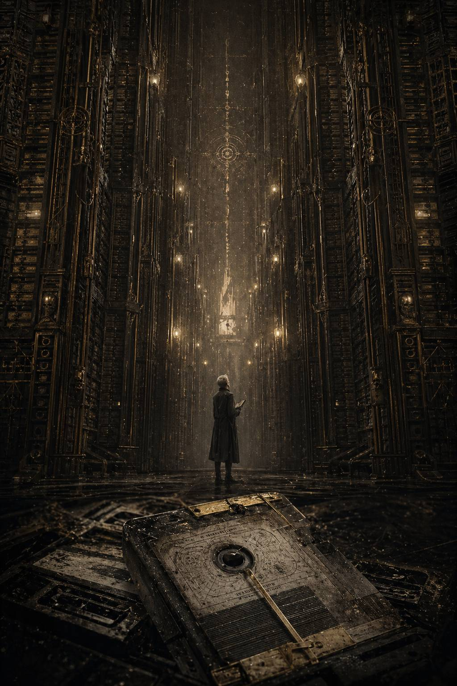
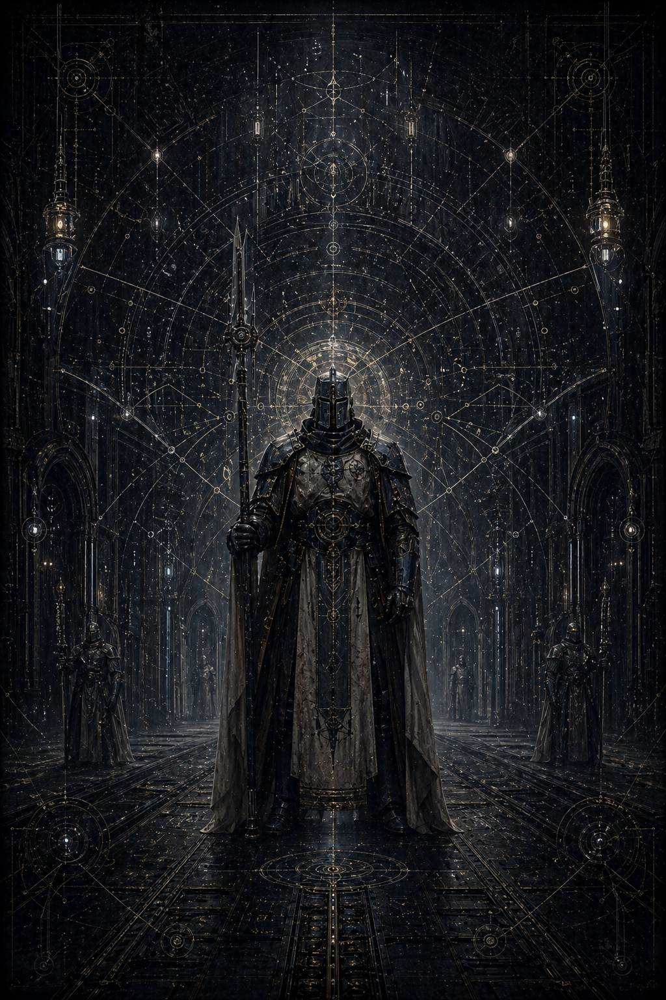
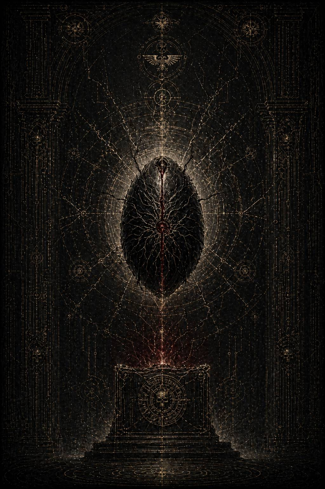

  

<h1 align="center">«Oblivio Duorum / Забвение двоих»</h1>

<i>Архивный гримдарк о том, как власть переписывает не только историю, но и саму возможность помнить.</i>

---

## Читать онлайн

- [Оглавление Markdown-издания](https://github.com/antonkurenkov/openbook/tree/main/1/page/oblivio-duorum-markdown/oblivio_duorum_md)
- [Файл оглавления `index.md`](https://github.com/antonkurenkov/openbook/blob/main/1/page/oblivio-duorum-markdown/oblivio_duorum_md/index.md)

### Главы

- [Обложка / титульный лист](https://github.com/antonkurenkov/openbook/blob/main/1/page/oblivio-duorum-markdown/oblivio_duorum_md/cover.md)
- [Apocryphum: De numeris absentium](https://github.com/antonkurenkov/openbook/blob/main/1/page/oblivio-duorum-markdown/oblivio_duorum_md/1-0.md)
- [I. Dispersae Reliquiae / Технический мусор](https://github.com/antonkurenkov/openbook/blob/main/1/page/oblivio-duorum-markdown/oblivio_duorum_md/1-1.md)
- [II. Silentium Impositum / Обет молчания](https://github.com/antonkurenkov/openbook/blob/main/1/page/oblivio-duorum-markdown/oblivio_duorum_md/1-2.md)
- [III. Absentiae Scriptura / Почерк отсутствия](https://github.com/antonkurenkov/openbook/blob/main/1/page/oblivio-duorum-markdown/oblivio_duorum_md/1-3.md)
- [IV. Custodes Pallidi / Бледный Дозор](https://github.com/antonkurenkov/openbook/blob/main/1/page/oblivio-duorum-markdown/oblivio_duorum_md/1-4.md)
- [V. Custodes Viarum / Хранители Пути](https://github.com/antonkurenkov/openbook/blob/main/1/page/oblivio-duorum-markdown/oblivio_duorum_md/1-5.md)
- [VI. Vix Fuit / То, чего не должно быть](https://github.com/antonkurenkov/openbook/blob/main/1/page/oblivio-duorum-markdown/oblivio_duorum_md/1-6.md)
- [VII. Limes Imperii / Имперский предел](https://github.com/antonkurenkov/openbook/blob/main/1/page/oblivio-duorum-markdown/oblivio_duorum_md/1-7.md)
- [VIII. Monolithus Ymgi / Монолит Имги](https://github.com/antonkurenkov/openbook/blob/main/1/page/oblivio-duorum-markdown/oblivio_duorum_md/1-8.md)
- [IX. Respira / Дыши](https://github.com/antonkurenkov/openbook/blob/main/1/page/oblivio-duorum-markdown/oblivio_duorum_md/1-9.md)
- [X. Schema Divisum / Чертёж](https://github.com/antonkurenkov/openbook/blob/main/1/page/oblivio-duorum-markdown/oblivio_duorum_md/1-10.md)
- [XI. Via Falsa / Ложный маршрут](https://github.com/antonkurenkov/openbook/blob/main/1/page/oblivio-duorum-markdown/oblivio_duorum_md/1-11.md)
- [XII. Malum](https://github.com/antonkurenkov/openbook/blob/main/1/page/oblivio-duorum-markdown/oblivio_duorum_md/1-12.md)
- [XIII. Arcus Vetrа́ / Арка Ветра́](https://github.com/antonkurenkov/openbook/blob/main/1/page/oblivio-duorum-markdown/oblivio_duorum_md/1-13.md)
- [XIV. Colloquium Extremum / Последний разговор](https://github.com/antonkurenkov/openbook/blob/main/1/page/oblivio-duorum-markdown/oblivio_duorum_md/1-14.md)
- [XV. Vestigia Duorum / Пепел двух](https://github.com/antonkurenkov/openbook/blob/main/1/page/oblivio-duorum-markdown/oblivio_duorum_md/1-15.md)
- [XVI. Oblivio memoriae / Забвение памяти](https://github.com/antonkurenkov/openbook/blob/main/1/page/oblivio-duorum-markdown/oblivio_duorum_md/1-16.md)
- [Vas Haeresis / Контейнер ереси](https://github.com/antonkurenkov/openbook/blob/main/1/page/oblivio-duorum-markdown/oblivio_duorum_md/1-17.md)

---

## Коротко

**«Oblivio Duorum»** — сильный, плотный и стилистически выверенный роман в декорациях далёкого техно-теократического будущего. Это текст не о сражениях как таковых, а о последствиях: о документах, следах, пробелах и о человеке, который пытается восстановить правду там, где истина заранее объявлена опасной.

Главный герой, архивист Каэль Меррон, расследует аномальные массивы данных, связанные со «стёртыми» легионами II и XI. Чем глубже он спускается в слои имперской памяти, тем яснее становится центральная идея книги: иногда **уничтожение людей начинается с уничтожения их связей и языка, которым о них можно говорить**.

---

## Что в книге особенно хорошо (по некоторым нейромнениям, покуда автору не доказано обратное)

### 1) Атмосфера

Архивариум здесь — почти самостоятельный персонаж: холодный, бюрократичный, бесконечно вежливый и потому особенно страшный. Роман отлично передаёт ощущение институционального ужаса, где насилие происходит без крика — через формулировки, статусы доступа и «коррекцию памяти».

### 2) Язык и ритм

Текст построен на сочетании латинских заголовков, канцелярской лексики и очень живой, нервной внутренней оптики героя. Получается редкая интонация: одновременно философская и триллерная. Автор уверенно держит высокий стиль и почти не теряет напряжения на длинной дистанции.

### 3) Темы

Книга работает сразу в нескольких регистрах:
- как мрачная научно-фантастическая драма;
- как политическая притча о механике стирания;
- как история о верности, которую невозможно легализовать.

Сквозная линия «не разъединяй их» превращает расследование в этическую дуэль между живой памятью и машиной имперского порядка.

---

## Нюансы

- Это не «лёгкое» чтение: текст густой, фрагментарный, с большим количеством служебных пластов и повторяющихся формул.
- Роман требует внимания к деталям и готовности читать медленно.
- Тем, кто ждёт классической боевой динамики, книга может показаться слишком созерцательной.

Но именно эта медленная, архивная оптика делает произведение оригинальным и запоминающимся.

---

## Визуальный ряд

  
  
  

  
  

