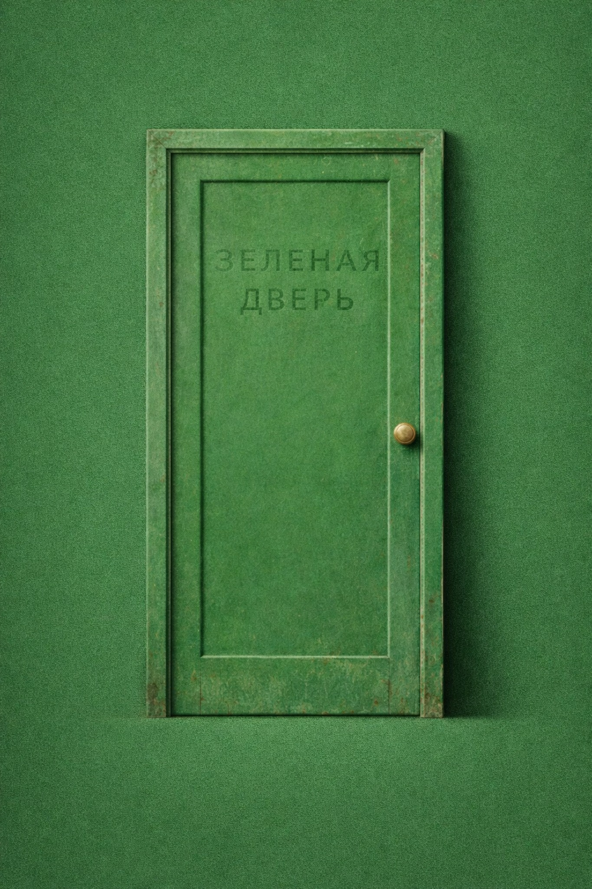

  

<h1 align="center">Зелёная дверь</h1>

  <i>Научно-футуристический цикл о том, что делает человека настоящим в мире, где почти всё можно заменить.</i>

---

## О цикле

Цикл строится вокруг одной большой темы:

> **Если жить можно почти вечно, то что делает жизнь настоящей?**

Это не антиутопия и не техно-манифест.  
Это проза о внутренней мере человека в мире больших возможностей.
Это серия романов о личности, памяти, выборе и человеческом достоинстве в будущем, где люди научились продлевать жизнь, менять тела и всё дальше отодвигать границы естественного существования.

В цикл входят:
- [`1/`](1/) — **Oblivio Duorum / Забвение двоих**
- [`2/`](2/) — **Arbor Exilii / Древо изгнания**
- [`3/`](3/) — **Semina Verbi / Семена слов**

- [`4/`](4/) — **Зелёная дверь**
- [`5/`](5/) — **Те, кого можно улучшить**
- [`6/`](6/) — **Сад забытых голосов**
- [`7/`](7/) — **За последней дверью**

---

## Зелёная дверь

Сквозной образ всей серии — **зелёная дверь**.

Это знак перехода, тайны, внутреннего выбора и той границы, за которой человек остаётся собой.

В каждой книге эта дверь открывается по-разному:
- как вопрос о личности;
- как выбор себя;
- как память;
- как свобода и смысл.

---

## Как читать

Репозиторий организован по книгам.  
Самый естественный способ чтения — идти по порядку, начиная с папки [`1/`](1/).

Сопроводительные материалы:

- [`LICENSE.md`](LICENSE.md)
- [`TRADEMARK.md`](TRADEMARK.md)

---

## О публикации

Этот текст опубликован на GitHub не только как файл, но и как форма.

Оригинальная версия книги остаётся авторской.  
При этом сама структура публикации допускает продолжения, форки и иные траектории чтения.

Если совсем кратко:

**можно**
- читать;
- делиться текстом некоммерчески;
- писать собственные продолжения;

**нельзя**
- продавать оригинальный текст как есть;
- выдавать производные версии за официальные.

Подробные условия указаны в [`LICENSE.md`](LICENSE.md) и [`TRADEMARK.md`](TRADEMARK.md).

---

## Формула цикла

> **В мире, где тело можно заменить, человек ищет не бессмертие, а подтверждение того, что он всё ещё настоящий.**

---

<i>Иногда книга действительно оказывается дверью.</i>

